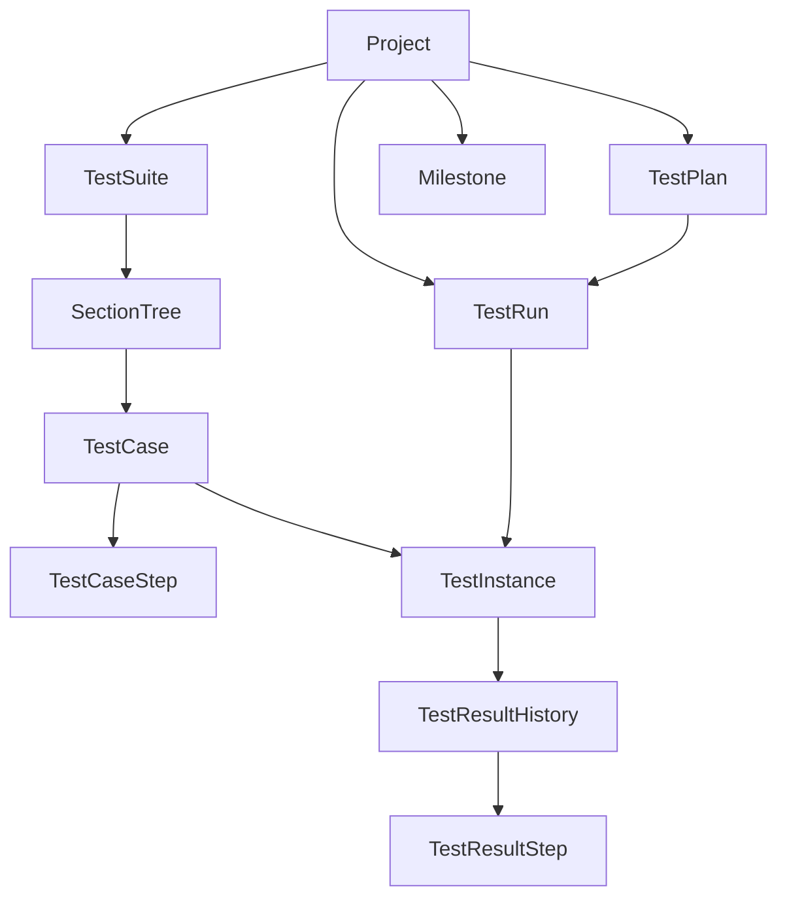

# Domain Model (TestRail-like)

## Core Modeling Principles
- `TestCase` is the source specification, not execution state.
- `TestRun` is a time-bound execution container.
- `TestInstance` is the executable unit cloned into a run from a case.
- `TestResult` is append-only execution history on a test instance.
- Never mix mutable case definition with historical execution records.

If this separation is violated, past execution evidence becomes corrupted when test case definitions are edited later.

## Entity Definitions

## 1) Project
- Top-level boundary for all test assets and executions.
- Owns suites, runs, plans, milestones, settings, and membership.

## 2) Test Suite
- Logical storage area for cases in a project.
- Example: `MWEB Regression`, `API Regression`, `App E2E`.

## 3) Section
- Hierarchical folder tree inside a suite.
- Supports nesting via `parent_section_id`.

## 4) Test Case
- Canonical test specification authored by QA.
- Typical fields:
  - `title`, `preconditions`, `expected_result`
  - `priority`, `type`, `estimate`
  - `refs`, `labels`
  - `automation_key`, `external_id`
- Must not contain execution status.

## 5) Test Case Step
- Ordered procedural steps attached to a test case.
- Fields:
  - `step_order`, `content`, `expected_result`

## 6) Test Run
- Execution batch at a specific point in time.
- Fields:
  - `project_id`, `suite_id`, `milestone_id`
  - `name`, `description`, `include_all`
  - `status`, `assigned_to`, `environment`
- On creation, selected cases are materialized into test instances.

## 7) Test Instance (or Test)
- Run-scoped executable test unit.
- References original `case_id` but stores key snapshots:
  - `title_snapshot`, `priority_snapshot`, `type_snapshot`
  - optional `estimate_snapshot`, `automation_key_snapshot`
- Holds current/latest status for UI and progress metrics.
- Terminology policy:
  - Domain canonical: `TestInstance`
  - API compatibility alias: `test` (`/api/tests/*`)
  - Both refer to the same run-scoped execution entity.

## 8) Test Result
- Append-only history entries for a test instance.
- Fields:
  - `status`, `comment`, `elapsed`, `version`, `defects`, `created_by`, `created_at`
- New result updates latest status on `test_instances`, but old results remain immutable.

## 9) Test Result Step
- Step-level execution outcome under a test result.
- Fields:
  - `step_order`, `status`, `actual_result`, `comment`

## 10) Milestone
- Release/sprint/version container to group runs and plans.

## 11) Test Plan
- Parent unit that groups multiple runs, often by environment matrix.
- Example: `Release 1.5 Regression`.

## 12) Attachment
- Evidence files linked to cases/results/runs:
  - screenshots, logs, traces, Appium logs

## 13) User
- Human actor account for project operations.

## 14) Project Member
- Relationship between user and project with role/permission scope.

## 15) Configuration Group
- Logical set of configuration dimensions for plan entries.
- Example: `Browser`, `Device`, `OS`.

## 16) Configuration
- Concrete value inside a configuration group.
- Example: `Chrome`, `iOS 17`, `Galaxy S24`.

## 17) Requirement (Reference Target)
- External/internal requirement item linked to cases for coverage tracking.

## 18) DefectLink
- Link between result and defect tracker entity (Jira/GitHub/Azure DevOps).

## 19) CaseTemplate
- Reusable structure for case creation fields and step defaults.

## 20) CustomField
- Dynamic project-level field extension for case/run/result entities.

## 21) CustomStatus
- Project-scoped result status extension/mapping layer.

## 22) ActivityEvent
- User-visible timeline event across case/run/result actions.

## Domain Relationship Overview

## Status Model
- Canonical statuses:
  - `untested`
  - `passed`
  - `failed`
  - `blocked`
  - `retest`
- Compatibility mapping for TestRail-like integration:
  - `1 = passed`
  - `2 = blocked`
  - `3 = untested`
  - `4 = retest`
  - `5 = failed`

## Invariants to Preserve
- Editing a test case does not rewrite old run instances or results.
- Result insertion is append-only and timestamped.
- Current status is derived from latest result and cached on instance.
- Case-level entities are design-time assets; run/result entities are execution-time assets.

## Future Extensions (Not in Initial Scope)
- `TestCaseVersion`
  - Versioned case snapshots for formal review/approval workflows.
- `SharedStep`
  - Reusable step blocks referenced by multiple test cases.

These remain explicit future capabilities and are not mandatory in initial MVP,
but `Configuration`, `Requirement`, `DefectLink`, `CaseTemplate`, `CustomField`,
`CustomStatus`, `ActivityEvent` are now first-class planning entities.
