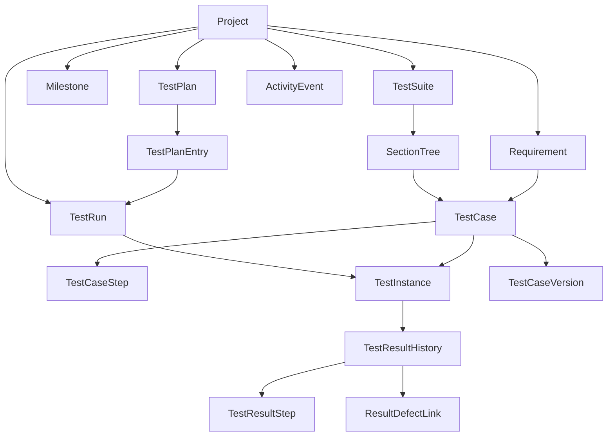

# Domain Model (TestRail-like)

## Core Modeling Principles
- `TestCase` is the source specification, not execution state.
- `TestRun` is a time-bound execution container.
- `TestInstance` is the executable unit cloned into a run from a case.
- `TestResult` is append-only execution history on a test instance.
- Never mix mutable case definition with historical execution records.

If this separation is violated, past execution evidence becomes corrupted when test case definitions are edited later.

## Entity Definitions

## 1) Project
- Top-level boundary for all test assets and executions.
- Owns suites, runs, plans, milestones, settings, and membership.

## 2) Test Suite
- Logical storage area for cases in a project.
- Example: `MWEB Regression`, `API Regression`, `App E2E`.

## 3) Section
- Hierarchical folder tree inside a suite.
- Supports nesting via `parent_section_id`.

## 4) Test Case
- Canonical test specification authored by QA.
- Typical fields:
  - `title`, `preconditions`, `expected_result`
  - `priority`, `type`, `estimate`
  - `refs`, `labels`
  - `automation_key`, `external_id`
- Change-safety fields:
  - `version`, `lock_version`
- Must not contain execution status.
- Current case rows represent the latest editable version. Historical case definitions are stored separately in `TestCaseVersion`.

## 5) Test Case Step
- Ordered procedural steps attached to a test case.
- Fields:
  - `step_order`, `content`, `expected_result`

## 6) Test Case Version
- Immutable snapshot of a case whenever meaningful authored content changes.
- Captures title, preconditions, expected result, priority, type, estimate, refs, labels, automation key, external id, and ordered steps.
- Supports TestRail-style change history and run reproducibility.
- A run should record which case version was selected for each test instance when versioned execution is enabled.

## 7) Test Run
- Execution batch at a specific point in time.
- Fields:
  - `project_id`, `suite_id`, `milestone_id`
  - `name`, `description`, `include_all`
  - `status`, `assigned_to`, `environment`
- On creation, selected cases are materialized into test instances.
- Closing a run freezes further result entry except by explicit manager/admin reopen policy.

## 8) Test Instance (or Test)
- Run-scoped executable test unit.
- References original `case_id` but stores key snapshots:
  - `title_snapshot`, `priority_snapshot`, `type_snapshot`
  - optional `estimate_snapshot`, `automation_key_snapshot`
- Stores optional `case_version_id` when versioned execution is enabled.
- Holds current/latest status for UI and progress metrics.
- Terminology policy:
  - Domain canonical: `TestInstance`
  - API compatibility alias: `test` (`/api/tests/*`)
  - Both refer to the same run-scoped execution entity.

## 9) Test Result
- Append-only history entries for a test instance.
- Fields:
  - `status`, `comment`, `elapsed`, `version`, `defects`, `created_by`, `created_at`
- New result updates latest status on `test_instances`, but old results remain immutable.
- Result creation is the high-frequency write path. It must be batched when possible and must not reload unrelated runs/cases.

## 10) Test Result Step
- Step-level execution outcome under a test result.
- Fields:
  - `step_order`, `status`, `actual_result`, `comment`

## 11) Milestone
- Release/sprint/version container to group runs and plans.

## 12) Test Plan
- Parent unit that groups multiple runs, often by environment matrix.
- Example: `Release 1.5 Regression`.

## 13) Test Plan Entry
- One named execution slice inside a plan.
- Can generate one or more runs from selected cases and selected configurations.
- Should not rely on a free-form environment string when matrix reporting is required.

## 14) Attachment
- Evidence files linked to cases/results/runs:
  - screenshots, logs, traces, Appium logs
- Metadata lives in the app database; binary content lives in object storage.
- Download/upload access should use short-lived signed URLs.

## 15) User
- Human actor account for project operations.

## 16) Project Member
- Relationship between user and project with role/permission scope.
- Roles:
  - `owner`: full project administration.
  - `manager`: cases/runs/plans/reports plus member-light operations.
  - `tester`: result entry and assigned execution workflows.
  - `viewer`: read-only access.

## 17) Configuration Group
- Logical set of configuration dimensions for plan entries.
- Example: `Browser`, `Device`, `OS`.

## 18) Configuration
- Concrete value inside a configuration group.
- Example: `Chrome`, `iOS 17`, `Galaxy S24`.

## 19) Requirement (Reference Target)
- External/internal requirement item linked to cases for coverage tracking.
- Fields:
  - `key`, `title`, `url`, `source`, `status`
- Coverage is computed from requirement -> case -> test instance -> latest result, filtered by milestone/run/plan/configuration when present.

## 20) DefectIntegration
- Project-level defect provider settings.
- Supports URL templates first, then provider APIs such as Jira/GitHub/Azure DevOps later.

## 21) ResultDefectLink
- Link between result and defect tracker entity (Jira/GitHub/Azure DevOps).
- Canonical relation is result-to-defect. Denormalized `test_results.defects` text may exist only for compatibility/display.

## 22) CaseTemplate
- Reusable structure for case creation fields and step defaults.

## 23) CustomField
- Dynamic project-level field extension for case/run/result entities.

## 24) CustomStatus
- Project-scoped result status extension/mapping layer.

## 25) ActivityEvent
- User-visible timeline event across case/run/result actions.

## 26) Notification
- User-visible unread/read event generated from activity rules.
- Examples: assignment changed, run closed, failed result added.

## 27) ImportJob / ExportJob
- Tracks CSV/XML/JSON import and export operations.
- Imports support dry-run validation, row-level errors, and atomic apply mode.
- Exports should be generated asynchronously for large projects.

## Domain Relationship Overview

## Status Model
- Canonical statuses:
  - `untested`
  - `passed`
  - `failed`
  - `blocked`
  - `retest`
- Compatibility mapping for TestRail-like integration:
  - `1 = passed`
  - `2 = blocked`
  - `3 = untested`
  - `4 = retest`
  - `5 = failed`

## Invariants to Preserve
- Editing a test case does not rewrite old run instances or results.
- Editing a test case increments the case version when authored content changes.
- Result insertion is append-only and timestamped.
- Current status is derived from latest result and cached on instance.
- Case-level entities are design-time assets; run/result entities are execution-time assets.
- Concurrent edits use optimistic locking. A stale client must receive a conflict instead of silently overwriting another user's change.
- Large list screens use pagination, filtering, and narrow projections. They must not hydrate all cases, runs, results, and attachments at once.
- Real-time updates are scoped to the current project/run/case context and are used for lightweight invalidation, not full project reloads.

## Future Extensions (Not in Initial Scope)
- `SharedStep`
  - Reusable step blocks referenced by multiple test cases.

`Configuration`, `Requirement`, `ResultDefectLink`, `CaseTemplate`, `CustomField`,
`CustomStatus`, `ActivityEvent`, `Notification`, `ImportJob`, and `ExportJob`
are first-class planning entities for a TestRail-like product.
