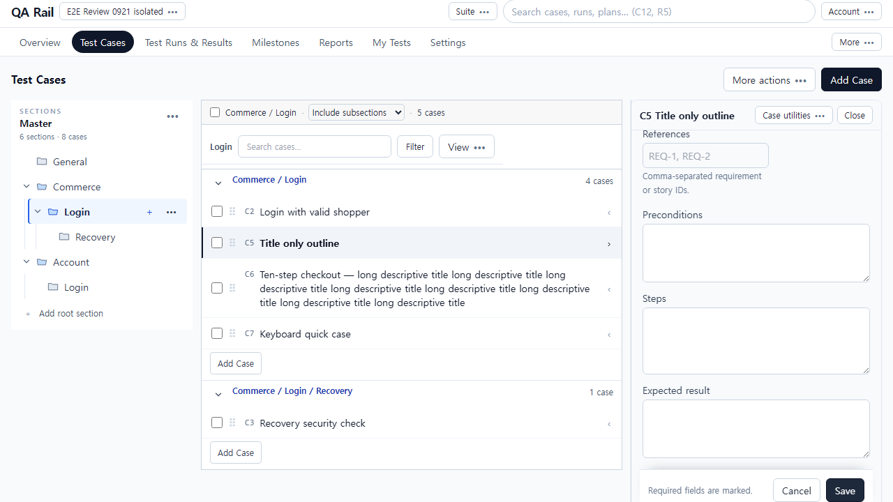
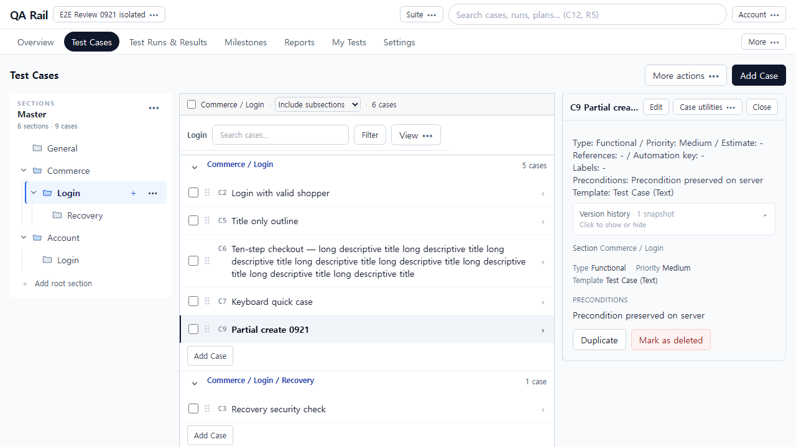
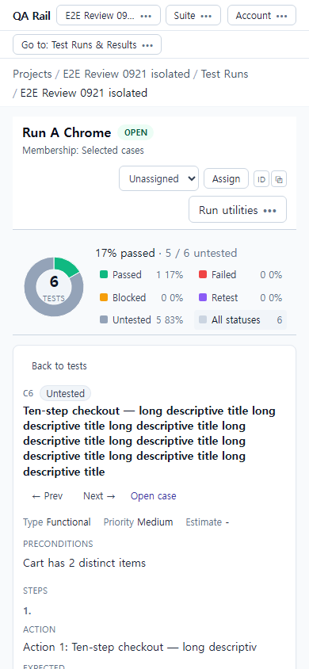
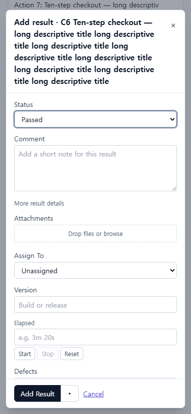

# E2E 기능·저장·복구 검증 보조 기록 — 2026-09-21

이 문서는 최초 기능 중심 검토의 증거를 보존한 보조 기록이다. **최종 UI/UX 판단과 우선순위는 [UI/UX 검토 본문](./E2E_USABILITY_REVIEW_2026-09-21.md)을 따른다.** 아래 기능 pass를 사용성 합격으로 해석하지 않는다.

실제 검증: 2026-09-21 KST. 중단 후 원본 재확인·보고서 정리: 2026-09-22 KST.

**판정: 작성→저장→수행 흐름의 일부는 정상이나, 통합 사용성 수용은 아직 불가하다.** 특히 저장된 지침과 편집 화면의 불일치, 부분 저장 후 초안 소실, 작성 취소 후 목록 문맥 손실이 처음 사용하는 테스터의 신뢰를 깨뜨린다. 이 문제들은 이미 UI-067/068/072에 편성되어 있으므로 새 중복 작업을 만들 필요가 없다. UI-065는 이번 검증에서도 유효했고, UI-066 진행 중 코드의 Close/Cancel 보호는 일부 경로에서 동작했다.

이 문서는 검토 결과와 편입 제안이다. 제품 코드, 원본 문서, Current, 완료 체크, 예약, 계정 권한을 변경하지 않았다. 기존 프로세스를 종료하거나 DB를 초기화하지 않았다. 제품 변경을 하지 않았으므로 **after 화면은 없다.** 아래 화면은 모두 이번 실행의 관찰 화면이다.

## 1. 검사 기준과 원본/worktree 차이

| 항목 | 확인 결과 |
| --- | --- |
| 원본 | `C:/Users/cease/OneDrive/문서/GitHub/testrail-clone` — 읽기 전용 확인 |
| 산출물 worktree | `C:/Users/cease/.codex/worktrees/16c6/testrail-clone` |
| 양쪽 HEAD | `cea2fd676156969d2442b5eef3e7c9026465cf7b` |
| 시작 worktree | 제품 변경 없음. 원본의 미커밋 변경이 포함되지 않은 상태 |
| 원본 문서 | NEXT_ACTIONS, USABILITY_REALIGNMENT, CASE_AUTHORING_FLOW_REVIEW 및 UI-062/064/065 증거·관련 설계 확인 |
| 시작 및 재개 시 Current | UI-066. UI-064·065 문서상 완료. UI-066 관련 미커밋 소스와 검증 스크립트가 이미 존재 |
| 실행 소스 | 원본의 당시 파일을 임시 스냅샷으로 복사. 오래된 worktree 제품으로 실행하지 않음 |
| 기준 manifest | [baseline](./ux-evidence/e2e-0921-baseline.json): 856개 검사 대상 파일의 SHA-256, 원본/스냅샷/worktree 비교. 생성 시각 2026-09-21 22:43:57 KST |
| 변경 재확인 | [end-source](./ux-evidence/e2e-0921-end-source.json): 2026-09-22 재개 시 검사 대상 원본 hash drift **0**. 문서 3개도 동일. 이 범위를 벗어난 파일·다른 실행 상태 전체가 불변이라는 뜻은 아님 |

원본에는 서버 CORS/worker 관련 변경, `AddCasePage`, `CaseAuthoringForm`, `CaseDetailBody`, `CaseDetailSidePanel`, `TestCaseWorkspace`, `useExpandedCase`, `ConfirmDialog`, `RunStatusOverview` 변경과 `CaseDraftGuardContext`, `useUnsavedDraftGuard`, `caseAuthoringValueKey` 신규 파일 등이 있었다. 내용 차이와 줄바꿈 차이를 구분한 목록은 end-source의 `snapshotVsWorktreeNormalized`에 있다. 스냅샷의 유일한 원본 대비 설정 차이는 Vite 캐시를 임시 복사본 안에 두도록 한 `vite.config.ts`의 `cacheDir`이다. UI-066의 진행 중 파일을 옛 CA-F02 결함으로 재보고하지 않았다.

### 검증 환경과 증거의 의미

- 임시 경로: `%TEMP%/e2e-review-20260921-16c6`. API `4196`, web `5196`. `USE_IN_MEMORY_REPOSITORY=true`, `DATABASE_URL` 비움, 이메일 disabled. 원본 `.env`를 복사하지 않았다.
- 기존 설치 의존성을 읽어 사용했고 Vite 캐시·빌드 출력은 임시 스냅샷에 두었다. 원본 포트 4000/5173 및 진행 중 실행을 조작하지 않았다.
- Playwright Chromium의 실제 DOM 조작, `keyboard.press`의 Enter/Tab/Shift+Tab/Escape, HTTP 요청/응답, 별도 GET 재조회를 사용했다. 브라우저 메모리 상태만으로 저장을 판정하지 않았다.
- 메모리 API 재조회는 이 프로세스의 저장 사실을 입증한다. DB 영속성·서버 재시작 후 보존·외부 저장소 성공을 입증하지 않는다.
- 첫 실행의 Windows 디렉터리 접근 차단, 임시 복사본의 workspace 의존성 연결 누락은 환경 준비 문제였다. 해결 후 같은 스냅샷으로 검증했다.
- 이 검토는 자동화된 테스터 업무 리허설이다. 실제 쇼핑 사이트를 조작한 시험이나 독립된 사람의 직관성 수용 관찰이 아니다. fixture의 Passed/Failed는 관리 도구의 기록 시험 데이터다.

### fixture 및 재현 주의

[fixture](./ux-evidence/e2e-0921-fixture.json), [초기 요청](./ux-evidence/e2e-0921-seed-requests.json), [fixture 교정 요청](./ux-evidence/e2e-0921-fixture-correction.json).

프로젝트 1, Master suite 1. `Commerce / Login / Recovery` 3단계와 `Account / Login` 동명 섹션. C1–C6에 서로 다른 Preconditions/Action/Expected, 제목만 있는 C5, 긴 제목·10-step C6를 준비했다. 활성 Run A/R1와 B/R2에 같은 케이스를 넣고, R3는 완료했다. 이후 작성·빠른 추가·Plan·milestone·All/Dynamic 전용 데이터만 추가했다.

초기 seed의 `parentId`와 step `expected`는 API 필드명이 아니어서 `parentSectionId`/`expectedResult`로 **fixture만 교정**했다. 교정 전 `e2e-0921-cases-1280.png`는 트리 결함 증거로 쓰지 않는다. 범위 검증은 교정 후 direct/subtree/all에서 수행했다. C5는 편집 검증 후 제목만 있는 상태에서 지침 있는 상태로 바뀌므로 이후 Run C5 화면을 '지침 없음' 검증으로 해석하면 안 된다.

검증 스크립트는 실조작 기록용이며 하나의 무인 합격 테스트팩은 아니다. 일부 탐색 단계의 selector 오류와 실행 순서 의존성이 JSON에 남아 있다. 상태값은 label로, My Tests는 실제 링크의 텍스트/접근 이름으로 교정했다. 초기 result 실패 주입은 잘못된 `/api/tests/...` 경로를 잡아 실제 실패를 만들지 못했다. 따라서 `execution.json`의 `retry-error`, `result-failure.png`는 복구 결함 증거가 아니며, 올바른 `/api/runs/2/results`를 주입한 `remaining.json` 및 `retry-real-failure.png`만 그 판정에 사용한다.

## 2. 시나리오별 결과

`pass`는 해당 행에 적힌 범위만 확인했다는 뜻이다. `not tested`는 실패나 환경 차단을 뜻하지 않는다. 서로 다른 하위 경로를 합쳐 전체 통과로 표시하지 않았다.

| 시나리오 / 재현 | 기대 → 실제 | 판정 | 이번 증거 / 기존 작업 |
| --- | --- | --- | --- |
| 프로젝트 진입 → Cases / Runs / Assigned | 업무별 진입과 케이스·Run 수 구분 → 프로젝트/Overview에서 제공 | pass | [resume.json](./ux-evidence/e2e-0921-resume.json), UI-063 일부 |
| 3단계·동명 섹션, direct/subtree/all | Login 직속/하위 포함/전체 구분 → 초기 3/4/6건, 경로와 소속 블록 일치 | pass | [cases.json](./ux-evidence/e2e-0921-cases.json), scope-* 화면, UI-059/060 일부 |
| 섹션 끝 빠른 추가 → Enter | 제목 생성 후 다음 제목 입력 유지 → C7 생성·입력 포커스 유지 | pass | cases.json `quick-enter`, [화면](./ux-evidence/e2e-0921-quick-enter.png) |
| 상단 전체 작성 발견 | 주요 Add Test Case가 전체 폼 → 상단 Add Case도 제목 추가, 전체 폼은 More actions 안 | fail | [메뉴·진입](./ux-evidence/e2e-0921-remaining.json), UI-069 중복 |
| Text 전체 작성, Section A→B, 저장 | 지침 유지·최종 B에 저장 → C8 Account/Login, 제목·사전조건·Steps·Expected 유지 | pass | cases.json `section-values`, 생성/step 요청·응답; UI-065 재확인 |
| Steps 작성, Section 변경·저장·GET | Action/Expected 쌍 보존 → C11 두 단계와 기대 결과 재조회 일치 | pass | [remaining.json](./ux-evidence/e2e-0921-remaining.json) `steps-api`, UI-065 일부 |
| Template Text→Steps | 변환 설명, 취소 보존, 확정 후 지침 유지 → Keep current template 보존, Change template 첫 Action에 Text 이관 | pass | [followup.json](./ux-evidence/e2e-0921-followup.json) `template-*` |
| dirty 패널 Close / Keep editing | 폐기 확인·유지 → 확인창과 제목 유지 | pass | [authoring.json](./ux-evidence/e2e-0921-authoring.json), [화면](./ux-evidence/e2e-0921-panel-close-guard.png); UI-066 진행 중 부분 확인 |
| dirty 전체 폼 Cancel / Keep editing | 폐기 확인·유지 → 입력 유지 | pass | followup.json `cancel-*`, [화면](./ux-evidence/e2e-0921-cancel-dialog.png) |
| dirty 행/필터/상단 내비/뒤로가기/IME/저장 중 이탈 | 모든 전환 보호 | not tested | UI-066 전체 완료로 승격하지 않음 |
| 제목만 있는 C5를 패널에서 보완·Save | 저장 뒤 같은 지침을 계속 읽고 편집 → 서버에는 저장됐으나 Steps 입력은 빈 값 | fail | authoring.json `panel-api` / `panel-input-after`, CA-F03 / UI-067 |
| 정상 Add & Next | 완전 저장 후 같은 목적지의 빈 폼 → C16 생성, section 6 유지, 제목/Steps 비움 | pass | [context-next.json](./ux-evidence/e2e-0921-context-next.json) |
| 생성 본문 성공·첫 Steps 500, 일반 Add | 성공 ID/실패 초안 보존 → C9 생성 후 경고 없이 목록 이동, 지침 없음 | fail | authoring.json `partial-normal` / network, CA-F04 / UI-068 |
| 같은 실패, Add & Next | 다음으로 넘어가지 않음 → C10 생성, 경고는 있으나 제목/Steps 초기화 | fail | authoring.json `partial-next-values`, UI-068 |
| 검색 Login·direct → 전체 작성 → Cancel | 원래 조건으로 복귀 → q 삭제·검색 빈 값·subtree로 변경 | fail | context-next.json `context-before/after/values`, UI-072 |
| UI에서 All Run 생성 → 새 케이스 → 재열기 | 자동 포함 → R6 11→12 tests, +1 sync 표시 | pass | [final-live.json](./ux-evidence/e2e-0921-final-live.json) `run-before/after`, UI-058 |
| Selected 고정 / Dynamic high | Selected 유지·Dynamic 조건 일치 → R1 6개 유지, Dynamic high 1→2, low 제외 | pass | [resume-final.json](./ux-evidence/e2e-0921-resume-final.json); Dynamic은 API 구성 후 UI·GET 확인, UI chooser 작성은 not tested |
| Plan → entry → Run 구성 및 열기 | 특정 1 case 실행 Run → Plan 상세에 1 selected case, 생성 Run으로 이동 | pass | [resume-links.json](./ux-evidence/e2e-0921-resume-links.json) `plan-open`, 구성은 API fixture |
| 실행 허브 Plan 요약 | 상세와 같은 포함 수 → 상세는 1 test, 허브 Plan은 No tests yet·Run 별도 노출 | fail (memory) | E2E-F05, resume/links 요청·화면 |
| Run에서 서로 다른 지침·10-step 읽기 | 수행 대상의 사전조건·Action·Expected 유지 → C2/C6 및 다음 C5의 지침 제공 | pass | [run-inspect.json](./ux-evidence/e2e-0921-run-inspect.json), [execution.json](./ux-evidence/e2e-0921-execution.json) |
| 목록 Status와 패널 Add result | 같은 폼·선택만으로 저장 안 함 → 같은 dialog, 취소 전후 result 총 2→2 | pass | execution.json `panel-dialog/status-dialog/before-cancel/after-cancel` |
| 일반 저장 / Pass & Next | 현재 유지 / 명시적 다음 → `testId=2` 유지, 다음은 `testId=5` | pass | execution.json `normal-save/explicit-next`, UI-056 일부; split 메뉴 Save & Next는 not tested |
| 같은 C2, Run A/B 결과 | Run별 독립 → A Failed 기록과 B Passed 기록이 각 test 2/8에 존재 | pass | execution.json network·normal-api, remaining.json retry 조회 |
| 결과 POST 500 → Retry | 초안 유지·실패 시 무기록·재시도 1건 → 결과 total 1→1→2 | pass | remaining.json `retry-before/failed-api/after`, [실패 화면](./ux-evidence/e2e-0921-retry-real-failure.png) |
| 6건 bulk Blocked | 대상·목록·패널·통계 즉시 일치 → 6 Blocked / 100%, 6개 GET 일치 | pass | remaining.json `bulk-applied/bulk-requery`, UI-055 일부 |
| bulk 일부 성공·실패 대상만 Retry | 성공 대상 중복 없이 재시도 | not tested | 단일 결과 Retry와 bulk 정상 결과로 대신하지 않음 |
| 첨부 포함 결과 저장 → Leave → 재열기 → Retry | 결과 성공/첨부 실패 구분·result 중복 방지 → 파일 Retry 유지, total 1→1 | pass (실패 복구만) | resume-final.json `attachment-*`, UI-057 일부 |
| 실제 bytes upload/reopen/download | 저장소 원본 왕복 | blocked | 메모리 서버 501 저장소 미지원. E01 준비 필요 |
| 모바일 Run 목록→행→Back to tests | 목록으로 복귀 후 유지 → visible rows 6, 목록 유지 | pass | followup.json `mobile-return/mobile-row-count`, UI-052 일부 |
| My Tests → Open test → refresh | 정확한 Run/test 이어가기 → R2/test8 URL과 해당 지침·결과 유지 | pass | resume-links.json `assigned-open/assigned-refresh` |
| Run 목록 → B, Plan → 생성 Run | 정확한 실행 대상으로 이동 → 각 R2/R4 열림 | pass | resume-links.json `list-open/plan-open` |
| Overview 특정 오래된 Run 재개 | 현재 Active work에 있을 때 직접 진입 | not tested | 뒤에 Run을 더 만든 뒤 R1이 최근 목록에서 빠져 selector가 실패. 결함으로 판정하지 않음. 초기 Overview의 Active work와 링크는 관찰 |
| 완료 Run / 연결·비연결 milestone | 닫힌 Run 쓰기 진입 없음, 연결된 것만 집계 → Status 버튼 0, milestone 연결 Run 1개/총 test 1 | pass | execution.json `closed`, resume.json `milestone`; 완료 Run 역할 검증과 viewer 검증은 별개 |
| 실제 viewer 계정 | 읽기 허용·쓰기 차단 | blocked | 메모리 인증/권한 경로가 실제 역할을 재현하지 않음. 권한 확대 없이 별도 환경 필요 |
| 1440×1000 / 1280×720 / 390×844 | 내용·핵심 행동 접근 | pass / fail 분리 | 관찰 화면들 가로 overflow 0. Run dialog 저장 footer 접근 가능. Case 모바일 패널 진입은 아래 E2E-F04의 fail |
| 독립 테스터 J01–J08 관찰 | 도움 없이 업무 완수 여부 | blocked | E03 미준비. 자동 조작으로 직관성 수용을 대신하지 않음 |

## 3. 확인된 문제와 원인

원인 파일은 **원본 스냅샷의 해당 경로**를 뜻한다. 같은 이름의 현재 worktree 파일에는 진행 중 변경이 빠져 있을 수 있으므로 baseline hash를 함께 사용한다.

### E2E-F01 — 저장된 Steps와 현재 편집 화면이 다름 (P1, UI-067)

1. C5 Title only outline을 열고 Edit.
2. Steps에 `Newly written instructions 0921` 입력 후 Save.
3. 같은 편집칸과 `GET /api/cases/5` 비교.

기대: 성공 후 지침이 그대로 보이고 재편집 가능. 실제: 입력칸 `''`, API에는 step 16의 content가 존재. 새로고침하면 지침이 나타난다. 사용자에게는 저장 실패처럼 보이므로 재입력·중복 조작을 유발한다.

원인 경로: `ExpandableCaseDetail.tsx`의 `onSubmit`이 `onSave`를 먼저 기다린 뒤 `syncCaseInstructionSteps`를 호출한다. `CaseDetailBody.tsx`의 본문 mutation은 `useCaseEditorActions.ts`의 성공 콜백에서 상세를 먼저 invalidate한다. 이 재조회/lockVersion 변화가 폼을 초기화하며, 뒤의 직접 Steps 동기화에는 같은 완료 경계의 최종 refresh가 없다. `syncCaseInstructionSteps.ts`도 함께 확인했다. 서버 저장 누락으로 분류하면 안 된다.

증거: [저장 직후 화면](./ux-evidence/e2e-0921-panel-save-stale.png), [새로고침 화면](./ux-evidence/e2e-0921-panel-reload.png), [API와 값](./ux-evidence/e2e-0921-authoring.json). CA-F03과 동일하며 신규 작업 제외.

### E2E-F02 — 일부 저장 실패가 이동/초기화로 이어짐 (P1, UI-068)

1. 전체 Text 작성 폼에 제목·지침을 넣는다.
2. 케이스 생성 요청은 실제 서버로 보내고 후속 `/api/cases/:id/steps` POST만 500으로 제어한다.
3. 일반 Add와 Add & Next를 별도 케이스로 실행한다.

기대: 생성된 ID와 실패 초안을 유지하고 실패한 Steps만 재시도. 실제: 일반 Add의 C9는 목록으로 이동하며 실패 안내가 없다. Add & Next C10은 실패 안내를 표시하지만 입력을 비운다. 본문 성공을 전체 성공처럼 다뤄 수행 지침 없는 케이스가 남는다. 재시도 UI에서의 무중복을 이 경로는 검증할 수 없었다.

원인: `createCaseFromAuthoring.ts`가 Steps 오류를 `stepsWarning`으로 반환하고, `AddCasePage.tsx`의 `onSuccess`가 warning 여부와 무관하게 일반 저장에서 `leaveAuthoring`, next에서 `formKey` 증가를 수행한다. 코드만으로 제기됐던 CA-F04를 이번에는 실제 UI+실제 본문 저장+제어된 실패+재조회로 확인했다. 본문 POST 실패, 중간 Steps 실패, 409, 이동 실패까지 확인한 것은 아니다.

증거: [일반 Add 후](./ux-evidence/e2e-0921-partial-normal.png), [Add & Next 후](./ux-evidence/e2e-0921-partial-next.png), [요청/응답·조회](./ux-evidence/e2e-0921-authoring.json). UI-068의 수용 조건을 그대로 사용하고 중복 편성하지 않는다.

### E2E-F03 — 전체 작성 취소 후 검색·범위가 사라짐 (P2, UI-072)

1. UI에서 Commerce/Login, Selected section only, 검색 Login 설정.
2. More actions → Add Test Case → 수정 없이 Cancel.

기대: 같은 검색·direct 결과로 복귀. 실제: `...&scope=direct&q=Login`이 `suiteId=1&sectionId=3`만 남는 URL로 바뀌고 search는 빈 값, scope는 subtree가 된다. 이탈 보호와 무관하게 허용된 취소에서도 출발 문맥이 사라진다.

원인: `caseRoute.ts`의 작성 진입 경로와 `AddCasePage.tsx`의 `goToList`가 suite/section 및 저장 case 식별자만 구성한다. 검색/범위 등의 return context 계약이 없다. 필터 밖 새 케이스, 열/밀도/스크롤 위치까지 이번에 모두 재현한 것은 아니다.

증거: [출발](./ux-evidence/e2e-0921-context-before.png), [복귀](./ux-evidence/e2e-0921-context-after.png), [URL·값](./ux-evidence/e2e-0921-context-next.json). CA-U04/UI-072를 실제 재현으로 강화하며 새 작업 제외.

### E2E-F04 — 전체 작성 발견성과 케이스 패널의 읽기 우선순위 (P2, UI-069/070/071)

- 상단 **Add Case**와 섹션 **Add Case**가 같은 제목 추가 역할이다. 전체 지침 작성은 More actions 안의 Add Test Case에 있다. 처음 쓰는 테스터는 제목만 저장한 뒤 편집으로 우회하기 쉽다. `ProjectContentHeader.tsx`, `CaseListPane.tsx`/`CaseListOutlineAdd.tsx`, 작성 route가 UI-069 소유다.
- 읽기 패널은 `ExpandableCaseDetail.tsx`의 Type/Priority/Preconditions/Template와 `CaseInstructionReadView.tsx`의 같은 정보가 반복된다. 편집 맨 위에는 Case images가 먼저 온다. 안내나 카드를 추가하기보다 같은 사실을 한 번만 보여줄 필요가 있다.
- 390px에서 C6 패널 직접 열기 시 Edit 버튼의 viewport 좌표 y=1217.5로 첫 화면 밖이다. 목록 아래 패널이 붙으며 열 때 활성 영역으로 이동하지 않는다. Playwright의 자동 scroll을 통한 클릭 성공을 발견성 통과로 간주하지 않았다. 가로 넘침 0이어도 핵심 작업 진입은 별개다.
- 신규 전체 작성에서 첨부 준비 UI는 보이지 않는다. 기존 UI-071 범위다. 저장소 미지원 E01과 별개의 작성 UI 문제다.

증거: [390 읽기](./ux-evidence/e2e-0921-case-panel-390.png), [390 편집](./ux-evidence/e2e-0921-case-edit-390.png), [1280 읽기](./ux-evidence/e2e-0921-case-panel-1280.png), [좌표·화면](./ux-evidence/e2e-0921-followup.json). CA-U01–03과 중복이므로 별도 UI ID를 제안하지 않는다.

### E2E-F05 — 메모리 Plan 상세와 실행 허브의 연결·집계 불일치 (P1 검증환경 정확성, 신규 후보)

1. Plan에 선택 케이스 1개인 entry를 추가하고 해당 entry의 Run을 생성한다.
2. Plan 상세와 Test Runs & Results를 번갈아 연다.
3. Plan 생성 응답, `GET /api/runs/4`, `GET /api/projects/1/runs-overview`를 비교한다.

기대: Plan에 1 test가 집계되고 같은 Run이 독립 Run처럼 중복 노출되지 않음. 실제: Plan 상세는 1 generated run / 1 test를 표시하고 Open run도 동작하지만, 허브 Plan은 No tests yet이며 생성 Run이 별도 Run으로 나온다. Run 응답에 `planId`가 없다.

원인: `apps/server/src/modules/plans/plans.routes.ts`의 memory 생성 분기는 `target.runId = run.id`만 설정한다. Prisma 분기는 추가로 `testRun.planId`를 갱신한다. `runsOverview.service.ts`의 memory 집계는 `run.planId`로 Plan 소속을 찾으므로 같은 사실을 연결하지 못한다. 웹의 `runListHubModel.ts`는 서버 total 0을 No tests yet로 표시한다. **Prisma 운영 환경에서도 재현된다고 주장하지 않는다.**

증거: [허브](./ux-evidence/e2e-0921-resume-runs-list.png), [Plan 상세](./ux-evidence/e2e-0921-resume-plan.png), [생성 요청](./ux-evidence/e2e-0921-resume.json), [Run·overview 재조회](./ux-evidence/e2e-0921-resume-links.json). UI-047/048/050 및 UI-021의 Plan 재개 목적과 연관되지만 UI-065–072와는 다른 원인이다. 기존 큐를 바꾸지 않고 §6의 후보로만 남긴다.

## 4. 이전 관찰과 현재 구현 대조

| 기존 항목 | 이번 판정 | 후속 처리 |
| --- | --- | --- |
| CA-F01 / UI-065 | Text·Steps Section 변경 시 보존 확인. 원본 수정이 유효 | 새 결함/중복 작업 없음 |
| CA-F02 / UI-066 | 원본에 진행 중 guard 코드가 존재. 패널 Close·전체 Cancel·Keep에서 보호 확인 | 다른 이탈 경로·Discard·IME·저장 중 조작은 미검증. 완료 처리 안 함 |
| CA-F03 / UI-067 | 실제 재현, API 저장 성공과 화면 초기화 분리 | E2E-F01을 기존 항목의 증거로 편입 제안 |
| CA-F04 / UI-068 | 코드 위험에서 실제 제어 실패 재현으로 강화 | E2E-F02 편입 제안 |
| UI-069 | 상단/전체 작성 진입 역할 불일치 유지 | 기존 범위 유지 |
| UI-070 | 메타·사전조건 중복 및 모바일 활성 패널 접근 문제 유지 | 기존 범위 유지 |
| UI-071 | 신규 작성 첨부 진입 미제공 | E01 실저장과 분리하여 기존 범위 유지 |
| UI-072 | UI 검색·direct 설정 후 취소 시 유실 재현 | E2E-F03 편입 제안 |
| UI-064 | 390 Run 통계에서 여섯 범례가 읽히고 가로 overflow 없음 | 완료 이력과 부합. 이번 6건 fixture를 넘어 전체 인증 아님 |
| UI-052/055/056/057/058/060/062/063 | 표에 명시한 정상 경로는 부합 | 과거 전체 체크를 재인증하거나 재개방하지 않음 |

## 5. 테스터 관점 UI/UX와 TestRail 비교

좋아진 부분은 경로를 보여주는 섹션 블록, 읽기 중심 Run 패널, 공통 결과창, 상단 통계다. Section direct/subtree/all의 3/4/6건 차이는 화면에서 설명된다. 같은 C2의 A/B 결과가 test instance 단위로 남고, My Tests 링크에 Run과 test ID가 함께 들어가는 점도 재개에 유리하다.

반면 '작성이 끝났다'는 피드백은 아직 신뢰하기 어렵다. E2E-F01/02는 단순 화면 장식보다 먼저 다뤄야 한다. 제목만 있는 케이스의 생성 성공과 수행 가능한 지침 작성 완료를 같은 성공으로 취급하면 안 된다. 전체 작성 진입점과 읽기 패널 정리는 그 뒤에 효과가 크다.

Run에는 toolbar와 패널의 Prev/Next·Pass & Next가 반복되고, toolbar에 Failed/Blocked/Untested 이동, Columns/Filter/Group/Sort/밀도까지 동시에 보인다. 이는 새 기능 부재가 아니라 주요 행동의 경쟁 문제다. 지침과 Add result를 우선하면서 보조 이동·보기 제어의 노출을 줄이는 검토 후보로 남긴다. 테스터 관찰 없이 전부 제거하거나 새 메뉴를 추가하는 구현을 권하지 않는다.

이번 브라우징에서 확인한 공식 자료와 프로젝트 결정을 구분했다.

- [TestRail Adding test cases](https://support.testrail.com/hc/en-us/articles/14438119644692-Adding-test-cases): 전체 작성과 섹션 하단 quick outline은 서로 보완하는 경로이며 생성 중 첨부도 지원한다. UI-069/071의 방향을 뒷받침한다.
- [Submitting test results](https://support.testrail.com/hc/en-us/articles/15813183376148-Submitting-test-results): Status 선택과 3-pane Add Result는 결과창으로 이어지고 Pass & Next와 bulk는 별도 행동이다. 두 결과 진입점 자체를 중복 결함으로 제거하면 안 된다.
- [Creating new test runs](https://support.testrail.com/hc/en-us/articles/7076838639892-Creating-new-test-runs): 구성 선택의 기준 자료로 확인했다. 이 프로젝트의 All 자동 포함 및 Dynamic 갱신 판정은 현재 UI-058 계약과 실제 결과에 근거한다.
- 저장 후 현재 유지, 명시적 다음, 정확한 부분 실패 복구, 작은 2열 결과창과 상단 통계는 프로젝트의 `RUN_RESULT_DIALOG_DESIGN_2026-09-19.md` / `RUN_STATUS_OVERVIEW_DESIGN_2026-09-19.md` 계약을 따른다. TestRail 픽셀 복제를 요구하는 것으로 해석하지 않았다. 제공 참고 화면의 의미는 해당 문서에서 확인했고, 기존 화면을 이번 검증 화면으로 재사용하지 않았다.

### 키보드·접근성·화면 크기

- 실제 Enter로 quick outline 생성, 결과창에서 Tab/Shift+Tab, Escape 취소와 Status 트리거 포커스 복귀를 확인했다. `execution.json`에 실제 activeElement가 남아 있다. DOM `.focus()`만으로 합격시키지 않았다.
- 전체 선택의 접근 이름은 `Select all tests on this page`, 개별 선택은 `Select C*`다. 후자는 체크박스이며 '상세 열기 버튼'이 아니다. 초기 harness가 이를 button으로 찾은 오류를 제품 접근성 실패로 세지 않았다.
- 결과창 Status/Comment와 My Tests 링크의 실제 이름·대상은 기록했다. 스크린리더 전수 검사, 전체 키보드 전용 완주, IME, 실제 휴대폰 가상 키보드는 not tested다.
- case panel/edit와 Run/detail/result dialog를 1440/1280/390에서 새로 캡처했다. JSON의 `scrollWidth == innerWidth`는 문서 가로 넘침이 없다는 좁은 증거다. 모든 자식의 잘림·세로 접근·읽기 이해를 자동 보증하지 않는다.
- 긴 제목 결과창은 모바일에서 제목이 여러 줄을 차지하지만 저장 footer가 보인다. Case 편집에서는 긴 제목이 단일 입력으로 스크롤되고, 지침보다 첨부·메타가 먼저 온다. UI-070의 정리 대상이다.

## 6. 편입 제안 — 실행 큐를 변경하지 않음

권장 순서는 현재 승인된 **UI-066 → 067 → 068 → 069 → 070 → 072 → 071 → UI-021**을 유지한다. 발견한 저장 신뢰성 문제를 기존 067/068에 연결하고, UI-066 진행 중 작업에 중복 구현을 시작하지 않는다.

| 후보 | 한 작업 단위의 범위 | 완료 조건 | 검증 방법 / 제외 |
| --- | --- | --- | --- |
| 기존 UI-067 증거 보강 | 본문+Steps 전체 완료 뒤 상세/폼/목록 갱신 경계 하나 | refresh 없이 입력·읽기·GET 일치, 느린 Steps 응답에도 빈 폼으로 돌아가지 않음 | C5 실패 재현 회귀 + Text/Steps UI 저장. 재시도 설계는 UI-068 소유 |
| 기존 UI-068 증거 보강 | 생성 ID와 실패 단계·초안 유지, 성공 부분 재사용 | 일반 Add/Next 모두 부분 실패 시 남아 있음; Retry 두 번에도 case/성공 step 중복 없음 | 첫/중간 Steps, 본문 실패, 이동 실패, 409를 분리. 외부 첨부 bytes는 별도 |
| 기존 UI-072 증거 보강 | 허용된 작성 종료에서 목록 context 전달/복원 | 실제 direct+검색+필터/보기/위치 복원, 필터 밖 저장 케이스 안내 | context-next 재현 확장. guard는 UI-066 소유 |
| **CAND-01: memory Plan–Run 연결 일관성** | Plan 생성 Run의 양방향 소속과 overview 집계 계약 정합성만 | 1 entry/1 run/1 case가 상세·허브에서 동일; 독립 Run 중복 노출 없음; 재생성 요청도 같은 Run | API 생성→GET run/overview→UI 재개. Prisma 분기 회귀 확인. 새로운 Plan 기능/DB 초기화 제외. 기존 관련 작업과 재대조 후 편입 |
| **CAND-02: Run 행동 노출 검토** (P2 제안, 결함 확정 아님) | 읽기/기록/다음과 보조 보기·상태 이동의 동시 노출 수준만 평가 | 처음 보는 테스터가 지침→기록→다음과 bulk를 혼동하지 않음; 키보드/모바일 접근 유지 | E03 목적만 제공한 관찰로 먼저 판단. 두 공통 결과 진입점 제거·새 결과 폼·기능 삭제 제외. UI-039/050 목표와 중복되면 그 검증에 흡수 |

CAND-01은 통합 검증 신뢰성을 위해 UI-021의 Plan 수용 전에 정리할 가치가 있다. CAND-02는 독립 구현을 바로 편성하기보다 사람 관찰 후 필요성을 결정한다. 새 UI 번호 할당, 체크 변경, Current 이동은 이 보고서에서 하지 않았다.

## 7. 자동 검사와 남은 검증

임시 최신 소스 스냅샷에서 수행했다. 결과가 제품 사용성 합격을 대신하지 않는다.

| 검사 | 결과 | 증거 |
| --- | --- | --- |
| `npm.cmd run lint -w apps/web` | pass, exit 0 | [lint 로그](./ux-evidence/e2e-0921-lint.txt) |
| `npm.cmd run build -w apps/web` | pass, exit 0 | [build 로그](./ux-evidence/e2e-0921-build.txt). Vite 큰 chunk 경고 존재 |
| Vitest 관련 6파일, `--cache=false` | 23 passed | [테스트 로그](./ux-evidence/e2e-0921-tests.txt): caseAuthoringValueKey, caseAuthoringDraft, caseRoute, runStatusOverview, runListStatusEntry, modalFocus |
| 실제 브라우저 실행 | 시나리오별 위 표 참조 | 이번 JSON·PNG. 기존 helper 성공/옛 화면을 대체 증거로 사용하지 않음 |
| 서버 전체 test/build | not tested | 서버 코드 변경 없음. 실제 API는 스냅샷 tsx로 실행. Prisma 통합 검증으로 확대하지 않음 |

### 외부 준비 / 환경 차단

- **E01 blocked:** 실제 저장소 연결 없이 501. 기존 지원 저장소와 테스트 계정이 준비되면 원본 bytes upload→reopen→download 및 내용 hash 일치를 검증해야 한다. mock이나 안전한 거절로 성공 처리하지 않는다. 새 인프라·비용을 만들지 않았다.
- **viewer blocked:** `AuthService.login`의 memory 분기는 email과 무관하게 id 1/Admin을 만들며, `requireProjectPermission`은 Prisma가 없으면 실제 권한 검사를 건너뛴다. 메모리 계정 이름을 viewer로 바꾸는 것은 역할 시험이 아니다. 기존 승인된 DB 기반 테스트 환경과 실제 viewer 계정이 필요하다. 권한을 확대하지 않았다.
- **E03 blocked:** 독립 테스터에게 J01–J08 목적만 주는 관찰 미실시. 이 보고서의 자동화 결과는 사람 수용 판단이 아니다.
- **E04 범위:** 별도 메모리 포트와 재생성 스크립트로 사용자 DB를 보호했다. 웹 빌드 후에도 해당 API fixture로 후속 작업을 수행했다. 프로세스 재시작 후 영속성은 검사하지 않았다.

### 명시적 not tested

bulk 부분 성공/재시도, 담당자 저장만 실패하는 복구, 느린 응답 중 중복 클릭, 409 및 중간 단계 저장 실패, 모든 이탈 경로·Discard/뒤로가기/IME, Save & Next split 메뉴, Plan UI에서 처음부터 작성/구성 matrix, Dynamic UI chooser, suite 전환·다른 suite로 복귀, 지침 로딩 500/빈 지침의 별도 사용자 안내, 필수 custom 필드, 결함·References의 이번 재조회, 실제 viewer·실제 bytes·독립 테스터는 전체 완료로 간주하지 않는다. 원래 제목만 있던 C5를 보완한 뒤의 화면으로 지침 없음 상태를 통과시키지 않았다.

### UX 19개 상위 수용 상태

상위 gate는 하위 한 경로 통과로 완료할 수 없다. `not tested`는 일부 증거는 있지만 gate 전체를 판단할 만큼 검증하지 않았음을 뜻한다.

| UX | 상위 판정 | 이유 |
| --- | --- | --- |
| 001 | not tested | All/Selected/Dynamic, A/B 분리·지침 일부 pass; 구성·템플릿 통합 전부 미검증 |
| 002 | not tested | 일반 저장 유지/Pass & Next pass; 모든 다음·실패·재개 조합 미검증 |
| 003 | not tested | 범위·bulk 정상 pass; 필터·접기·부분 실패 전체 미검증 |
| 010 | fail | 전체 작성 주요 진입 숨김, UI-069 |
| 011 | not tested | 공통 결과창 확인; 전체 화면 일관성 수용 미완료 |
| 012 | fail | 부분 Case 저장에서 초안/저장 상태 오해, UI-068 |
| 013 | fail | 패널 메타·사전조건 중복, UI-070 |
| 020 | fail | 작성 취소 후 검색·범위 문맥 유실, UI-072 |
| 021 | fail | 저장 후 지침 화면 불일치 및 부분 실패, UI-067/068 |
| 022 | not tested | direct/subtree/all pass, 필터/보기 전체 미검증 |
| 023 | not tested | 3단계·동명 경로 pass, 이동/복사 전체 미검증 |
| 030 | not tested | bulk 정상 pass, 부분 성공/실패 재시도 미검증 |
| 031 | not tested | 양쪽 진입·취소·저장 pass, 모든 결과 필드/템플릿 미검증 |
| 032 | not tested | 결과 500 Retry·첨부 재열기 무중복 pass, 할당/부분 bulk 미검증 |
| 033 | blocked | E01 실제 bytes 왕복 없음 |
| 034 | not tested | Run 읽기·다음·통계 pass, 지침 load error/누락 분기 미검증 |
| 040 | fail (memory) | Plan 허브/상세 집계 불일치. DB 환경 판정은 보류 |
| 041 | blocked | E03 독립 사람 관찰 없음 |
| 042 | blocked | 일부 실키·반응형 확인, viewer와 전체 상태별 수용 미완료 |

## 8. 대표 화면과 증거 인덱스

### 저장 뒤 화면만 비어 보이는 지침

### 일반 Add의 부분 실패 뒤 경고 없이 목록으로 이동

### 모바일 긴 지침 Run과 공통 결과창

추가 화면: [1440 Run](./ux-evidence/e2e-0921-run-1440.png), [1280 Run](./ux-evidence/e2e-0921-run-1280.png), [bulk 즉시 갱신](./ux-evidence/e2e-0921-bulk-applied.png), [모바일 목록 복귀](./ux-evidence/e2e-0921-mobile-return.png), [첨부 재열기](./ux-evidence/e2e-0921-attachment-reopened.png), [My Tests 재개](./ux-evidence/e2e-0921-assigned-open.png), [Plan 재개](./ux-evidence/e2e-0921-plan-open.png).

재현 기록은 `docs/ux-evidence/e2e-0921-*.py/json/png`와 공통 harness `e2e_0921_common.py`에 있다. fixture ID와 실행 순서에 의존하므로 다른 서버에 무심코 실행하지 말고 위 전용 메모리 환경을 사용한다. 과거 검토의 before/after나 기존 helper 테스트는 이번 실제 검증 증거에 포함시키지 않았다.
