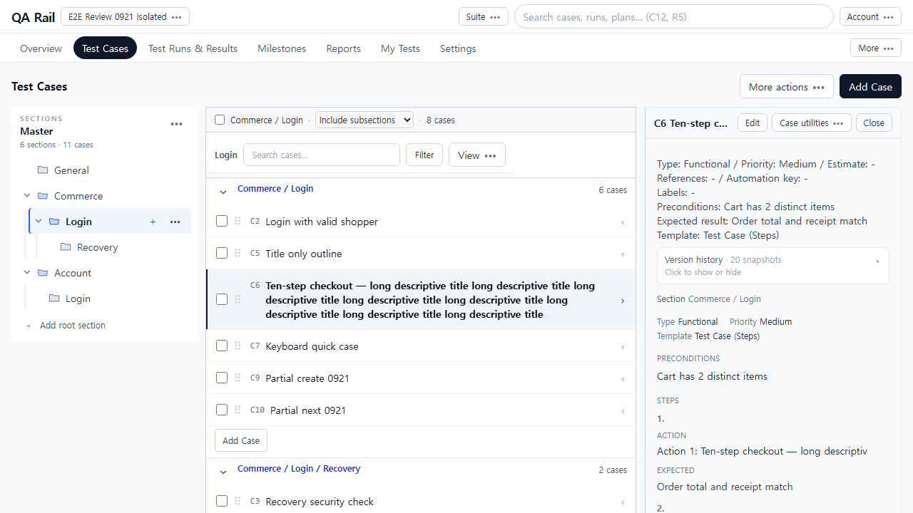
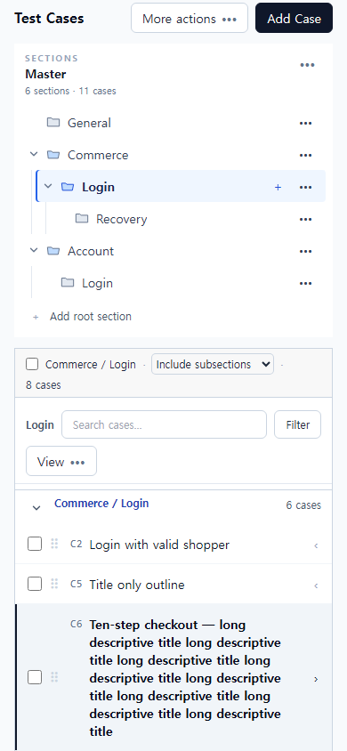

# TestRail 업무 흐름 기준 UI/UX 검토 — 2026-09-21

> **2026-09-23 평가 기준 수정:** 최상위 판단은 [TestRail 공식 화면 기준 페이지 전체 구성 검토](./TESTRAIL_PAGE_COMPOSITION_REVIEW_2026-09-23.md)를 따른다. 아래 개별 UX 항목은 페이지 평가의 세부 증거다. 공식 화면 비교 결과, '메타가 앞에 있음' 또는 '차트 아래에 작업이 있음'만으로 불합격 처리한 해석은 철회한다. 핵심은 영역 간 관계·공간 배분·정보 위계·페이지 간 일관성이다.

실제 제품 조작·캡처: 2026-09-21. UI/UX 중심 재평가: 2026-09-22.

**결론: 섹션→케이스 목록→상세→결과라는 구조는 TestRail과 유사하다. 그러나 처음 보는 테스터가 작성·읽기·기록·재개를 자연스럽게 이어가는 UI/UX는 아직 충분히 정리되지 않았다.** 주요 문제는 기능 부족보다 **잘못 강조된 진입점, 지침 앞을 차지하는 보조 정보, 동시에 노출된 제어, 읽기 공간 부족, 화면 간 다른 상세 전환 방식**이다.

앞선 보고서는 실제 UI를 조작했지만 저장·복구의 정확성을 중심으로 구성했다. 사용자가 요청한 UI/UX 평가를 충분히 수행한 보고서로 보기 어려워 본문을 다시 작성했다. 기능·API·테스트 결과는 [기능 검증 보조 문서](./E2E_FUNCTIONAL_EVIDENCE_2026-09-21.md)로 분리했다. 그 문서의 `pass`는 TestRail과 동등한 사용성 합격을 뜻하지 않는다.

제품 코드, 원본 문서, Current, 체크박스, 예약, 권한은 변경하지 않았다. 수정 후 화면이나 after는 없다.

## 재검토 핵심: 화면을 보고 무엇을 추론해야 하는가

2026-09-22 보완에서는 이 작업에서 확보한 실제 화면 18개를 다시 열어 프로젝트 진입→범위 선택→작성/읽기→Run 실행→일괄 기록→오류 복구→재개를 검토했다. 섹션 들여쓰기 한 건만 추가하는 방식에서 벗어나 **구조, 현재 위치, 행동 대상, 처리 상태를 화면이 스스로 설명하는지**를 판단했다. 상세 근거와 검토 범위는 [직관성 재검토 기록](./UI_INTUITIVENESS_REVIEW_2026-09-22.md)에 있다. 새 live E2E나 독립 사용자 실험은 아니다. 원본 hash 재대조 결과 drift 0이다.

| 사용자가 바로 알아야 할 것 | 현재 화면에서 대신 해야 하는 추론 | 판정·우선순위 |
| --- | --- | --- |
| 어떤 섹션의 하위인가 | 같은 깊이의 전체 경로를 읽고 관계를 복원 | UX-R10, P1 |
| 지금 전체 목록인가 Login 목록인가 | All sections와 Login 제목·선택 강조 중 어느 것이 실제 범위인지 판단 | UX-R11, P1 |
| 이 버튼은 몇 개에 적용되는가 | 6 selected와 오른쪽 C5 상세, 여러 Assign/결과 버튼의 영역을 대조 | UX-R12, P1 |
| 이미 저장됐는가, 무엇을 다시 해야 하는가 | Result saved와 Add Result, 두 Retry, Cancel의 의미를 함께 해석 | UX-R13, P1 |
| 다음 미실행으로 이동하는가, 상태를 바꾸는가 | Pass & Next 옆 Untested →의 다른 동작을 기억 | UX-R05 보강, P1 |
| 실행할 준비가 끝났는가 | Plan의 NO CONFIGURATION과 Configure, Open run을 함께 해석 | UX-R14, P2 |
| 지금 열어볼 업무가 어디 있는가 | Overview 차트·Milestone 통계·모바일 Run 도구 아래에서 작업을 찾음 | UX-R15, P2; UX-R04 보강 |
| 단계별 Expected와 마지막 Expected result는 어떻게 다른가 | 거의 같은 필드 이름의 적용 범위를 추측 | UX-R16, P2 |
| Run에서도 같은 섹션 구조인가 | Cases의 전체 경로와 Run의 LOGIN/RECOVERY 평면 제목을 다시 대응 | UX-R17, P1 |

**수정 검토 순서는 구조·범위·행동 대상·저장 상태를 먼저 명확히 하고, 작성 진입과 읽기 공간, 보조 정보의 우선순위를 정리하는 순서다.** 아래 기존 작업 번호는 편입 관계이며, 번호가 있다는 이유로 사용성 합격으로 취급하지 않는다. 새 발견의 우선순위는 이 표를 따른다. 기존 §7은 UX-R01~10의 편입 제안으로 한정한다.

## 1. 무엇을 기준으로 판단했는가

테스터의 목표를 다음 여섯 질문으로 평가했다.

1. 지금 어디에 있으며 어떤 케이스·Run을 다루는지 알 수 있는가?
2. 설명을 듣지 않고 다음 주요 행동을 발견할 수 있는가?
3. 제목·사전조건·절차·기대 결과가 읽고 쓰는 순서대로 배치되는가?
4. 수행 중 목록·지침·결과 사이에서 불필요하게 시선과 스크롤을 옮기지 않는가?
5. 같은 행동이 화면마다 같은 의미를 가지며, 취소·복귀 후 이전 문맥을 이어갈 수 있는가?
6. 좁은 화면에서도 같은 업무를 수행할 수 있는가?

버튼 존재, 클릭 성공, 가로 overflow 0, 단위 테스트 통과는 이 질문의 충분한 답이 아니다. 특히 자동화가 화면 밖 버튼까지 찾아 스크롤한 것은 사용자가 쉽게 발견했다는 증거가 아니다.

### 근거와 한계

- 이 작업에서 직접 조작해 남긴 `e2e-0921-*` 화면·행동 기록을 다시 시각 검토했다. 과거 다른 UI 작업의 screenshots를 이번 제품 검증으로 대체하지 않았다.
- 원본과 worktree HEAD는 `cea2fd676156969d2442b5eef3e7c9026465cf7b`. 실제 검증은 원본 미커밋 변경을 포함한 격리 스냅샷에서 수행했다. 원본의 UI-064/065 완료, UI-066 진행 중 상태를 반영한다.
- [기준 hash](./ux-evidence/e2e-0921-baseline.json)와 [재평가 시 hash 대조](./ux-evidence/e2e-0921-end-source.json)에서 검사 대상 원본 drift 0. 이번 재평가는 같은 화면 기준에 유효하다.
- 재평가 시 검토용 웹 포트 5196은 실행 중이 아니었다. 이번 보완을 새로운 live E2E 실행으로 포장하지 않는다. 이미 이 작업에서 확보한 실제 화면과 기록을 분석했고, TestRail 공식 참고 이미지는 이번에 브라우저로 직접 열어 확인했다.
- TestRail 로그인 제품을 같은 fixture로 조작한 비교 실험은 아니다. 공식 문서·공식 이미지·제공 참고 화면을 설명한 프로젝트 설계 문서와의 비교다. 제품 버전, 데이터, 화면 크기가 다르므로 정확한 클릭 수·작업 시간·동일 픽셀 밀도 우열은 주장하지 않는다.
- 아래의 '헤맬 가능성/오해 위험'은 화면과 행동 근거에 따른 전문가 평가다. 실제 사람의 망설임 시간이나 성공률을 측정했다고 주장하지 않는다. 독립 테스터 미참여는 발견된 화면 문제를 판정하지 않을 이유가 되지 않는다.

## 2. TestRail에서 가져올 흐름과 그대로 복제하지 않을 부분

| 확인한 공식 근거 | 읽어야 할 UI/UX 원칙 | 이 제품에 적용하는 판단 |
| --- | --- | --- |
| [전체 작성·quick outline 설명](https://support.testrail.com/hc/en-us/articles/14438119644692-Adding-test-cases), [전체 폼 이미지](https://support.testrail.com/hc/article_attachments/35637920570644), [섹션 quick outline 이미지](https://support.testrail.com/hc/article_attachments/35637920575252) | 지침까지 작성하는 전체 경로와 섹션 문맥 안에서 제목을 연속 수집하는 경로를 구분한다 | 섹션의 빠른 추가는 유지. 상단 주요 행동은 전체 작성으로 구분해야 한다 |
| [결과 입력 설명](https://support.testrail.com/hc/en-us/articles/15813183376148-Submitting-test-results), [3-pane 이미지](https://support.testrail.com/hc/article_attachments/35638122795924) | 선택한 테스트를 옆에서 확인하고 같은 자리에서 기록한다. 목록 Status와 상세 Add Result는 같은 목적의 다른 진입점이다 | 양쪽 진입점 자체는 불필요한 중복이 아니다. 선택 대상과 읽기·기록의 연결을 유지한다 |
| [결과창 이미지](https://support.testrail.com/hc/article_attachments/15881055029652) | 결과·Comment가 주 내용, 담당자·버전·시간·결함은 보조 내용이며 저장/취소가 한곳에 있다 | 현재 2열 결과창과 고정 footer는 유지 가치가 높다. 장문의 반복 안내는 줄일 후보 |
| [FastTrack 5.1 자료](https://support.testrail.com/hc/en-us/articles/16959978163604-TestRail-5-1-Default) | 목록과 상세 사이의 페이지 왕복을 줄이는 업무 구조 | 2015년 역사적 구조 참고다. 최신 TestRail 외관의 기준으로 쓰지 않는다 |

공식 이미지에도 많은 도구·큰 차트·메타 필드가 있다. 따라서 'TestRail은 항상 더 단순하고 버튼이 적다'고 일반화하지 않는다. 이 프로젝트가 선택한 작은 결과창, 상단 통계, 읽기 우선 패널은 기존 설계 계약을 따른다. 개선 목표는 TestRail의 장식 복제가 아니라 **같은 업무를 연속해서 수행하게 하는 구조**다.

프로젝트 기준: [전체 배치 검토](./TESTRAIL_UI_REALIGNMENT_REVIEW_2026-09-19.md), [결과창 설계](./RUN_RESULT_DIALOG_DESIGN_2026-09-19.md), [상태 요약 설계](./RUN_STATUS_OVERVIEW_DESIGN_2026-09-19.md). 특히 모바일 상세는 목록을 대체하는 읽기 영역으로 전환하고, 기본 화면에서 관리 명령보다 업무 내용을 우선한다는 계약을 함께 적용했다.

## 3. 테스터의 한 업무를 따라간 비교

과제: **Commerce/Login의 새 로그인 테스트를 작성하고, Chrome Run에서 수행한 결과를 남긴 뒤, 중단했다가 같은 Run/test로 돌아온다.** 아래의 pass/fail은 해당 UI/UX 관점의 판정이다.

| 업무 단계 | 자연스러운 흐름 | 현재 화면·행동 | UI/UX 판정 |
| --- | --- | --- | --- |
| 프로젝트에 들어간다 | 케이스 준비와 오늘 실행할 작업을 구분 | Cases/Runs/Assigned 바로가기, Overview Active work 제공. 명칭 체계는 My Tests / Assigned / Assigned to me로 나뉨 | 대체로 적합. 명칭 학습 부담은 정리 후보 |
| 섹션을 찾는다 | 폴더 계층을 따라 이동하고 목록에서도 부모·자식과 TC 소속을 바로 이해 | 왼쪽 트리는 들여쓰지만 본문 Commerce/Login과 그 하위 Recovery 블록은 같은 깊이. 전체 경로를 읽어야 관계를 앎 | 트리 탐색 일부 pass / 본문 계층 표현 fail(UX-R10) |
| 지침을 새로 작성한다 | 주요 Add Test Case에서 제목과 절차를 함께 작성 | 가장 강조된 Add Case는 제목 전용. 전체 폼은 More actions에 있음 | fail. 주 행동의 역할이 목표와 다름 |
| 제목만 빠르게 수집한다 | 해당 섹션 끝에서 연속 입력 | 섹션 Add Case→제목→Enter→다음 입력 유지 | pass. 전체 작성과의 구별만 필요 |
| 내용을 쓰고 보완한다 | 목적지·템플릿 확인 후 지침 작성에 집중 | 전체 폼에서 메타·설명·큰 헤더가 첫 화면을 차지. 패널 Edit는 첨부부터 시작 | fail. 작성의 핵심이 뒤로 밀림 |
| 케이스를 선택해 읽는다 | 한 곳의 제목·메타 뒤에 지침을 읽음 | 패널 상단 요약, Version history, 소속, 다시 메타·Preconditions를 거쳐 Steps에 도달 | fail. 반복 정보가 읽기 순서를 끊음 |
| Run을 구성한다 | 무엇을 포함할지 선택한 뒤 실행 | All/Selected/Dynamic의 의미를 짧게 설명. Schedule/environment는 접혀 있음 | 대체로 적합. 포함 요약·Cancel 반복은 축약 후보 |
| Run에서 처음 보는 테스트를 수행한다 | 제목→사전조건→첫 Action/Expected→다음 단계 | 1280×720 긴 제목 사례는 첫 Action이 초기 패널에서 완전히 읽히지 않음. 결과 버튼은 항상 보임 | fail. 기록보다 앞선 읽기 공간이 부족 |
| 결과를 기록한다 | 읽던 대상이 표시된 짧은 폼에서 기록 | C번호·제목이 있는 공통 결과창, 주/보조 필드 분리, 고정 저장/취소 | pass 범위가 가장 명확. 기존 이력이 있으면 안내가 Comment를 아래로 밀어냄 |
| 다음 테스트로 이동한다 | 기록과 단순 이동의 차이가 명확 | Pass & Next가 목록 위·패널 아래 두 곳, Prev/Next도 두 곳. 상태별 화살표 이동까지 병렬 노출 | fail(계층). 동작은 정확해도 선택지가 경쟁 |
| 중단 후 재개한다 | 업무 목록에서 Run/test를 인식해 복귀 | My Tests는 제목·Run·상태·Open test가 한 행에 있어 직접 복귀 가능. 작성 Cancel은 검색·범위를 잃음 | 실행 재개 일부 pass / 케이스 복귀 fail |
| 모바일에서 같은 업무를 한다 | 목록→상세→목록의 한 가지 전환 문법 | Run은 상세 대체+Back to tests. Cases는 목록 아래 패널이 붙어 스크롤 탐색 필요 | fail. 화면 간 조작 문법이 다름 |

**현재 사용자는 실행 경로에 도달할 수는 있지만, 작성 시에는 숨은 전체 폼을 찾아야 하고, 읽을 때는 반복 메타를 지나야 하며, 실행 중에는 많은 이동·보기 제어 사이에서 주 행동을 골라야 한다. 이것이 TestRail형 업무 흐름과의 주요 간극이다.**

## 4. 화면별 구체적인 UI/UX 문제와 개선 방향

### UX-R01. 가장 강한 추가 버튼이 전체 작성을 시작하지 않음 — P1, UI-069

[현재 섹션 화면](./ux-evidence/e2e-0921-scope-subtree.png)에서 상단 검은 Add Case가 가장 강조된다. 이를 선택하면 제목만 추가한다. 지침까지 쓰려는 사람은 More actions에서 Add Test Case를 찾아야 하거나, 제목을 저장한 후 새 행→Edit로 우회한다. 섹션 아래에도 같은 이름의 추가가 있어 두 행동의 역할 차이를 화면에서 추론할 수 없다.

- **사용자 부담:** '추가하면 전체 양식이 나올 것'이라는 예상이 어긋난다. 제목 추가 완료를 테스트 준비 완료로 오해할 위험이 있다.
- **정리 방향:** 상단 **Add Test Case = 전체 작성**, 섹션 끝 **Add Case = 제목 빠른 추가**. More actions의 동일 전체 작성 항목은 중복 유지하지 않는다. 설명 카드나 세 번째 CTA를 추가하지 않는다.
- **완료 조건:** 메뉴 탐색 없이 전체 지침 작성으로 진입하며, 빠른 제목 입력은 섹션 문맥과 Enter 연속성을 유지한다. 처음 보는 테스터에게 두 목적만 제시해 맞는 시작점을 고르는지 관찰한다.
- **원인 위치:** `ProjectContentHeader.tsx`, `CaseListPane.tsx`, `CaseListOutlineAdd.tsx`, `caseRoute.ts`. 기존 CA-U01/UI-069와 중복이다.

### UX-R02. 작성 화면의 첫 관심사가 지침이 아님 — P1, UI-070 범위 및 UI-049 재검토

[전체 작성 1280×720](./ux-evidence/e2e-0921-context-entry.png)에서는 별도 제목 카드와 Suite 안내 다음에 Title, Section/Template, Type/Priority, Estimate/References가 이어진다. Preconditions가 화면 아래에서 시작하고 Steps·Expected는 초기 viewport에 없다. [패널 Edit](./ux-evidence/e2e-0921-case-edit-1280.png)는 빈 Case images 블록부터 시작한다. 360px 안팎 패널에 2열 메타 입력이 들어가 Estimate 설명의 오른쪽 일부도 잘려 보인다.

공식 전체 작성 이미지도 메타를 앞에 두지만, 뒤이어 Preconditions→Steps→Expected가 한 방향으로 연속 배치된다. 동일 viewport 비교는 아니므로 'TestRail보다 몇 px 낭비'라고 계산하지 않는다. 현재 문제는 이 제품의 패널 폭과 상단 구조에서 **지침 작성이 첫 화면의 중심이 되지 못한다는 것**이다.

- **사용자 부담:** 작성자는 테스트 행동을 생각하기 전에 분류·추정·첨부를 먼저 훑는다. 빠르게 보완하려고 연 패널에서 지침까지 다시 스크롤해야 한다.
- **정리 방향:** 제목/목적지·템플릿 뒤에 지침을 배치하고 선택적 메타·첨부의 강조를 낮춘다. 읽기와 무관한 큰 제목 카드·중복 Suite 안내는 공통 헤더와 통합한다. 좁은 패널은 한 열을 기본으로 한다. Save/Cancel의 안정된 위치는 유지한다.
- **완료 조건:** 일반 Text·3-step에서 지침 작성 위치를 바로 찾고, 360px 패널에서 label/설명이 잘리지 않는다. 10-step에서도 마지막 지침과 저장 조작을 함께 접근할 수 있다.
- **원인 위치:** `AddCasePage.tsx`, `CaseAuthoringForm.tsx`, `ExpandableCaseDetail.tsx`. 패널 순서/폭은 UI-070에 흡수. 전체 작성 헤더까지 기존 범위에 포함되는지는 편입 시 분리 확인한다.

### UX-R03. 읽기 패널이 같은 사실을 두 번 설명함 — P1, UI-070

[케이스 읽기 패널](./ux-evidence/e2e-0921-case-panel-1280.png)의 순서는 메타·Preconditions·Expected 요약→Version history→Section→다시 Type/Priority/Template→다시 Preconditions→Steps다. Version history 박스는 실제 절차보다 위에 있다. 제목은 잘려 있는데 보조 메타는 반복된다.

- **사용자 부담:** 어느 내용이 본문인지 다시 판단하고, 이미 읽은 사전조건을 재독한다. 좁은 패널의 높이를 지침 대신 중복 설명에 사용한다.
- **정리 방향:** ID/제목→한 번의 메타·소속 요약→Preconditions→Action/Expected→공통 Expected 순서. 버전·복제·삭제는 보조 위치로 이동한다. 예상 결과 자체를 삭제하거나 접힌 고급 메뉴로 숨기지 않는다.
- **완료 조건:** 같은 메타/사전조건은 한 번만 보이고, 처음 보는 사람이 버전 이력을 열지 않고 수행 절차와 기대 결과를 설명할 수 있다.
- **원인 위치:** `ExpandableCaseDetail.tsx`와 `CaseInstructionReadView.tsx`의 중복 출력. UI-070과 동일하며 새 작업 불필요.

### UX-R04. Run의 읽기 공간보다 위쪽 제어가 우선됨 — P1, UI-039/040/042/050 목표 재검토

[1280 Run](./ux-evidence/e2e-0921-run-1280.png)에서는 전역 줄·프로젝트 탭·breadcrumb·Run 헤더·통계 다음인 y≈318에서 workbench가 시작한다. 선택 C6의 긴 제목과 메타·Preconditions 뒤에 첫 step 번호만 보이고, Action/Expected 본문은 아래로 스크롤해야 한다. Add result footer는 바로 보인다. [1440×1000](./ux-evidence/e2e-0921-run-1440.png)에서는 같은 데이터의 단계가 여러 개 보인다.

이 수치는 캡처상의 위치이며 DOM 정밀 재측정값은 아니다. 긴 제목 fixture의 스트레스 상태에 관한 판정이지 모든 케이스가 읽기 불가능하다는 주장은 아니다.

- **사용자 부담:** 실제 테스트 내용보다 결과를 남기는 조작이 먼저 눈에 들어온다. 목록의 많은 보조 열과 제어를 유지하는 동안 가장 중요한 지침은 좁고 짧은 영역에 배치된다.
- **정리 방향:** 읽기 패널의 실사용 폭·높이를 먼저 확보한다. 중복 breadcrumb/헤더 문맥, 상시 할당 폼, 낮은 빈도의 목록 열·보기 제어가 쓰는 공간을 줄인다. 통계를 다시 영구 왼쪽 열로 돌리거나 지침 글자를 줄이는 해결은 피한다.
- **완료 조건:** 대표적인 보통 제목·3-step에서 사전조건과 첫 Action/Expected를 초기 읽기 영역에서 함께 볼 수 있다. 긴 제목·10-step에서는 제목을 임의로 잃지 않으면서 단계 읽기 시작 위치와 스크롤이 명확하다. Add result footer가 마지막 지침을 가리지 않는다.
- **원인 위치:** `RunDetailPage.tsx`의 workbench·패널 배치와 헤더/통계/toolbar 조합. UI-064 범례 수정의 실패로 돌리지 않는다. 기존 목표의 배치 후속 후보이며 코드 수정은 하지 않았다.

### UX-R05. 실행·이동·보기 동작이 같은 강도로 경쟁함 — P2, 기존 CAND-02 구체화

[Run 1280](./ux-evidence/e2e-0921-run-1280.png)에는 목록 위 Pass & Next, Failed→/Blocked→/Untested→, Prev/Next, 도움말이 있고, 그 아래 Columns/Filter/Group/Sort/Compact/Comfortable/Search가 있다. 패널에는 다시 Prev/Next/Open case와 Add result/Pass & Next/Assign to me가 있다.

- **사용자 부담:** '다음으로 간다'와 'Passed를 저장하고 다음으로 간다'가 가까운 여러 위치에 있다. 수행자는 지침을 읽기 전에 자기 목적에 맞는 제어를 골라야 한다. 네 개의 Prev/Next 버튼이 있다는 사실만으로 오조작을 단정하지는 않지만 행동 계층은 분산되어 있다.
- **정리 방향:** 선택한 테스트의 읽기/기록/다음 이동을 한 작업 영역으로 묶는다. 상태별 점프와 보기 설정은 보조 그룹으로 통합하고 적용 상태는 남긴다. 어디서나 필요한 검색·필터까지 전부 숨기지는 않는다.
- **보존:** 목록 Status와 패널 Add result는 두 가지 정당한 진입점이다. 이를 제거 대상으로 삼지 않는다. Pass & Next의 명시적 저장 의미와 키보드 경로도 보존한다.
- **완료 조건:** '결과 없이 다음 지침만 보기', '성공 기록 후 다음', '실패 상세 기록' 과제를 주었을 때 각 행동의 차이를 설명할 수 있다. 잘못된 저장·도움 요청·되돌아가기를 관찰한다. 단순 버튼 수 감소를 수용 기준으로 삼지 않는다.
- **원인 위치:** `RunDetailPage.tsx` 및 목록 toolbar/패널의 독립 행동 영역. UI-039/050 재검토와 통합 가능한지 확인 후 한 단위로 편입한다.

### UX-R06. 모바일 Cases와 Run의 상세 전환 문법이 다름 — P1, UI-070

[모바일 Cases](./ux-evidence/e2e-0921-case-panel-390.png)는 트리→범위/검색→목록 아래에 패널이 붙는다. C6를 연 상태에서도 첫 화면은 목록이며, 기록된 Edit 버튼의 viewport y는 1217.5였다. [Run 모바일 상세](./ux-evidence/e2e-0921-run-390.png)는 목록 대신 지침과 Back to tests를 보여준다.

- **사용자 부담:** 같은 '행을 연다'는 행동인데 Cases에서는 변경된 영역을 아래에서 찾아야 하고 Run에서는 바로 읽는다. 클릭이 반응하지 않은 것으로 오해해 재클릭할 수 있다. 이것은 가로 overflow 유무로 잡히지 않는다.
- **정리 방향:** Cases도 좁은 화면에서 활성 상세·편집 영역으로 전환하고 명확한 목록 복귀를 제공한다. 복귀 때 이전 행·검색·스크롤 위치를 회복한다. 데스크톱 3-pane 구조를 모바일에 세로로 단순 적층하지 않는다.
- **완료 조건:** 탭/터치로 케이스를 열면 제목·읽기/편집 작업 영역이 즉시 보이고, 닫으면 원래 행으로 돌아온다. 패널 버튼의 자동 스크롤 클릭 성공을 대신 쓰지 않는다.
- **원인 위치:** `TestCaseWorkspace.tsx`, `CaseDetailSidePanel.tsx`. UI-070의 기존 모바일 기준과 중복.

### UX-R07. 실행 허브에서 색을 읽어야 남은 작업을 파악하는 경우 — P2, 새 검토 후보

[실행 목록](./ux-evidence/e2e-0921-resume-runs-list.png)의 Run A는 실제 6 Blocked인데 요약은 `6 tests`, 오른쪽 `0%`, 주황 막대다. 같은 화면의 Run B는 `6 tests · 5 untested`, `17%`로 구체적이다. 상세에서는 6 blocked가 표시된다.

- **사용자 부담:** 허브에서 '왜 진행이 멈췄는지'를 알려면 색의 의미를 기억하거나 Run을 열어야 한다. 0%가 통과율이라는 문맥도 상세보다 약하다. 저장 실패가 아니라 요약의 정보 선택 문제다.
- **정리 방향:** 짧은 요약에 현재 남은 작업 성격을 텍스트로 넣는다. 예: `6 tests · 6 blocked`, `0% passed`. 모든 상태를 큰 카드로 늘어놓거나 차트를 추가하지 않는다.
- **원인 위치:** `runListHubModel.ts`의 work summary는 total/untested 중심이며, 진행 막대와 비율이 분리되어 있다. UI-063의 Overview·Milestone 집계 정확성과는 다른 'Run 목록 요약' 범위다. UI-047/050 목표와 대조 후 중복이 없을 때 편입한다.
- **완료 조건:** 동일 크기의 행에서 미실행·실패·차단 Run을 색 없이 구별하고 다음에 열 Run을 선택할 수 있다. Passed-only/Untested-only/Blocked-only/혼합/완료 Run을 확인한다.

### UX-R08. 취소·복귀가 '하던 자리로 돌아간다'는 기대를 깨뜨림 — P1 사용 흐름, 기존 UI-072

[출발](./ux-evidence/e2e-0921-context-before.png)에서 Login 검색·direct 범위를 설정하고 전체 작성에 들어간 뒤 Cancel하면 [복귀 화면](./ux-evidence/e2e-0921-context-after.png)의 검색은 비고 subtree가 된다. 이는 URL 보존의 기술 문제가 아니라 테스터가 방금 찾던 업무 집합을 다시 구성해야 하는 사용성 문제다.

- **정리 방향:** 저장·취소 모두 출발 문맥을 유지한다. 새 케이스가 필터 밖이면 조건을 몰래 바꾸지 말고 저장 사실과 케이스 열기를 안내한다.
- **완료 조건:** 작성 전 찾던 행·조건·위치로 돌아와 다음 행동을 이어갈 수 있다. 사용자가 같은 검색과 필터를 다시 입력할 필요가 없다.
- **원인 위치:** `caseRoute.ts`, `AddCasePage.tsx`의 return context. UI-072에 편입하고 독립 신규 작업을 만들지 않는다.

### UX-R09. 결과창의 기본 계층은 적합하나 반복 안내가 입력과 경쟁함 — P2 보완 후보

[현재 결과창](./ux-evidence/e2e-0921-result-dialog-panel.png)은 대상 C번호·제목, 왼쪽 Status/Comment, 오른쪽 Assign/Version/Elapsed/Defects, 하단 저장/취소로 구성된다. 공식 참고 이미지의 주/보조 구분과 유사하며 현재 흐름에서 가장 잘 정리된 부분이다.

기존 결과가 있는 fixture에서는 Untested 제한과 이력 불변 안내 두 문단이 Status와 Comment 사이에 상시 나타난다. 사용자는 자주 기록하는 Comment보다 먼저 정책 설명을 읽게 된다. Case steps와 Step results 두 접힘도 '지침 확인'과 '단계 결과 기록'의 차이를 이름만으로 파악해야 한다.

- **정리 방향:** 일반적인 기록에는 핵심 입력을 먼저 보이게 하고, 제한 안내는 관련 선택·이력 문맥에서 간결하게 제공한다. 지침/실제 단계 결과의 구별은 유지한다. 필수 오류나 부분 성공 경고는 축약으로 숨기지 않는다.
- **완료 조건:** 기존 결과가 있는 평상시 기록에서 Comment와 저장이 주 흐름을 이루고, 실제로 제한된 동작을 시도하면 이유를 이해한다. 초보자 관찰 후 접힘 이름 변경 필요성을 판단한다.
- **범위:** UI-051의 작은 공통 폼을 유지하는 문구·배치 보완. 새 입력창·결과 정책 변경·항상 표시할 설명 카드 추가 제외.

### UX-R10. 섹션별 TC 목록이 경로만 다른 평면 블록으로 표시됨 — P1, UI-023 후속 검토

[하위 섹션 포함 화면](./ux-evidence/e2e-0921-scope-subtree.png)에서 `Commerce / Login`과 `Commerce / Login / Recovery` 제목은 같은 왼쪽 위치에 있다. 두 블록의 TC 행과 Add Case도 동일한 깊이로 정렬된다. 왼쪽 트리에는 들여쓰기가 있지만, 사용자가 실제로 TC를 읽는 본문에는 부모·자식 관계가 시각적으로 전달되지 않는다. **섹션별로 분리되었다는 사실과 하위 섹션을 계층적으로 알아보기 쉽다는 평가는 다르다.** 앞선 '계층과 케이스 소속을 읽기 쉽다'는 긍정 판단을 철회한다.

- **사용자 부담:** 경로 문자열을 매번 해석하거나 왼쪽 트리를 대조해야 Recovery가 Login의 하위임을 안다. 여러 하위 섹션이 펼쳐지면 동급 섹션과 자식 섹션을 빠르게 훑어 구별하기 어렵다.
- **원인 확인:** `CaseListPane.tsx`는 `sectionDepthById`를 계산하고 그룹 유틸도 `depth`를 전달한다. 그러나 `repositoryGroups.map`의 본문 블록은 동일한 여백으로 출력하며 이 깊이를 시각 배치에 사용하지 않는다. 계층 데이터 부재가 아닌 본문 표현의 문제다. 실제 캡처와 원본 소스를 대조했으며 새 live 실행은 하지 않았다.
- **정리 방향:** 선택한 범위를 기준으로 부모→자식 순서를 유지하고, 하위 섹션 제목과 그 소속 TC 제목·빠른 추가를 일관된 들여쓰기로 묶는다. 경로는 동명 섹션 식별에 필요한 보조 정보로 유지하되 계층 표현을 경로 문자열에만 맡기지 않는다. 선택 체크박스와 메타 열의 정렬, 긴 TC 제목의 읽기 폭을 함께 검토한다. 모바일·깊은 중첩에는 들여쓰기 상한과 문맥 표시를 적용한다.
- **완료 조건:** direct/subtree/all 각각에서 부모 직접 소속 TC와 자식 소속 TC가 중복 없이 구분된다. 3단계 이상·형제 섹션·동명 Login·직접 TC 없는 부모·검색 결과·Compact/Comfortable을 포함해 확인한다. 1280/1440/390에서 전체 경로를 하나씩 읽지 않고도 상하 관계와 소속을 알아볼 수 있어야 한다. 접기/펼치기의 영향 범위와 숨겨진 선택 표시가 화면의 계층과 일치하는지도 확인한다.
- **기존 작업 관계:** UI-023의 경로 헤더·소속 구분 완료 근거만으로 계층 가독성을 합격 처리할 수 없다. UX-013/023 및 UI-023의 후속 검토로 연결한다. 목적지 선택의 UI-059나 상세 패널 UI-070으로 대신 처리하지 않는다. 기존 체크·Current는 변경하지 않았다.
- **비교 근거의 범위:** [TestRail Sections 공식 문서](https://support.testrail.com/hc/en-us/articles/14985199889812-Sections)는 섹션/하위 섹션 계층과 Test Case 화면에서의 접기/펼치기를 설명한다. 여기서 구체적인 들여쓰기 개선은 사용자가 명시한 비교 요구와 현재 화면의 결함을 기준으로 제안하며, 최신 TestRail과 동일한 픽셀 간격을 검증했다고 주장하지 않는다.

## 5. 유지해야 할 좋은 흐름

- **왼쪽 폴더 트리와 동명 섹션 식별:** 트리의 들여쓰기와 경로를 통한 동명 구분은 보존한다. 본문 섹션별 블록은 존재하지만 계층 가독성은 불합격이며 UX-R10의 개선 대상이다.
- **섹션 quick outline:** 제목 여러 개를 연속 작성하는 용도에 맞는다. 전체 작성 개선을 이유로 제거하지 않는다.
- **공통 결과창:** 선택한 대상이 제목에 있고, 저장/취소 위치가 안정적이다. 일반 저장 현재 유지와 명시적 다음 이동은 예측 가능한 계약이다.
- **Run 구성의 단계적 노출:** All/Selected/Dynamic 의미를 짧게 설명하고 일정·환경은 기본 선택 뒤에 둔다. 중복 요약·Cancel은 줄일 수 있지만 이해에 필요한 포함 정책은 남긴다.
- **My Tests:** [현재 화면](./ux-evidence/e2e-0921-my-tests-assigned.png)은 케이스·Run·상태·Open test를 한 행에서 확인한다. 같은 케이스가 여러 Run에 있을 때 올바른 대상 재개에 도움이 된다.
- **Plan 상세의 Runs to execute:** entry/선택 수/Open run으로 이어지는 구조는 관리 설정을 펼치지 않고 실행할 수 있다. `NO CONFIGURATION`, 숫자 breadcrumb 등의 표현은 사람 관찰 후 정리할 후보이며, 새로운 기능 추가가 우선은 아니다.

## 6. 시각적 정리의 구체적 원칙

| 영역 | 현재 문제 | 줄이거나 합칠 것 | 반드시 남길 것 |
| --- | --- | --- | --- |
| 전역/페이지 문맥 | Run breadcrumb에 프로젝트명이 반복되고, 작성에는 별도 큰 제목 카드 | 중복 문맥과 불필요한 헤더 높이 | 프로젝트·Run·선택 case 식별 |
| Cases 목록 | 부모·자식 블록이 평면이며 경로를 읽어야 관계를 앎 | 반복 경로 중심 표현을 본문의 계층 들여쓰기와 간결한 문맥으로 정리 | direct/subtree/all·동명 식별·각 TC 소속·행 가독성 |
| 읽기 패널 | 메타·지침 요약 중복, 버전 박스 선행 | 중복 출력과 보조 정보의 상단 점유 | 실제 사전조건·Action·Expected |
| 편집 패널 | 빈 첨부 카드가 첫 내용, 좁은 폭의 2열 폼 | 빈 첨부 강조, 폭에 맞지 않는 열 구성 | 제목·목적지·템플릿·지침·안정된 Save/Cancel |
| Run 도구막대 | 이동·결과·보기 설정이 여러 줄에 병렬 노출 | 중복 이동과 낮은 빈도의 설정 기본 노출 | 검색·적용 필터·선택 대상·주요 기록 행동 |
| Run 허브 | 막대색·비율로 남은 작업 의미 전달 | 의미 없는 비율 반복보다 짧은 상태 요약 우선 | Run/Plan 구별, test 수, 실행 진입 |
| 경계/카드 | 입력·선택과 단순 정보 모두 박스로 구획 | 제목/메타/설명용 불필요한 카드·중첩 경계 | 입력, 포커스, 선택, dialog, 오류의 의미 있는 경계 |

단순화는 기능을 모두 More로 옮기거나 글자를 줄이는 작업이 아니다. **테스터가 지금 수행할 판단과 내용에 화면 공간을 돌려주는 것**이다.

## 7. 개선 우선순위와 기존 작업 편입 제안

실제 실행 순서는 원본 NEXT_ACTIONS만 관리한다. 아래는 UI/UX 영향 순위이며 Current나 체크를 변경한 것이 아니다.

| 순위 | 결과로 바꿔야 할 사용자 경험 | 작업 관계·범위 | 검증 방법 |
| --- | --- | --- | --- |
| 1과 함께 | 목록에서 부모·자식 섹션과 각 TC 소속을 바로 알아봄 | UX-R10, UI-023 후속 검토 | 3단계·동명·빈 부모, direct/subtree/all, 좁은 화면에서 본문 들여쓰기와 소속 판독 확인 |
| 1 | 지침 작성으로 바로 들어가고 읽기·편집에서 지침이 먼저 보임 | UI-069/070. UX-R01/02/03/06을 각 기존 범위에 연결 | 초보자에게 새 지침 작성·기존 지침 보완 목적만 제시. 경로 선택, 첫 지침 위치, 모바일 전환 확인 |
| 2 | Run에서 충분히 읽은 뒤 하나의 명확한 기록/다음 흐름으로 이동 | UX-R04/05를 CAND-02의 구체적 범위로 재정의. 기존 UI-039/040/042/050 목표와 중복 대조 | 보통/긴 제목, 3/10-step, 1280/1440/390에서 읽기 시작·스크롤·다음 판단 확인. 모든 단계/저장 버튼을 한 화면에 우겨넣지 않음 |
| 3 | 작성·취소 후 찾던 케이스와 조건으로 돌아옴 | UI-072, UX-R08 | 검색·scope·필터·행 위치를 재입력하지 않고 다음 케이스 작업 |
| 4 | 허브에서 미실행·실패·차단을 알아보고 올바른 Run 재개 | 신규 후보 UX-R07. Run 목록 요약 한 단위로 제한 | 색 없이 상태 이해; A/B 동일 case, 완료 Run 포함. Plan memory 집계 결함과 분리 |
| 5 | 결과 입력에서 상시 설명보다 기록이 중심이 됨 | UX-R09, UI-051 보완 여부 검토 | 기존 결과 유무·제한 시도·실패 복구에서 설명의 필요성과 입력 방해를 비교 |

UI-066/067/068의 초안·저장 신뢰성 수정은 여전히 필요하다. 다만 **그 수정과 테스트 통과를 위 UI/UX 정리가 완료된 것으로 대체해서는 안 된다.** UI-071 신규 첨부 준비, E01 실제 저장소, E03 사람 관찰도 소유 범위를 유지한다. CAND-01 memory Plan 집계는 기능·환경 정확성 보조 작업이며 UI/UX 개선 목록의 중심으로 올리지 않는다.

### 새 후보의 완료 단위

- **Run 읽기 공간·행동 계층(CAND-02 구체화):** header/toolbar/pane 조합에서 읽기 공간과 행동 역할만 다룬다. 결과창 재작성·통계 API·기능 삭제 제외. 초기 읽기, 단순 다음/저장 후 다음 구별, 키보드·모바일의 같은 계약을 완료 기준으로 한다. 폭·높이 개선과 toolbar 통합이 독립적으로 커지면 구현 전 두 단위로 분리하되 동일 파일의 서로 반대되는 변경을 만들지 않는다.
- **Run 목록 상태 요약(UX-R07):** 목록 한 행의 상태 텍스트와 비율 의미만 다룬다. 새 대시보드·차트·집계 인프라 제외. 이미 받은 statusCounts를 확인하고 데이터가 없을 경우 임의 추정하지 않는다. 각 상태 fixture에서 화면 문구와 실제 값 일치, 색 없이 이해 가능해야 한다.
- **결과창 반복 안내(UX-R09):** 자주 쓰는 입력과 안내의 우선순위만 조정한다. 제한·경고를 삭제하지 않는다. 정상 기록은 간결하고, 제한/오류 시 필요한 설명은 가까이 보이는 것을 완료 기준으로 한다.

## 8. 사람 관찰에서 확인할 것과 이미 판정할 수 있는 것

**이미 화면·행동으로 판정 가능:** 전체 폼의 숨은 진입점, 중복 메타, 첨부 선행, 긴 제목 Run의 읽기 공간 부족, 병렬 제어, 모바일 Cases의 화면 밖 상세, 취소 후 문맥 소실, 허브의 상태 텍스트 부족. 사람을 기다리며 이를 모두 pending으로 돌리지 않는다.

**관찰이 필요한 부분:** 어느 표현에서 실제로 멈추는지, 어떤 버튼을 오해하는지, 업무 완수 시간, Run/Plan 구분의 이해, 접힘 이름·요약 문구의 최적안. 아래 과제를 설명 없이 주고 첫 행동·잘못된 경로·도움 요청·재탐색을 기록한다.

1. 'Commerce/Login에 사전조건과 기대 결과가 있는 테스트를 하나 만들어 주세요.'
2. '지금은 제목만 다섯 개 빠르게 정리해 주세요.'
3. '처음 보는 10-step 케이스의 준비 조건과 첫 세 행동을 설명해 주세요.'
4. '결과를 기록하지 말고 다음 테스트만 보세요. 이어서 실패 근거를 남겨 주세요.'
5. 'Chrome과 Firefox에 같은 케이스가 있습니다. 어제 하던 Firefox 테스트로 돌아가 주세요.'
6. '모바일에서 선택한 케이스를 수정한 뒤 아까 검색한 목록으로 돌아가 주세요.'

현재는 독립 관찰·실제 viewer·외부 bytes 저장이 준비되지 않았다. 이는 사람 수용/권한/첨부 성공의 미검증이며, 위 전문가 UI/UX 평가를 대신하거나 무효화하지 않는다. 이 보고서는 TestRail과 같은 데이터로 실시한 사용자 비교 실험이나 전체 합격 인증이 아니다.

## 9. 대표 화면

### 케이스 읽기: 절차 앞의 반복 정보

### Run 실행: 1280×720에서 읽기 공간과 행동 경쟁

### 모바일 Cases: 선택했지만 상세 대신 목록이 보이는 상태

### 유지할 부분: 대상이 명확한 공통 결과창

API 저장·복구·원인 파일·시나리오별 기능 pass/fail/blocked/not tested·23개 테스트·빌드 로그는 [기능 검증 보조 문서](./E2E_FUNCTIONAL_EVIDENCE_2026-09-21.md)에 보존했다. UI/UX 결론의 대표 근거는 위 화면과 업무 흐름이며 테스트 통과 수가 아니다.
