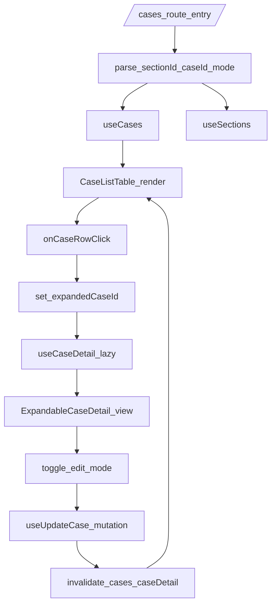

# Frontend Architecture

## Overview

프론트엔드는 React + TypeScript 기반 모듈 구조를 사용하며, 서버 상태는 TanStack Query, 테이블 UI는 TanStack Table로 관리한다.  
핵심 UX 원칙은 테스트 관리 도구의 작업 흐름을 따르되, `Case List` 중심의 `Expandable Case Detail` 구조를 유지하는 것이다.

문서의 디렉터리 구조 예시는 **target structure(목표 구조)**이며, 현재 코드 구조와 차이가 있을 수 있다.  
구현 시에는 실제 코드 트리를 우선하고, 구조 전환은 별도 migration task로 관리한다.

## Tech Stack

- React + TypeScript
- Tailwind CSS + shadcn/ui
- TanStack Query
- TanStack Table
- React Router

## Core Principles

- TestRail UI를 픽셀 단위로 복제하지 않는다.
- 테스트 관리 도구의 정보 구조/작업 흐름을 참고해 독자 UI를 설계한다.
- 컴포넌트에는 비즈니스 도메인 로직을 넣지 않는다.
- API 호출은 feature 단위 `api/` + `hooks/`로 분리한다.
- 주요 화면은 모두 `Loading`, `Empty`, `Error` 상태를 정의한다.
- UI 로드맵은 확정 디자인 문서가 아니라 변경 가능한 구조 문서로 다룬다.

## Design-for-Change Rules

변경 가능성을 전제로 아래 규칙을 기본 아키텍처로 유지한다.

1. Page는 route 단위 조립 역할만 담당한다.
2. Feature component는 작은 화면 조각으로 분리한다.
3. API 호출은 component가 아닌 `feature api/hook`에 둔다.
   - 점진적으로 `packages/api-client`를 표준 진입점으로 전환한다.
   - 전환 완료 전에는 `apps/web/src/shared/api/http.ts`를 compatibility layer로 유지한다.
4. 도메인 판단 로직은 backend service layer에서 처리한다.
5. Case detail 표시 방식은 교체 가능하게 설계한다.
   - 초기: `ExpandableCaseDetail`
   - 대안: `CaseDetailDrawer`, `CaseDetailPage`, `CaseDetailPanel`
6. Run result 입력 방식도 교체 가능하게 설계한다.
   - 초기: `ResultEntryPanel`
   - 대안: `ResultEntryDrawer`, `InlineResultEditor`
7. route와 핵심 데이터 모델은 가능한 안정적으로 유지한다.

## Directory Structure

```text
apps/web/src/
  app/
  shared/
    ui/
    hooks/
    utils/
    types/
  features/
    projects/
    cases/
    runs/
    automation/
    reports/
    settings/
  pages/
```

### App Shell Structure

```text
apps/web/src/shared/ui/
  AppShell.tsx
  ProjectHeader.tsx
  ProjectTabs.tsx
  ProjectSwitcher.tsx
  Breadcrumb.tsx
  LoadingState.tsx
  EmptyState.tsx
  ErrorState.tsx
  ConfirmDialog.tsx
```

### Cases Feature Structure

```text
apps/web/src/features/cases/
  api/
    caseApi.ts
    sectionApi.ts
  hooks/
    useCases.ts
    useCaseDetail.ts
    useCreateCase.ts
    useUpdateCase.ts
    useDeleteCase.ts
    useSections.ts
    useExpandedCase.ts
  components/
    TestCaseWorkspace.tsx
    CaseListPane.tsx
    CaseListToolbar.tsx
    CaseListTable.tsx
    CaseRow.tsx
    ExpandableCaseDetail.tsx
    CaseMetaSummary.tsx
    CaseStepViewer.tsx
    CaseStepEditor.tsx
    CaseFormDrawer.tsx
    SectionTreePane.tsx
    SectionTree.tsx
    AddSectionDialog.tsx
    DeleteCaseConfirmDialog.tsx
  types.ts
  index.ts
```

## Routing and Layout

- Entry / Project:
  - `/projects`
  - `/projects/:projectId`
- Project scoped:
  - `/projects/:projectId/*`
  - 공통 레이아웃: `AppShell`, `ProjectHeader`, `ProjectTabs`, `ProjectSwitcher`, `Breadcrumb`
- Test Cases:
  - `/projects/:projectId/cases`
  - Layout: `[CaseListPane + ExpandableDetail] [SectionTreePane]`
- Test Runs:
  - `/projects/:projectId/runs`
  - `/projects/:projectId/runs/new`
  - `/projects/:projectId/runs/:runId`
- Automation:
  - `/projects/:projectId/automation`
  - `/projects/:projectId/automation/uploads/:uploadId`
  - `/projects/:projectId/settings/tokens`
- Reports:
  - `/projects/:projectId/reports`
- Settings:
  - `/projects/:projectId/settings`
  - `/projects/:projectId/settings/tokens`
  - `/projects/:projectId/settings/members`
  - `/projects/:projectId/settings/custom-fields`
  - `/projects/:projectId/settings/webhooks`
  - `/projects/:projectId/settings/audit-logs`

## Expandable Case Detail Architecture

### Core Rule
- 별도 `Case Detail` 페이지를 만들지 않는다.
- `CaseRow` 하단에 상세를 인라인 확장한다.
- 기본은 `single-expand` 정책(하나만 open).

### Query-driven State
- `sectionId`: 선택 섹션
- `caseId`: 확장된 케이스
- `mode`: `view | edit`

예시:
- `/projects/1/cases?sectionId=10`
- `/projects/1/cases?sectionId=10&caseId=101`
- `/projects/1/cases?sectionId=10&caseId=101&mode=edit`

### UI State Model

- `selectedSectionId`
- `expandedCaseId`
- `selectedCaseIds`
- `caseFilters`

## Data Flow



## Screen-to-Component Architecture

컴포넌트 소유권과 구현 상태는 `COMPONENT_MAP.md`를 canonical로 본다.

이 문서는 화면별 컴포넌트 목록을 반복하지 않고, 프론트엔드 구조 원칙과 데이터 흐름만 다룬다. Route tree는 `ROUTE_MAP.md`, 화면 요구사항은 `SCREEN_INVENTORY.md`, API 계약은 `API_SPEC.md`를 참조한다.

## Responsibilities by Layer

### Components
- 렌더링, 입력 이벤트 처리, 접근성 처리
- 비즈니스 정책 판단 금지
- 페이지 조립 외 도메인 판단/상태 전이 금지

### Hooks (Query/Mutation)
- 서버 상태 조회/캐시/무효화
- query key 및 optimistic update 정책 관리

### API Modules
- 엔드포인트 호출 세부 구현
- 요청/응답 타입 정합성 유지

### Backend Service Layer
- 도메인 규칙(권한, 상태 전이, 불변식) 최종 판단
- 예: run 생성 시 instance 복제, result 저장 후 status 갱신, bulk upload 실패 처리

## Query and Cache Strategy

- 목록: `useCases(projectId, sectionId, filters)`
- 상세: `useCaseDetail(caseId)` (expand 시 lazy load)
- 생성/수정/삭제 후:
  - 목록 query invalidation
  - 현재 확장 상세 query invalidation
- 초기 화면은 list data 우선 표시, 상세는 필요 시 보강 로드

### Recommended Feature API Boundaries
- `features/projects/api/*`: 프로젝트 목록/생성/개요
- `features/cases/api/*`: 케이스/섹션 CRUD
- `features/runs/api/*`: 런 생성/목록/상세/결과
- `features/automation/api/*`: 매핑/업로드/토큰
- `features/reports/api/*`: 집계 리포트
- `features/settings/api/*`: 멤버/필드/웹훅/감사 로그

## Error/Loading/Empty Conventions

- Loading:
  - 목록, 상세, 트리 각각 독립 skeleton/spinner
- Empty:
  - "섹션에 케이스 없음"과 "필터 결과 없음" 분리
- Error:
  - 패널 단위 fallback + `Retry` 버튼
  - 치명적 오류는 페이지 에러 바운더리로 승격

## Accessibility and UX Baseline

- Row expand/collapse는 키보드 접근 가능해야 한다.
- expanded 상태는 시각 아이콘과 `aria-expanded` 동기화.
- edit mode 진입 시 첫 입력 필드 focus.
- 저장/삭제 완료 시 toast + focus 복귀.

## Performance Guidelines

- list는 페이지네이션/가상화 고려
- detail은 on-demand fetch
- 대량 필터 변경 시 debounce 적용
- query staleTime은 목록/상세 성격별로 분리

## Phase Alignment (UI vs Backend)

- UI U1(Project Screens)은 Backend B2(project APIs)에 의존
- UI U2(Test Cases)는 Backend B2(cases/sections API)에 의존
- UI U3/U4(Runs)는 Backend B3(runs/results API)에 의존
- UI U5(Automation)는 Backend B4(automation/tokens API)에 의존
- UI U6(Reports)는 Backend B5(aggregation API)에 의존
- UI U7(Settings Advanced)는 Backend B7(governance APIs)에 의존

세부 일정은 `docs/IMPLEMENTATION_PLAN.md`의 `UI Delivery Tracks`를 기준으로 관리한다.
