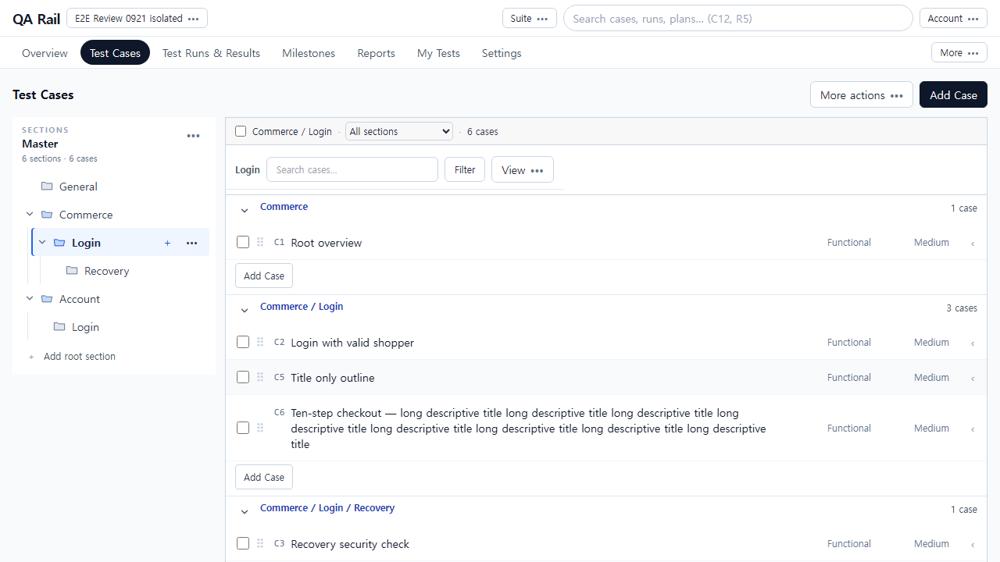
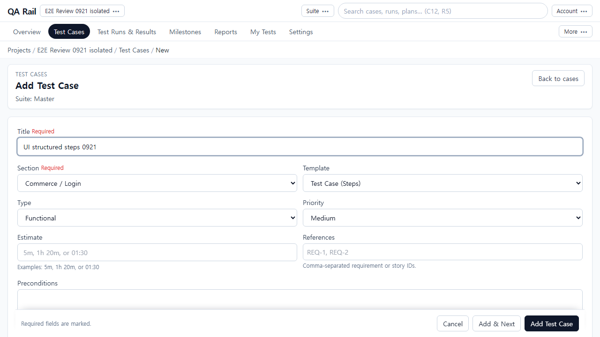
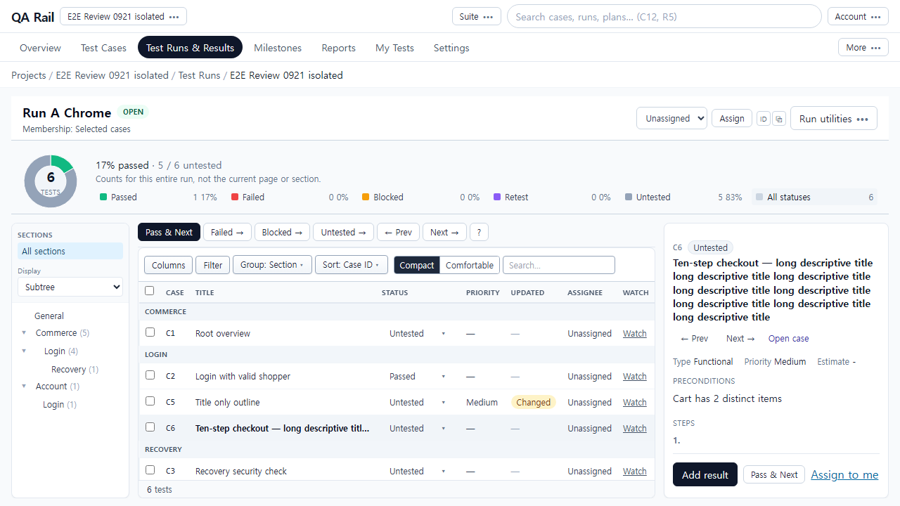
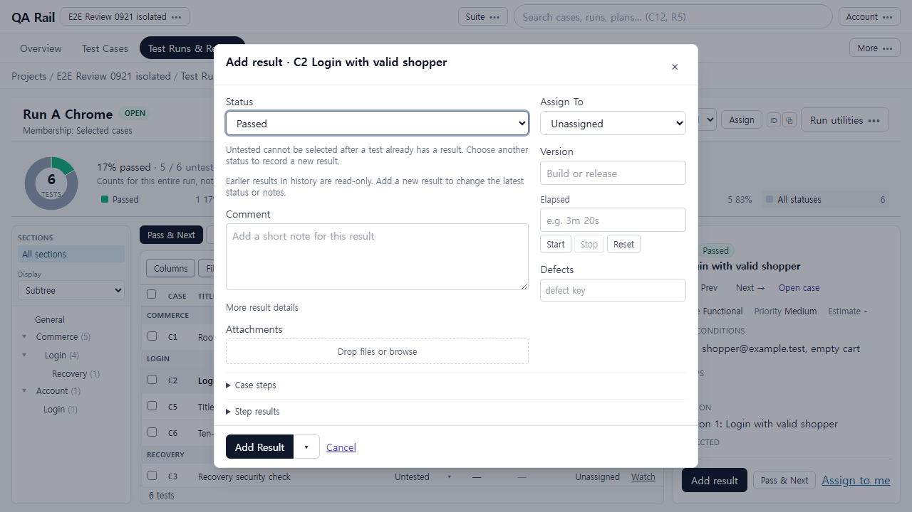

# TestRail 공식 화면 기준 페이지 전체 구성 검토 — 2026-09-23

## 결론

현재 제품은 TestRail의 기능과 일부 요소를 갖췄지만, **페이지 전체가 하나의 업무 공간으로 읽히는 배치에는 차이가 크다.** Cases는 트리와 본문이 같은 계층을 말하지 않고, Run은 요약·목록 도구·상세가 서로 공간과 주목도를 빼앗는다. 작성은 입력 내용보다 페이지 외곽 구조가 크게 보인다. 이 문제는 버튼별 수정 목록만으로 해결할 수 없다.

공식 문서의 이미지를 직접 열어 확인하고, 기존 실제 제품 캡처와 아래에서 짝지어 비교했다. 판단 단위는 먼저 **페이지의 역할과 골격**, 다음은 **영역 간 관계와 시선 흐름**, 마지막은 개별 요소다. 이전 UX-R01~17은 여기서 확인한 페이지 문제의 세부 증거로 사용한다.

색·폰트·왼쪽 메뉴를 똑같이 복사해야 한다는 결론은 아니다. TestRail 공식 화면에는 서로 다른 시기의 외관과 잘린 이미지가 섞여 있다. 문서 갱신일을 모든 이미지의 제품 버전으로 간주하지 않는다. 동일 viewport의 속도·클릭 수·픽셀 우열 비교도 아니다. 공식 이미지가 보여주는 구성 관계를 근거로 삼는다.

## 1. 공식 자료와 직접 확인한 범위

| 문서 | 직접 열어 본 공식 이미지 | 비교에 사용할 수 있는 범위 |
| --- | --- | --- |
| [Sections](https://support.testrail.com/hc/en-us/articles/14985199889812-Sections) | [2400×1230 섹션 화면](https://support.testrail.com/hc/article_attachments/39004473715092) | 전역 헤더·왼쪽 내비게이션·섹션 트리·본문의 부모/자식 블록·도구막대 |
| [Adding test cases](https://support.testrail.com/hc/en-us/articles/14438119644692-Adding-test-cases) | [754×712 작성 폼](https://support.testrail.com/hc/article_attachments/35637920570644) | 폼 내부의 메타 묶음·본문 입력 흐름·저장 위치. 전체 앱 내비게이션은 잘려 있음 |
| [Submitting test results](https://support.testrail.com/hc/en-us/articles/15813183376148-Submitting-test-results) | [1336×719 3-pane](https://support.testrail.com/hc/article_attachments/35638122795924), [974×762 결과창](https://support.testrail.com/hc/article_attachments/15881055029652) | Run 요약/목록과 상세의 상대 배치, 결과창 내부 주·보조 입력. 3-pane 이미지의 전역 내비게이션은 잘려 있음 |
| [Introduction to TestRail](https://support.testrail.com/hc/en-us/articles/7076810203028-Introduction-to-TestRail) | [1414×772 Run 전체](https://support.testrail.com/hc/article_attachments/35637740095508), [1312×689 Plan 구성 선택](https://support.testrail.com/hc/article_attachments/35637784981140), [프로젝트 전환 crop](https://support.testrail.com/hc/article_attachments/35637784974484) | Run 전체 골격 확인. Plan 이미지는 구성 dialog가 열린 편집 상태이며 실행 상세와 동등 상태가 아님 |
| [Create new test plans](https://support.testrail.com/hc/en-us/articles/30765296499604-Create-new-test-plans) | [2938×1596 Plan 작성](https://support.testrail.com/hc/article_attachments/39004426494228) | Plan 작성에서 외곽 내비게이션·보조 명령과 폼의 관계. 현재 Plan 실행 상세의 직접 대응 화면은 아님 |
| [Charts and dashboards](https://support.testrail.com/hc/en-us/articles/7101753582996-Charts-and-dashboards) | [상태 요약 crop](https://support.testrail.com/hc/article_attachments/7381759761172), [활동 차트 crop](https://support.testrail.com/hc/article_attachments/11099649983124) | 차트와 요약의 관계만 확인. Overview 전체 배치 비교 근거로 확대하지 않음 |

공식 원본은 링크와 원격 이미지로 제시한다. 이미지를 로컬로 내려받거나 편집해 만든 비교 화면은 아니다. 현재 제품은 9월 21일 직접 조작한 캡처이며 이번에는 새 live 실행을 하지 않았다.

## 2. Cases — 하나의 계층을 탐색하고 읽는 페이지인가

| TestRail 공식 | 현재 제품 |
| --- | --- |
|  |  |

**공식 화면 관찰:** 왼쪽은 이동·섹션 탐색, 넓은 본문은 TC 목록이다. 본문 Prerequisites 뒤의 Software & Versions 블록은 한 단계 안쪽에 놓인다. 구분 배경·여백·제목의 굵기와 행 정렬이 소속을 함께 전달한다. 전체 작성 버튼은 왼쪽의 강한 행동이고 섹션 끝의 Add Case/Add Subsection은 조용한 문맥 행동이다. 도구가 많아도 목록 위의 한 띠로 읽힌다.

**현재 페이지 관찰:** 왼쪽 트리에서는 계층이 보이지만 본문에서는 Commerce, Commerce/Login, Commerce/Login/Recovery가 같은 깊이의 블록이다. 경로/범위 줄, Login/검색 줄, 그룹 경로 제목이 각각 문맥을 반복한다. 상단 Add Case는 강한 버튼이고 섹션 끝 Add Case도 같은 말이라 페이지 수준 행동과 섹션 수준 행동의 역할 구별이 약하다.

**페이지 전체 판정:** 목록의 줄과 구분선은 정돈되어 있지만, 왼쪽에서 배운 구조가 본문으로 이어지지 않는다. 사용자는 트리→경로→행을 번갈아 읽어 관계를 재구성한다. 문제는 들여쓰기 하나의 누락을 넘어 **탐색 영역과 작업 영역이 서로 다른 구조를 말한다는 것**이다.

**정리 방향:** 본문의 부모/자식 블록과 직접 소속 TC를 하나의 계층으로 읽히게 하고, 제목·범위·트리 강조를 그 구조에 맞춘다. 페이지 작성과 섹션 빠른 추가의 강조를 구별한다. 상단의 반복 문맥을 줄여 목록 시작 위치를 안정시킨다. 좌우 메뉴의 위치 자체보다 구조의 대응을 먼저 맞춘다.

**페이지 완료 기준:** 경로를 하나씩 읽지 않아도 부모·자식·형제와 TC 소속을 구별하고, 현재 조회 범위와 추가 대상이 맞물려 보인다. 상세를 열어 목록 폭이 줄어도 같은 질서를 유지한다. 관련 세부 증거: UX-R01/10/11/17.

## 3. 작성 — 폼 전체가 하나의 작성 순서로 읽히는가

| TestRail 공식 폼 crop | 현재 작성 페이지 |
| --- | --- |
|  |  |

**공식 화면 관찰:** 제목 다음 메타정보가 하나의 조밀한 묶음으로 놓이고, Preconditions→Steps→Expected가 같은 너비의 입력 흐름으로 이어진다. 메타가 앞에 있다는 사실 자체는 현재와 같다. 하단 저장 행동은 그 흐름의 끝이다.

**현재 페이지 관찰:** 상단 전역 영역과 breadcrumb 다음에 큰 Add Test Case/Suite 카드, 그 다음 별도 폼 카드가 놓인다. 넓은 화면인데 메타를 두 열로 여러 줄 배치하고 여백이 반복되어, 첫 화면에서 지침 작성이 아래로 밀린다. 고정 저장 footer는 유용하지만 본문을 보기 전에 강하게 드러난다.

**페이지 전체 판정:** 공간은 넓지만 주 작업의 밀도는 낮다. 제목 카드와 입력 카드가 독립된 화면처럼 분절되고, 작성자의 시선이 내용보다 외곽을 여러 번 거친다. 공식 폼 crop과 현재 전체 viewport의 높이를 직접 비교해 몇 px 낭비라고 계산하지는 않는다.

**정리 방향:** 페이지 제목과 폼의 경계를 단순하게 연결하고, 분류 필드는 하나의 짧은 묶음으로 조직한다. 지침은 주 입력 영역으로 연속해서 읽히게 한다. 무조건 모든 메타를 아래로 옮기거나 TestRail의 작은 글자를 복제할 필요는 없다.

**페이지 완료 기준:** 제목→분류→지침→저장의 흐름이 한눈에 보이고, Text/Steps와 넓은/좁은 화면에서 위계가 유지된다. 카드 수나 필드 수 감소 자체는 완료 기준이 아니다. UX-R02/16을 이 배치 안에서 해결한다.

## 4. Run — 요약을 보는 화면과 테스트를 수행하는 공간이 조화를 이루는가

| TestRail 공식 3-pane crop | 현재 Run 전체 |
| --- | --- |
|  |  |

전체 내비게이션과 요약/목록의 관계는 [공식 Run 전체 화면](https://support.testrail.com/hc/article_attachments/35637740095508)에서도 확인했다.

**공식 화면 관찰:** 전체 Run 화면은 탐색 영역과 큰 요약→짧은 도구막대→넓은 목록으로 조직된다. 3-pane 이미지에서는 왼쪽의 요약/목록과 오른쪽의 선택 테스트가 나뉘고, 상세는 Run 제목과 비슷한 높이에서 독립적으로 시작한다. 상세 폭도 업무 내용을 담는 주요 영역이다. 기록 행동은 선택 테스트 쪽에 모인다. 공식 화면도 큰 차트와 다수의 메타를 포함한다.

**현재 페이지 관찰:** 전역 줄→탭→breadcrumb→Run 헤더/할당→전폭 통계를 지나야 목록과 상세가 시작된다. 그 아래에도 목록에는 이동 줄과 보기 줄이 쌓인다. 상세는 우측의 상대적으로 좁은 폭에 놓여 긴 제목과 메타가 지침 공간을 소비한다. 동일한 다음/기록 행동이 목록 위와 상세 아래로 흩어진다.

**페이지 전체 판정:** 가장 큰 차이는 '차트가 크다'가 아니라 **전폭 상단 영역이 모든 작업 영역의 시작점을 지배하고, 읽기 패널이 보조 열처럼 취급되는 것**이다. 통계를 압축했어도 읽기/실행 중심 배치가 되지는 않았다. 목록을 훑는 모드와 선택 테스트를 수행하는 모드의 공간 우선순위가 분명하지 않다.

**정리 방향:** 선택 테스트를 읽고 기록하는 영역을 페이지의 주요 작업 영역으로 확보한다. Run 문맥과 요약이 상세를 불필요하게 아래로 밀지 않도록 영역 관계를 조정하고, 목록 도구는 목록에, 단일 수행 행동은 선택 테스트에 묶는다. 기존 상단 통계 설계를 무조건 폐기하거나 영구 차트 사이드바를 추가하라는 뜻은 아니다. 수정안은 전체 화면으로 비교해야 한다.

**페이지 완료 기준:** 첫 시선에 Run 전체 상태, 현재 선택 테스트, 읽을 지침, 기록 위치를 구별할 수 있다. 선택/일괄/모바일 상태에서도 같은 우선순위가 유지되어야 한다. 긴 제목을 줄이거나 글자를 작게 해서만 공간을 맞추지 않는다. UX-R04/05/12/17은 이 페이지 배치의 하위 문제다.

## 5. 결과 입력 — 페이지 위에 일관된 기록 공간이 열리는가

| TestRail 공식 | 현재 제품 |
| --- | --- |
|  |  |

**공식 화면 관찰:** 넓은 왼쪽은 상태·Comment·단계 기록, 좁은 오른쪽은 담당자·버전·시간·결함이다. 하단은 저장/취소다. 영역의 폭과 위치가 중요도 차이를 전달한다.

**현재 페이지 판정:** 이 주/보조 2열과 하단 행동은 비교적 잘 이어받았다. 다른 페이지와 달리 중심 작업이 분명하다. 다만 반복 정책 안내가 주 입력 열의 윗부분을 차지하고, 부분 성공 시 주 행동의 의미가 현재 상태와 어긋난다.

**정리 방향과 완료 기준:** 전체 구조를 다시 만들기보다 정상 입력·오류·부분 성공에서도 '대상→기록→완료'의 위계를 유지한다. UX-R09/13을 국소 보완하되 결과창을 설명 페이지로 확대하지 않는다.

## 6. Plan·Overview — 근거가 허용하는 범위에서 판단하기

공식 Plan 작성과 구성 선택 이미지는 직접 확인했지만, 확보한 현재 캡처는 **Plan 실행 상세**다. 서로 다른 상태를 나란히 놓고 같은 페이지의 배치 우열로 평가하면 안 된다. 공식 작성은 보조 설정과 중심 폼을 구분한다는 참고가 되고, 현재 Plan의 실행/설정 구별 문제(UX-R14)는 독립적인 화면 관찰로 유지한다. Plan 실행 상세의 전체 구성 유사성은 대응 공식 화면 추가 확보 전 보류한다.

Overview도 공식 활동 차트 crop만으로 전체 페이지를 비교하지 않는다. 공식 문서는 요약·활동 차트를 정당한 핵심 역할로 설명한다. 따라서 이전의 '차트 뒤에 Active work가 있으므로 부적합'이라는 강한 판단을 철회한다. **현재 화면에서 빈 요약의 점유가 큰 것은 개선 후보지만, TestRail 기준과 어긋난다고 확정한 것은 아니다.** Milestone의 중복 요약은 현재 화면 관찰이며 공식 동일 페이지 비교는 아직 없다.

## 7. 페이지를 관통하는 시각적 질서

| 관계 | 공식 화면에서 관찰한 질서 | 현재 화면의 차이 | 페이지 차원에서 맞출 것 |
| --- | --- | --- | --- |
| 전역 탐색 ↔ 현재 업무 | 전역 헤더/내비게이션과 중심 작업의 역할이 공간적으로 나뉨 | 탭·breadcrumb·제목·보조 행동이 상단에 누적 | 모든 페이지의 문맥 높이와 역할을 일관되게 조정 |
| 그룹 ↔ 그 안의 행 | 들여쓰기·배경·간격·제목 무게가 관계를 함께 표현 | 경로 문자열/얇은 구분선에 의존 | 구조를 같은 시각 문법으로 표현 |
| 주 작업 ↔ 보조 정보 | 영역의 폭과 배치가 중요도 차이를 만듦 | Run 지침은 좁고 작성의 외곽은 큼 | 읽기·작성·기록에 맞게 실사용 공간 배분 |
| 페이지 행동 ↔ 문맥 행동 | 강한 작성 행동과 섹션 끝 링크의 차이 | 같은 이름과 유사한 강조가 여러 위치에 반복 | 행동 대상을 위치와 강조로 예측 가능하게 함 |
| 요약 ↔ 실제 업무 | 요약은 페이지 목적에 맞춰 목록/상세와 연결 | 반복 수치·설명·도구가 연속 띠를 이룸 | 요약을 줄이는 것보다 업무 영역과의 관계 정리 |
| 페이지 간 일관성 | Cases/Run에 같은 섹션 구조가 이어짐 | Cases는 경로, Run은 평면 짧은 제목 | 전환 후 구조를 다시 학습하지 않게 함 |

이는 서로 다른 공식 버전에서 공통으로 관찰한 구성 원칙에 대한 분석이다. 공식 이미지가 항상 최적이라는 주장이 아니다. 현재 상단 탭·색상·고정 footer를 유지하더라도 이 관계는 맞출 수 있다.

## 8. 수정 검토의 단위와 수용 기준

1. **Cases 한 페이지:** 트리/범위/블록/TC/추가의 관계를 함께 정리한 전체 화면으로 판단한다. 들여쓰기 패치만 보고 완료하지 않는다.
2. **Run 한 페이지:** 요약/목록/선택 상세/결과 행동의 비중을 함께 재배치한 화면으로 판단한다. 버튼 몇 개를 숨긴 것으로 완료하지 않는다.
3. **작성 한 페이지:** 헤더/메타 묶음/지침/저장이 하나의 흐름이 된 화면으로 판단한다.
4. **결과창과 전환:** 정상·실패·부분 성공에서도 같은 기록 흐름을 유지하는지 확인한다.

각 수정안은 공식 참조와 현재 before, 수정 after를 같은 비교표에 놓고 기본/선택/일괄/긴 내용/빈 상태를 확인해야 한다. 1280·1440·390에서는 페이지 중심 작업이 유지되는지를 평가한다. 모바일 TestRail 참조는 이번에 확보하지 않았으므로 모바일 동일성 합격은 내리지 않는다.

제품 수정은 수행하지 않았다. 이 문서는 페이지 전체의 판단을 우선하는 검토 기준이며, [기존 개별 문제 기록](./UI_INTUITIVENESS_REVIEW_2026-09-22.md)은 세부 증거, [기능 검증](./E2E_FUNCTIONAL_EVIDENCE_2026-09-21.md)은 동작 정확성의 보조 증거다.
