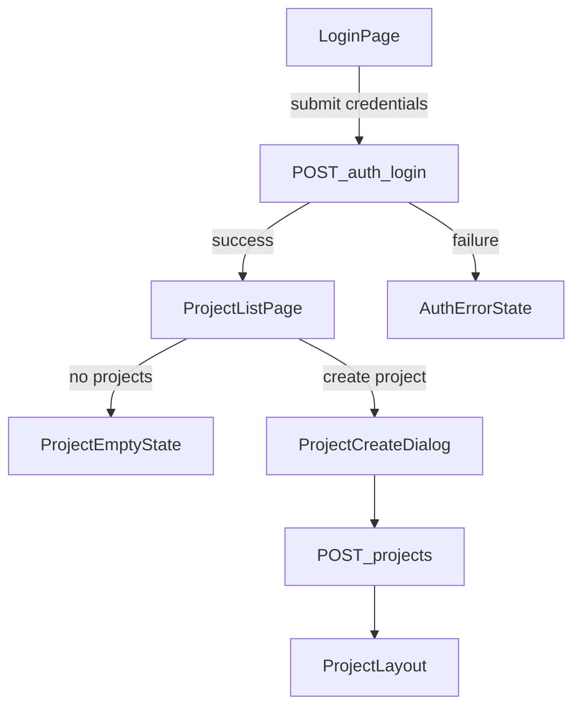
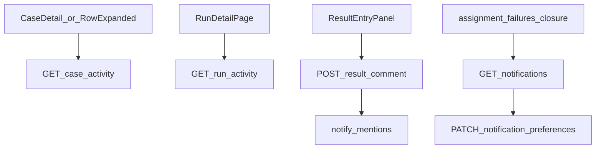

# UI Flow

## 1) Authentication to Project Entry



## 2) Project Layout and Global Navigation

```mermaid
flowchart TD
  projectLayout[ProjectLayout] --> overview[/projects/:projectId]
  projectLayout --> cases[/projects/:projectId/cases]
  projectLayout --> runs[/projects/:projectId/runs]
  projectLayout --> milestones[/projects/:projectId/milestones]
  projectLayout --> plans[/projects/:projectId/plans]
  projectLayout --> results[/projects/:projectId/results]
  projectLayout --> automation[/projects/:projectId/automation]
  projectLayout --> settings[/projects/:projectId/settings]
  projectLayout --> reports[/projects/:projectId/reports]
```

## 3) Test Case Workspace Flow (Expandable Detail)

```mermaid
flowchart TD
  casesEntry[/projects/:projectId/cases] --> loadSections[GET_sections]
  casesEntry --> loadCases[GET_cases_by_section_filters]
  loadCases --> caseTable[CaseListTable]
  caseTable -->|row click| setExpanded[set_expandedCaseId]
  setExpanded --> syncQuery[sync_query_caseId_mode]
  setExpanded --> loadCaseDetail[GET_case_detail_lazy]
  loadCaseDetail --> expandedView[ExpandableCaseDetail_ViewMode]
  expandedView -->|edit click| editMode[ExpandableCaseDetail_EditMode]
  editMode --> saveCase[PATCH_case]
  saveCase --> invalidateCaseQueries[invalidate_cases_and_caseDetail]
  invalidateCaseQueries --> caseTable
  expandedView -->|delete click| deleteDialog[DeleteCaseConfirmDialog]
  deleteDialog --> deleteCase[DELETE_case]
  deleteCase --> refreshList[refetch_case_list]
  refreshList --> caseTable
```

### Case Expand/Collapse Rules
- Row 클릭 시 해당 `caseId`를 `expandedCaseId`로 설정한다.
- 같은 Row 재클릭 시 `expandedCaseId`를 `null`로 전환한다.
- 다른 Row 클릭 시 이전 확장을 닫고 새 Row만 열린다.
- `mode=edit`는 `caseId`가 있을 때만 유효하다.

## 4) Run Creation and Execution Flow

```mermaid
flowchart TD
  runList[/projects/:projectId/runs] --> createRun[/projects/:projectId/runs/new]
  createRun --> loadRunFormData[GET_suites_cases_milestones]
  loadRunFormData --> submitRun[POST_project_runs]
  submitRun --> runDetail[/projects/:projectId/runs/:runId]
  runDetail --> selectInstance[TestInstanceRow_select]
  selectInstance --> resultPanel[ResultEntryPanel]
  resultPanel --> submitResult[POST_run_results]
  submitResult --> refreshRunState[refetch_run_summary_instances_history]
  runDetail --> assignTester[PATCH_test_assignee]
  runDetail --> closeRun[POST_run_close]
  runDetail --> rerun[POST_run_rerun]
  resultPanel --> attachEvidence[POST_result_attachments]
  resultPanel --> linkDefect[POST_result_defects]
```

## 5) Automation and Upload Trace Flow

```mermaid
flowchart TD
  automationEntry[/projects/:projectId/automation] --> loadMappings[GET_automation_mappings]
  automationEntry --> loadUploads[GET_automation_uploads]
  loadUploads --> uploadDetail[/projects/:projectId/automation/uploads/:uploadId]
  uploadDetail --> loadUploadDetail[GET_upload_detail]
  uploadDetail --> retryFailed[POST_upload_retry]
  retryFailed --> reloadUpload[refresh_upload_detail]
  automationEntry --> createToken[POST_project_tokens]
```

### Automation Retry Naming Rule
- Canonical action: `retry` (`POST /api/automation/uploads/{uploadId}/retry`)
- `reprocess`는 별도 endpoint를 두지 않고 retry 정책의 하위 동작으로 취급한다.

## 6) Settings and Reports Flow

```mermaid
flowchart TD
  settingsEntry[/projects/:projectId/settings] --> updateSettings[PATCH_project_settings]
  tokenSettings[/projects/:projectId/settings/tokens] --> tokenCreate[POST_tokens]
  tokenSettings --> tokenDelete[DELETE_token]
  memberSettings[/projects/:projectId/settings/members] --> memberCrud[CRUD_project_members]
  fieldSettings[/projects/:projectId/settings/custom-fields] --> fieldCrud[CRUD_custom_fields]
  statusSettings[/projects/:projectId/settings/statuses] --> statusCrud[CRUD_custom_statuses]
  templateSettings[/projects/:projectId/settings/templates] --> templateCrud[CRUD_case_templates]
  integrationSettings[/projects/:projectId/settings/integrations] --> defectIntegration[PATCH_defect_integration]
  notificationSettings[/projects/:projectId/settings/notifications] --> updatePrefs[PATCH_notification_preferences]
  reportsEntry[/projects/:projectId/reports] --> loadReports[GET_report_aggregates]
  reportsEntry --> traceability[GET_traceability_report]
  reportsEntry --> coverage[GET_coverage_gap_report]
```

## 7) Collaboration Flow



## State and Error Handling Rules

- Loading state는 화면 단위가 아니라 패널/위젯 단위로 분리한다.
- Empty state는 "데이터 없음"과 "필터 결과 없음"을 구분한다.
- Error state는 사용자 재시도 액션(`Retry`)을 기본 제공한다.
- UI 컴포넌트는 도메인 정책을 결정하지 않고 백엔드 서비스 결과를 소비한다.
