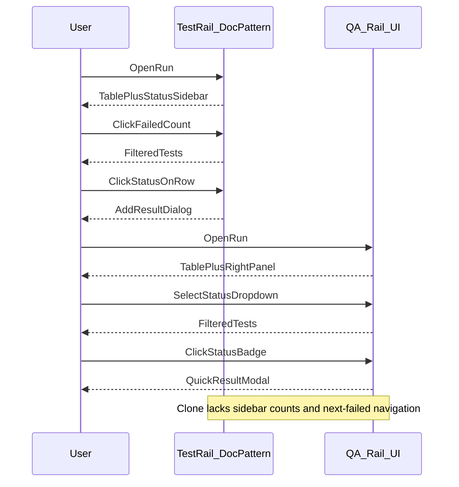

# TestRail vs QA Rail — UI/UX Gap Analysis

Last aligned: 2026-05-16  
Method: TestRail [Support Center](https://support.testrail.com/hc/en-us/) docs + screenshots only (no live TestRail session).  
Scope: **Core daily workflows** — overview, cases, runs, My Tests, milestones, plans, basic reports.  
Clone baseline: `apps/web` on `main` after BUILD_PLAN Waves 1–5.

Related: [SUPPORT_URL_MAP.md](./references/testrail/SUPPORT_URL_MAP.md), [SCREEN_INVENTORY.md](./SCREEN_INVENTORY.md), [COMPONENT_MAP.md](./COMPONENT_MAP.md), [UX_BACKLOG.md](./UX_BACKLOG.md).

---

## 1. Evaluation rubric

Scores per screen: **1** = far from TestRail-like / blocks task, **2** = usable with friction, **3** = aligned for Core workflow.

| Dimension | TestRail expectation (docs) | Clone check question |
|-----------|----------------------------|----------------------|
| **Navigation & IA** | Milestones/plans visible; short path to execution | Do primary tabs match TR priority? Is daily work buried under **More**? |
| **Information density** | Scannable tables; status at a glance | Extra cards/columns vs TR sidebar + table? |
| **Action priority** | Frequent actions ≤1–2 clicks | Result entry, next failed, assign — click count? |
| **Execution speed** | Status click → result; filter sidebar | Modal vs inline? Keyboard / next-test? |
| **Feedback & states** | Consistent empty/loading/error | Match [SCREEN_INVENTORY.md](./SCREEN_INVENTORY.md)? |
| **Deep links** | Filters + selection in URL | `caseId`, run `status`/`q`/`page`/`testId`? |
| **Progressive disclosure** | Secondary fields in dialog/drawer | Expandable row vs dedicated edit screen? |

**Severity:** **P0** blocks daily execution · **P1** daily friction vs TR · **P2** convenience/polish · **OOS** out of Core scope (Enterprise/admin).

---

## 2. TestRail UX pattern cards (document extraction)

### 2.1 Project home / dashboard

**Refs:** [Introduction](https://support.testrail.com/hc/en-us/articles/7076810203028-Introduction-to-TestRail), [Charts and dashboards](https://support.testrail.com/hc/en-us/articles/7101753582996-Charts-and-dashboards)

| Pattern | TestRail (docs) |
|---------|-----------------|
| IA | Project dashboard as landing; charts for activity, progress, failures |
| Density | Widget grid; clickable chart segments drill to filtered tests |
| Actions | Jump to runs, milestones, cases from summary widgets |

### 2.2 Test case repository

**Refs:** [Cases](https://support.testrail.com/hc/en-us/articles/7076832010516-Cases), [Sections](https://support.testrail.com/hc/en-us/articles/7077918603412-Sections), [Suites](https://support.testrail.com/hc/en-us/articles/7077936624276-Suites)

| Pattern | TestRail (docs) |
|---------|-----------------|
| IA | Left section tree; case list/grid; dedicated add/edit case views |
| Density | Columns for ID, title, priority, refs; section-scoped list |
| Actions | Add case in section; bulk select; filter bar above list |
| Disclosure | Full-page or large panel edit; steps/fields tabs |

### 2.3 Test runs — create & list

**Refs:** [Creating new test runs](https://support.testrail.com/hc/en-us/articles/7076838639892-Creating-new-test-runs), [Runs](https://support.testrail.com/hc/en-us/articles/7077874763156-Runs)

| Pattern | TestRail (docs) |
|---------|-----------------|
| IA | Runs tab; wizard/form for suite, cases, milestone, include options |
| Density | Run list with progress bar per row |
| Actions | Dynamic filters; include all; case picker with sections |

### 2.4 Test runs — execution

**Refs:** [Adding test results](https://support.testrail.com/hc/en-us/articles/7077882766612-Adding-test-results), [Best practices runs/results](https://support.testrail.com/hc/en-us/articles/32784099933844-Best-Practices-Guide-Test-Runs-and-Results)

| Pattern | TestRail (docs) |
|---------|-----------------|
| IA | Run detail: **tests table + status sidebar** (filter by status counts) |
| Density | Status column clickable; compact rows |
| Actions | Click status → add result; assignee; next failed/blocked navigation |
| Disclosure | Result dialog with comment, defects, elapsed, attachments |

### 2.5 Milestones & plans

**Refs:** [Milestones](https://support.testrail.com/hc/en-us/articles/7077892766612-Milestones)

| Pattern | TestRail (docs) |
|---------|-----------------|
| IA | Top-level **Milestones** and **Test Plans** tabs |
| Density | Milestone detail: linked runs, progress rollup |
| Actions | Complete milestone; create run under milestone/plan |

### 2.6 Reports (Core)

**Refs:** [Reports](https://support.testrail.com/hc/en-us/articles/7077902766612-Reports)

| Pattern | TestRail (docs) |
|---------|-----------------|
| IA | Reports area with templates; run summary / progress |
| Actions | Generate report; export; drill from chart to tests |

---

## 3. Scenario walkthroughs (Clone UI)

Approximate **clicks** from local UI review (`apps/web` components). TestRail clicks are **doc-informed estimates** (`검증 필요` where interaction unknown).

### S1 — Release prep (Overview → Milestone → Run → progress)

| Step | TestRail (doc pattern) | QA Rail (Clone) | Gap |
|------|------------------------|-----------------|-----|
| Open project home | Dashboard widgets | `ProjectOverviewPage`: cards + chart + recent lists | TR: clickable chart → filtered tests; Clone: chips not clickable filters (P1) |
| Open milestones | Primary tab | **More → Milestones** | Extra click; lower discoverability (P1) |
| Create run | Runs → Add run wizard | **Test Runs** tab → New run | Aligned (2) |
| Check progress | Run list progress bars | Run list `%` column | Aligned (2); detail uses chips not bar (P2) |

### S2 — Case maintenance (section → add/edit → version)

| Step | TestRail | QA Rail | Gap |
|------|----------|---------|-----|
| Pick section | Tree left | `SectionTreePane` | Aligned (3) |
| Add case | Toolbar / dedicated form | `CaseListPane` toolbar | Aligned (2) |
| Edit case | Full edit view | **Expandable row** `ExpandableCaseDetail` | Different IA; less screen space for steps (P1) |
| Version history | Enterprise timeline UI | Drawer/timeline in expandable | Clone+ depth OK; compare UX denser in TR (P2) |

### S3 — Smoke execution (run → result → history)

| Step | TestRail | QA Rail | Gap |
|------|----------|---------|-----|
| Open run | Run detail | `RunDetailPage` | Aligned |
| Filter by status | **Sidebar** count clicks | `<select>` in `TestInstanceFilterBar` | No count-driven sidebar; weaker scan (P1) |
| Enter result | Status on row → dialog | Status badge → **modal** quick entry | Similar pattern (2) |
| Full result + defects | Result panel | **320px aside** `ResultEntryPanel` + history below | Two-pane OK; must select row first (2) |
| Deep link | — | URL: `status`, `q`, `page`, `testId` | Good (3) |

### S4 — Bulk regression (filter → bulk → rerun)

| Step | TestRail | QA Rail | Gap |
|------|----------|---------|-----|
| Bulk results | Multi-select + apply | Checkbox column + bulk form in `RunActionsPanel` | Present (2) |
| Per-row failures | — | Bulk failure list | Clone+ helpful |
| Rerun failed | — | Rerun dialog on run header | Present (2) |
| Next failed only | Toolbar navigation | **Not found** in run detail | Missing TR ergonomics (P1) |

### S5 — Assignee (My Tests)

| Step | TestRail | QA Rail | Gap |
|------|----------|---------|-----|
| My work entry | Tests & Results / assignments | **More → My Tests** | Hidden under More (P1) |
| Filter active | Status tabs | Status `<select>` + run filter | Functional (2) |
| Open test in run | Link to execution | Link to `runs/:runId` | Aligned (3) |
| Watch/subscribe | Email icon on test | **Watch** column on run table | Different surface (P2) |

### S6 — Release review (run summary report)

| Step | TestRail | QA Rail | Gap |
|------|----------|---------|-----|
| Open report | Reports templates | **Reports** tab → Run summary child route | Aligned (2) |
| Filter + export | Template options | `ReportFilterBar`, `ReportExportButton`, Save view | Good chrome (3) |
| Drilldown | Chart → tests | Table links to runs | Partial vs TR chart drill (P2) |

---

## 4. Screen gap matrix (Core)

| Route | Component | TR doc ref | Rubric (1–3) | Gap summary | Sev | Rec. type | Checklist xref |
|-------|-----------|------------|--------------|-------------|-----|-----------|----------------|
| `/projects/:id` | `ProjectOverviewPage` | Dashboards | Nav 2, Density 2 | Summary cards OK; status chips **not clickable** to filtered runs/tests | P1 | IA | — |
| `/projects/:id` | `ProjectTabs` | Introduction | Nav **1** | Milestones primary in TR; Clone: Milestones primary tab OK but **Plans/My Tests/Activity** under **More** | P1 | IA | Convenience §Nav |
| `/cases` | `TestCaseWorkspace` | Cases, Sections | Exec 2, Disclosure 2 | Expandable row vs TR dedicated edit; no suite selector in MVP policy | P1 | IA | SCREEN §3 |
| `/runs` | `RunListPage` | Runs | Density 2 | Table OK; TR progress **bar** vs `%` text | P2 | Visual | — |
| `/runs/new` | `RunCreatePage` | Creating runs | Actions 3 | Composition modes + filters present (Wave 1) | — | — | BUILD_PLAN W1 |
| `/runs/:runId` | `RunDetailPage` | Adding results | Exec **1–2** | No **status sidebar** with counts; filters are dropdowns | P1 | IA / component | Convenience §Run shortcuts |
| `/runs/:runId` | `TestInstanceTable` | Adding results | Actions 2 | Quick result modal; no **next/previous test** | P1 | Workflow | FEATURE §271–297 |
| `/runs/:runId` | `RunSummaryBar` | Runs overview | Density 2 | Chips not clickable to filter table (TR bar segments click) | P1 | IA | — |
| `/my-tests` | `MyTestsPage` | Assignments | Nav 2 | Buried in More; table OK | P1 | IA | — |
| `/milestones` | `MilestonesPage` | Milestones | Nav 2 | Primary tab exists; detail rollup thinner than TR docs | P2 | Content | — |
| `/plans` | `PlansPage` | Test plans | Nav **1** | Under More only | P1 | IA | — |
| `/reports` | `ReportsLayout` | Reports | Nav 2 | Overview + children; not template gallery | P2 | IA | — |
| `/reports/runs` | `ReportRunSummaryPage` | Reports | Actions 3 | Shared chrome, URL filters, save/export | — | — | — |

**Known component debt** ([COMPONENT_MAP.md](./COMPONENT_MAP.md)): missing shared `FilterBar`, `StatusBadge`, `DataTable`, `PageHeader` — drives inconsistent run vs report vs settings UX (P1 engineering).

---

## 5. Consolidated gap list (prioritized)

### P0

_None identified for Core daily execution in doc-only review — users can complete S1–S6 without blocked paths. Revisit if usability test finds otherwise._

### P1 (top product impact)

1. **Run execution: status sidebar** — Replace or augment status `<select>` with TR-like count sidebar; clicking filters table ([Runs docs](https://support.testrail.com/hc/en-us/articles/7077874763156-Runs)).
2. **Navigation: elevate Plans + My Tests** — Move out of **More** menu or add dashboard shortcuts ([Introduction](https://support.testrail.com/hc/en-us/articles/7076810203028-Introduction-to-TestRail)).
3. **Run summary chips → filters** — `RunSummaryBar` counts should apply `statusFilter` (mirror TR bar segment click).
4. **Execution navigation** — Next/previous test, jump to next failed/blocked/untested ([FEATURE_CHECKLIST](./FEATURE_CHECKLIST.md) § Case And Run Shortcuts).
5. **Shared report/run filter primitives** — `FilterBar`, `StatusBadge`, `PageHeader` ([FEATURE_CHECKLIST](./FEATURE_CHECKLIST.md) § Clone Engineering).

### P2

- Clickable overview chart segments → drilldown runs/tests.
- Run list progress **bar** visual parity.
- Case workspace: optional dedicated edit route for power users.
- Report template gallery vs fixed analysis pages.
- Keyboard shortcuts overlay (`?`) — doc cannot validate; live TR check later.

### Out of scope (logged only)

- SSO, approval workflow, datasets — Enterprise.
- Global search, command palette — Convenience § (not blocking Core).

---

## 6. Execution flow comparison (run detail)

---

## 7. FEATURE_CHECKLIST cross-reference

| UX_GAP item | Existing checklist row |
|-------------|------------------------|
| Status sidebar / clickable counts | § Case And Run Shortcuts — clickable status counts, next/previous test (P1) |
| Plans/My Tests IA | § Navigation — pinned projects, recent (partial overlap) |
| Shared FilterBar / StatusBadge | § Clone Engineering P1 components |
| Global search | § Navigation P1 global search |
| UI/UX review pass | § Clone Engineering — mark `[x]` when UX_BACKLOG Wave UX-1 ships |

New gaps **not** duplicated in checklist: overview chart drilldown (add to Convenience or Reports).

---

## 8. Sign-off (analysis phase)

| Criterion | Status |
|-----------|--------|
| Core screens in matrix | Yes (§4) |
| 6 scenarios documented | Yes (§3) |
| P1 list ≥5 with doc links | Yes (§5) |
| FEATURE_CHECKLIST cross-ref | Yes (§7) |
| Implementation backlog | [UX_BACKLOG.md](./UX_BACKLOG.md) |
