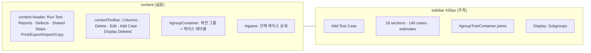
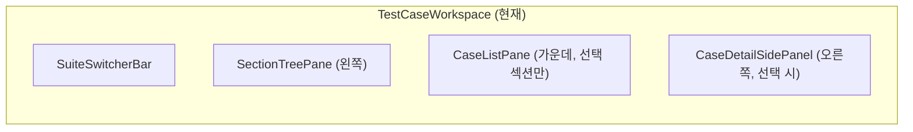

# TestRail Test Cases(Repository) 화면 대비 갭 및 좁히기 계획

Last updated: 2026-05-18

**기준 스냅샷:** TestRail 7.x Test Cases HTML (`suites/view/3588`, suite `Gemini Ph 2_Search(추천 모듈 전환)`, 16 sections / 140 cases, `display=subtree`, `group_by=cases:section_id`).

**관련 문서:** [UX_GAP_ANALYSIS.md](../../UX_GAP_ANALYSIS.md) § Test Case Repository, [RUN_EXECUTION_VIEW_PARITY.md](./RUN_EXECUTION_VIEW_PARITY.md), [PROJECT_OVERVIEW_VIEW_PARITY.md](./PROJECT_OVERVIEW_VIEW_PARITY.md), [FEATURE_CHECKLIST.md](../../FEATURE_CHECKLIST.md).

---

## 1. TestRail이 이 화면에서 하는 일

**케이스 저장소(workbench)** 다. 한 suite 안에서:

1. **섹션 트리**로 구조를 탐색하고, 선택한 범위의 케이스를 **섹션 헤더가 있는 하나의 큰 테이블**로 본다.
2. 행·섹션 단위로 **선택·정렬·필터·컬럼**을 바꾸고, **QPane**에서 케이스 상세를 본다.
3. **Run Test**, Import/Export, Copy/Move, Shared Steps 등 저장소 운영 작업을 헤더에서 시작한다.
4. 드래그앤드롭으로 섹션·케이스를 이동/복사한다.
5. 삭제는 **Mark as Deleted** vs **Delete Permanently** 두 단계다.

런 실행 화면과 달리, 여기서는 “한 번에 많은 케이스를 구조와 함께 스캔”하는 것이 핵심이다.

---

## 2. TestRail 레이아웃 (HTML 기준)

TestRail은 **섹션 트리가 오른쪽 사이드바**, **케이스 그리드가 가운데**, **QPane이 선택 시 분할**된다.

**DOM 앵커:**

| 영역 | TestRail ID/클래스 | 역할 |
|------|-------------------|------|
| 헤더 툴바 | `content-header-toolbar` | Run Test, Reports, Defects, Shared Test Steps |
| 헤더 아이콘 | print, `#exportDropdown`, `#importDropdown`, copy cases | 저장소 I/O |
| Defects | `#defectDropdown` | 외부 Jira 등 **Add Defect** (새 탭) |
| 메인 툴바 | `#contentToolbar` | Columns, Delete, Edit▼, Add Case, Display Deleted |
| Sort/Filter | `#orderDropdown`, `#filterCasesBubble` | groupBy (기본 Section), 복합 필터 |
| 케이스 그리드 | `#groupContainer` / `#groups` | AJAX `App.Suites.showInitial()`, **전 suite·섹션 그룹 테이블** |
| QPane | `#qpane`, `App.Suites.applyQPane` | 선택 행 상세 (토글 Q) |
| 사이드바 트리 | `#groupTreeContainer`, `#groupTree` | jstree 섹션 트리 |
| 표시 모드 | `#displayDropdown` | tree / subtree / compact |
| Suite 메타 | `#sidebarInfo` | 섹션·케이스 수, forecast bubble |
| DnD | `#casesDndDropdown`, `#sectionsDndDropdown` | Move/Copy here |
| 삭제 | `#casesDeletionDialog` | Mark as Deleted \| Delete Permanently |

**스크립트 상태 (스냅샷):** `suite_id=3588`, `display=subtree`, `group_id=111274`, `group_by=cases:section_id`, `displayDeletedCases=0`.

---

## 3. 클론 현재 구현 매핑

**라우트:** `/projects/:projectId/cases` → `TestCaseWorkspacePage` → `TestCaseWorkspace.tsx`

| TestRail 영역 | 클론 | 일치도 |
|---------------|------|--------|
| 3-pane workbench | 트리 \| 목록 \| 상세 패널 | **있음** (트리 위치는 현재 구현처럼 좌/우 선택 가능) |
| 가운데 **전체 suite 그룹 테이블** | `subtree`/`compact` 시 `sectionId` 없이 suite 전체 로드 + 섹션 헤더 그룹 | **있음** (`tree` 모드만 단일 섹션 direct) |
| display subtree/compact | `?display=subtree\|tree\|compact` + `CaseRepositoryDisplayMenu` | **부분** |
| content-header (Run Test 등) | `ProjectContentHeader` + `CaseRepositoryContentHeader` (공통 Reports/Defects) | **부분** (다른 탭에도 variant 적용) |
| Reports/Defects 드롭다운 | Reports 별도 탭; Defects 외부 연동 일부 | 부분 |
| Shared Test Steps | 미구현 ([FEATURE_CHECKLIST](../../FEATURE_CHECKLIST.md) P2) | 없음 |
| Import/Export/Copy in header | `ImportExportPage` 별도 라우트 | 부분 |
| Columns / Sort groupBy | `CaseListToolbar` 컬럼·필터·saved views | 부분 |
| Display Deleted toggle | `state: active \| archived` 필터 | 부분 |
| Edit selected / view / filter | bulk edit, archive, delete | 부분 |
| QPane | `CaseDetailSidePanel` + `CaseDetailPage` 라우트 | 부분 |
| Section tree + Add Section | `SectionTreePane` (기본 왼쪽, 좌/우 전환 및 프로젝트별 저장) | 있음 |
| Suite stats / estimates | `SuiteRepositoryStats` + `SuiteEstimatesBubble` | **있음** (Wave D) |
| DnD cases/sections | `useCaseListDnD`, section reorder | **있음** (행·섹션·append zone) |
| Mark deleted vs permanent | Active: Mark as deleted; Archived: Undelete + Delete permanently (`caseDeleteCopy`) | **있음** |
| 키보드 C/S/R/Q/J/K | `useCaseRepositoryKeyboard` + J/K/Q | **있음** (Wave E) |

---

## 4. 기능별 상세 갭

### 4.1 정보 구조 (P0)

| 항목 | TestRail | 클론 | 좁히기 |
|------|----------|------|--------|
| 메인 그리드 범위 | 선택 섹션 **+ 하위 섹션** 케이스를 **한 테이블**에 섹션 헤더로 표시 (`subtree`) | `subtree`/`compact`는 suite-wide 섹션 그룹 테이블, `tree`는 단일 섹션 direct 목록 | 현재 구현 유지 |
| 트리 위치 | **우측** sidebar | `SectionTreePane` 좌/우 선택 가능, 기본 왼쪽, `localStorage` 프로젝트별 저장 | 현재 구현 유지: TestRail처럼 강제 우측 이동하지 않고 사용자 위치 설정을 보존 |
| URL 상태 | `group_id`, filter, display | `suiteId`, `sectionId`, `panelCaseId`, `display`, `groupBy`, filters, columns | 현재 구현 유지 |
| QPane | 목록 유지 + 우측 분할 | `xl:grid-cols` 패널 | Q 토글, 스플리터 너비 저장 |

**핵심:** 클론은 3-pane 골격과 suite-wide 섹션 그룹 테이블을 갖췄다. 남은 차이는 트리 위치를 TestRail처럼 강제 우측으로 고정하지 않고, 현재 구현처럼 좌/우 전환 가능한 사용자 설정으로 보존한다는 점이다.

### 4.2 헤더·저장소 운영 (P1)

| 항목 | TestRail | 클론 | 좁히기 |
|------|----------|------|--------|
| Run Test | `runs/add/3588/2` | 런 생성 라우트만 | `CaseRepositoryHeader`: Run Test → run create w/ suite |
| Reports | suite-scoped `add_job` 메뉴 | 프로젝트 Reports | 헤더 Reports 드롭다운 → 기존 report 라우트 + suite 쿼리 |
| Defects | Jira CreateIssue URL | defect integration 설정 | `DefectsDropdown` (외부 URL from settings) |
| Shared Steps | `shared_steps/overview/222` | `/shared-steps` CRUD + 케이스 Insert shared | Wave G |
| Print | `suites/plot/3588` | `CasesPrintPage` | 헤더 Print 링크 |
| Export XML/CSV/Excel | `#exportDropdown` | Import/Export 페이지 + jobs | 헤더 Export + 다이얼로그 |
| Import XML/CSV | 4-step CSV wizard | wizard on Import/Export | 헤더 Import 동일 플로우 진입 |
| Copy/Move cases | `#selectCasesDialog` cross-project | `CaseBulkRelocationDialog` + 헤더 | **있음** (프로젝트·스위트·섹션 대상) |

### 4.3 툴바·테이블 (P1)

| 항목 | TestRail | 클론 | 좁히기 |
|------|----------|------|--------|
| Columns | per-user width `selectColumnsDialog` | `CaseColumnsDialog` + localStorage | user column prefs API (width 추후) |
| Sort/Group | 15+ `setCaseGrouping` | Sort 드롭다운 (Section/Priority/Type/None) | 추가 groupBy + API |
| Filter bubble | `filterCasesBubble` | toolbar 필터 필드 | 고급 필터 패널 |
| Display Deleted | toolbar toggle | Display deleted 토글 (`state=archived`) | soft delete 분리 (Wave E) |
| Bulk Edit | edit selected / view / all in filter | Edit▼ 3-scope → bulk update | Move/Archive도 동일 scope |
| Inline title edit | `#editCaseDialog` | 행 더블클릭 인라인 제목 | **있음** (Wave F) |

### 4.4 사이드바·메타 (P2)

| 항목 | TestRail | 클론 | 좁히기 |
|------|----------|------|--------|
| Section/case counts | `Contains 16 sections and 140 cases` | `SuiteRepositoryStats` | **있음** |
| Estimates bubble | `App.Suites.applyEstimates` | `SuiteEstimatesBubble` (forecast 합계) | **있음** |
| Edit suite description | `editDescription` | 사이드바 Edit description | **있음** |
| Add Test Case (sidebar) | 큰 버튼 | 사이드바 primary CTA | **있음** |

### 4.5 삭제·버전·편집 (P1)

| 항목 | TestRail | 클론 | 좁히기 |
|------|----------|------|--------|
| Mark as Deleted | soft delete, 복구 가능 | Mark as deleted (archive) + Undelete | **있음** (Wave E) |
| Delete Permanently | tests/results 제거 | hard delete + TR confirm copy | **있음** (deleted view bulk + case panel) |
| Case history / versions | QPane·history | version API + `ExpandableCaseDetail` | QPane History 탭 |

### 4.6 키보드 (P2)

| 키 | TestRail | 클론 |
|----|----------|------|
| Q | QPane toggle | Q toggle panel | **있음** |
| J/K | next/prev case | J/K focus rows | **있음** |
| C | add case | C → Add Case | **있음** |
| S | add section | S → new section input | **있음** |
| R | run test | R → Run Test | **있음** |
| E | edit suite description | E → description dialog | **있음** |
| D | push defect | D → Add defect URL | **있음** (integration URL template) |

---

## 5. 좁히기 로드맵 (권장 순서)

### Wave A — 가운데 “저장소 테이블” (P0, 1~2 PR)

1. `SuiteCaseGrid` (또는 `CaseListPane` 리팩터): suite 전체 로드 + **섹션 헤더 행** + 케이스 행.
2. `display` 모드: `tree` \| `subtree` \| `compact` (트리 선택과 연동).
3. `sectionScope: subtree` 기본값; 트리 클릭 시 `group_id` 필터만 변경.
4. URL: `sectionId`, `caseId`, `display`.

**완료 기준:** 트리에서 부모 섹션 선택 시 가운데에 **하위 섹션 포함** 케이스가 섹션별로 묶여 보이고, 행 클릭 시 우측 패널이 열린 채 다음 케이스로 이동 가능.

### Wave B — TestRail식 헤더 (P1, 1 PR)

1. `CaseRepositoryHeader`: Run Test, Reports, Defects, Shared Steps(disabled), Print, Export▼, Import▼, Copy/Move.
2. Defects → 프로젝트 defect plugin URL (`Add Defect` 새 탭).

### Wave C — 툴바 정합 (P1, 1 PR) ✅

1. `CaseColumnsDialog` (`#selectColumnsDialog` 스타일) + column set.
2. `groupBy` URL + Sort 드롭다운 (Section / Priority / Type / No grouping).
3. Display deleted 토글 (`state=archived`).
4. Edit▼ → selected / current view / all matching filter → bulk update.

### Wave D — 사이드바·레이아웃 (P2) ✅

1. 트리 위치는 현재 구현처럼 기본 왼쪽 + localStorage 좌/우 전환을 유지한다.
2. `SuiteRepositoryStats` + `SuiteEstimatesBubble` (`totalEstimateDisplay` API).
3. Sidebar Add Test Case + Edit suite description.

### Wave E — 삭제·키보드·Shared Steps (P2+) ✅

1. Mark as deleted / Undelete / Delete permanently (2단계 confirm, TR copy).
2. J/K/Q + C/S/R/E/D 단축키 (`useCaseRepositoryKeyboard`).
3. Shared Steps 헤더 링크 + `/shared-steps` placeholder page.

### Wave F — Copy/Move·인라인 편집 (P1 후속) ✅

1. 헤더 **Copy/Move Cases** → 선택 케이스 일괄 복사·이동 (`CaseBulkRelocationDialog`).
2. 선택 바 **Copy / Move** 동일 다이얼로그 (Move + Copy).
3. 행 제목 **더블클릭** 인라인 편집.

### Wave G — Shared Steps CRUD·케이스 링크 (P2) ✅

1. `SharedStep` / `SharedStepEntry` 엔티티 + REST `/api/projects/:id/shared-steps`.
2. `SharedStepsPage` 목록·생성·편집·삭제.
3. 케이스 편집 **Insert shared** → `POST /api/cases/:caseId/shared-steps/:sharedStepId` (연동 스텝 동기화).
4. `GET /api/v2/get_shared_steps/{project_id}` 실데이터 반환.

### Wave H — cross-project Copy/Move (P1) ✅

1. `CaseBulkRelocationDialog`: 대상 **프로젝트 → 스위트 → 섹션** 선택 (`#selectCasesDialog` 수준).
2. API: 소스 프로젝트 URL + 대상 섹션(타 프로젝트) 권한 검사; 이동 시 `projectId` 동기화.

---

## 6. API·데이터 선행

| capability | 제안 | 상태 |
|------------|------|------|
| Suite grouped cases | `GET .../cases?groupBy=section_id\|priority\|type\|none` | **있음** (서버 `buildSuiteCaseGroups`) |
| Suite stats | `GET /api/projects/:projectId/suites/:suiteId/summary` → sectionCount, active/archived caseCount, casesWithEstimateCount | **있음** |
| User columns | `preferences.caseColumns[suiteId]` | **부분** (localStorage per suite; server prefs 추후) |
| Shared steps | `GET/POST /api/projects/:id/shared-steps`, case link | **있음** (Wave G) |
| Soft delete | `PATCH cases/:id { isDeleted }` + `displayDeleted` query | **부분** (archived + Display archived 토글; permanent/soft 분리는 Wave E) |

**UI (TestRail식, 2026-05):** `#contentToolbar` 스타일 `CaseRepositoryToolbar`, `#groupContainer` 섹션 그룹 테이블, **우측** 섹션 트리, 사이드바 **Add Test Case** + suite summary API 연동.

---

## 7. Run execution / Project Overview와의 관계

| 화면 | 중심 질문 | 테이블 형태 |
|------|-----------|-------------|
| **Cases (이 문서)** | 어떤 케이스가 정의돼 있나? | **Suite-wide**, section-grouped |
| [Run execution](./RUN_EXECUTION_VIEW_PARITY.md) | 이번 런에서 뭘 실행했나? | Run tests, section-grouped |
| [Project Overview](./PROJECT_OVERVIEW_VIEW_PARITY.md) | 프로젝트가 최근 어떻게 움직였나? | 차트 + milestones/runs |

Run 생성·케이스 피커는 **이 저장소 워크벤치와 동일한 그리드/트리**를 재사용해야 한다 ([UX_GAP_ANALYSIS](../../UX_GAP_ANALYSIS.md) Run Creation).

---

## 8. 완료 게이트 (Case Repository “TestRail-like”)

- [x] 가운데 그리드가 **선택 섹션의 subtree(또는 전체 tree)** 를 섹션 헤더와 함께 보여준다. (Wave A: `display=subtree` 기본, `tree`/`compact` 분기)
- [x] 트리·필터·선택 케이스가 URL에 남는다. (`sectionId`, `panelCaseId`, `display`, 필터 쿼리)
- [x] 헤더에서 Run Test, Export, Import, Defects(Add)에 도달할 수 있다. (Wave B: `ProjectContentHeader`, Defects/Reports 드롭다운)
- [x] Columns / groupBy / Display Deleted가 TestRail과 동등하게 동작한다. (Wave C: v1 column set, 4 group modes, archived toggle, Edit 3-scope)
- [x] QPane(상세 패널)을 닫지 않고 5건 이상 케이스를 열람·편집할 수 있다. (J/K/Q + `CaseDetailSidePanel`; 편집은 패널/전체 페이지)
- [x] 섹션·케이스 DnD가 가능하다. (`useCaseListDnD` + 섹션 트리 DnD)
- [x] 삭제가 soft(표시)와 permanent로 구분된다. (Wave E: Mark as deleted vs Delete permanently)

---

## 9. 클론 코드 앵커

| 역할 | 파일 |
|------|------|
| 워크스페이스 | `apps/web/src/features/cases/components/TestCaseWorkspace.tsx` |
| 섹션 트리 | `SectionTreePane.tsx` |
| 케이스 목록 | `CaseListPane.tsx`, `CaseRow.tsx` |
| 툴바 | `CaseListToolbar.tsx` |
| 상세 패널 | `CaseDetailSidePanel.tsx`, `ExpandableCaseDetail.tsx` |
| 편집 | `CaseEditDrawer.tsx`, `CaseAuthoringForm.tsx` |
| DnD | `hooks/useCaseListDnD.ts` |
| Import/Export | `features/projects/components/ImportExportPage.tsx` |
| 인쇄 | `features/print/.../CasesPrintPage` |

---

## 10. 다음 액션

1. [RUN_EXECUTION_VIEW_PARITY.md](./RUN_EXECUTION_VIEW_PARITY.md)와 **공통 `GroupedTestTable` 추출** 검토.
2. 서버 column prefs, filter bubble 고도화.

이 문서는 제공된 HTML 및 `App.Suites.*` 초기화 스크립트를 기준으로 한다.
