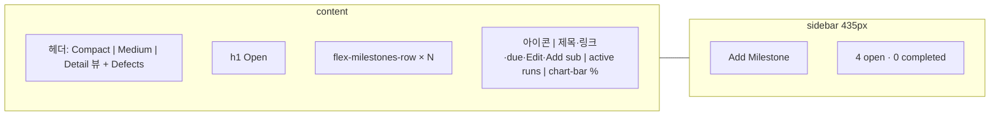
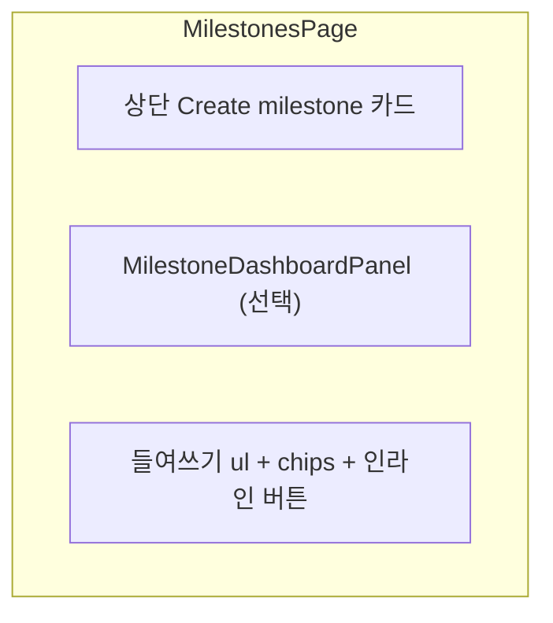

# TestRail Milestones 화면 대비 갭 및 좁히기 계획

Last updated: 2026-05-18

**기준 스냅샷:** TestRail 7.x Milestones Overview HTML (`milestones/overview/222`, `display=large` Detail View, **Open** 섹션 4건, 프로젝트 `Gemini Ph 2_Search(추천 모듈 전환)`).

**관련 문서:** [UX_GAP_ANALYSIS.md](../../UX_GAP_ANALYSIS.md) § Milestones And Plans, [PROJECT_OVERVIEW_VIEW_PARITY.md](./PROJECT_OVERVIEW_VIEW_PARITY.md), [RUN_EXECUTION_VIEW_PARITY.md](./RUN_EXECUTION_VIEW_PARITY.md), [FEATURE_CHECKLIST.md](../../FEATURE_CHECKLIST.md).

---

## 1. TestRail이 이 화면에서 하는 일

릴리스·스프린트 단위 **진행 허브**다. 매니저/리드가:

1. 마일스톤을 **상태별 묶음**(Open / Upcoming / Completed 등)으로 본다.
2. 각 마일스톤의 **진행률 바**(Passed / Failed / Untested)와 **활성 런 수**를 한눈에 본다.
3. **표시 밀도**(Compact / Medium / Detail)를 바꾼다.
4. 사이드바에서 **Add Milestone**, Open/Completed 개수를 확인한다.
5. 행에서 **Edit**, **Add Milestone**(하위), 상세(`milestones/view`)로 드릴다운한다.

케이스 저장소·런 실행과 달리, 여기서는 **집계·일정·진행 시각화**가 중심이다.

---

## 2. TestRail 레이아웃 (HTML 기준)

**DOM 앵커:**

| 영역 | TestRail ID/클래스 | 역할 |
|------|-------------------|------|
| 표시 밀도 | `overview_display` POST `display=small\|medium\|large` | Compact / Medium / **Detail**(스냅샷) |
| 헤더 | `#content-header`, Defects `#defectDropdown` | Jira **Add Defect** (새 탭) |
| 섹션 | `h1.top` **Open** | lifecycle 그룹 (Upcoming·Completed는 별도 블록) |
| 마일스톤 행 | `#milestone-1685`, `.flex-milestones-row` | 대형 아이콘 + 3열(summary / bar) |
| 제목 | `.summary-title` → `milestones/view/{id}` | 드릴다운 |
| 메타 링크 | `.summary-links` | due date, **Edit**, **Add Milestone** (parent) |
| 설명 | `.summary-description` | `Has N active test runs` |
| 진행 바 | `.chart-bar-custom` | Passed/Failed/Untested 색 + width + tooltip % |
| 퍼센트 | `.chart-bar-percent` | 예: 75%, 100%, 0% |
| Upcoming 도움 | `#upcomingHelp` | start date 설명 |
| 시작 다이얼로그 | `#startMilestoneDialog` | Start Milestone |
| 사이드바 | `#navigation-milestones-add` | Add Milestone |
| 사이드바 카운트 | `4 open and 0 completed` | 프로젝트 집계 |

**스냅샷 행 예:**

| 마일스톤 | Active runs | Bar |
|----------|-------------|-----|
| Production Test | 2 | 75% passed (165/219), 2% failed, 23% untested |
| Staging Test | 2 | 100% passed |
| DevTest | 0 | 0% (transparent bar) |
| Automation | 3 | 46% passed, 54% failed |

---

## 3. 클론 현재 구현 매핑

**라우트:** `/projects/:projectId/milestones` → `MilestonesPage.tsx`  
**상세:** `/projects/:projectId/milestones/:milestoneId` → `MilestoneDetailPage.tsx`

| TestRail 영역 | 클론 | 일치도 |
|---------------|------|--------|
| Open / Upcoming / Completed 섹션 | 단일 리스트 + `MilestoneLifecycleBadge` | 부분 |
| Detail 행 (아이콘+바+active runs) | 카드형 `li` + `MilestoneProgressChip` | 부분 |
| chart-bar (세그먼트) | chip 퍼센트·숫자 (바 없음) | 없음 |
| display small/medium/large | 없음 | 없음 |
| 사이드바 Add Milestone | 상단 **Create milestone** 폼 | 부분 |
| open/completed 카운트 | dashboard 패널 일부 | 부분 |
| Edit / Add sub (행 링크) | 상세·인라인 Complete/Delete | 부분 |
| Start Milestone 다이얼로그 | **Start now** 버튼 (upcoming) | 부분 |
| Defects 헤더 | 없음 | 없음 |
| Has N active test runs 문구 | `runCount` chip | 부분 |
| 마일스톤 상세 | `MilestoneDetailPage` + runs + forecast | 있음 |

---

## 4. 기능별 상세 갭

### 4.1 목록 UX (P0)

| 항목 | TestRail | 클론 | 좁히기 |
|------|----------|------|--------|
| lifecycle 섹션 | **Open** 제목 아래 행 목록 | 플랫 리스트 | `MilestoneListSection` title=Open \| Upcoming \| Completed |
| 진행 시각화 | 가로 **stacked bar** + % | `MilestoneProgressChip` | `MilestoneProgressBar` (passed/failed/untested), 클릭 → filtered runs |
| 행 밀도 | Detail: 64px 아이콘, 3열 | 컴팩트 border 카드 | `MilestoneSummaryRow` TR 레이아웃 |
| Active runs | 본문 `Has 2 active test runs` | chip runCount | 동일 문구 + 링크 `runs?milestoneId=` |
| 0% / 무테스트 | transparent bar + 0% | chip만 | empty bar 스타일 통일 |

### 4.2 헤더·사이드바 (P1)

| 항목 | TestRail | 클론 | 좁히기 |
|------|----------|------|--------|
| View density | 3 아이콘 POST preference | 없음 | `display=compact\|medium\|detail` user pref |
| Defects | `#defectDropdown` | 없음 | 공통 `DefectsMenu` (settings URL) |
| Add Milestone | sidebar primary | top form | sidebar CTA + `/milestones/new` 또는 다이얼로그 |
| 카운트 | `N open and M completed` | dashboard | 사이드바 고정 문구 |

### 4.3 행 액션·계층 (P1)

| 항목 | TestRail | 클론 | 좁히기 |
|------|----------|------|--------|
| Edit | `milestones/edit/{id}` | 상세에서 편집? | 행 **Edit** 링크 |
| Add sub-milestone | `milestones/add/222&parent_id=` | create form parent select | 행 **Add Milestone** |
| Sub-milestone 트리 | flat rows (parent_id) | `depth` indent | Detail view에서 children nest 표시 |
| Complete / Reopen | (상세·다이얼로그) | 인라인 버튼 | 유지 + TR 라벨 정합 |
| Start milestone | `#startMilestoneDialog` | Start now | 동일 다이얼로그 (날짜·런 옵션) |

### 4.4 상세·드릴다운 (P1)

| 항목 | TestRail | 클론 | 좁히기 |
|------|----------|------|--------|
| `milestones/view/{id}` | 런·플랜·활동 | `MilestoneDetailPage` | parity 점검: linked runs 테이블, progress bar |
| 바 클릭 드릴다운 | tooltip → 실행 필터 | 미구현 | failed 클릭 → milestone runs failed filter |
| Reports | milestone summary report | ReportMilestoneSummaryPage | 상세·목록에서 report 링크 |

### 4.5 Upcoming·일정 (P2)

| 항목 | TestRail | 클론 | 좁히기 |
|------|----------|------|--------|
| Upcoming 섹션 | start date 기준 + help | `lifecycleStatus: upcoming` | 별도 섹션 + `#upcomingHelp` 요약 |
| Due date | `No due date` / 날짜 | startDate on create; due? | due date 필드 + 행 표시 |

---

## 5. 좁히기 로드맵 (권장 순서)

### Wave A — 목록 행 TR 스타일 (P0, 1 PR)

1. `MilestoneProgressBar` (passed/failed/untested/unexecuted).
2. `MilestoneSummaryRow`: icon + title + links (Edit, Add sub) + description + bar.
3. API rollup에 `untested`, `activeRunCount` 명시 (이미 summary API 확장 가능).

**완료 기준:** Open 섹션 4건이 TestRail 스냅샷처럼 **가로 진행 바 + % + active runs** 로 보인다.

### Wave B — lifecycle 섹션 + 사이드바 (P1, 1 PR)

1. Open / Upcoming / Completed 그룹 헤더.
2. 사이드바: Add Milestone, open/completed counts.
3. 상단 create 폼 → 다이얼로그 또는 sidebar로 이동.

### Wave C — 표시 밀도 + Defects (P1, 1 PR)

1. Compact / Medium / Detail (행 높이·숨김 필드).
2. `user_preferences.milestoneOverviewDisplay`.
3. 헤더 Defects 드롭다운.

### Wave D — 행 액션·Start dialog (P2)

1. Edit / Add Milestone 행 링크.
2. `StartMilestoneDialog` (TR `#startMilestoneDialog`).

### Wave E — 드릴다운·상세 (P2)

1. Progress bar segment click → runs list filtered.
2. `MilestoneDetailPage` 레이아웃 TR view 페이지 정합.

---

## 6. API·데이터

| capability | 제안 |
|------------|------|
| Overview list | `GET /api/projects/:id/milestones/overview?display=large` → `{ open[], upcoming[], completed[] }` |
| Row rollup | `passed`, `failed`, `untested`, `total`, `activeRunCount`, `percentPassed` |
| Display pref | `PATCH /api/users/me/preferences` → `milestoneOverviewDisplay` |

기존 `fetchMilestoneSummary` / `MilestoneDashboardPanel`과 **통합**해 중복 집계를 피한다.

---

## 7. 다른 화면과의 관계

| 화면 | 역할 |
|------|------|
| [Project Overview](./PROJECT_OVERVIEW_VIEW_PARITY.md) | 마일스톤 **컴팩트 링크** 2~4개 (사이드 요약) |
| **Milestones (이 문서)** | 마일스톤 **전체 목록 + 진행 바** |
| [Run execution](./RUN_EXECUTION_VIEW_PARITY.md) | 마일스톤에 속한 **런 실행** |
| Plans (미작성) | 플랜·구성 중심 — Milestones와 유사한 summary row 패턴 재사용 가능 |

---

## 8. 완료 게이트 (Milestones “TestRail-like”)

- [ ] Open / Upcoming / Completed로 구분된 목록이 있다.
- [ ] 각 open 마일스톤에 **세그먼트 진행 바**와 passed %가 있다.
- [ ] `Has N active test runs` (또는 동등 문구)가 보인다.
- [ ] Display density 3단계 중 최소 Detail + Compact가 있다.
- [ ] 사이드바(또는 동등 위치)에 Add Milestone + open/completed 카운트가 있다.
- [ ] 행에서 Edit·Add sub-milestone·상세 진입이 1~2클릭이다.
- [ ] 진행 바 클릭(또는 %)이 실패/미실행 런 목록으로 이어진다.

---

## 9. 클론 코드 앵커

| 역할 | 파일 |
|------|------|
| 목록 페이지 | `apps/web/src/features/projects/components/MilestonesPage.tsx` |
| 상세 | `MilestoneDetailPage.tsx` |
| 대시보드 위젯 | `MilestoneDashboardPanel.tsx` |
| 진행 chip | `MilestoneProgressChip.tsx` |
| lifecycle | `MilestoneLifecycleBadge.tsx` |
| 리포트 | `reports/ReportMilestoneSummaryPage.tsx` |
| 집계 API | `api/milestoneSummaryApi.ts` |
| 계층 정렬 | `utils/milestoneDisplay.ts` |

---

## 10. 다음 액션

1. [NEXT_ACTIONS.md](../../NEXT_ACTIONS.md)에 **Milestones Wave A (progress bar rows + Open section)** 추가.
2. [PROJECT_OVERVIEW_VIEW_PARITY.md](./PROJECT_OVERVIEW_VIEW_PARITY.md) §4.3 — 마일스톤 열이 이 목록으로 링크됨을 명시.
3. `MilestoneProgressBar` 구현 시 [RUNS_OVERVIEW_VIEW_PARITY.md](./RUNS_OVERVIEW_VIEW_PARITY.md) / [RUN_EXECUTION_VIEW_PARITY.md](./RUN_EXECUTION_VIEW_PARITY.md)와 **색상 토큰·바 컴포넌트 공유** (`passed` `#3cb850`, `failed` `#e40046`, `untested` `#979797`).

이 문서는 제공된 HTML 및 `milestones/overview/222` 스냅샷 기준이며, Enterprise 배너·세션 만료 메시지는 범위 외다.
