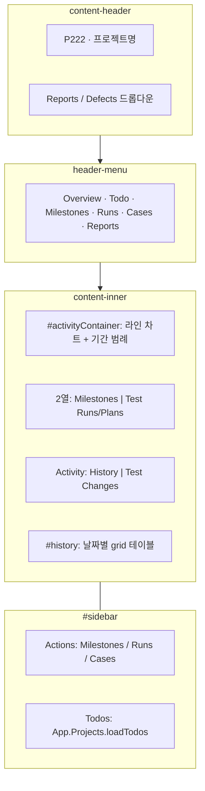
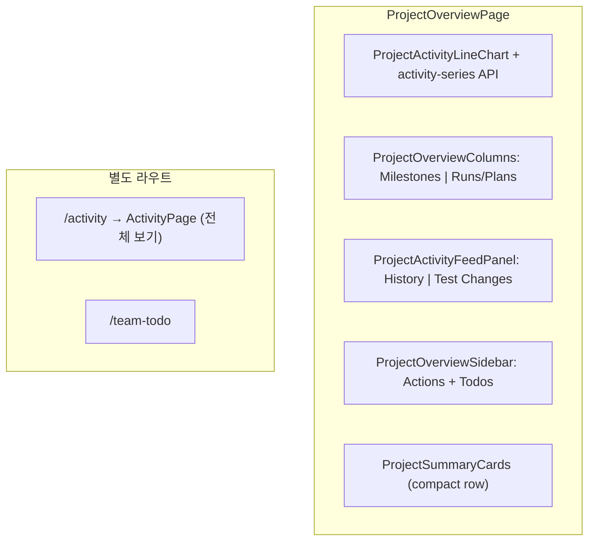

# TestRail 프로젝트 Overview 화면 대비 갭 및 좁히기 계획

Last updated: 2026-05-18

**기준 스냅샷:** TestRail 7.x 프로젝트 Overview HTML (`projects/overview/222`, 프로젝트 `Gemini Ph 2_Search(추천 모듈 전환)`, P222, 활동 차트 60일).

**관련 문서:** [UX_GAP_ANALYSIS.md](../../UX_GAP_ANALYSIS.md) § Project Shell, [MILESTONES_VIEW_PARITY.md](./MILESTONES_VIEW_PARITY.md), [CASE_REPOSITORY_VIEW_PARITY.md](./CASE_REPOSITORY_VIEW_PARITY.md), [RUN_EXECUTION_VIEW_PARITY.md](./RUN_EXECUTION_VIEW_PARITY.md), [SCREEN_INVENTORY.md](../../SCREEN_INVENTORY.md), [NEXT_ACTIONS.md](../../NEXT_ACTIONS.md).

---

## 1. TestRail이 이 화면에서 하는 일

프로젝트에 들어왔을 때의 **허브(hub)** 이다. 실행 벤치(런 상세)로 가기 전에:

1. **최근 실행 추이**를 본다 (일별 Passed/Failed 라인 차트, 기간 선택).
2. **마일스톤·런/플랜** 최근 항목으로 바로 드릴다운한다.
3. **프로젝트 히스토리**(생성/종료 이벤트) 또는 **테스트 변경** 피드를 본다.
4. 사이드바 **Actions**로 Add Run / Add Case 등 다음 작업을 시작한다.
5. **Todos**로 할당·미완료 작업을 확인한다.

대시보드 카드가 아니라, **차트 + 2열 요약 + 활동 그리드 + 우측 Actions** 가 한 화면에 붙어 있는 구조가 핵심이다.

---

## 2. TestRail 레이아웃 (HTML 기준)

**DOM 앵커:**

| 영역 | TestRail ID/클래스 | 역할 |
|------|-------------------|------|
| 헤더 | `#content-header`, `content-header-id` P222 | 프로젝트 ID, Reports/Defects |
| 프로젝트 탭 | `#header` `.header-menu` | Overview 선택, Todo/Milestones/Runs/Cases/Reports |
| 활동 차트 | `#activityContainer`, `#activityChart` | Highcharts **line**, 60일 기본, `App.Projects.selectActivityDays` |
| 기간 선택 | `#selectTimeframeDialog` | 7/14/30/60/90 days |
| 마일스톤 열 | `column-p2` 첫 열, `navigation-overview-viewmilestones` | 컴팩트 마일스톤 링크 목록 |
| 런 열 | 두 번째 열, `icon-plan-32` / `icon-run-32` | **플랜 + 단일 런** 최근 항목 (혼합) |
| 활동 피드 | `History` \| `Test Changes` | `App.Projects.showHistory` / `showActivities` |
| 히스토리 | `#history`, `table.grid` | 날짜 헤더 + entity 배지 + 링크 + Created/Closed by |
| 더보기 | `#showHistory`, `loadHistory` | AJAX 페이지 추가 |
| 사이드바 Actions | `#sidebar` `.sidebar-h1` Actions | Milestones/Runs/Cases — Add \| View All |
| 사이드바 Todos | `#todos`, `loadTodos(222)` | 프로젝트 할 일 위젯 |
| 런 추가 | `#sidebar-runs-add` → `runs/add/3588/4` | suite 선택 후 런 생성 (`#chooseSuiteDialog`) |
| QPane | `#qpane` | Overview에서는 `display: none` |

**스냅샷 데이터 예 (차트 범례):** 지난 60일 Passed 473 (74%), Failed 166 (26%), Blocked/커스텀 상태 0. 일별 시계열은 3-19 ~ 5-18 카테고리.

---

## 3. 클론 현재 구현 매핑

**라우트:** `/projects/:projectId` (index) → `ProjectOverviewPage.tsx`  
**셸:** `ProjectLayout.tsx` — `ProjectTabs`, `ProjectHeader`, breadcrumb (TestRail `top-section` + `header-menu`에 해당).

| TestRail 영역 | 클론 | 일치도 |
|---------------|------|--------|
| P222 + Reports/Defects 헤더 | `ProjectContentHeader` + `ReportsDropdown` / `DefectsDropdown` | 있음 |
| header-menu 6탭 | `ProjectTabs` primary 6 (Overview, Todo, Milestones, Runs, Cases, Reports) + More | 있음 |
| 라인 차트 (일별) | `ProjectActivityLineChart` + `GET .../activity-series` | 있음 |
| 기간 7~90일 | 차트 상단 7/14/30/60/90d 버튼 | 있음 |
| 2열 Milestones \| Runs | `ProjectOverviewColumns` 2열 | 있음 |
| 플랜+런 혼합 목록 | `recentPlans` + `recentRuns` in Runs/Plans 열 | 있음 |
| History \| Test Changes | `ProjectActivityFeedPanel` 탭 | 있음 |
| 날짜별 grid 히스토리 | 날짜 헤더 + `table` grid, Show more (`feed=history`) | 있음 |
| sidebar Actions | `ProjectOverviewSidebar` Add \| View All | 있음 |
| sidebar Todos | 실패·활성 런 요약 + View All → team-todo | 부분 |
| chooseSuiteDialog | `/runs/new` (Actions 링크) | 있음 (다른 진입점) |
| 차트·범례 드릴다운 | 범례 → runs `resultStatus`; 일자·시리즈 → results `status`+날짜 | 있음 |

---

## 4. 기능별 상세 갭

### 4.1 프로젝트 셸·내비 (P1)

| 항목 | TestRail | 클론 | 좁히기 |
|------|----------|------|--------|
| 탭 순서·이름 | Overview, **Todo**, Milestones, Runs, Cases, Reports | Overview, Cases, Runs, My Tests, Team to-do, Plans, … | TestRail 순서에 맞춘 **primary 6탭**; 나머지는 More |
| Todo vs My Tests | `todos/overview/222` | `my-tests`, `team-todo` | Todo = 할당 테스트 큐로 통합 URL 또는 Overview 사이드바 위젯 |
| Return to Dashboard | `navigation-dashboard-top` | `/projects` 목록 | 동일 링크 라벨·위치 |
| Reports/Defects 헤더 | 프로젝트 스코프 `add_job` 링크 | Reports 하위 페이지 | Overview 헤더에 **Reports · Defects** split button |

### 4.2 활동 차트 (P0 — Overview 정체성)

| 항목 | TestRail | 클론 | 좁히기 |
|------|----------|------|--------|
| 차트 타입 | **Line** (일별 Passed/Failed/…) | Stacked bar (현재 스냅샷 집계) | `ProjectActivityChart` line series |
| 기간 | 7/14/30/60/90, 클릭으로 변경 | 없음 | `?days=60` + 다이얼로그/드롭다운 |
| 범례 | 기간 내 합계 + % | Passed/Failed/Remaining 3종만 | 프로젝트 **전체 상태** 설정 반영 |
| 드릴다운 | (차트 클릭 시 필터 — TR 문서 참고) | runs 목록 링크만 | 일자 클릭 → 해당일 결과/런 필터 |

**API 제안:** `GET /api/projects/:projectId/activity-series?days=60` → `{ categories: string[], series: { name, color, data: number[] }[] }` (결과 `created_at` 일별 집계).

### 4.3 마일스톤·런 2열 요약 (P1)

| 항목 | TestRail | 클론 | 좁히기 |
|------|----------|------|--------|
| 레이아웃 | `table` 50/50, `h1` + 컴팩트 row | 세로 스택 카드/섹션 | `ProjectOverviewColumns`: `MilestonesColumn` \| `RunsPlansColumn` |
| 마일스톤 | 최근 N개, due date 한 줄 | `MilestoneDashboardPanel` (리포트 연동) | 동일 밀도: 아이콘 + 제목 + due, View All → 전체는 [MILESTONES_VIEW_PARITY.md](./MILESTONES_VIEW_PARITY.md) |
| 런/플랜 | plan 아이콘 + run 아이콘 혼합, 작성자·날짜 | `RecentRunList` run만 | `recentPlans` + `recentRuns` API; 전체 목록은 [RUNS_OVERVIEW_VIEW_PARITY.md](./RUNS_OVERVIEW_VIEW_PARITY.md) |
| View All | `milestones/overview`, `runs/overview` | 각 탭 | 열 제목 링크 |

### 4.4 Activity 피드 (P1)

| 항목 | TestRail | 클론 | 좁히기 |
|------|----------|------|--------|
| History | Milestone/Plan/Run 생성·종료, 날짜 그룹 `table.grid` | `ActivityPage` 이벤트 스트림 | Overview 하단에 **History** 탭 + grid 컴포넌트 |
| Test Changes | `showActivities`, `#activities` | 동일 API에서 `eventType` 필터 | **Test Changes** 탭 |
| Show more | `loadHistory` AJAX | Activity 페이지네이션 | Overview에서 “Show more” → activity API page++ |
| entity 배지 | `status entity-run`, `entity-milestone` | 텍스트 eventType | `ActivityEntityBadge` |

**API:** 기존 activity 이벤트에 `category: "history" | "test_change"` 또는 eventType 화이트리스트.

### 4.5 사이드바 Actions·Todos (P1)

| 항목 | TestRail | 클론 | 좁히기 |
|------|----------|------|--------|
| Actions 블록 | 우측 고정 435px | 없음 (전폭 콘텐츠) | `ProjectOverviewLayout`: `content` + `aside` |
| Add Run | sidebar → suite dialog → add | `/runs/new` | Actions에서 동일 플로우 |
| Add Case / Milestone | sidebar 링크 | cases/milestones 라우트 | Add \| View All 패턴 |
| Todos | `App.Projects.loadTodos` | Team to-do 페이지 | Overview sidebar **Todos 위젯** (top 5 + View All) |

### 4.6 밀도·안티패턴 (UX rubric)

| TestRail | 클론 리스크 | 조치 |
|----------|------------|------|
| 컴팩트 summary-row | `ProjectSummaryCards` 대형 카드 | Overview 상단 카드를 **한 줄 통계 + 차트**로 축소 |
| grid 테이블 활동 | 카드형 섹션 stack | `space-y-4` 카드 대신 **테이블/그리드 우선** |
| 차트가 첫 화면 | 차트가 카드 안에 묶임 | 차트를 content 최상단 full-width |

---

## 5. 좁히기 로드맵 (권장 순서)

### Wave A — Overview 골격 (P0, 1 PR)

1. 레이아웃: `main` + `aside`(Actions/Todos), max-width 제거 또는 TestRail식 wide.
2. `ProjectActivityLineChart` + `days` 쿼리 (60 기본).
3. `GET .../activity-series` API.

**완료 기준:** 프로젝트 진입 시 60일 라인 차트가 보이고, 기간 변경 시 차트·범례가 갱신된다.

### Wave B — 2열 요약 + 헤더 (P1, 1 PR)

1. Milestones \| Runs/Plans 2열.
2. `recentPlans` API (또는 overview DTO 확장).
3. content-header Reports/Defects 드롭다운 (기존 report job URL 패턴).

### Wave C — History / Test Changes on Overview (P1, 1 PR)

1. Overview 하단 탭 History | Test Changes.
2. 날짜 그룹 grid + Show more.
3. `/activity`는 “전체 보기”로 유지.

### Wave D — Sidebar Actions·Todos (P1, 1 PR)

1. Actions: Milestones, Runs, Cases (Add | View All).
2. Todos 위젯 (`/tests/team-todo` 또는 전용 compact API).

### Wave E — 탭·셸 정합 (P2)

1. Primary tabs를 TestRail 6개에 정렬; Todo 라우트 통합.
2. 차트·범례 클릭 드릴다운 (runs filtered by status/date).

---

## 6. 클론 코드 앵커

| 역할 | 파일 |
|------|------|
| Overview 페이지 | `apps/web/src/features/projects/components/ProjectOverviewPage.tsx` |
| 라인 차트 | `ProjectActivityLineChart.tsx` |
| 활동 피드 | `ProjectActivityFeedPanel.tsx` |
| 2열 요약 | `ProjectOverviewColumns.tsx` |
| 사이드바 | `ProjectOverviewSidebar.tsx` |
| 콘텐츠 헤더 | `content-header/ProjectContentHeader.tsx` |
| 통계 카드 | `ProjectSummaryCards.tsx` |
| 마일스톤 위젯 | `MilestoneDashboardPanel.tsx` |
| 최근 런 | `RecentRunList.tsx` |
| 프로젝트 셸 | `ProjectLayout.tsx`, `shared/ui/ProjectTabs.tsx` |
| 활동 전체 | `ActivityPage.tsx`, `fetchProjectActivity` |
| Overview API | `GET /api/projects/:projectId/overview` (`reports.routes.ts`) |

---

## 7. Run Overview vs Project Overview

| | Project Overview | Run execution |
|--|------------------|---------------|
| 차트 | **Line** (시간별 추이) | **Pie** (현재 런 스냅샷) |
| 목록 | Milestones + Plans/Runs | Section-grouped **tests** |
| 사이드바 | Actions + Todos | Section tree + run meta |
| 피드 | History / Test Changes | (런 Activity 탭은 별도 라우트) |

두 화면은 같은 Highcharts/밀도 문법을 쓰지만 **질문에 답하는 지표가 다르다**. Project는 “프로젝트가 최근 어떻게 움직였나”, Run은 “이번 런을 얼마나 끝냈나”.

---

## 8. 완료 게이트 (Project Overview “TestRail-like”)

- [x] 진입 1스크롤 이내에 **기간 선택 가능한 라인 차트**가 있다.
- [x] 마일스톤과 런/플랜이 **2열 컴팩트 목록**으로 보인다.
- [x] History / Test Changes를 Overview에서 전환할 수 있다.
- [x] 우측(또는 동등 위치) Actions에서 Run/Case/Milestone **Add**가 1클릭이다.
- [x] Todos 요약이 Overview에 있고 실행 화면으로 이어진다.
- [x] 상단 카드만 있는 대시보드 형태가 아니다 (차트+그리드 우선).

- [x] 차트·범례 클릭 시 일자/상태별 드릴다운 (runs 또는 results).

---

## 9. 다음 액션

1. [NEXT_ACTIONS.md](../../NEXT_ACTIONS.md)에 **Project Overview Wave A (activity-series API + line chart)** 추가.
2. [FEATURE_CHECKLIST.md](../../FEATURE_CHECKLIST.md) Project overview / shell 항목과 §8 체크리스트 링크.
3. Wave A 구현 시 [RUN_EXECUTION_VIEW_PARITY.md](./RUN_EXECUTION_VIEW_PARITY.md)와 **차트 컴포넌트 공유** (`shared/charts`) 검토 — pie vs line props 분리.

이 문서는 제공된 HTML 스냅샷 기준이며, TestRail Enterprise 전용 배너·뉴스레터 등은 범위에서 제외한다.
