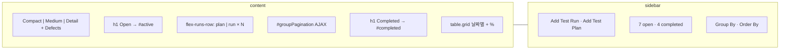
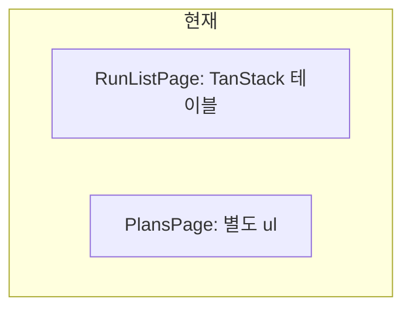

# TestRail Test Runs & Results(목록) 화면 대비 갭 및 좁히기 계획

Last updated: 2026-05-18

**기준 스냅샷:** TestRail 7.x Runs Overview HTML (`runs/overview/222`, `display=large` Detail View, **Open** 7건 [플랜+런 혼합], **Completed** 날짜별 그리드, 프로젝트 222).

**관련 문서:** [RUN_EXECUTION_VIEW_PARITY.md](./RUN_EXECUTION_VIEW_PARITY.md) (단일 런 **실행** 화면 `runs/view/{id}`), [MILESTONES_VIEW_PARITY.md](./MILESTONES_VIEW_PARITY.md), [PROJECT_OVERVIEW_VIEW_PARITY.md](./PROJECT_OVERVIEW_VIEW_PARITY.md), [UX_GAP_ANALYSIS.md](../../UX_GAP_ANALYSIS.md) § Run List.

> **구분:** 이 문서는 **런·플랜 목록 허브**이다. `runs/view/63307` 같은 **실행 워크벤치**는 [RUN_EXECUTION_VIEW_PARITY.md](./RUN_EXECUTION_VIEW_PARITY.md)를 본다.

---

## 1. TestRail이 이 화면에서 하는 일

프로젝트에서 **어떤 런/플랜을 열지** 고르는 허브다.

1. **Open** 영역에서 진행 중인 플랜·런을 **진행 바**와 상태 집계와 함께 본다.
2. **Completed** 영역에서 종료된 런을 **날짜별 컴팩트 목록**으로 본다.
3. 표시 밀도(Compact / Medium / Detail)를 바꾼다.
4. 사이드바에서 **Add Test Run / Add Test Plan**, Group By, Order By로 목록을 재구성한다.
5. 행 클릭 → `plans/view` 또는 `runs/view`로 실행·관리 화면으로 드릴다운한다.

마일스톤 목록과 유사한 **summary row + chart-bar** 패턴이지만, 대상이 **런·플랜**이고 플랜(`icon-plan`)과 단일 런(`icon-run`)이 한 목록에 섞인다.

---

## 2. TestRail 레이아웃 (HTML 기준)



**DOM 앵커:**

| 영역 | TestRail ID/클래스 | 역할 |
|------|-------------------|------|
| 표시 밀도 | `runs/overview_display/222` `display=small\|medium\|large` | 목록 행 높이·상세도 |
| 헤더 | Defects `#defectDropdown` | Jira **Add Defect** |
| Open | `h1` Open, `#active` | 활성 플랜·런 |
| 플랜 행 | `icon-plan-64`, `plans/view/{id}` | 다구성 매트릭스 |
| 런 행 | `icon-run-64`, `runs/view/{id}` | 단일 런 |
| 메타 | `.summary-links` | By user on date \| **Edit** |
| 상태 문장 | `.summary-description` | Passed, Failed, … 전 상태 카운트 나열 |
| 진행 바 | `.chart-bar-custom` | Passed/Failed/Untested 등 + **passed %** |
| 페이지네이션 | `#groupPagination`, `App.Runs.loadActive` | offset AJAX (25 단위) |
| Completed | `#completed`, `table.grid` | 날짜 헤더 + 이름 + **우측 %** |
| Upcoming 도움 | `#upcomingHelp` | 마일스톤 upcoming 시 런·플랜 표시 |
| Completion Pending | `#completionPendingHelp` | 완료 마일스톤·close 안내 |
| 사이드바 | `#navigation-runs-add`, `#navigation-plans-add` | suite 선택 후 런 생성 |
| 집계 | `7 open and 4 completed test runs` | |
| Group By | `#groupbySelection` | assignee, creator, day, milestone, month |
| Order By | `#orderbySelection` | date, name |
| Suite 선택 | `#chooseSuiteDialog` | 새 런 시 suite |

**스냅샷 Open 행 예:**

| 항목 | 타입 | Passed % | 비고 |
|------|------|----------|------|
| Tracking Test | plan | 29% | 20/70 passed, 50 untested |
| Functional test | plan | 97% | 145/149 passed, 4 failed |
| User Tracking … 09:20:23 | run | 60% | 12 passed, 8 failed |
| Tracking Test (4/30) | plan | 100% | |

---

## 3. 클론 현재 구현 매핑

**라우트:** `/projects/:projectId/runs` → `RunListPage.tsx`  
**플랜:** `/projects/:projectId/plans` → `PlansPage.tsx` (**분리**)



| TestRail 영역 | 클론 | 일치도 |
|---------------|------|--------|
| 플랜+런 통합 목록 | 런만 `RunListPage`, 플랜은 `PlansPage` | **없음** |
| Open / Completed 섹션 | status 컬럼만, 섹션 없음 | 없음 |
| Detail summary row + bar | name, progress%, failed 숫자 | 없음 |
| 전 상태 카운트 문장 | 없음 | 없음 |
| display small/medium/large | 없음 | 없음 |
| Completed 날짜 그리드 | closed 런 필터 없음/별도 | 없음 |
| AJAX pagination | 전체 fetch 후 클라이언트 테이블 | 부분 |
| 사이드바 Add Run/Plan | 상단 + New run 버튼 | 부분 |
| open/completed 카운트 | 없음 | 없음 |
| Group By / Order By | 없음 | 없음 |
| Defects 헤더 | 없음 | 없음 |
| My runs 필터 | `?mine=1` (TR에 없음) | 추가 기능 |
| Compare runs | 있음 (TR overview에 없음) | 추가 기능 |
| 실행 화면 | `RunDetailPage` | [RUN_EXECUTION_VIEW_PARITY](./RUN_EXECUTION_VIEW_PARITY.md) |

---

## 4. 기능별 상세 갭

### 4.1 통합 목록·섹션 (P0)

| 항목 | TestRail | 클론 | 좁히기 |
|------|----------|------|--------|
| 플랜+런 한 화면 | `#active`에 plan/run 혼합 | 페이지 분리 | `RunsOverviewPage`: `RunPlanSummaryRow[]` |
| Open | 명시적 `h1 Open` | 없음 | `RunsOverviewSection` title=Open |
| Completed | 날짜별 `table.grid` + % | 없음 | Completed 섹션 + `closedAt` 그룹 |
| Upcoming / Completion Pending | help + (다른 milestone 상태) | 없음 | lifecycle 연동 (마일스톤 API) |

### 4.2 행 UX (P0)

| 항목 | TestRail | 클론 | 좁히기 |
|------|----------|------|--------|
| 진행 바 | stacked bar + tooltip | progress % 텍스트 | `RunPlanProgressBar` (마일스톤 문서와 공유) |
| 아이콘 | plan-64 / run-64 | 없음 | `entityType` badge |
| 상태 요약 | 12개 상태 카운트 문장 | failed 숫자만 | `formatRunStatusSummary(counts)` |
| Edit | `runs/edit`, `plans/edit` | 상세에서만? | 행 **Edit** 링크 |
| passed % 강조 | `.chart-bar-percent` | progress 컬럼 | 동일 위치 |

### 4.3 헤더·사이드바 (P1)

| 항목 | TestRail | 클론 | 좁히기 |
|------|----------|------|--------|
| View density | 3단계 POST | 없음 | user pref `runsOverviewDisplay` |
| Defects | dropdown | 없음 | 공통 `DefectsMenu` |
| Add Test Run | sidebar + chooseSuite | `/runs/new` | sidebar + suite dialog |
| Add Test Plan | sidebar | `/plans` create card | sidebar CTA |
| Group By | AJAX reload | 없음 | `?groupBy=milestone` 등 |
| Order By | date \| name | 테이블 implicit | API sort + UI select |
| 카운트 | N open, M completed | 없음 | sidebar 문구 |

### 4.4 페이지네이션·성능 (P1)

| 항목 | TestRail | 클론 | 좁히기 |
|------|----------|------|--------|
| Active 목록 | `loadActive(222, null, offset)` | 전체 로드 | `GET /runs/overview?status=open&offset=` |
| Completed | 정적 HTML (스냅샷 소량) | — | `status=completed&limit=` |

### 4.5 클론 유지 가치 (P2)

| 기능 | 처리 |
|------|------|
| My runs | TR에 없음 → 필터 칩으로 유지 (Group By assignee와 유사) |
| Compare runs | 유지; overview 툴바 또는 사이드바 링크 |

---

## 5. 좁히기 로드맵

### Wave A — 통합 Open 목록 + progress bar (P0, 1~2 PR)

1. `GET /api/projects/:id/runs-overview` → open items (plan \| run), rollup counts, percentPassed.
2. `RunPlanSummaryRow` + `RunPlanProgressBar` (reuse from milestones wave).
3. `RunsOverviewPage` Open 섹션; 기존 `RunListPage`를 대체하거나 리다이렉트.

**완료 기준:** Open에 플랜·런이 함께 보이고, 각 행에 TR과 같은 **바 + % + 상태 문장**이 있다.

### Wave B — Completed + 사이드바 (P1, 1 PR)

1. Completed 날짜 그리드.
2. Sidebar: Add Run, Add Plan, open/completed counts.
3. `chooseSuiteDialog` on Add Run.

### Wave C — Group By / Order By / Display (P1, 1 PR)

1. Group By / Order By (서버 정렬·그룹).
2. Compact / Medium / Detail density.

### Wave D — Defects·드릴다운 (P2)

1. Header Defects.
2. Bar segment click → run/plan filtered execution view.

---

## 6. API 제안

```typescript
// GET /api/projects/:projectId/runs-overview?display=large&groupBy=none&orderBy=date
{
  open: { total: 7, items: RunPlanOverviewItem[], nextOffset?: number },
  completed: { total: 4, groups: { date: string, items: { id, name, type, percentPassed }[] }[] },
  counts: { open: 7, completed: 4 }
}

type RunPlanOverviewItem = {
  id: string;
  type: "run" | "plan";
  name: string;
  createdBy: string;
  createdAt: string;
  statusCounts: Record<string, number>;
  percentPassed: number;
  totalTests: number;
};
```

기존 `fetchRuns` / `fetchPlans`를 합치지 말고 **overview 전용 집계**로 N+1을 피한다.

---

## 7. 다른 화면과의 관계

| 문서 | 화면 | 질문 |
|------|------|------|
| [RUNS_OVERVIEW (이 문서)](./RUNS_OVERVIEW_VIEW_PARITY.md) | `runs/overview` | 어떤 런/플랜을 열까? |
| [RUN_EXECUTION](./RUN_EXECUTION_VIEW_PARITY.md) | `runs/view/{id}` | 이 런에서 테스트를 어떻게 실행하나? |
| [MILESTONES](./MILESTONES_VIEW_PARITY.md) | `milestones/overview` | 릴리스 단위 진행은? |
| [PROJECT_OVERVIEW](./PROJECT_OVERVIEW_VIEW_PARITY.md) | `projects/overview` | 최근 런 2~3개만 티저 |

**공유 컴포넌트:** `RunPlanProgressBar`, `SummaryStatusCounts`, `DefectsMenu`, `DisplayDensityToggle`.

---

## 8. 완료 게이트

- [ ] 플랜과 런이 **한 Open 목록**에 있다.
- [ ] 각 open 항목에 **세그먼트 진행 바** + passed % + 상태 카운트 문장이 있다.
- [ ] **Completed**가 날짜별로 구분된다.
- [ ] 사이드바(또는 동등 UI)에 Add Run, Add Plan, open/completed 카운트가 있다.
- [ ] Group By / Order By가 동작한다.
- [ ] Display density 최소 Detail + Compact가 있다.
- [ ] 행 클릭이 plan/view 또는 run/view로 이어진다.

---

## 9. 클론 코드 앵커

| 역할 | 파일 |
|------|------|
| 런 목록 (현재) | `apps/web/src/features/runs/components/RunListPage.tsx` |
| 플랜 목록 (분리) | `apps/web/src/features/projects/components/PlansPage.tsx` |
| 런 실행 | `RunDetailPage.tsx` |
| 런 생성 | `RunCreatePage.tsx` |
| 플랜 상세 | `PlanDetailPage.tsx` |
| API | `apps/web/src/features/runs/api/runApi.ts`, `fetchRuns` |
| 타입 | `apps/web/src/features/runs/types.ts` `RunSummary` |

---

## 10. 다음 액션

1. [NEXT_ACTIONS.md](../../NEXT_ACTIONS.md)에 **Runs Overview Wave A** 추가 (Run List P0와 구분).
2. [RUN_EXECUTION_VIEW_PARITY.md](./RUN_EXECUTION_VIEW_PARITY.md) 서두에 “목록은 RUNS_OVERVIEW” 링크 명시 (이미 상단에 구분 문단 추가 권장).
3. [MILESTONES_VIEW_PARITY.md](./MILESTONES_VIEW_PARITY.md) Wave A와 **ProgressBar 컴포넌트 공유** PR 순서 정리.

이 문서는 `runs/overview/222` HTML 기준이며, Enterprise·세션 UI는 범위 외다.
