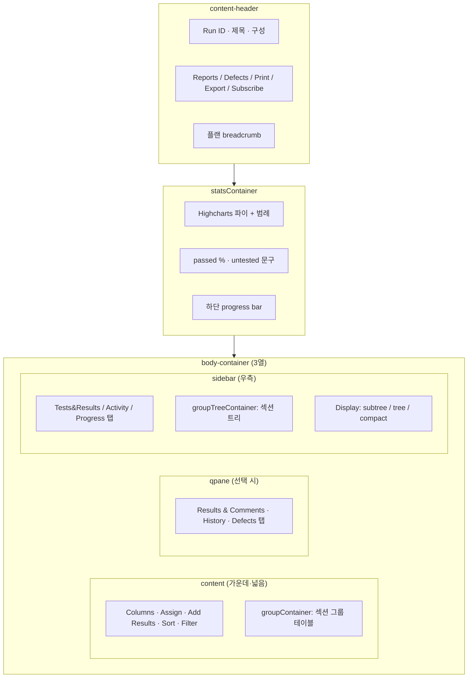
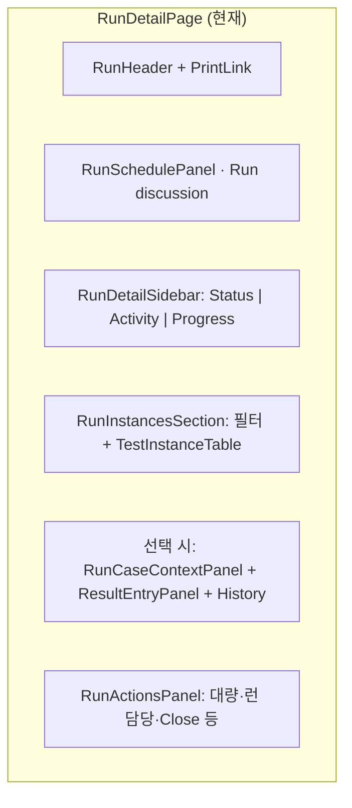

# TestRail Run 실행 화면 대비 갭 및 좁히기 계획

Last updated: 2026-05-18

**기준 스냅샷:** 실제 TestRail 7.x 런 상세 페이지 HTML (`runs/view/63307`, 프로젝트 222, 플랜 `Tracking Test`, 구성 `APP (iOS)`, 25 tests, `display=subtree`).

**관련 문서:** [UX_GAP_ANALYSIS.md](../../UX_GAP_ANALYSIS.md), [RUNS_OVERVIEW_VIEW_PARITY.md](./RUNS_OVERVIEW_VIEW_PARITY.md) (런·플랜 **목록** `runs/overview`), [CASE_REPOSITORY_VIEW_PARITY.md](./CASE_REPOSITORY_VIEW_PARITY.md), [PROJECT_OVERVIEW_VIEW_PARITY.md](./PROJECT_OVERVIEW_VIEW_PARITY.md), [SCREEN_INVENTORY.md](../../SCREEN_INVENTORY.md) § Run execution, [NEXT_ACTIONS.md](../../NEXT_ACTIONS.md), [COMPONENT_MAP.md](../../COMPONENT_MAP.md).

> **구분:** `runs/overview` (어떤 런을 열지)는 [RUNS_OVERVIEW_VIEW_PARITY.md](./RUNS_OVERVIEW_VIEW_PARITY.md). 이 문서는 `runs/view/{id}` **실행 워크벤치** 전용이다.

---

## 1. TestRail이 이 화면에서 하는 일

테스터의 **일일 작업 벤치**다. 한 런 안에서:

1. 진행률을 한눈에 본다 (파이·바·passed %).
2. 섹션/그룹으로 테스트 목록을 탐색한다.
3. 행에서 빠르게 상태를 찍거나, 상세 패널에서 결과·스텝·첨부·결함을 기록한다.
4. 필터·정렬·컬럼·대량 할당/결과로 묶음 작업을 한다.
5. 목록 컨텍스트를 잃지 않은 채 다음 테스트로 이동한다.

이 흐름이 깨지면 “TestRail 같은 느낌”은 나지 않는다.

---

## 2. TestRail 레이아웃 (HTML 기준)

**DOM 앵커 (참고용):**

| 영역 | TestRail ID/클래스 | 역할 |
|------|-------------------|------|
| 헤더 | `#content-header` | R63307, 툴바, 구독, 플랜 링크 |
| 통계 | `#statsContainer`, `#statusChart` | 파이·범례·untested 바 |
| 메인 툴바 | `#contentToolbar`, `#contentSticky` | 컬럼·할당·대량 결과·Sort·Filter |
| 테스트 그리드 | `#groupContainer` | `App.Runs.showInitial()` AJAX, **섹션 그룹** 테이블 |
| 상세 패널 | `#qpane`, `App.QPane` | 선택 행 상세·결과 입력 |
| 우측 사이드바 | `#sidebar`, `#groupTreeContainer` | 섹션 트리·표시 모드·런 메타 |
| 인라인 상태 | `#statusDropdown` | 행에서 `addResultInline` |
| 결과 모달 | `#addResultDialog` | 스텝 결과·첨부·다음 테스트 이동 |
| 키보드 | `body keyup` + `App.Hotkeys` | R/J/K/P/Q/A 등 |

---

## 3. 클론 현재 구현 매핑

**라우트:** `/projects/:projectId/runs/:runId` → `RunDetailPage.tsx`

| TestRail 영역 | 클론 컴포넌트 / 동작 | 일치도 |
|---------------|---------------------|--------|
| content-header | `RunHeader`, `PrintLinkButton`, 일부 액션은 `RunActionsPanel` | 부분 |
| statsContainer (파이) | `RunStatusSidebar` / `RunSummaryBar` (칩·숫자, 파이 없음) | 부분 |
| sidebar 섹션 트리 | **없음** (Activity/Progress는 별도 탭) | 없음 |
| sidebar Tests/Activity/Progress/Defects | Status·Activity·Progress 탭; Defects는 런 전용 라우트 미연결 | 부분 |
| groupContainer (섹션 그룹 테이블) | `TestInstanceTable` **페이지네이션 평면 목록** | 없음 |
| Sort (Section, Status, …) | URL `status`/`assignee`/`search` 필터만 | 없음 |
| Filter bubble | `TestInstanceFilterBar` (단순 필드) | 부분 |
| Columns | **없음** | 없음 |
| Assign To (view/all/selected) | 행 할당 + `useRunBulkActions` 대량 | 부분 |
| Add Results (대량) | `RunActionsPanel` + bulk mutation | 있음 |
| statusDropdown (인라인) | `TestInstanceTable` quick result | 부분 |
| addResultDialog | `ResultEntryPanel` (우측 패널, 모달 아님) | 부분 |
| qpane 탭 (Results/History/Defects) | 결과 폼 + `ResultHistoryList` + 결함; **탭 분리·히스토리 차트 없음** | 부분 |
| Pass & Next / rel dropdown | `useRunTestNavigation`, `RunExecutionToolbar` | 부분 |
| Subscribe run/test | 테스트 구독 API 연동 | 부분 |
| Export XML/CSV/Excel | Print 위주; CSV/Excel 런 export **미구현** | 없음 |
| Reports/Defects 헤더 드롭다운 | 프로젝트 Reports 라우트; Jira Push 일부 | 부분 |
| display=subtree | **없음** | 없음 |
| 커스텀 상태 12종 | 프로젝트 `statuses` 설정에 따름 (기본 5종 + 확장 가능) | 부분 |

---

## 4. 기능별 상세 갭

### 4.1 정보 구조 (P0)

| 항목 | TestRail | 클론 | 좁히기 |
|------|----------|------|--------|
| 3-pane 고정 | 사이드바(트리) + 테이블 + QPane | 사이드바(통계) + 테이블 + 선택 시 우측 패널 | **섹션 트리를 실행 화면에 복원**; 레이아웃을 `lg:grid-cols-[tree\|table\|qpane]`로 고정 |
| 섹션 그룹 테이블 | `App.Tables.group_by = cases:section_id`, `#groupContainer` | API 페이지 단위 flat rows | `GET /runs/:id/tests?groupBy=section` 또는 클라이언트 그룹 + 접기/펼치기 |
| URL 상태 | 그룹·필터·선택 test id | `useRunUrlState`: filter·page·testId 일부 | `groupId`, `display`, `testId` 쿼리 동기화 |
| QPane 토글 | Q 키, 스플리터 | 선택 시에만 aside 표시 | 빈 QPane + 토글; 스플리터 너비 저장 |

### 4.2 실행 속도 (P0)

| 항목 | TestRail | 클론 | 좁히기 |
|------|----------|------|--------|
| 인라인 상태 | `#statusDropdown` → `addResultInline` | 행 편집 quick result | 상태 셀 = 드롭다운; 클릭 1회로 제출 |
| Pass & Next | `#addResultAndNextDropdown`, P 키 | 툴바 + 단축키 일부 | Passed 후 `goNextTest` 기본 ON; 설정 저장 |
| Add Result 모달 | `#addResultDialog`, 스텝·첨부 | `ResultEntryPanel` 인라인 | “전체 결과” 모달 또는 QPane 전용 탭; 스텝 결과 API 연동 |
| Jump to next | `addResultNext` Yes/No | 미흡 | localStorage `qa-rail.jump-to-next` |
| Next failed/blocked/untested | App.Runs.* | `RunExecutionToolbar` | untested 추가; 필터 적용 후 스크롤 |

### 4.3 진행률 시각화 (P1)

| 항목 | TestRail | 클론 | 좁히기 |
|------|----------|------|--------|
| 파이 차트 | Highcharts, 12 상태 색 | 칩/리스트 | `RunProgressChart` (recharts 등); 클릭 → `jumpToStatus` |
| Sticky 요약 | `#contentSticky` | `RunSummaryBar` mobile only | 데스크톱 상단 sticky 바 |
| passed % 중앙 | `chart-pie-percent` | 텍스트만 | 동일 위치 배치 |

### 4.4 테이블·필터·컬럼 (P1)

| 항목 | TestRail | 클론 | 좁히기 |
|------|----------|------|--------|
| Columns | `selectColumnsDialog`, per-user width | 고정 컬럼 | `user_run_columns` 설정 + 다이얼로그 |
| Sort/Group | 20+ 그룹 키 (Section, Priority, …) | 없음 | `groupBy` 쿼리 + 드롭다운 |
| Filter bubble | `filterTestsBubble` 복합 조건 | status/assignee/search | priority, type, refs, custom fields |
| Display mode | tree / subtree / compact | 없음 | subtree = 선택 섹션만 테이블에 표시 |

### 4.5 사이드바·런 컨텍스트 (P1)

| 항목 | TestRail | 클론 | 좁히기 |
|------|----------|------|--------|
| 섹션 트리 | `#groupTreeContainer` | 없음 | `RunSectionTree` + `group_id` 연동 |
| 플랜 breadcrumb | `content-breadcrumb` → plan | milestone 이름만 | plan 링크 + entry name |
| Run Defects 탭 | `runs/defects/63307` | 별도 기능 분산 | 사이드바 탭 또는 링크 |
| Export | XML/CSV/Excel 다이얼로그 | 없음 | `POST /runs/:id/export` + UI |

### 4.6 QPane 심화 (P2)

| 항목 | TestRail | 클론 | 좁히기 |
|------|----------|------|--------|
| History & Context | 동일 케이스 과거 런·라인 차트 | `ResultHistoryList` 현재 런만 | cross-run history API |
| Defects 탭 | 관련 결함 집계 | 결과별 결함 | 케이스 기준 defect rollup |
| Working On | 상단 `inProgressLink` | 없음 | “진행 중” 큐 (My Tests 연동) |

### 4.7 조직 커스텀 (참고)

스냅샷 인스턴스의 **커스텀 상태** (StepWaiting, Skipped_*, NewReq, NotCovered, UpdReq 등)는 `statuses` JS 객체로 주입된다. 클론은 **프로젝트별 Status 설정**으로 흡수 가능하나, UI에 모든 상태가 드롭다운·차트·리포트에 반영되는지는 별도 검증이 필요하다.

---

## 5. 좁히기 로드맵 (권장 순서)

각 웨이브는 [UX_GAP_ANALYSIS.md](../../UX_GAP_ANALYSIS.md) 루브릭(밀도·연속성·드릴다운)으로 **스크린샷 + 5건 결과 입력 워크플로** 검수 후 완료 처리한다.

### Wave A — 실행 벤치 골격 (P0, 1~2 PR)

**목표:** TestRail `body-container` 3열에 가깝게.

1. `RunSectionTree` (suite sections + run tests scope) → 클릭 시 `groupId` / 필터.
2. `TestInstanceTable` → 섹션 헤더 행 + 그룹 내 테스트 (최소 `groupBy=section`).
3. 레이아웃: `[ RunSectionTree | groupTable | QPane ]`, QPane 기본 너비 ~500px, localStorage.
4. `useRunUrlState`에 `testId`, `sectionId`, `groupBy` 추가.
5. 인라인 status dropdown (`TestInstanceTable`).

**완료 기준:** 섹션 클릭 → 해당 구역만 테이블에 표시 → 행 선택 → QPane에서 결과 3건 연속 입력 시 목록 스크롤 위치·선택 유지.

### Wave B — 실행 속도 (P0, 1 PR)

1. Pass & Next (기본 on) + `addResult` 후 자동 다음 행 선택.
2. `RunExecutionToolbar`: Next untested.
3. 키보드: J/K/P/R/Q/A — `useRunKeyboardShortcuts`와 TestRail 매핑 표 정합.
4. Quick inline vs “Add Result…” 모달 분리 (스텝 있는 케이스는 모달).

### Wave C — 진행률·헤더 (P1, 1 PR)

1. `RunProgressChart` (파이 + 클릭 필터).
2. Sticky `RunSummaryBar` (desktop).
3. 헤더: Subscribe run, Export 드롭다운 골격, plan breadcrumb.

### Wave D — 테이블 운영 (P1, 2 PR)

1. Column picker + user preference API.
2. Group by / Sort dropdown (`orderDropdown` 수준의 필드 목록은 API `tests`/`cases` 메타에서 생성).
3. Filter bubble (복합 조건 → API query).

### Wave E — QPane·사이드바 심화 (P2)

1. QPane 탭: Results | History | Defects.
2. Cross-run history + 간단 trend chart.
3. Sidebar Defects / Export CSV.

---

## 6. API·데이터 선행 작업

실행 UI만으로는 Wave A~D가 막힐 수 있다. 병행 권장:

| 필요 capability | 제안 |
|-----------------|------|
| 섹션별 테스트 목록 | `GET /api/runs/:runId/tests?sectionId=&groupBy=section&include=sectionMeta` |
| 그룹 집계 | section별 counts (untested/failed/…) |
| 사용자 컬럼 설정 | `PATCH /api/users/me/preferences` → `runColumns[runId]` |
| Export | `POST /api/runs/:runId/export` (columns, sections, layout) |
| Cross-run history | `GET /api/cases/:caseId/execution-history` |

---

## 7. 의도적으로 맞추지 않을 것

- jQuery / Highcharts / TestRail 7.0.2.1016 번들 구조.
- Enterprise 배너, newsletter, session continue 메시지 UX.
- Assembla/브랜드 CSS, `min-width: 995px` 고정.
- HTML에 노출된 CSRF 토큰·내부 user id 패턴.

대신 **동일 업무 흐름·밀도·키보드·URL 상태**를 맞춘다.

---

## 8. 체크리스트 (실행 화면 “TestRail-like” 게이트)

- [ ] 섹션 트리에서 구역 선택 시 테이블이 해당 subtree로 제한된다.
- [ ] 테이블이 섹션(또는 선택 groupBy) 헤더로 묶인다.
- [ ] 행에서 1클릭 상태 변경이 가능하다.
- [ ] QPane이 열린 채로 Pass & Next로 5건 이상 처리 가능하다.
- [ ] failed/blocked/untested 점프가 필터와 함께 동작한다.
- [ ] 상태 칩/차트 클릭 시 테이블 필터가 연동된다.
- [ ] `testId`(및 가능하면 `sectionId`)가 URL에 남는다.
- [ ] 새로고침 후에도 선택·필터가 복원된다.

---

## 9. 코드 앵커 (클론)

| 역할 | 파일 |
|------|------|
| 페이지 조립 | `apps/web/src/features/runs/components/RunDetailPage.tsx` |
| 통계 사이드바 | `RunDetailSidebar.tsx`, `RunStatusSidebar.tsx` |
| 테이블·필터 | `RunInstancesSection.tsx`, `TestInstanceTable.tsx`, `TestInstanceFilterBar.tsx` |
| 결과 입력 | `ResultEntryPanel.tsx` |
| 네비게이션 | `hooks/useRunTestNavigation.ts`, `hooks/useRunKeyboardShortcuts.ts` |
| URL 상태 | `hooks/useRunUrlState.ts` (존재 시) |
| 대량 작업 | `hooks/useRunBulkActions.ts`, `RunActionsPanel.tsx` |

---

## 10. 다음 액션

1. [NEXT_ACTIONS.md](../../NEXT_ACTIONS.md) 상단에 **Wave A (Run section tree + grouped table)** 를 P0로 명시.
2. [FEATURE_CHECKLIST.md](../../FEATURE_CHECKLIST.md) Run execution 항목을 본 문서 §8 체크리스트와 링크.
3. Wave A 설계 PR: `RunSectionTree` + `groupBy=section` API 스펙 초안을 [API_SPEC.md](../../API_SPEC.md)에 추가.

이 문서는 사용자 제공 HTML 스냅샷을 구조 분해한 것이며, TestRail 버전·라이선스 기능에 따라 Enterprise 전용 메뉴는 포함하지 않는다.
