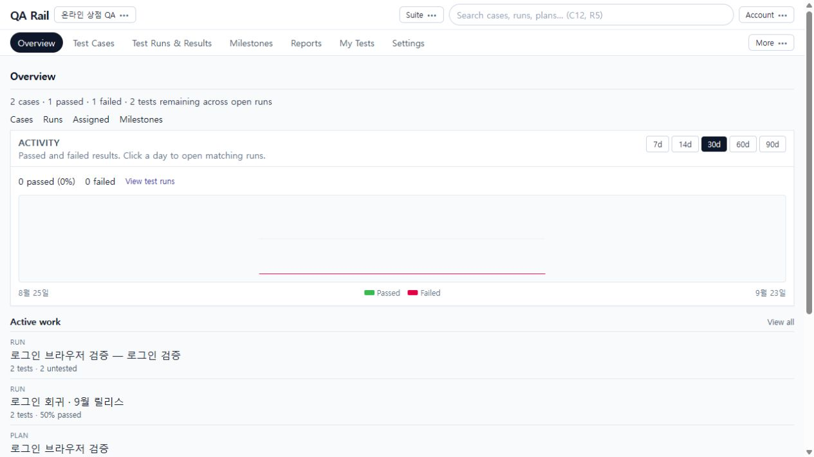

# 1. 시작하기와 화면 탐색

[목차](README.md) · 다음: [케이스 관리](02-case-organization.md)

## 목적

검증할 제품의 프로젝트를 열고, 케이스 준비 → 실행 → 현황 확인의 위치를 찾습니다. 예제는 **온라인 상점 QA**이며 정상 로그인과 잘못된 비밀번호 안내를 확인합니다.

## 시작 위치와 사전 조건

운영자가 알려준 서비스 주소에서 시작합니다. 로그인 화면에는 Email, Password, Sign in이 있습니다. 촬영 환경은 개발용 로그인·메모리 저장소입니다. 실제 서비스의 계정 발급이나 비밀번호 재설정 절차까지 구현된 것으로 해석하지 마세요.

## 절차

1. 로그인 후 Projects 목록에서 대상 프로젝트 이름을 선택합니다. 새 예제를 만들 권한이 있다면 `Add project` → Name에 `온라인 상점 QA` → Project type에 `Multiple test suites` → `Create`를 선택합니다. 이 예제는 자동 생성되는 `Suite 1`을 사용합니다.
2. Overview가 열리면 먼저 상단 프로젝트 이름을 확인합니다. 프로젝트 전환 메뉴, Suite 메뉴, Search project, Account가 상단에 있고 그 아래에 업무별 탐색 탭이 있습니다.

   

   이 화면은 예제 여정을 진행한 뒤의 모습입니다. 그래프는 결과 활동을, Active work는 진행 중 작업을 보여줍니다. 처음 만든 빈 프로젝트에서 0과 빈 목록은 정상입니다.

3. 테스트 정의를 준비할 때는 `Test Cases`, 실행할 때는 `Test Runs & Results`를 선택합니다. `My Tests`는 본인에게 배정된 테스트를 찾는 출발점입니다.
4. 일정 기준으로 묶어 볼 때는 `Milestones`, 현황 분석은 `Reports`, 구성과 권한은 `Settings`를 사용합니다. 나머지 업무는 `More` 메뉴에서 찾습니다. 전역 Search project와 Cases 내부 Search cases는 서로 다른 위치의 검색입니다.
5. 케이스를 만든 뒤 Run에 포함하고 결과를 기록합니다. **Case**는 재사용할 테스트 정의, **Run**은 특정 검증 회차, Run 안의 **Test**는 실제 수행 대상, **Result**는 한 번의 수행 기록입니다. 같은 케이스를 여러 Run에서 실행할 수 있습니다.

## 완료 상태

상단에 올바른 프로젝트 이름이 보이고 Test Cases로 이동할 수 있습니다. [2장](02-case-organization.md)부터 같은 프로젝트에서 계속합니다. 화면의 C1, R1 같은 번호는 환경마다 달라집니다.

## 실패 시 복구

- 로그인 오류는 주소와 계정 입력을 확인하고 다시 시도합니다. 개발용 기본값을 운영 계정으로 사용한다고 가정하지 마세요.
- 프로젝트가 보이지 않으면 Projects로 돌아가 대상과 접근 권한을 확인합니다. 읽기 권한만 있는 경우 생성·편집 버튼이 제한될 수 있습니다.
- 촬영 환경에서 서버 재시작 후 데이터가 사라지면 메모리 저장소의 특성입니다. 운영 데이터 보존은 운영자가 구성한 영속 저장소에 따릅니다.
