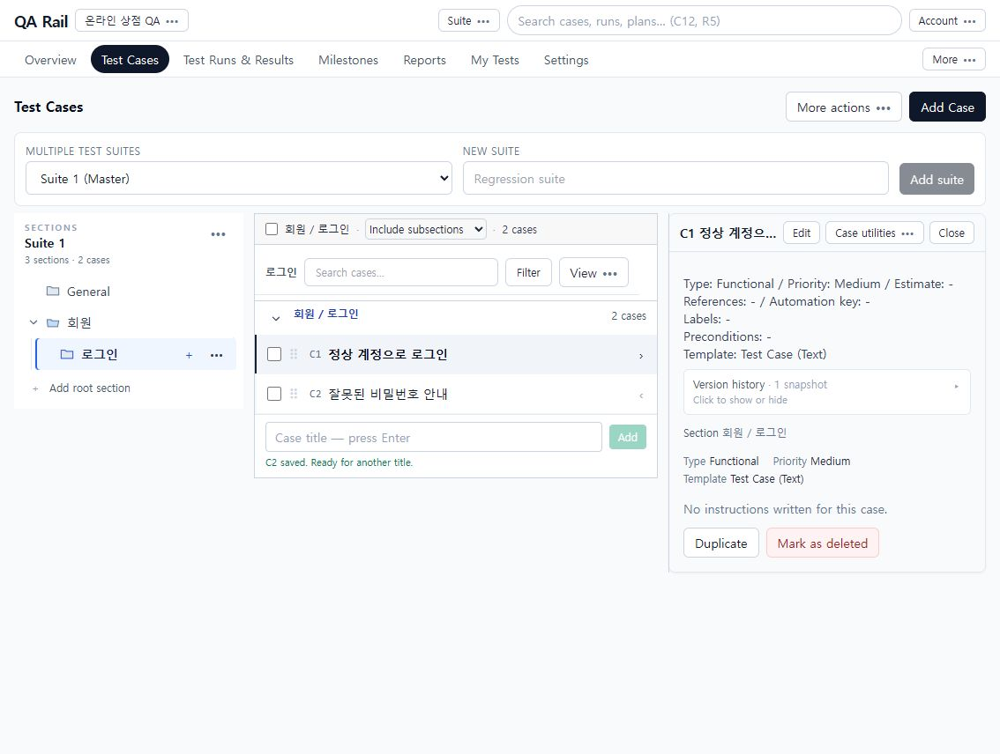

# 2. 케이스를 계층으로 정리하고 찾기

[목차](README.md) · 이전: [시작하기](01-getting-started.md) · 다음: [작성·편집](03-case-authoring.md)

## 목적

Suite 1 아래에 `회원 → 로그인` 섹션을 만들고 두 로그인 케이스를 배치합니다. 계층과 조회 범위를 구분하면 목록이 비거나 예상보다 많은 케이스가 보일 때 원인을 찾기 쉽습니다.

## 시작 위치와 사전 조건

온라인 상점 QA → `Test Cases`. 프로젝트는 Multiple test suites 방식이며 케이스 작성 권한이 필요합니다. Single repository 프로젝트에서는 Suite 선택 흐름이 다를 수 있습니다.

## 절차

1. 왼쪽 위 Suite 선택에서 `Suite 1 (Master)`를 선택합니다. 새 묶음이 필요하면 New suite에 이름을 입력하고 `Add suite`를 누릅니다. 이번 예제는 기존 Suite를 유지합니다.
2. 섹션 트리 아래 `Add root section`을 누르고 `회원`을 입력한 뒤 `Add`를 선택합니다. 회원 옆 `…` 메뉴 → `Add subsection to 회원`에서 `로그인`을 추가합니다. 트리 들여쓰기는 부모·자식 관계이고 펼침 화살표는 트리 표시를 바꿉니다.
3. `로그인`을 선택하고 상단 `Add Case`를 누릅니다. 목록의 제목 입력란에 `정상 계정으로 로그인` → `Add`, 이어서 `잘못된 비밀번호 안내` → `Add`로 두 개를 만듭니다. 현재 이 버튼은 **제목만 먼저 저장**합니다. 상세 작성은 다음 장에서 이어집니다.

   

   왼쪽은 저장 위치, 가운데는 조회된 케이스, 오른쪽은 선택 케이스의 미리보기입니다. 섹션의 케이스 수와 가운데 조회 건수는 범위·필터에 따라 다를 수 있습니다.

4. 부모 `회원`을 선택한 뒤 가운데 `Case query scope`를 바꿔 차이를 확인합니다.

   | 범위 | 보이는 대상 |
   | --- | --- |
   | Selected section only | 현재 섹션에 직접 속한 케이스 |
   | Include subsections | 현재 섹션과 그 아래 하위 섹션의 케이스 |
   | All sections | 현재 Suite의 모든 섹션 |

   예제의 회원은 직접 케이스가 없으므로 첫 범위에서는 비어도 정상입니다. Include subsections에서는 로그인 아래 두 케이스가 보입니다.

5. `Search cases`에 `로그인` 등 제목 일부를 입력합니다. 속성으로 좁힐 때는 `Filter`를 열고 조건을 설정합니다. 범위 설명과 결과 건수를 함께 읽습니다. 찾기를 마쳤으면 검색어와 필터를 해제합니다.
6. 행 제목이나 상세 열기 화살표로 오른쪽 내용을 읽고 `Edit`로 편집합니다. 체크박스는 여러 행을 처리할 대상을 고르는 용도입니다. 전체 선택 레이블이 가리키는 **현재 로드된 목록의 건수**를 확인하세요.

## 완료 상태

Suite 1의 회원/로그인 아래 두 케이스가 보이고, C1을 열면 정상 로그인 제목이 오른쪽에 표시됩니다. 섹션을 펼치는 것과 조회 범위를 바꾸는 것을 구분할 수 있습니다.

## 실패 시 복구

- 케이스가 안 보이면 프로젝트 → Suite → 섹션 → 범위 → 검색·필터 순서로 확인합니다. 바로 다시 생성하면 중복될 수 있습니다.
- 제목만 있는 케이스는 저장 실패가 아닙니다. `Edit`로 Preconditions와 테스트 절차를 채웁니다.
- 위치를 바꿀 때는 섹션 `…`의 `Move or copy…`에서 원본과 대상 계층을 확인합니다. Delete section을 정리용으로 먼저 누르지 마세요.
- 이 영역은 후속 페이지 개선 대상입니다. 스크린샷은 [기준 코드](README.md)의 화면입니다.
