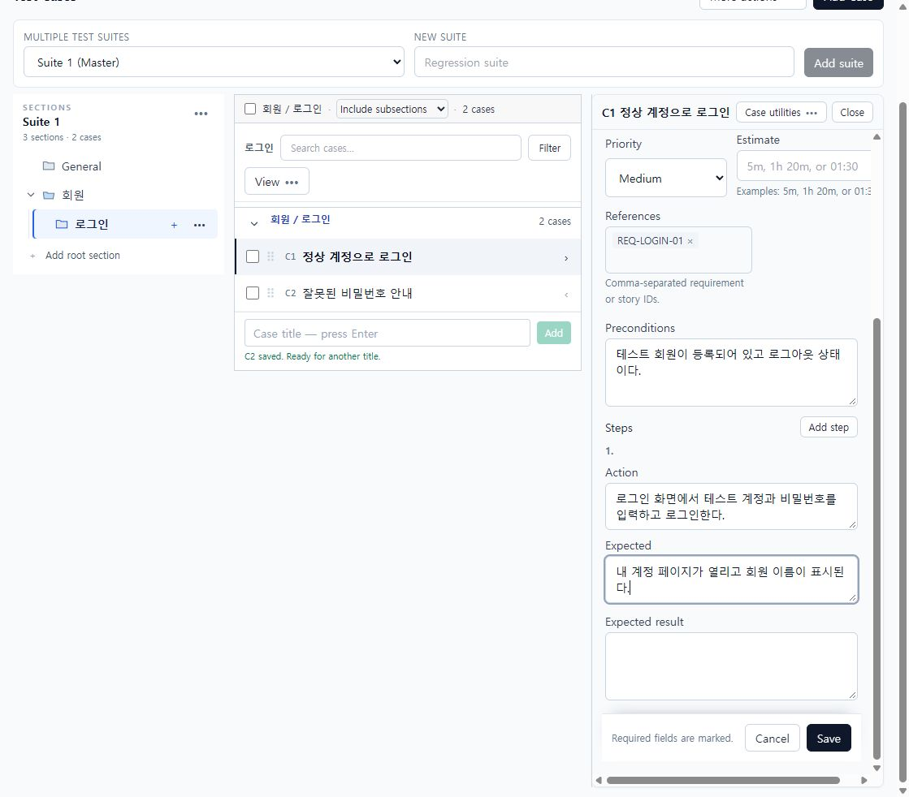
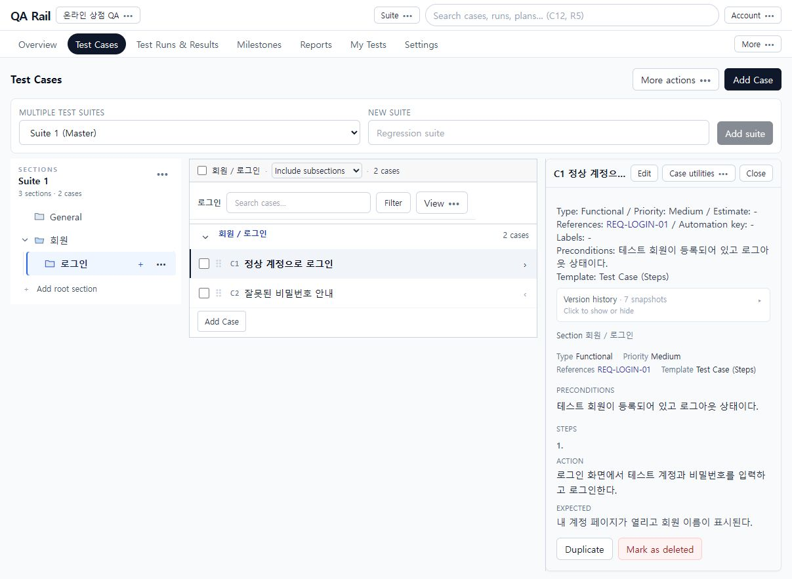

# 3. 케이스의 절차를 작성하고 저장하기

[목차](README.md) · 이전: [케이스 관리](02-case-organization.md) · 다음: [Run 준비](04-run-planning.md)

## 목적

다른 테스터도 같은 조건으로 수행할 수 있도록 정상 로그인 케이스에 사전 조건, 행동, 기대 결과를 기록합니다.

## 시작 위치와 사전 조건

Test Cases → 회원/로그인 → 정상 계정으로 로그인 → 오른쪽 `Edit`. 본문 변경 권한이 필요합니다. 이 예제는 이미 제목이 저장된 케이스의 편집 흐름입니다.

## 절차

1. 편집 패널 위 제목과 Section 경로를 확인합니다. 목록을 보면서 오른쪽에서 편집하므로 다른 케이스와 혼동하지 않도록 C번호도 확인합니다.
2. `Template`에서 `Test Case (Steps)`를 선택합니다. Preconditions에는 `테스트 회원이 등록되어 있고 로그아웃 상태이다.`, References에는 `REQ-LOGIN-01`을 입력합니다. References는 요구사항·스토리 식별자를 기록하는 값입니다.
3. Action에 `로그인 화면에서 테스트 계정과 비밀번호를 입력하고 로그인한다.`, Expected에 `내 계정 페이지가 열리고 회원 이름이 표시된다.`를 입력합니다. 단계가 더 필요하면 `Add step`, 순서 변경은 각 단계의 Up/Down, 제거는 Remove를 사용합니다.

   

   Template 아래는 케이스 속성, Preconditions 아래는 실행 절차입니다. 패널이 길면 내부를 스크롤해 하단 Save/Cancel까지 확인합니다. `Test Case (Text)`를 선택하면 단계별 행 대신 Steps와 Expected result 본문을 작성합니다.

4. 이미지 증거가 필요한 기존 케이스는 편집 상단 `Case images`의 파일 선택 → `Upload`를 사용합니다. 파일을 선택한 것만으로 첨부가 완료된 것은 아닙니다. 업로드 성공과 첨부 표시를 확인합니다. 촬영 환경에는 외부 파일 저장소를 연결하지 않았으므로 실제 업로드 성공 화면은 이 가이드에 포함하지 않습니다.
5. `Save`를 누른 뒤 저장 결과를 확인하고 편집을 종료해 다시 내용을 읽습니다. **현재 기준에서는 Steps 저장 직후 편집 화면이 이전 내용이나 빈 행을 표시하는 현상을 관찰했습니다.** 저장 실패로 단정해 같은 행을 다시 추가하지 말고, 미저장 변경이 없는지 확인한 후 새로고침하여 서버에 저장된 내용을 먼저 확인합니다.

   

6. 변경을 버리려면 `Cancel`을 사용합니다. 취소·닫기·다른 행 선택·브라우저 뒤로가기의 초안 보호는 개선 진행 영역이므로 모든 이탈 경로에서 확인창이 뜬다고 가정하지 마세요. 저장할 내용은 이탈 전에 Save로 확정하고, 버릴 내용인지 직접 판단합니다.

## 완료 상태

읽기 화면에 Preconditions, References, Steps의 Action/Expected가 보입니다. 제목만 확인하지 말고 실제 단계 수와 본문을 확인한 뒤 [Run 생성](04-run-planning.md)으로 진행합니다.

## 실패 시 복구

- Save 후 화면이 오래된 값을 보여도 즉시 재입력하지 않습니다. 다시 열어 저장 상태를 확인합니다. 촬영 중 재입력 후 저장을 반복하자 중복 단계가 생겨 Remove로 정리한 뒤 재확인했습니다.
- 오류가 표시되면 제목 등 필수값과 권한을 확인하고 입력을 보존한 채 수정합니다. 기본 케이스와 Steps·첨부가 모두 성공했다고 추정하지 말고 각각 확인합니다.
- 첨부만 실패했다면 본문까지 다시 만들지 말고 해당 케이스에서 첨부 상태를 확인합니다. 외부 저장소 연결 문제는 운영자에게 전달합니다.
- 잘못된 변경은 미리보기의 `Version history`를 펼쳐 스냅샷을 비교합니다. 복원 기능을 사용할 때는 대상 버전과 변경 내용을 먼저 확인하세요. 이 가이드는 삭제한 케이스의 무조건적인 복구를 보장하지 않습니다.
