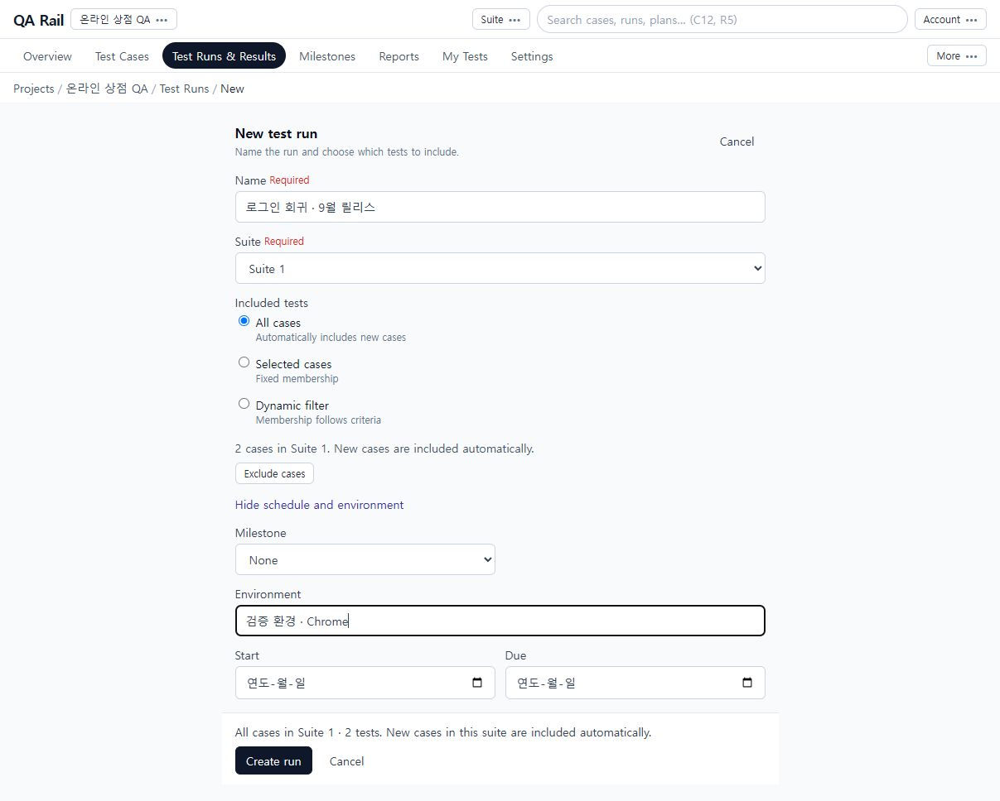
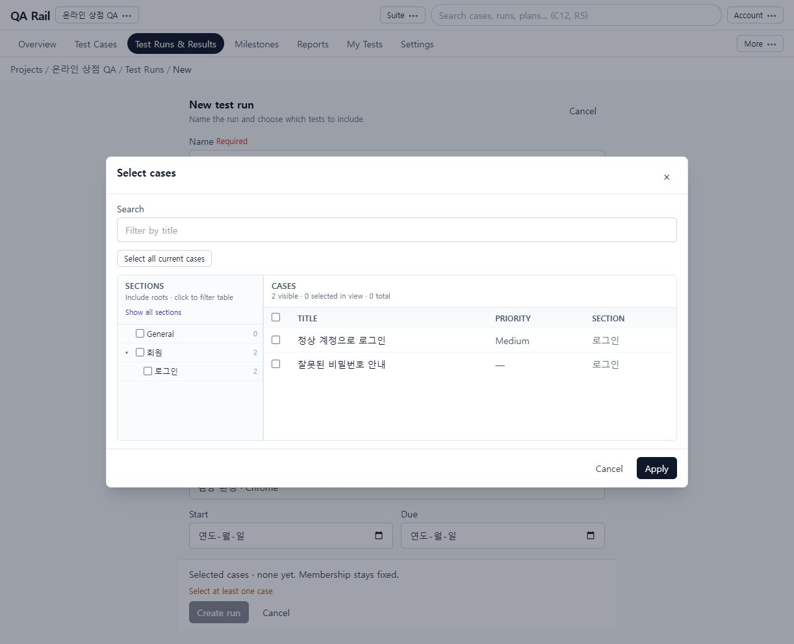
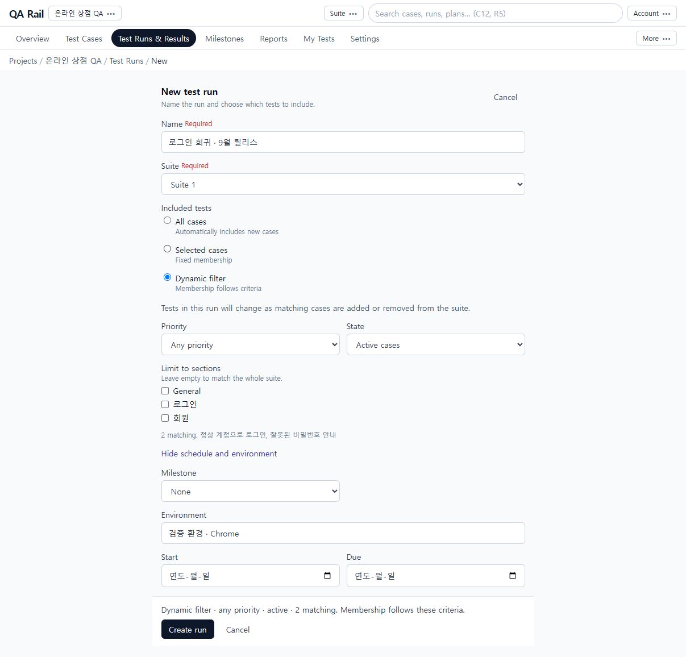

# 4. 실행할 테스트를 Run으로 준비하기

[목차](README.md) · 이전: [작성·편집](03-case-authoring.md) · 다음: [테스트 수행](05-execution.md)

## 목적

준비한 두 케이스를 `로그인 회귀 · 9월 릴리스`라는 실행 회차로 묶습니다. 이번 릴리스 대상을 고정하려면 Selected cases를 사용합니다.

## 시작 위치와 사전 조건

프로젝트 → `Test Runs & Results`. Suite 1에 두 케이스가 있고 Run 생성 권한이 필요합니다.

## 절차

1. `Add Run` → Choose test suite에서 Suite 1 → `Continue`를 선택합니다. New test run에서 이름과 Suite를 확인합니다.
2. Included tests에서 목적에 맞는 방식을 선택합니다.

   | 방식 | 사용할 때 | 이후 케이스 변경 |
   | --- | --- | --- |
   | All cases | Suite 전체를 계속 검증 | 새 케이스도 자동 포함; Exclude cases로 제외 대상 설정 |
   | Selected cases | 이번 회차의 대상을 고정 | 선택한 구성 유지 |
   | Dynamic filter | 우선순위·상태·섹션 조건을 계속 추적 | 조건에 맞는 구성으로 변함 |

   

   화면은 이름·Suite → 포함 대상 → 선택적 일정·환경 → 최종 요약 순서입니다. 위 그림은 전체 포함 방식의 예시이고, 공통 여정은 아래 고정 선택으로 생성합니다.

3. `Selected cases` → `Select cases`를 선택합니다. 왼쪽 섹션은 탐색과 하위 범위 포함, 오른쪽 표는 케이스 선택입니다. 예제의 두 행을 체크하거나 `Select all current cases`로 현재 케이스를 선택하고, 선택 수를 확인한 뒤 `Apply`를 누릅니다.

   

4. 조건 기반 구성이 필요할 때는 `Dynamic filter`에서 Priority, State, Limit to sections를 설정하고 matching 건수를 확인합니다. 섹션 제한을 비우면 전체 Suite가 대상입니다. 이는 검색 결과를 한 번 복사하는 고정 선택과 다릅니다.

   

5. 공통 예제는 Selected cases로 돌아와 **두 케이스를 다시 선택**합니다. 구성 방식 전환 후 선택이 초기화될 수 있습니다. 하단이 `Selected cases · 2 tests`인지 확인합니다.
6. `Schedule and environment`를 펼칩니다. Environment에 `검증 환경 · Chrome`을 입력하고, 필요하면 Milestone, Start, Due를 설정합니다. `Create run`을 선택합니다.
7. 생성 후 Run 상단의 `Run assignee`에서 담당자를 고르고 `Assign`합니다. 개별 Test 담당자는 행을 선택한 일괄 Assign 또는 상세의 `Assign to me`로 별도 지정합니다. 결과창의 Assign To도 해당 테스트 배정에 사용합니다. 촬영용 메모리 환경의 Run 담당자 목록은 Unassigned만 표시되어 실제 팀원 배정은 이 화면에서 검증하지 않았습니다.

## 완료 상태

Run 상세에 이름, OPEN, 환경, Membership: Selected cases와 두 테스트가 보입니다. 아직 수행 전이면 모두 Untested입니다. Run이 만들어졌다는 것과 결과를 기록했다는 것은 다릅니다.

## 실패 시 복구

- Create run이 비활성화되면 이름, Suite, 선택 케이스 수를 확인합니다. 모드를 바꾼 뒤 `none yet`이면 다시 선택해야 합니다.
- 대상을 잘못 골랐다면 생성 전 Edit cases에서 수정합니다. 생성 후에는 Run의 Composition을 확인합니다.
- 담당자가 목록에 없으면 프로젝트 멤버와 권한을 [설정](10-administration.md)에서 확인합니다. 사람 이름 대신 ID만 보이는 경우도 계정 표시 정보와 연결을 확인합니다.
- 일정은 계획 정보입니다. 날짜가 지났다고 Run이 자동 종료된 것으로 판단하지 말고 상세 상태를 확인합니다.
