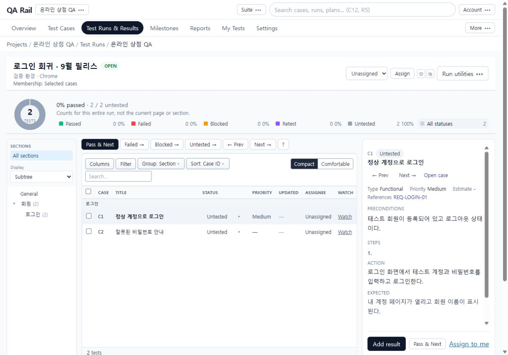
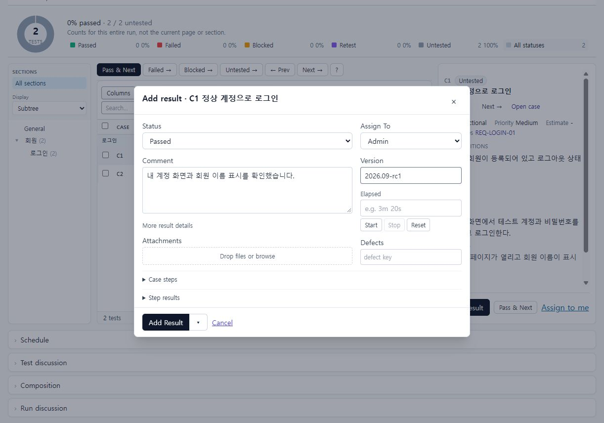
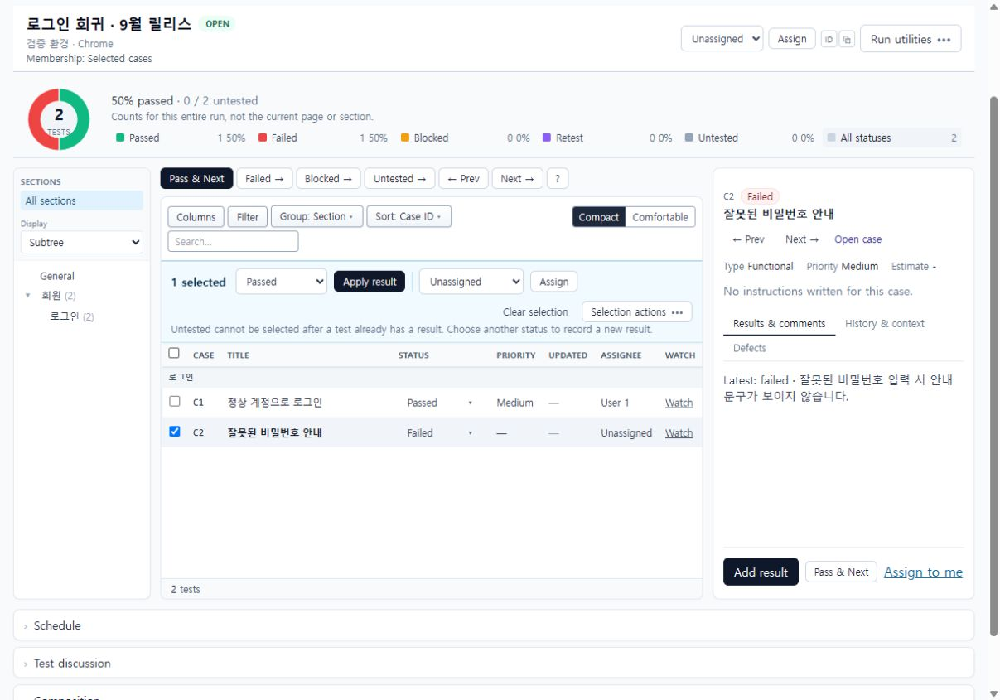
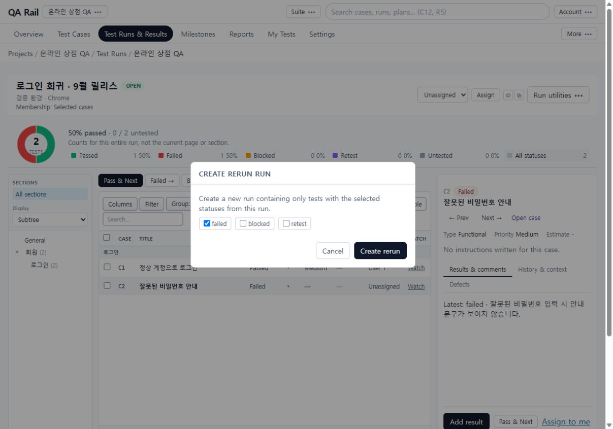
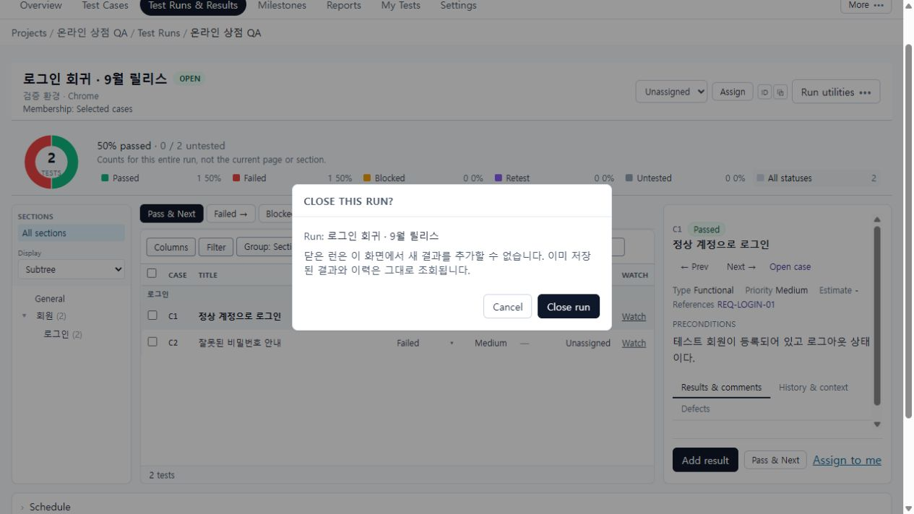

# 5. 테스트 실행, 결과 기록과 종료

[목차](README.md) · 이전: [Run 준비](04-run-planning.md) · 다음: [Plan·Milestone](06-plans-milestones.md)

## 목적

실제 제품을 검사한 뒤 각 Test에 결과를 남기고, 실패 대상을 재검증하거나 회차를 종료합니다. 가이드의 결과는 설명용 가상 결과이며 온라인 상점 제품 자체를 검증한 증거는 아닙니다.

## 시작 위치와 사전 조건

Test Runs & Results → 로그인 회귀 · 9월 릴리스. Run이 OPEN이고 결과 작성 권한이 있어야 합니다. 정상 로그인은 3장의 절차를 사용합니다. 두 번째 케이스는 수행 전에 잘못된 비밀번호 입력과 오류 안내 확인 절차를 같은 방식으로 작성해 두세요.

## 절차

1. Run 상단에서 이름·환경·구성을 확인합니다. 상단 상태 통계는 **Run 전체**, 왼쪽은 섹션, 가운데 표는 현재 검색·필터의 대상, 오른쪽은 선택한 테스트의 절차와 결과입니다.

   

2. 정상 로그인 행을 선택해 Preconditions와 Steps를 읽고 실제 검증 환경에서 수행합니다. `Add result`를 열면 제목에 C번호와 대상 이름이 보입니다. Status를 Passed, Comment에 확인한 사실을 입력합니다. 필요하면 Version, Elapsed, Assign To, Defects를 채웁니다. 실패·차단 결과에서는 Actual result도 확인합니다.

   

   첨부는 Attachments에서 추가하고 업로드 상태를 확인합니다. Case steps는 원래 절차를 읽는 영역, Step results는 단계별 판정을 기록하는 영역입니다. 단계 결과가 접혀 있으면 내부 펼침도 확인합니다.

3. `Add Result`는 저장, 옆 화살표의 `Save & Next`는 저장 후 다음 테스트로 이동합니다. 촬영에서는 C1 결과 저장 후 C2로 이동하고 Run이 50% passed가 되는 것을 확인했습니다. 간단한 통과 처리는 `Pass & Next`를 사용할 수 있으나 필요한 증거가 있으면 먼저 결과창에서 작성합니다.
4. C2의 실패 예시는 Status: Failed, Comment: `잘못된 비밀번호 입력 시 안내 문구가 보이지 않습니다.`, Defects: `BUG-LOGIN-02`로 기록합니다. 결함 키 입력이 외부 이슈 생성 자체를 뜻하지는 않습니다. 결과 저장 후 Latest와 상태 통계가 바뀌었는지 확인합니다.
5. 여러 테스트에 같은 판정을 기록하려면 행 체크박스로 대상들을 고릅니다. 선택 바의 `N selected` → Result status → `Apply result`를 사용합니다. 한 행을 읽기 위해 선택하는 것과 체크박스로 일괄 대상을 지정하는 것은 다릅니다. 표 머리글 체크박스는 `this page` 범위입니다.

   

   이미 결과가 있는 테스트에는 Untested로 되돌리는 선택이 제한됩니다. 새 판정은 새 결과로 기록합니다. 목록 필터와 Run 전체 통계의 분모가 다른 점도 확인하세요.

6. 수정된 제품을 다시 검증할 회차는 `Run utilities` → `Create rerun`에서 failed/blocked/retest 중 대상을 선택하고 생성합니다. 이는 실패한 네트워크 저장 요청을 Retry하는 것과 다른 기능입니다.

   

7. 회차의 기록을 끝내려면 `Run utilities` → `Close run`을 선택하고 대상 이름을 확인합니다. 종료하면 이 화면에서 새 결과를 기록할 수 없고 기존 결과·이력은 조회합니다. 실습을 계속하려면 Cancel을 선택합니다.

   

## 완료 상태

공통 예제는 두 결과가 저장되어 Passed 1, Failed 1, Untested 0입니다. Save & Next는 다음 테스트로 실제 이동했습니다. 재실행·종료 그림은 확인창을 촬영한 것이며 공통 예제 Run은 이후 협업·보고서 설명을 위해 OPEN으로 유지했습니다.

## 실패 시 복구

- 저장 중에는 대상 변경이나 중복 제출을 피하고 성공·실패 피드백을 기다립니다. 연결이 끊겼다면 결과 이력을 먼저 확인합니다.
- 결과는 저장됐지만 첨부가 실패한 경우에는 첨부의 Retry를 사용합니다. 결과 자체를 중복 생성하지 않도록 결과 저장 상태와 첨부 상태를 구분합니다. 첨부의 실제 외부 저장소 성공·실패는 이 촬영 환경에서 검증하지 않았습니다.
- 일괄 저장이 부분 성공이면 성공·실패 건수와 실패 대상을 확인하고 실패 대상 재시도를 사용합니다. 성공한 전체 목록에 같은 결과를 다시 적용하지 마세요. 이 복구 동작은 구현 코드에서 확인했으며 의도적인 통신 장애 촬영은 하지 않았습니다.
- 다음 대상이 예상과 다르면 현재 필터·정렬·섹션 범위를 확인합니다. Failed →, Blocked →, Untested →는 상태별 이동입니다.
- 종료 후 추가 검증은 새 Run 또는 재실행 회차로 분리합니다. 이 가이드는 닫힌 Run을 다시 여는 UI를 안내하지 않습니다.
