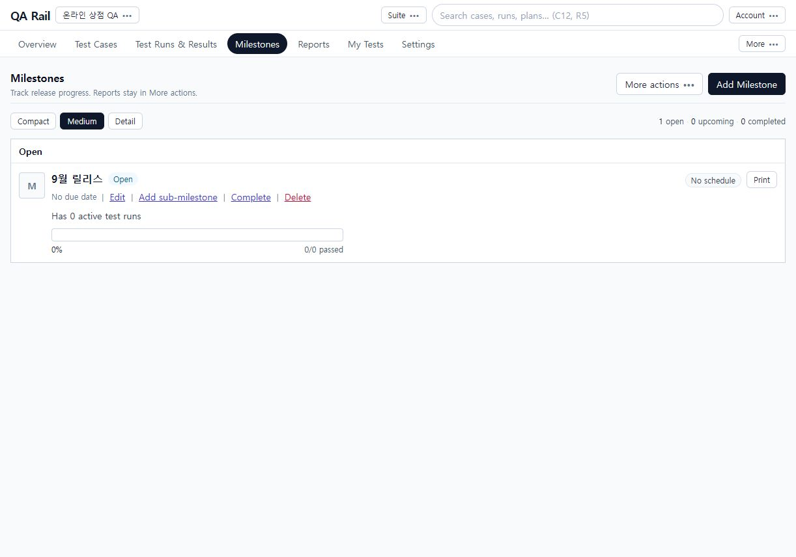
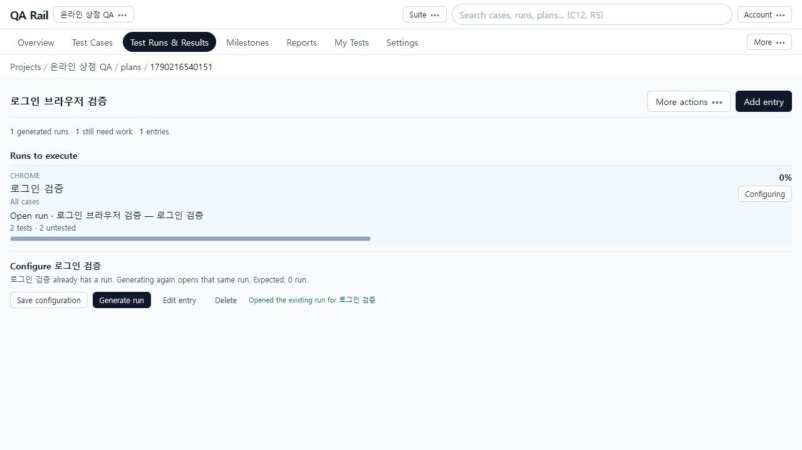

# 6. Plan과 Milestone으로 검증 묶음 관리하기

[목차](README.md) · 이전: [테스트 수행](05-execution.md) · 다음: [현황·보고서](07-reports.md)

## 목적

릴리스 일정은 Milestone으로, 실행할 작업 묶음은 Plan과 Entry로 관리합니다. 예제는 `9월 릴리스`와 `로그인 브라우저 검증`입니다. Plan에 항목을 만들었다고 테스트가 수행된 것은 아닙니다. 생성된 Run에서 결과를 기록해야 합니다.

## 시작 위치와 사전 조건

같은 온라인 상점 QA 프로젝트에서 진행합니다. 일정 관리 권한과 Run 생성 권한이 필요합니다. Configuration은 브라우저·운영체제 등 미리 등록한 실행 조건입니다. 현재 UI에는 Entry에 기존 Configuration을 선택하는 기능이 있으며 **구성 그룹 자체의 생성·편집 화면은 없습니다**. 그룹 준비가 필요하면 운영자가 API로 등록해야 합니다.

## 절차

1. `Milestones` → `Add Milestone`에서 이름을 `9월 릴리스`로 입력합니다. 필요하면 Start date, Due date를 지정하고 `Add milestone`을 누릅니다. 하위 일정은 Parent milestone을 선택하거나 기존 행의 `Add sub-milestone`에서 추가합니다.

   

   목록은 Open/Upcoming/Completed 상태별로 읽습니다. 마일스톤 이름은 상세로, active test runs 링크는 연결된 Run 목록으로 이어집니다. 예제 화면은 일정과 Run을 연결하기 전이라 0입니다.

2. 새 Run을 만들 때 [4장](04-run-planning.md)의 Schedule and environment에서 해당 Milestone을 선택합니다. 이름에 릴리스명을 적는 것만으로는 연결되지 않습니다. Milestone의 Complete와 Run의 Close는 별도 동작이므로 각각 상태를 확인합니다.
3. `Test Runs & Results` → `Add Plan`에서 `로그인 브라우저 검증`을 만듭니다. Plan 이름을 열고 `Add entry` → Name: `로그인 검증`, Environment: `Chrome` → `Add entry`를 선택합니다.
4. Entry의 `Configure`를 누릅니다. 아래 구성 영역의 대상 Entry 이름과 예상 생성 Run 수를 확인합니다. 등록된 Configuration 그룹이 있으면 그룹별로 하나의 값을 선택하고 `Save configuration`을 누릅니다. 그룹이 없는 촬영 환경에서는 `no configuration`인 1개 Run으로 안내됩니다. 여러 조합을 자동으로 모두 생성한다고 가정하지 마세요.
5. `Edit entry`에서는 담당자, References, 시작·마감일, 생성 포함 여부, 전체 케이스 포함 여부를 조정합니다. 전체 포함을 해제하면 Include case IDs를 입력하고 Exclude case IDs로 제외할 수 있습니다. 이 화면은 케이스 선택 트리 대신 ID 입력을 사용하므로 실제 프로젝트의 케이스 번호를 확인합니다. Plan 공통값은 상단 `More actions` → `Plan defaults`에서 지정합니다.
6. `Generate run`을 선택합니다. 생성 후 Entry 안에 `Open run` 링크와 테스트 수·진행률이 표시됩니다. 그 링크를 열어 [5장](05-execution.md)처럼 수행합니다.

   

   위쪽 Runs to execute는 실행할 항목이고 아래 Configure는 선택 Entry의 생성 설정입니다. 촬영에서는 2개 테스트가 포함된 Run이 생성됐습니다. 이미 Run이 있는 Entry는 다시 생성 시 기존 Run을 여는 안내가 표시됩니다.

## 완료 상태

Plan에 Entry가 있고 해당 Entry에서 실제 Run을 열 수 있습니다. 상단 generated runs와 still need work가 실행 상태를 보여줍니다. Milestone을 사용한다면 연결된 Run과 해당 일정의 상세를 별도로 확인합니다.

## 실패 시 복구

- Configuration이 안 보이면 등록된 그룹·값이 있는지 운영자에게 확인합니다. Environment에 `Chrome`을 적는 것은 Configuration 등록과 다릅니다.
- 예상 Run 수가 0이면 이미 생성된 Run 링크와 화면 안내를 확인합니다. 중복 Plan을 만들기 전에 현재 Entry를 확인하세요.
- 생성되지 않는 Entry는 Edit entry의 `Include entry in run generation`, 포함·제외 케이스 ID를 확인합니다.
- Milestone 진행이 0이면 해당 Run의 연결 여부를 확인합니다. 기간이 비었거나 하위 일정으로 연결했는지도 확인합니다.
