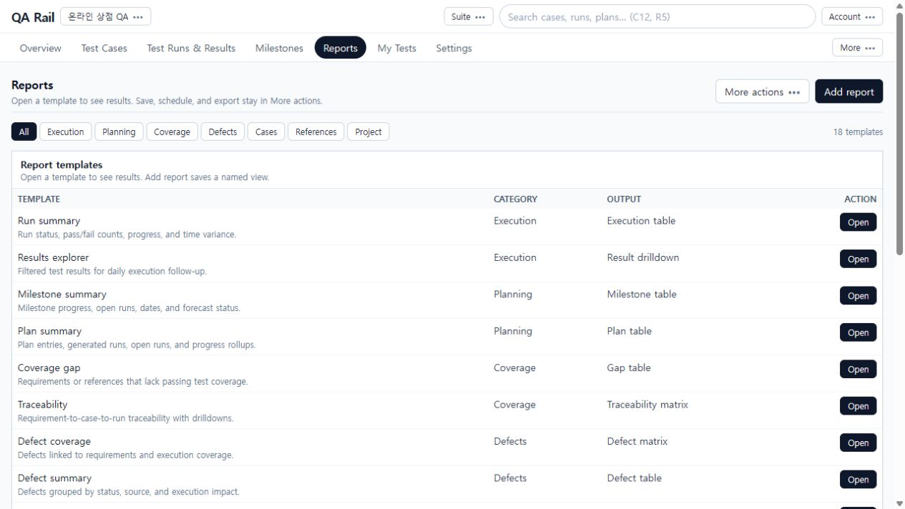
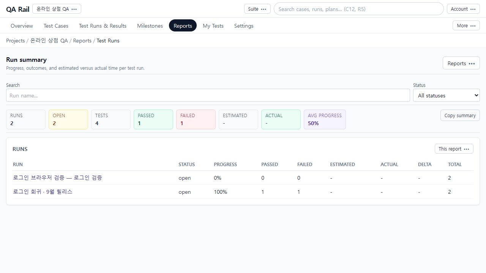

# 7. 진행 현황에서 확인이 필요한 테스트 찾기

[목차](README.md) · 이전: [Plan·Milestone](06-plans-milestones.md) · 다음: [협업·추적](08-collaboration.md)

## 목적

현재 릴리스가 얼마나 수행됐고 어디에 실패가 남아 있는지 확인한 뒤, 원본 Run과 결과로 이동해 판단합니다. 숫자만 보고 검증 완료와 통과를 혼동하지 않는 것이 중요합니다.

## 시작 위치와 사전 조건

온라인 상점 QA의 `Overview` 또는 `Reports`. [5장](05-execution.md)의 회귀 Run에는 Passed 1·Failed 1, [6장](06-plans-milestones.md)에서 생성한 Run에는 Untested 2가 있습니다. 따라서 프로젝트 전체와 단일 Run의 합계가 다릅니다.

## 절차

1. `Overview`에서 케이스 수와 전체 현황을 읽고 Active work에서 진행 중 Run/Plan을 엽니다. 아래 Needs attention에 항목이 있으면 해당 실패 대상으로 이동합니다. Activity 그래프의 기간 버튼은 활동을 보는 기간을 바꿉니다.

   

   촬영 환경은 메모리 모드라 활동 집계가 제한됩니다. 그림에서 상단 결과 수가 있는데 활동 그래프가 0인 것을 실제 결과가 없다는 뜻으로 해석하지 마세요. 구체적인 결과는 Run에서 확인합니다.

2. `Reports`를 엽니다. 상단은 Execution/Planning/Coverage 등 목적별 분류, 본문은 템플릿과 출력 형태입니다. 예제는 `Run summary` 행의 `Open`을 선택합니다. 템플릿 조회에는 저장된 보고서를 먼저 만들 필요가 없습니다.

   

3. Run summary 상단 Search와 Status로 대상을 좁힙니다. 요약 수치가 현재 필터에 맞는지 보고 아래 행에서 각 Run의 Progress, Passed, Failed, Total을 읽습니다.

   

   예제 회귀 Run은 **Progress 100%이지만 Passed 1·Failed 1**입니다. 수행을 마친 비율과 통과율은 다릅니다. 위쪽 AVG PROGRESS는 표시된 Run들의 평균 진행률이므로 단일 Run의 통과율과 같지 않습니다.

4. 회귀 Run 이름을 눌러 원본 실행 화면으로 이동합니다. 실패 행을 선택해 Comment, Defects, 결과 이력을 확인합니다. 여러 결과를 조건별로 조사하려면 Reports의 `Results explorer`, 두 회차를 비교하려면 `Results comparison (cases)`를 사용합니다.
5. 일정별 판단은 Milestone summary/Plan summary, 요구사항·참조 누락은 Coverage gap/References coverage, 결함 영향은 Defect summary로 이동합니다. 선택 기준에 맞는 원본 기록이 있어야 의미 있는 집계가 됩니다.
6. 반복 조회할 이름 있는 보고서는 Reports의 `Add report`에서 저장합니다. 인쇄·내보내기와 운영 기능은 해당 보고서의 `This report`, `Reports` 또는 카탈로그의 `More actions`를 확인합니다. 지원 형식과 저장 대상은 화면에서 확인하고, 조회 화면을 열었다고 저장·예약까지 완료된 것으로 보지 마세요.

## 완료 상태

실패가 남은 Run을 특정하고 원본 결과까지 열 수 있습니다. 수행률, 통과 수, 조회 범위와 기준 기간을 함께 설명할 수 있어야 합니다.

## 실패 시 복구

- 보고서가 비면 프로젝트, 검색어, 상태, 기간과 원본 데이터 존재 여부를 확인합니다.
- 숫자가 다르면 현재 Run 한 개인지 전체 프로젝트인지, 필터 적용 여부와 새로 생성한 Run이 포함됐는지 확인합니다.
- 활동·요구사항 관련 보고서가 메모리 모드에서 비어도 원본 결과 삭제를 뜻하지 않습니다. 영속 저장소 환경에서 필요한 이력·연결 데이터가 수집되는지 확인합니다.
- 화면에 오류가 나오면 Retry로 조회를 재시도합니다. 저장·예약·파일 생성 성공 여부는 각각의 응답과 기록을 확인합니다. 이 가이드에서는 예약 전달 및 외부 이메일 발송을 검증하지 않았습니다.
