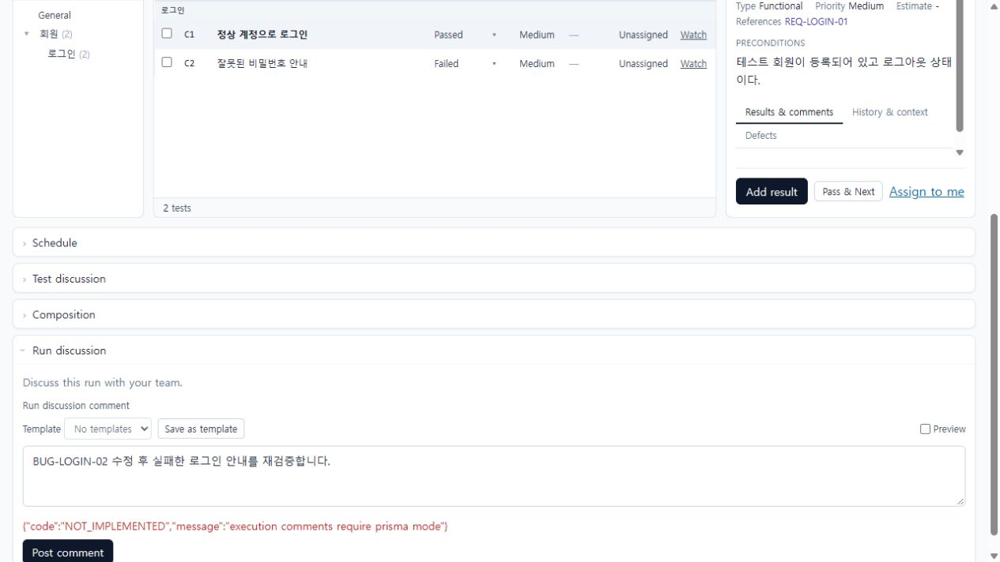
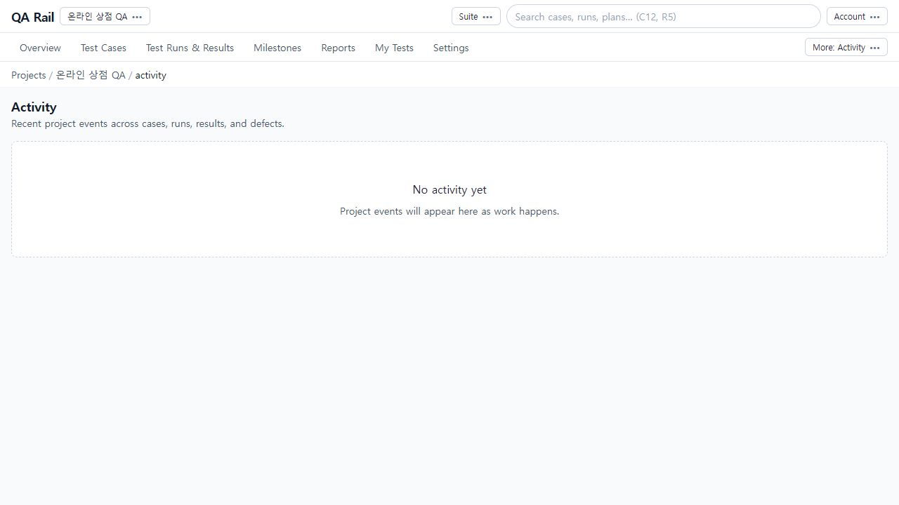
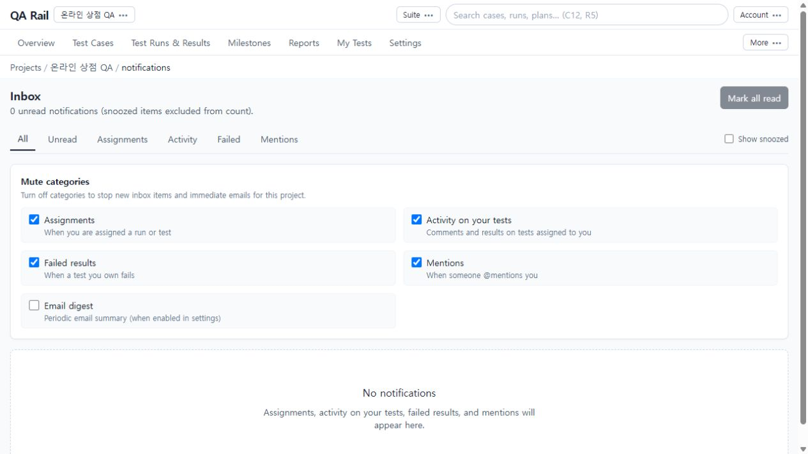

# 8. 결과의 근거를 공유하고 추적하기

[목차](README.md) · 이전: [현황·보고서](07-reports.md) · 다음: [데이터 입출력](09-data-exchange.md)

## 목적

실패한 이유, 관련 결함과 요구사항, 후속 검증 계획을 같은 테스트 문맥에 남깁니다. 결과 판정과 토론 댓글은 서로 다른 기록입니다.

## 시작 위치와 사전 조건

로그인 회귀 Run에서 대상 테스트를 선택합니다. **독립적인 Run/Test 댓글 저장에는 Prisma 모드가 필요합니다.** 현재 촬영 환경에서는 입력 UI까지 제공되지만 Post comment는 실패합니다. 결과창 Comment는 [5장](05-execution.md)에서 실제 저장한 결과 설명입니다.

## 절차

1. 실패한 테스트를 선택하고 오른쪽 `Results & comments`, `History & context`, `Defects`를 확인합니다. 결과에 속하는 관찰 내용은 Add result의 Comment에, 테스트 전체의 논의는 아래 `Test discussion`에 작성합니다. 회차 전체의 후속 계획은 `Run discussion`에 작성합니다.
2. Run discussion을 펼치고 `BUG-LOGIN-02 수정 후 실패한 로그인 안내를 재검증합니다.`처럼 행동이 분명한 내용을 입력합니다. Preview로 내용을 확인하고 `Post comment`를 선택합니다. 지원 환경에서는 목록에 저장된 댓글이 나타나는지 확인합니다.

   

   위 화면은 **성공 예시가 아닙니다**. `execution comments require prisma mode`가 표시되어 댓글은 저장되지 않았습니다. 입력을 보존하고 운영자에게 저장소 구성을 확인해야 합니다.

3. 결함과 연결할 때는 결과창의 Defects에 `BUG-LOGIN-02` 같은 식별자를 기록합니다. 상세의 Defects와 [결함 연동 설정](10-administration.md)을 함께 확인합니다. 기존 결함 링크와 외부 서비스에 새 이슈를 만드는 기능은 별개입니다. 연동의 모의 동작을 실제 외부 이슈 생성으로 판단하지 마세요.
4. 요구사항 추적은 케이스 편집의 References에 `REQ-LOGIN-01`을 기록하는 것부터 시작합니다. 참조 링크는 관련 케이스 검색으로 이어집니다. Reports의 References coverage/Traceability에서 추적할 수 있습니다. **별도 Requirement 엔터티의 생성·편집 UI는 현재 경로에 없으며 API는 Prisma 모드가 필요합니다.** References 입력만으로 Requirement가 생성되거나 연결됐다고 설명하지 않습니다.
5. 프로젝트의 변경 흐름은 `More` → `Activity`에서 확인합니다. 항목이 제공되는 환경에서는 사건에서 원본 대상으로 이동합니다. 촬영 환경에서는 최근 활동이 비어 있습니다.

   

6. 개인 알림은 상단 `Account` → `Inbox`에서 봅니다. All/Unread/Assignments/Activity/Failed/Mentions로 좁히고, 숨겨진 항목을 찾을 때는 Show snoozed를 확인합니다. 확인한 알림은 읽음 처리합니다. Mute categories는 새 알림 수신 범주를 조절하며 과거 실행 결과를 수정하는 기능이 아닙니다.

   

## 완료 상태

한 테스트에서 결과 설명, 결함 키, 요구사항 참조와 논의의 위치를 구분할 수 있습니다. 지원 환경에서는 저장한 댓글과 알림의 원본 링크를 확인합니다. 현재 촬영은 결과 설명·참조 입력은 확인했고, 댓글 저장과 알림 발생·전달 성공은 확인하지 않았습니다.

## 실패 시 복구

- Prisma 필요 오류는 같은 입력을 반복 제출해도 해결되지 않습니다. 운영자에게 환경을 확인하고 작성한 내용을 보존합니다.
- 결함 링크가 열리지 않으면 식별자와 `{key}` URL 템플릿을 확인합니다. 연결 성공 메시지와 실제 외부 이슈 존재 여부도 구분합니다.
- 알림이 없으면 필터, snooze, mute 범주와 본인 배정 여부를 확인합니다. 이메일은 서버 발송 설정도 필요합니다.
- Activity 빈 화면만으로 “아무도 변경하지 않았다”고 단정하지 않습니다. 저장소·수집 범위와 원본 Run/케이스 이력을 함께 확인합니다.
