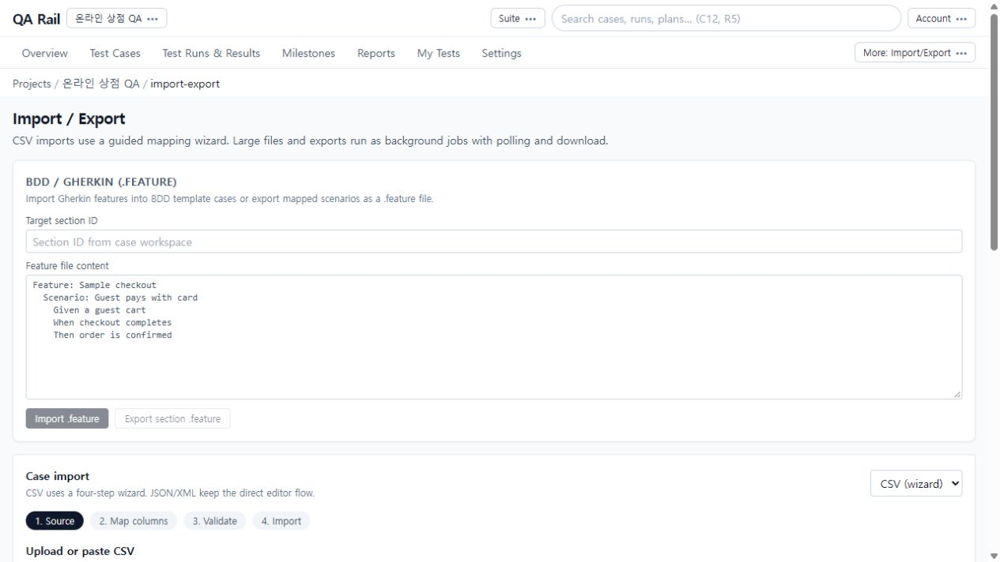
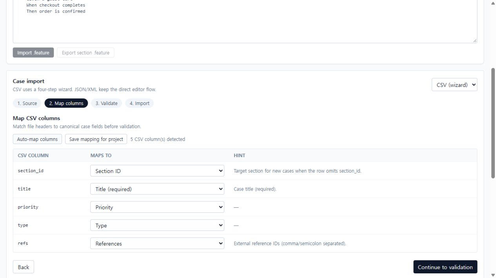
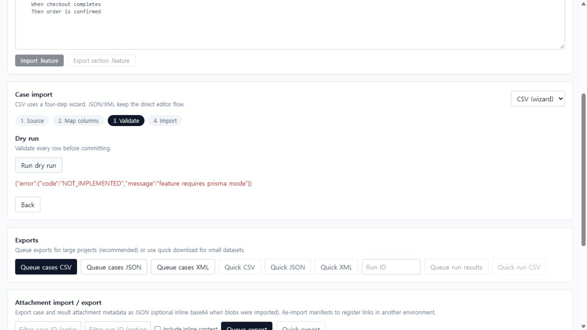
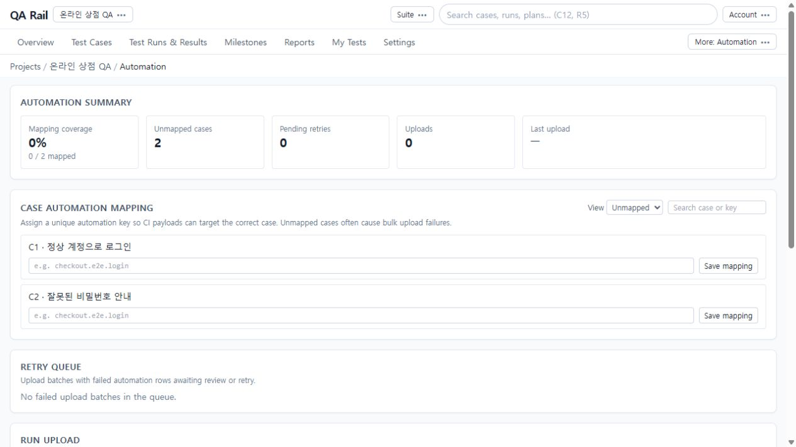

# 9. 케이스를 가져오고 자동화 결과 연결하기

[목차](README.md) · 이전: [협업·추적](08-collaboration.md) · 다음: [관리와 설정](10-administration.md)

## 목적

기존 케이스를 올바른 섹션으로 옮기거나 CI 결과를 기존 테스트와 연결합니다. 파일 제출과 실제 반영 완료를 구분하고, 오류가 난 행만 복구합니다.

## 시작 위치와 사전 조건

프로젝트의 `More` → `Import/Export` 또는 `Automation`. 실제 가져오기에는 대상 Section ID와 쓰기 권한이 필요합니다. CSV 검증·가져오기는 **Prisma 모드가 필요**하며 촬영 환경에서는 검증 요청이 거절됩니다. 자동화 업로드에는 대상 Run과 해당 범위의 유효한 토큰이 필요합니다.

## 절차: CSV 케이스 가져오기와 내보내기

1. Import / Export의 `Case import`에서 `CSV (wizard)`를 선택합니다. 페이지 위 BDD / Gherkin은 별도 흐름이며 CSV는 그 아래에 있습니다. `Download template`로 형식을 확인하고 파일을 선택하거나 CSV를 붙여 넣습니다. 행에 section_id가 없을 때 쓸 Default section ID도 확인합니다.

   

2. 예제 추가 케이스는 다음과 같습니다. `3`은 촬영 환경의 로그인 Section ID이므로 실제 환경의 값으로 바꿉니다.

   ```csv
   section_id,title,priority,type,refs
   3,잠긴 계정의 로그인 차단,High,Functional,REQ-LOGIN-03
   ```

3. `Continue to mapping` → `Auto-map columns`를 선택하고 각 원본 헤더가 Section ID, Title, Priority, Type, References로 연결됐는지 확인합니다. 불필요한 열은 Ignore column을 선택합니다. `Save mapping for project`는 이 브라우저에서 재사용할 프로젝트별 매핑을 저장합니다.

   

4. `Continue to validation` → `Run dry run`으로 실제 반영 전에 검증합니다. 오류가 있으면 행과 매핑을 고친 뒤 다시 검증합니다. 입력이나 매핑을 바꿨다면 이전 검증 결과를 재사용하지 말고 Dry run을 다시 실행합니다.

   

   촬영에서는 `feature requires prisma mode`로 중단했습니다. 이후 절차는 구현된 UI 흐름 설명이며 성공 캡처가 아닙니다. 지원 환경에서 유효 행이 있고 오류가 0이면 `4. Import`의 `Import cases`를 사용하고 반영 결과를 확인합니다.

5. 큰 파일은 화면 안내에 따라 배경 작업으로 처리됩니다. 아래 Import jobs에서 queued/processing/completed와 오류 상태를 확인합니다. 작은 파일의 직접 처리와 배경 작업 접수 성공을 같은 것으로 보지 마세요.
6. 내보내기는 아래 Exports에서 형식에 맞는 `Queue cases CSV/JSON/XML`을 선택하고 Export jobs의 완료 상태에서 `Download`합니다. 작은 데이터는 `Quick CSV/JSON/XML`을 사용할 수 있습니다. Run 결과는 Run ID를 입력하고 Queue run results 또는 Quick run CSV를 사용합니다.
7. 첨부 이전은 별도 Attachment import / export 영역의 manifest를 사용합니다. 필요하면 Include inline content를 선택하고, 재가져오기는 `Dry run import`를 먼저 실행합니다. 첨부 메타데이터만 옮긴 것이 실제 파일 바이트까지 복사한 것인지 확인해야 합니다. JSON/XML 직접 입력과 `.feature` 흐름은 CSV 마법사와 별개이므로 동일한 매핑 절차를 적용하지 않습니다.

## 절차: 자동화 결과 업로드와 복구

1. `More` → `Automation`을 엽니다. 위쪽 Summary는 매핑·재시도 상태, Case automation mapping은 케이스 연결, Run upload는 결과 제출, Recent uploads는 제출 이력입니다.

   

2. Unmapped에서 정상 로그인 케이스를 찾아 고유한 키(예: `shop.login.valid`)를 입력하고 `Save mapping`합니다. CI가 보내는 automation key와 이 값이 같아야 합니다. 서로 다른 케이스에 같은 키를 임의로 재사용하지 않습니다.
3. Run upload에서 대상 Run을 선택하고 승인된 Automation token을 입력합니다. Payload JSON은 현재 프로젝트의 case_id 또는 지원되는 자동화 식별자로 바꿉니다. 화면의 기본 예제 `case_id: 1`을 다른 환경에 그대로 보내지 마세요. Mixed/With steps는 예제 입력을 바꾸는 버튼이므로 실제 입력을 덮어쓰지 않도록 주의합니다.
4. `Atomic upload`는 업로드를 전체 단위로 처리할지 선택하는 옵션입니다. Payload의 대상과 상태를 검토하고 `Upload results`를 선택합니다. Recent uploads에서 total/saved/failed와 메타데이터를 확인하고 상세를 엽니다. 이 가이드에서는 토큰을 발급하거나 실제 CI 결과 업로드를 실행하지 않았습니다.
5. 실패 배치는 Retry queue 또는 업로드 상세의 Failed items에서 오류 코드와 안내를 확인합니다. 케이스 매핑을 고친 후 `Retry failed items`를 사용합니다. 현재 구현은 실패 행을 해당 테스트의 **Retest 대기 상태**로 요청하는 흐름이며, 버튼을 누르는 것만으로 외부 CI가 실행되거나 테스트가 Passed가 되지 않습니다. 안내에 따라 CI를 다시 수행하고 새 업로드 결과를 확인합니다.

## 완료 상태

가져오기는 대상 섹션에서 생성된 케이스와 행 수를 확인해야 완료입니다. 내보내기는 내려받은 파일의 형식과 범위를 확인합니다. 자동화는 업로드 접수뿐 아니라 저장 수·실패 수와 Run 결과까지 확인합니다. 촬영 환경의 CSV는 검증 단계에서 차단됐으므로 예제 추가 케이스는 생성되지 않았습니다.

## 실패 시 복구

- NOT_IMPLEMENTED/Prisma 오류는 운영자의 저장소 구성 확인이 필요합니다. 파일을 계속 수정해서 해결할 오류가 아닙니다.
- 매핑·행 값 오류는 Source/Map columns로 돌아가 수정하고 Dry run부터 다시 수행합니다.
- 배경 작업 중에는 동일 파일을 다시 제출하기 전에 작업 ID와 상태를 확인합니다. 완료 여부를 모르면 케이스 목록부터 확인해 중복 생성을 피합니다.
- 자동화 401/403은 토큰의 만료·취소·프로젝트·scope를 확인합니다. 값은 가이드나 오류 보고에 붙여 넣지 않습니다.
- 부분 실패는 실패 항목의 오류를 수정합니다. 전체 업로드를 반복하기 전에 saved 결과가 이미 반영됐는지 확인합니다.
