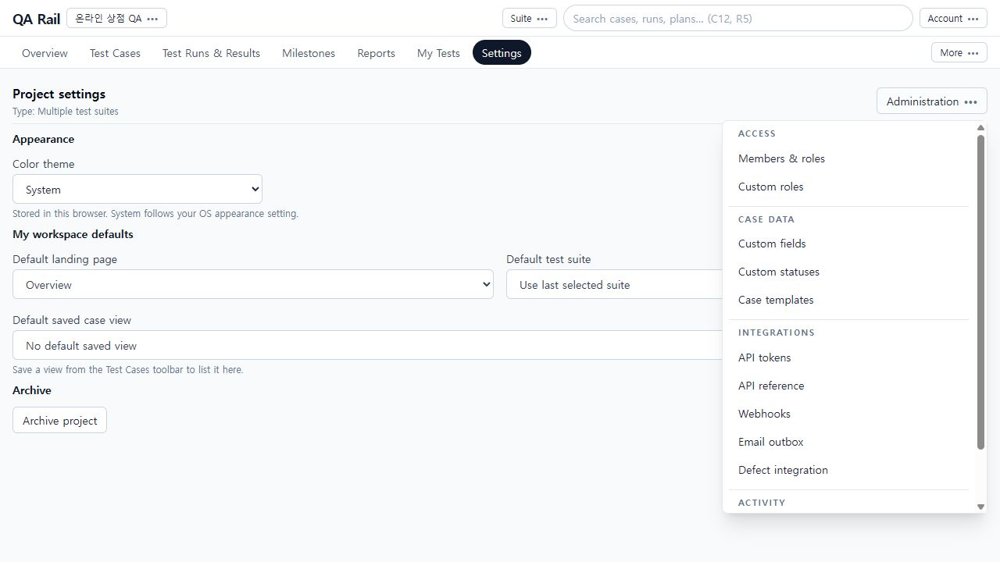
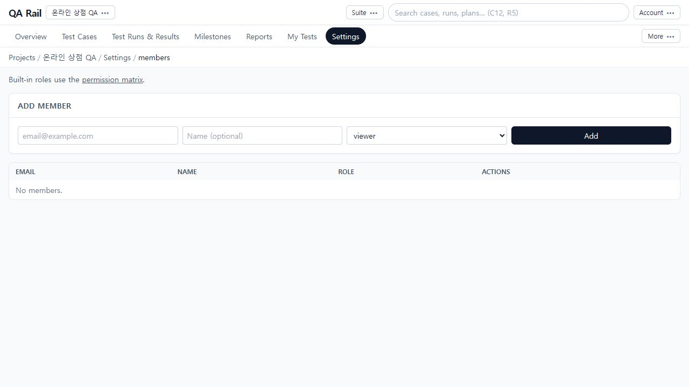
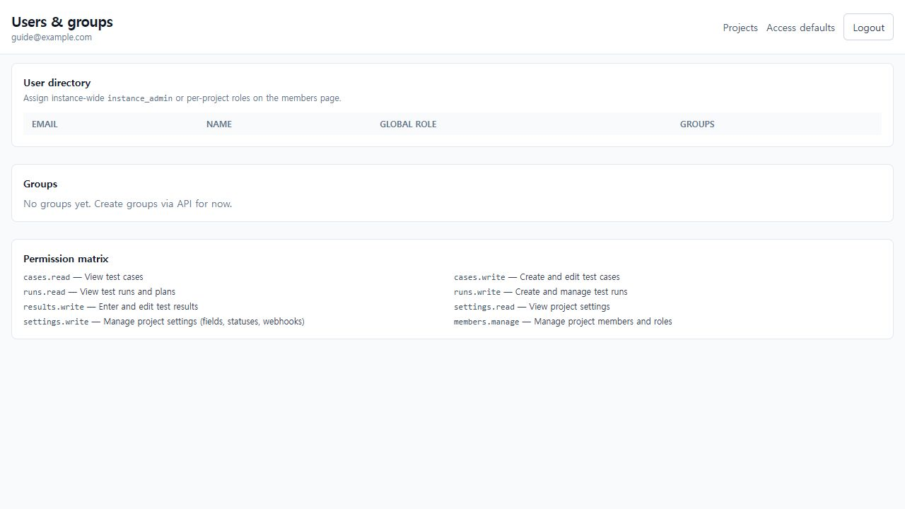
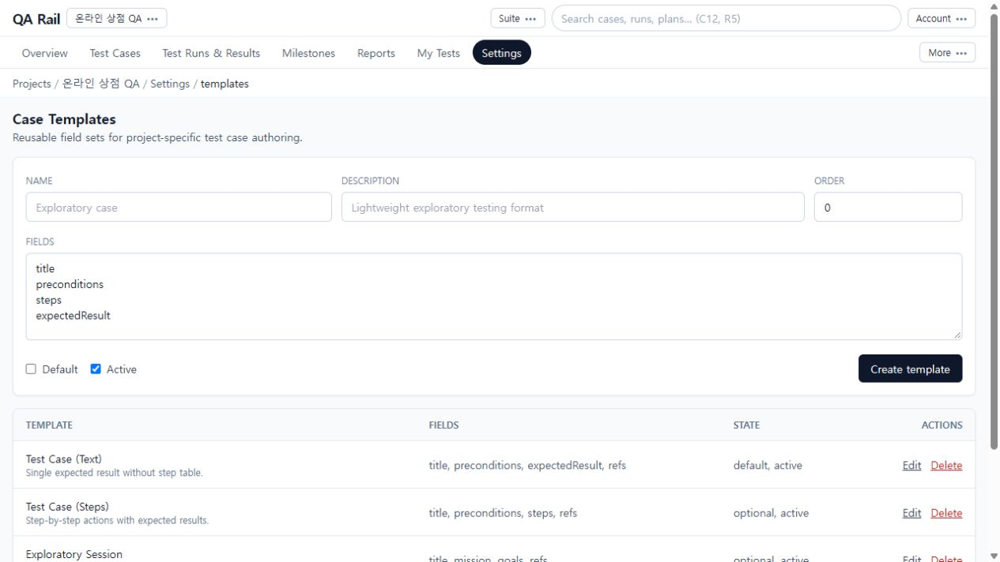
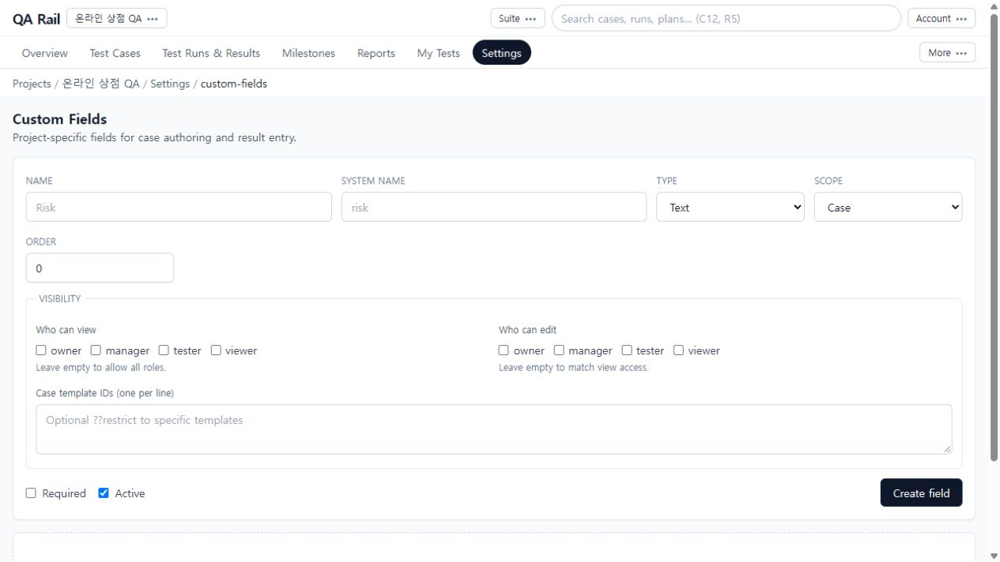
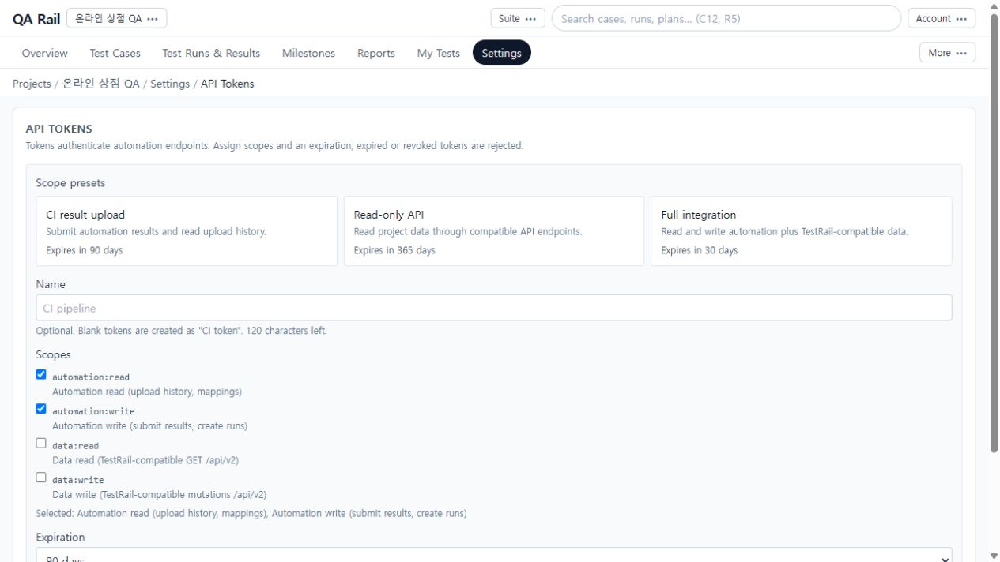
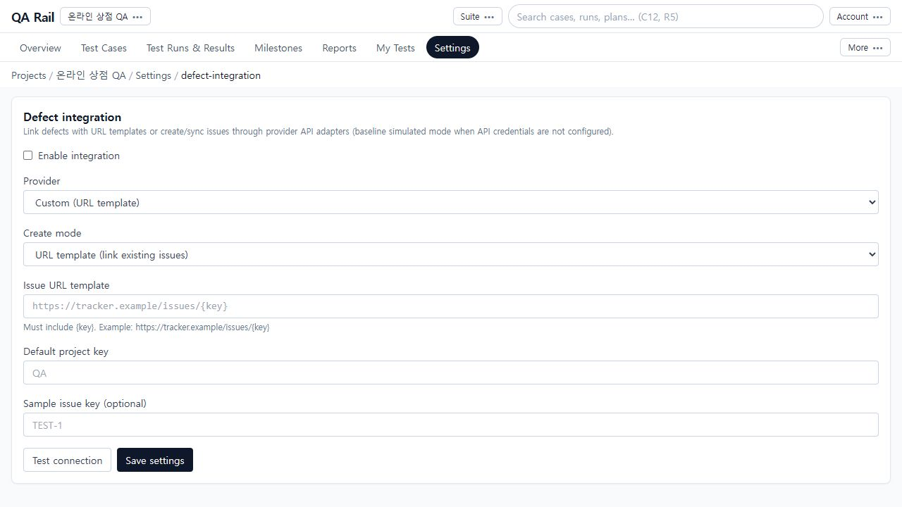

# 10. 팀이 사용할 프로젝트 환경 준비하기

[목차](README.md) · 이전: [데이터 입출력](09-data-exchange.md)

## 목적

팀원이 필요한 작업을 수행할 권한과 입력 형식을 준비하고, 자동화·결함 연동에 필요한 설정을 관리합니다. 개인 화면 취향, 프로젝트 설정, 인스턴스 관리자 설정의 범위를 구분합니다.

## 시작 위치와 사전 조건

프로젝트 → `Settings` → `Administration`. 역할과 권한에 따라 접근 가능한 작업이 다릅니다. 아래 화면은 가상 로컬 프로젝트에서 조회했으며 실제 사용자 권한 변경, 토큰 발급, 외부 웹훅·이슈 생성은 수행하지 않았습니다.

## 절차: 접근 권한 준비

1. Settings 본문에서 Appearance와 My workspace defaults를 확인합니다. Color theme는 이 브라우저의 표시 설정이고, 기본 진입 페이지·Suite·저장된 케이스 뷰는 작업 시작 문맥입니다. 팀 권한은 오른쪽 위 Administration에서 관리합니다.

   

2. `Members & roles`를 엽니다. Add member에 대상 이메일·이름과 역할을 지정해 `Add`합니다. 이미 등록된 팀원은 목록의 역할과 변경 동작을 확인합니다. 촬영 화면은 메모리 모드의 빈 목록입니다.

   

3. 역할 이름만 보고 모든 권한을 추정하지 말고 `permission matrix`/`Custom roles`에서 cases.read/write, runs.read/write, results.write, settings.read/write, members.manage 등 실제 허용 항목을 확인합니다. 기본 역할은 owner/manager/tester/viewer입니다. 필요한 작업이 거절될 때는 그 작업에 해당하는 권한부터 확인합니다.
4. 인스턴스 수준은 Projects 화면의 `Users & groups`에서 사용자 디렉터리와 전역 역할을 확인합니다. `Access defaults`에서는 새 프로젝트와 새 멤버의 기본 접근 정책을 관리합니다. 이 값은 개별 프로젝트의 기존 역할 편집과 구분합니다. 현재 Groups 화면은 **그룹 생성은 API 사용**이라고 안내하므로 웹 화면에서 그룹을 추가하는 절차는 없습니다.

   

## 절차: 작성 형식 준비

1. Administration → `Case templates`에서 기본 템플릿과 필드 구성을 확인합니다. Name, Description, Order, Fields와 Default/Active를 설정하고 `Create template`합니다. 기존 템플릿은 해당 행의 Edit를 사용합니다. Fields는 화면에 표시된 내부 필드 이름을 사용하므로 임의의 번역 이름을 입력하지 않습니다.

   

2. `Custom fields`에서는 Name과 System name, Type을 정하고 Scope를 Case 또는 Result로 선택합니다. 케이스 정의에 필요한 값인지 매 수행 결과에 필요한 값인지 먼저 정합니다. Order, Required, Active, 보기·편집 허용 역할과 Case template IDs를 확인한 뒤 `Create field`합니다.

   

3. 적용 후 실제 케이스 편집 또는 결과창을 다시 열어 필드가 보이고 올바르게 저장되는지 확인합니다. 화면의 안내에 따르면 보기 역할을 비우면 모든 역할 허용, 편집 역할을 비우면 보기 범위와 같아집니다. 숨기려는 필드를 빈 선택으로 두지 마세요. `Custom statuses`를 바꿀 때도 실제 결과 입력 선택지와 보고서 의미를 함께 확인합니다.

## 절차: 자동화·외부 연동 준비

1. Administration → `API tokens`에서 용도에 맞는 preset을 고릅니다. CI result upload, Read-only API, Full integration의 범위를 비교하고 Name, Scopes, Expiration을 확인한 뒤 필요한 담당자가 `Create token`을 수행합니다.

   

2. 발급 직후 raw token은 한 번만 표시되므로 승인된 비밀 저장소에 보관합니다. 목록에서는 scope·만료·최근 사용을 확인하고 더 이상 쓰지 않는 것은 Revoke합니다. 취소·만료된 토큰은 거절되므로 CI의 값도 함께 관리합니다. 토큰 원문은 스크린샷에 포함하지 않습니다.
3. `Defect integration`에서 Provider와 Create mode를 먼저 선택합니다. URL template은 기존 이슈를 여는 방식이며 `{key}`를 포함해야 합니다. Provider API 방식은 생성·동기화 연동입니다. 운영 환경의 값으로 Test connection을 확인한 후 Save settings를 수행합니다.

   

   화면은 API 자격 증명 미설정 시 baseline simulated mode를 안내합니다. 성공 응답만으로 실제 Jira/GitHub/Azure DevOps에 이슈가 생성됐다고 단정하지 말고 원본 서비스에서 확인합니다.

4. `Webhooks`는 Project/Global 범위와 이벤트, 수신 URL·비밀값을 설정하는 별도 화면입니다. 필요한 이벤트만 구독하고 Delivery diagnostics에서 HTTP 상태, 오류, 재시도 일정을 확인합니다. Disable-on-failure policy로 자동 비활성화됐다면 수신 측 원인을 먼저 해결한 뒤 다시 활성화합니다. 이 가이드에서는 외부 전송을 생성하지 않았습니다.
5. 변경 추적은 `Audit logs`, 메일 전달 문제는 `Email outbox`, 사용자 알림은 `Notifications`에서 확인합니다. Inbox에 표시됐다는 사실과 실제 이메일 전달은 구분합니다.

## 완료 상태

팀원의 필요한 작업 권한, 케이스·결과 입력 형식, 자동화 인증 범위가 목적에 맞게 준비되고 해당 사용 화면에서 확인됩니다. 외부 연동은 저장뿐 아니라 실제 수신·원본 서비스에서의 동작도 확인해야 완료입니다.

## 실패 시 복구

- 메뉴나 저장이 제한되면 현재 프로젝트와 역할·권한을 확인합니다. 임의로 더 높은 역할을 반복 부여하지 말고 필요한 권한 항목을 확인합니다.
- 필드가 보이지 않으면 Scope, Active, 템플릿 대상, 보기·편집 역할을 확인합니다.
- 토큰 원문을 잃었다면 목록에서 다시 표시할 수 있다고 가정하지 않습니다. 담당자가 새 토큰을 발급하고 CI 교체를 확인한 후 기존 토큰을 취소합니다.
- Settings에서 프로젝트를 Archive하면 읽기 전용 상태가 됩니다. 다시 작업해야 한다면 `Restore project`를 사용합니다. 이는 케이스 삭제 복구나 데이터베이스 백업 복원과는 다른 동작입니다.
- Prisma 또는 외부 서비스가 필요한 기능은 메모리 실습 환경에서 완전한 운영 성공을 확인할 수 없습니다. 사용자 DB 초기화나 임의의 새 연동 생성으로 우회하지 말고 운영 구성을 확인합니다.
