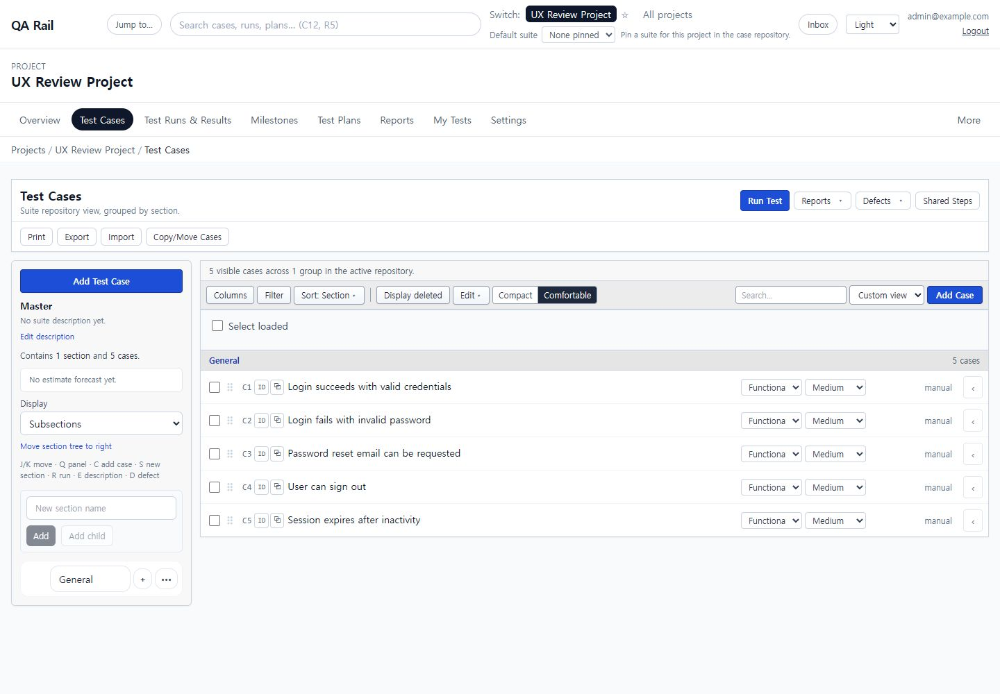
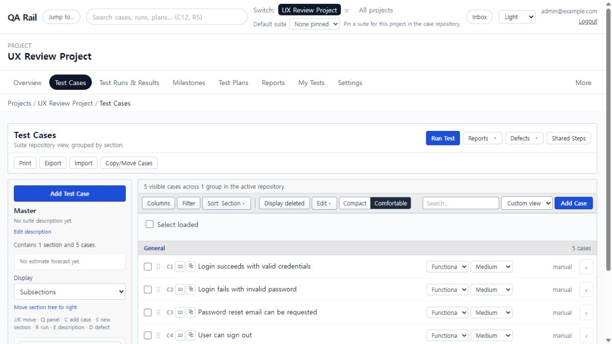

# UI-001 — Test Cases header and action hierarchy

Captured: 2026-09-18

## Before

The page exposed Run Test, Reports, Defects, Shared Steps, Print, Export, Import, Copy/Move Cases, Add Test Case, a section-level plus button, and a second Add Case button at the same time.

## After

The default page exposes one dominant Add Case action. Existing workflow, report, defect, import/export, print, shared-step, and copy/move capabilities remain available in one grouped More actions menu. Section-specific case creation remains available from the section row menu, and the `C` shortcut continues to open the authoring form.

## Acceptance evidence

- Default visible `Add Case` button count: `1`.
- Clicking Add Case opens the existing `New test case` authoring form.
- More actions groups: Workflow, Reports, Defects, Manage and output.
- Menu keyboard checks: initial focus, Arrow Down, End, Escape, and focus restoration to the trigger.
- Search, Filter, view controls, saved views, and permission-driven disabled states remain available.
- `npm run lint -w apps/web`: passed.
- `npm run build -w apps/web`: passed; the existing large-chunk warning remains unchanged.
