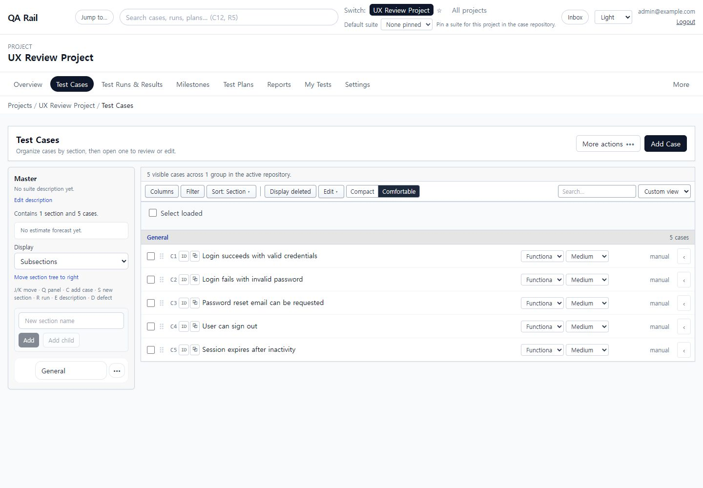
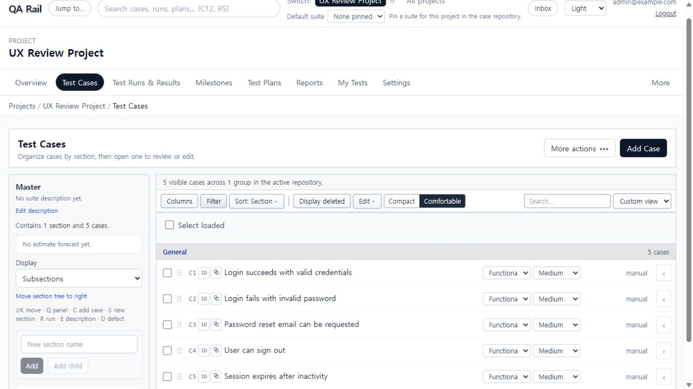

# UI-002 — Test Cases toolbar hierarchy

Captured: 2026-09-18

## Before

The repository toolbar exposed columns, filtering, sorting, deleted-case visibility, bulk editing, density, search, and saved-view controls at the same level. The competing controls obscured the main browse-and-find workflow.

## After

The zero-selection toolbar presents Search cases, Filter, and View. Display mode, grouping, density, columns and saved views, and archived-case visibility live in the shared View overflow. The contextual selection menu appears only after a case is selected.

## Acceptance evidence

- Zero selected cases: no Edit, Copy, Move, Delete, or other bulk action appears in the toolbar.
- Selection check: selecting C1 reveals the `1 selected` contextual menu; clearing the selection removes it.
- Filter check: applying Priority = High exposes `Filter, 1 active` after the filter panel is closed.
- View exposes selected states for display mode, grouping, density, and archived cases, plus entry to columns and saved views.
- Keyboard check: View opens with Enter, focuses its first item, and closes with Escape while returning focus to the trigger.
- Persistence check: Compact density remains selected after reload; Comfortable was restored after verification.
- Column settings dialog remains reachable from View and retains the existing saved-view controls.
- `npm run lint -w apps/web`: passed.
- `npm run build -w apps/web`: passed; the existing large-chunk warning remains unchanged.
