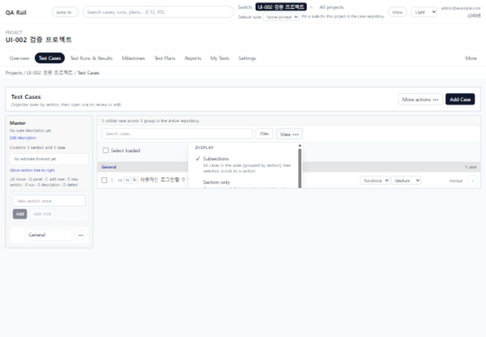
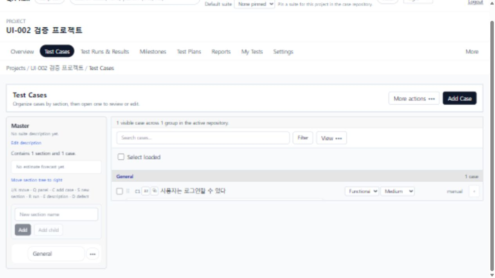
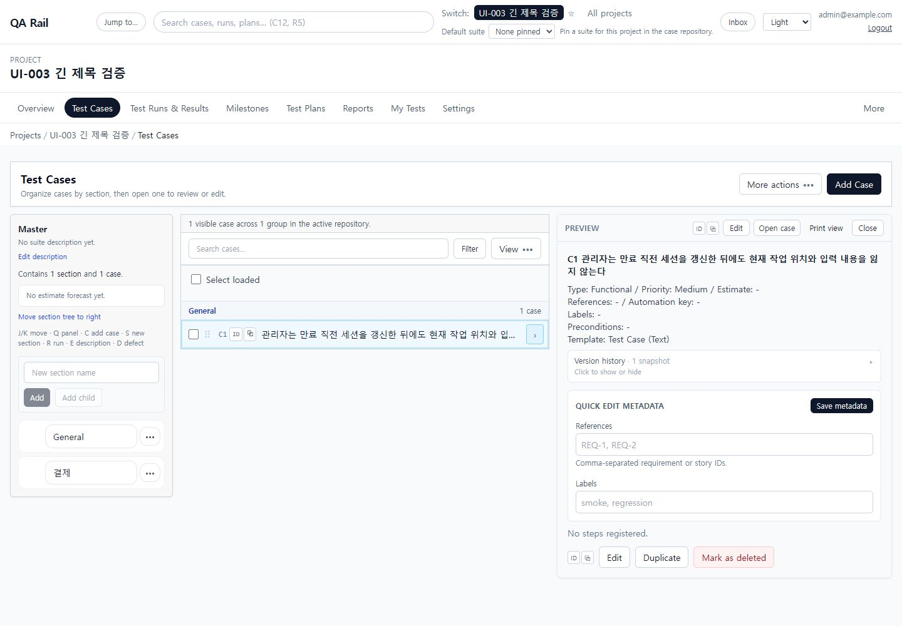
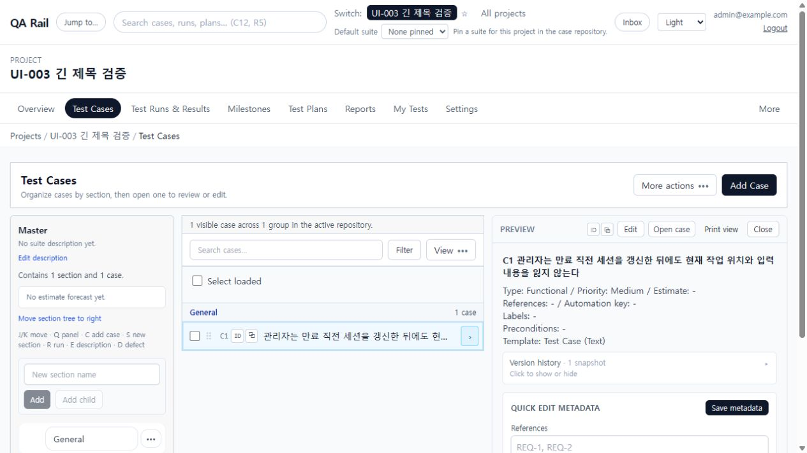

# UI-003 — Title-first case list

Captured: 2026-09-18

## Baseline

The UI-002 result still placed fixed-width Type, Priority, Automation, and Estimate metadata beside the title. With the detail pane open, those optional controls could reduce the title to a short fragment.

## After

The case code and title now form the primary row region. On desktop the title itself has a 240 px minimum, while optional metadata yields progressively and is removed from narrow list containers before the title contracts. The list retains one outer boundary; section headers and case rows use compact dividers rather than nested cards.

## Acceptance evidence

- At a 1280 x 720 viewport with the detail pane open, the list row measured 478.47 px and the title measured 302.09 px.
- Type, Priority, Automation, and Estimate yield at container thresholds; at the measured 478.47 px list width the optional metadata region is hidden.
- The measured row had no horizontal overflow.
- Compact density: 302.09 px title width, 34 px row height, no horizontal overflow.
- Comfortable density restored after verification and retained the same title-width guarantee.
- Selecting and clearing C1 continued to update selection state and contextual actions.
- The row preview toggle closed the panel, and pressing Enter on the focused case row reopened it.
- Section creation and section-button navigation remained operable.
- `npm run lint -w apps/web`: passed.
- `npm run build -w apps/web`: passed; the existing large-chunk warning remains unchanged.
