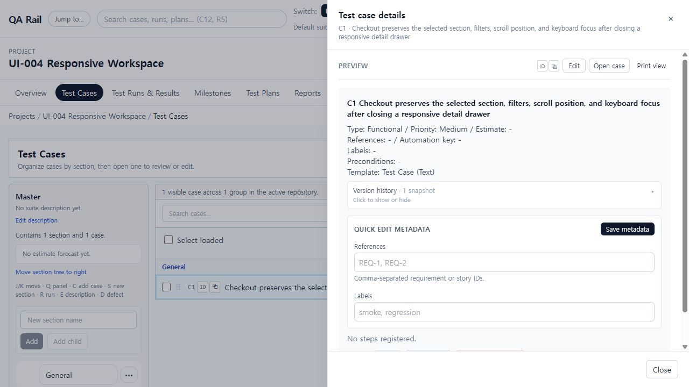
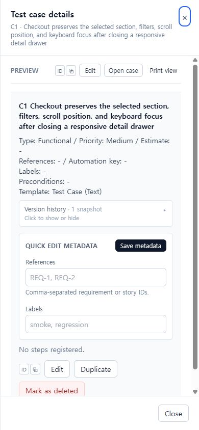
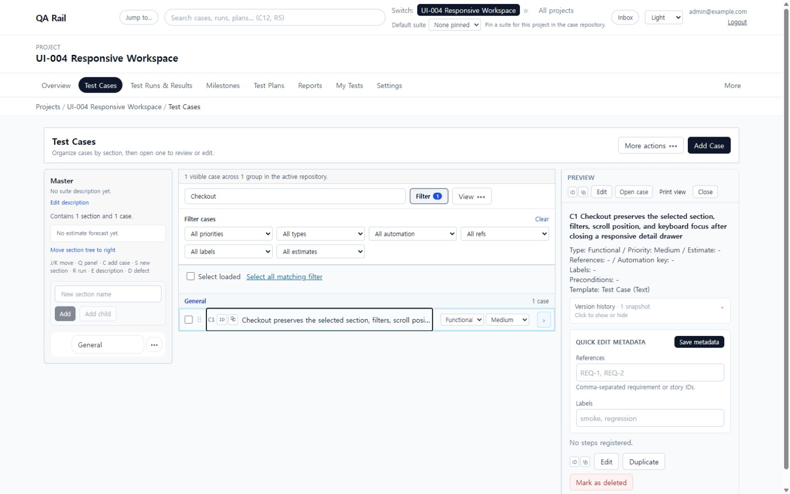

# UI-004 — Responsive Test Cases split view

Captured: 2026-09-18

## Baseline

The UI-003 workspace kept the section tree, case list, and detail pane inline at 1280 px. The fixed tertiary pane compressed the title-first list before the surrounding page had enough room for a useful three-column layout.

## After

The workspace now keeps all three regions inline only from 1536 px upward. Below that breakpoint the shared case detail body opens in an overlay drawer, so the section tree and title-first list keep their usable width. The inline detail pane remains resizable on wide screens and stores its clamped width per user and project.

## Acceptance evidence

- At 1280 x 720 the detail view opened as an overlay drawer; the section tree and list remained together and the visible `Add Case` action was not clipped.
- At 390 x 844 the drawer filled the viewport width, its header close control was visible and focused on open, and `scrollWidth` equaled `clientWidth` (390 px) with no horizontal page scroll.
- Pressing Enter on the focused C1 row opened the drawer. Tab moved from `Close drawer` to the first detail action, and Escape closed it and returned focus to the originating C1 row.
- The `q=Checkout` filter and selected suite remained in the URL across open and close. The mobile list returned to its pre-open scroll position after the body scroll lock was released.
- At 1600 x 1000 the section tree, case list, and inline detail pane were visible together with a keyboard-focusable separator.
- Keyboard resizing changed the detail pane from 360 px to 408 px; reload restored 408 px. Repeated resizing stopped at the documented 560 px maximum, then the pane was left at 448 px.
- `npm run lint -w apps/web`: passed.
- `npm run build -w apps/web`: passed; the existing large-chunk warning remains unchanged.
