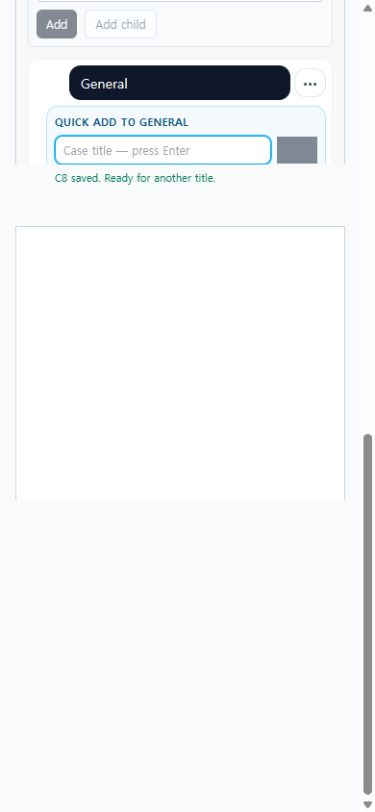

# UI-005 — Section-native quick outline creation

Captured: 2026-09-18

## Baseline

The section tree exposed case creation through a row overflow action, but a successful title-only create closed the inline form. Adding several outline cases therefore required reopening the action and reacquiring the input for every title, while success feedback appeared away from the field.

## After

Selecting a section now reveals a compact `Quick add` form directly beneath that section. Enter submits a title-only case, and a successful save clears and refocuses the same input. Saving, success, and failure feedback stays attached to the field; a rejected request keeps the title and exposes a `Retry` action. The header-level `Add Case` action still opens the detailed editor.

## Acceptance evidence

- Five title-only cases were created consecutively with the keyboard. After every Enter, the input value was empty and focus returned to `Case title — press Enter`.
- The inline live region progressed through `Saving case…` and `C# saved. Ready for another title.` without moving the user out of General.
- A server-rejected oversized request retained the complete title, announced the failure with `role="alert"`, displayed `Retry`, and did not increase the visible case count.
- Replacing that rejected title with a valid one created exactly one additional case, cleared the input, and restored focus.
- The header `Add Case` action still opened the full template-based editor while `sectionId=1` and `suiteId=1` remained in the URL.
- At 390 x 844 the selected section and quick-add form stacked without horizontal page overflow (`scrollWidth` equaled `clientWidth`, 375 px after the scrollbar).
- `npx vitest run apps/web/src/features/cases/utils/sectionTreeQuickAdd.test.ts`: passed.
- `npm run lint -w apps/web`: passed.
- `npm run build -w apps/web`: passed; the existing large-chunk warning remains unchanged.
