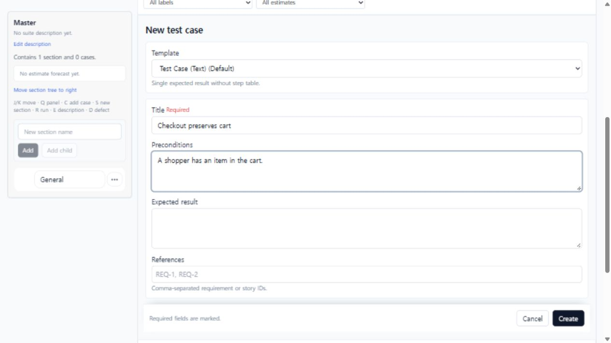
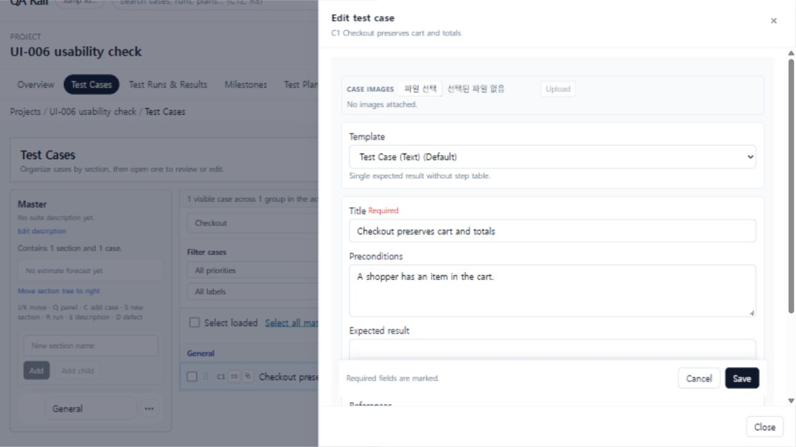
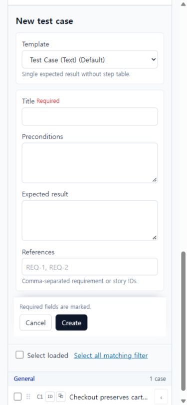

# UI-006 — Persistent, guarded full case editor

Captured: 2026-09-18

## Baseline

The detailed create and edit paths repeated field-label markup, placed actions after all form content, and closed without distinguishing a clean editor from one with unsaved changes. Required validation appeared inline for some fields, but it did not expose the invalid state to assistive technology or move keyboard focus to the content that needed attention.

## After

The full editor now uses the shared `FormField` pattern for labels, required markers, help, and accessible error relationships. Create/Save and Cancel stay in a sticky action footer, invalid submission focuses the first invalid field, and dirty create/edit exits require an explicit `Keep editing` or `Discard changes` decision. Opening the inline editor scrolls it into view on narrow layouts and closing it restores the prior list position.

## Acceptance evidence

- Submitting an empty create form focused `#case-title`, set `aria-invalid="true"`, and exposed `Title is required.` through the field's `aria-describedby` relationship and an inline alert.
- At 1280 x 720 the create footer remained visible at viewport bottom (`position: sticky`, bottom 696.8 px); the edit drawer footer remained visible at bottom 637.6 px while its content scrolled.
- Changing the create title and choosing Cancel opened `Discard unsaved case?`; `Keep editing` retained `Checkout preserves cart`. A clean Cancel closed directly.
- Changing the edit title and using the drawer close control opened `Discard unsaved changes?`; `Keep editing` preserved the draft. Reopening an unchanged editor and choosing Cancel closed without a prompt.
- Create completed with `q=Checkout` and `suiteId=1` intact, then opened the created case. Save removed only `panelMode=edit`, retaining the same query, suite, selected case, and list scroll position.
- The sticky Cancel/Create and Cancel/Save controls are native enabled buttons with `tabIndex=0`; the editor is a form, so its primary action is keyboard-submittable.
- At 390 x 844 opening the full editor scrolled it into view, kept the sticky actions visible, and produced no horizontal page overflow.
- `npx vitest run apps/web/src/features/cases/utils/caseAuthoringDraft.test.ts`: 2 tests passed.
- `npm run lint -w apps/web`: passed.
- `npm run build -w apps/web`: passed; the existing large-chunk warning remains unchanged.

Maps to: `UX-012`, `UX-021`, `UX-042`.
