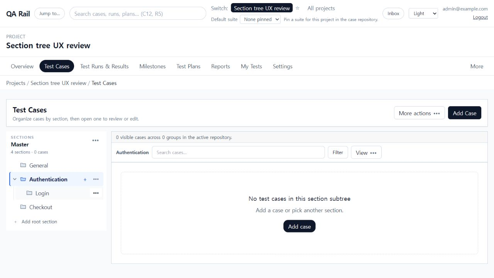
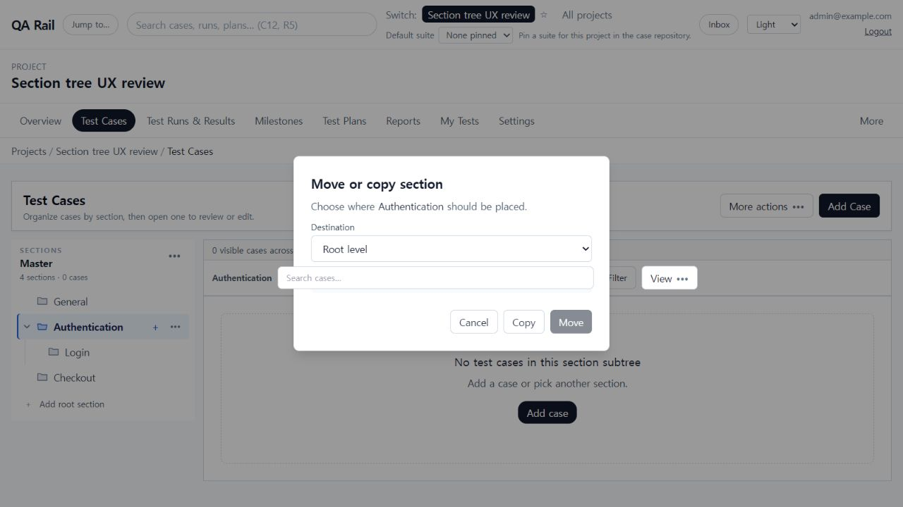
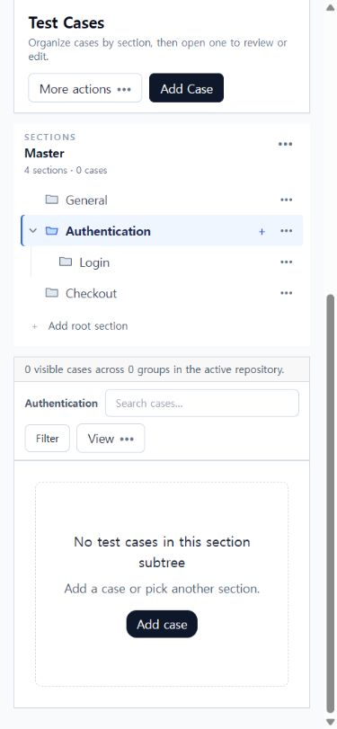

# UI-007 — Section tree actions and relationships

Completed: 2026-09-18

Re-review note (2026-09-18): the historical move-dialog screenshot below also exposes background Search/View controls covering the destination summary. Role/name inspection did not establish full keyboard accessibility. These unresolved defects are tracked as UI-025/UI-026 in the [simplicity re-review](../UI_UX_SIMPLICITY_REVIEW_2026-09-18.md); the earlier completion statement must not be read as proof those checks passed.

## Problem observed

- Every section looked like a separate bordered card, so a larger hierarchy became visually noisy.
- `Add` and `Add child` did not state whether they created a case, a root section, or a subsection.
- Copying used the currently selected section as an implicit destination, and moving depended on drag and drop.
- The selected section used a heavy dark pill while secondary actions competed with navigation.

## Result

- Replaced section cards with a 36px, text-first IDE-style tree: chevrons, folder icons, indentation, and a single subtle hierarchy guide.
- Removed node borders. Selection now uses a light background and a 2px inset accent rather than a filled pill.
- Kept the selected section's compact `+` action visible and grouped rename, subsection, move/copy, and delete actions in an accessible overflow menu.
- Reworded creation entry points as `Add case to {section}`, `Add subsection to {section}`, and `Add root section`.
- Added an explicit move/copy destination picker. It excludes the source and its descendants, repeats the selected destination before confirmation, marks the current location, and disables a no-op move while leaving copy available.
- Moved suite description, forecast, tree-side placement, and shortcut help into suite overflow so the tree itself stays focused.

## Verification

- Desktop 1280×720: no horizontal overflow; every leaf row measured 36px; tree-item borders measured 0px on all sides.
- Mobile 390×844: no horizontal overflow; the complete four-section tree and root action occupied 258px before the case workspace.
- Keyboard/accessibility inspection: semantic `tree`, `treeitem`, `group`, `menu`, and `menuitem` roles; named row action buttons; `aria-selected`, `aria-expanded`, and explicit dialog/select labels.
- Cancellation retained `sectionId=2&suiteId=1`, so the user's current section context remained intact.
- Browser console contained no warnings or errors during desktop and mobile interaction checks.
- `npm.cmd run lint -w apps/web`
- `npx.cmd vitest run apps/web/src/features/cases/utils/sectionTreeModel.test.ts apps/web/src/features/cases/utils/sectionTreeQuickAdd.test.ts`
- `npm.cmd run build -w apps/web`

## Screenshots

