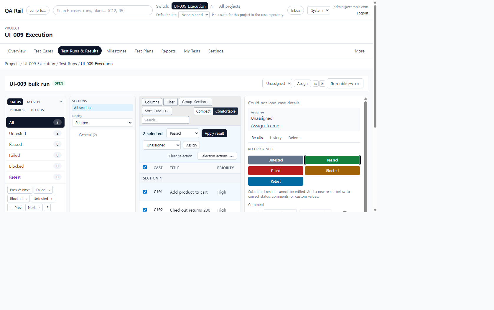
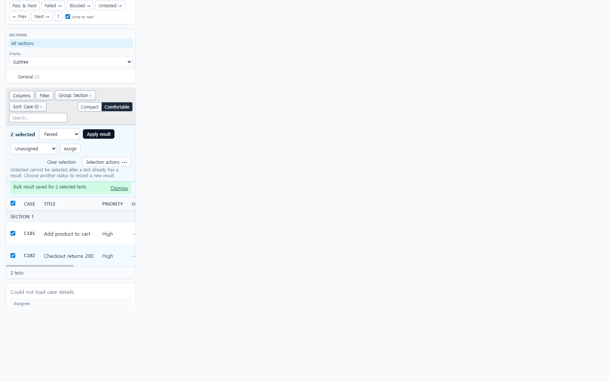

# UI-009 — Sticky selection action bar on Run Execution

Completed: 2026-09-18

## Result

- After the first selected test, a sticky `Selected test actions` bar appears immediately above the execution table with selected count, result status, assignment, clear selection, and a grouped overflow.
- The bar is hidden at zero selection. Bulk result entry was removed from the distant collapsed `Run actions` section so the only bulk-result path is this contextual bar.
- The bar reuses the shared `SelectionActionBar`, `Button`, and `OverflowMenu` patterns from `UI-001` and `UI-008`.

## Verification

- Zero selection: no `Selected test actions` region, no `Apply result` control, and no `Run actions` / `Bulk manual result entry` section.
- Selecting C101 revealed the bar; selecting C102 updated the label to `2 selected`. The bar sat flush above the table (0px gap) at 1280×720, and `Apply result` stayed in view.
- Submitting one Passed bulk result saved both selected tests without scrolling to another panel (`scrollY` unchanged). Success copy: `Bulk result saved for 2 selected tests.` The action bar then hid; `Clear selection` also hid it on the 390×844 layout.
- Keyboard: `Selection actions` opened Add result comment, Assign selected to me, and Clear selected assignees. `Escape` closed the menu and restored focus to the trigger.
- Desktop 1280×720: `scrollWidth` 1265px inside a 1280px viewport.
- Mobile 390×844: `scrollWidth` 390px; status, apply, assignee, clear, and overflow remained visible after wrapping.
- `npx.cmd vitest run apps/web/src/features/runs/utils/runSelectionActionBarModel.test.ts apps/web/src/features/runs/utils/runExecutionHeaderMenu.test.ts`
- `npm.cmd run lint -w apps/web`
- `npm.cmd run build -w apps/web` (passed; existing Vite large-chunk warning remains).

## Screenshot review

