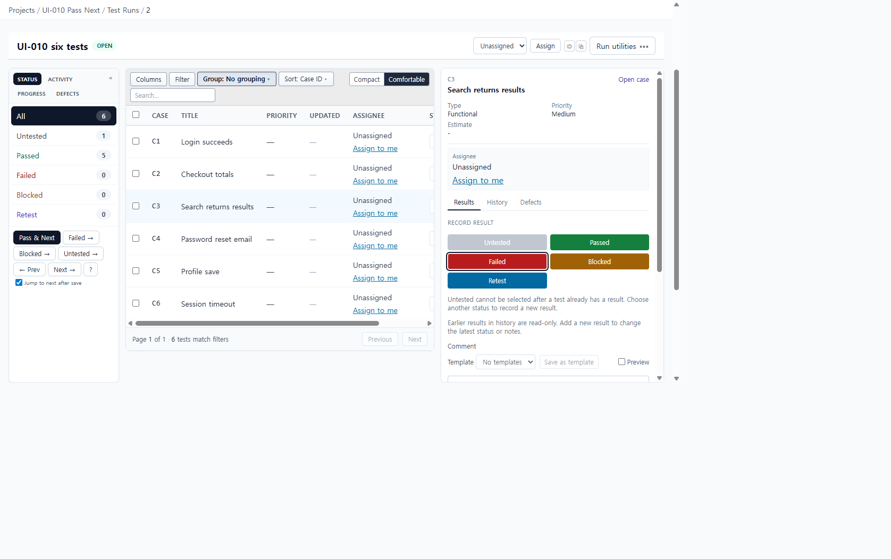
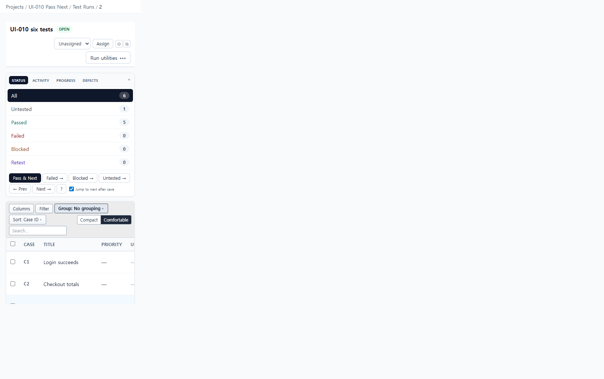

# UI-010 — Separate one-click Pass & Next from evidence-requiring statuses

Completed: 2026-09-18

## Result

- `Pass & Next` is the primary one-click action in the execution toolbar. It always records Passed and advances to the next visible test, independent of the `Jump to next after save` checkbox.
- Selecting Failed, Blocked, or Retest from a row status control opens the result composer with that status preselected and does not commit the result.
- Row click, previous/next, refresh, and Pass & Next all write the same `testId` URL parameter. Pending URL writes are kept until the address bar catches up so Pass & Next cannot snap back to the previous row.

## Verification

- Six-test run `UI-010 six tests` (`/projects/1/runs/2?groupBy=none`). Starting at C1, five consecutive `Pass & Next` clicks advanced C1→C2→C3→C4→C5→C6 with the detail pane open (`testId` 3→4→5→6→7→8). Sidebar counts ended at Passed 5 / Untested 1.
- C6 Failed, Blocked, and Retest each opened the composer with `data-composer-status` and `aria-pressed` matching that status. The row select stayed Untested and Failed/Blocked/Retest counts stayed 0.
- Row click on C3 set `testId=5`. ← Prev from C6 set `testId=7` (C5). Next → returned `testId=8` (C6). Refresh of `?groupBy=none&testId=5` restored C3 with the composer open.
- Keyboard: status selects expose `Failed, Blocked, and Retest open the result composer`. Status picker buttons use `aria-pressed`. Composer region is `aria-live="polite"`.
- Desktop 1280×720: `scrollWidth` 1265px inside a 1280px viewport. Mobile 390×844: `scrollWidth` 390px; Pass & Next remained visible after wrapping.
- `npx.cmd vitest run apps/web/src/features/runs/utils/runSelectedTestState.test.ts`
- `npm.cmd run lint -w apps/web`
- `npm.cmd run build -w apps/web` (passed; existing Vite large-chunk warning remains).

## Screenshot review

