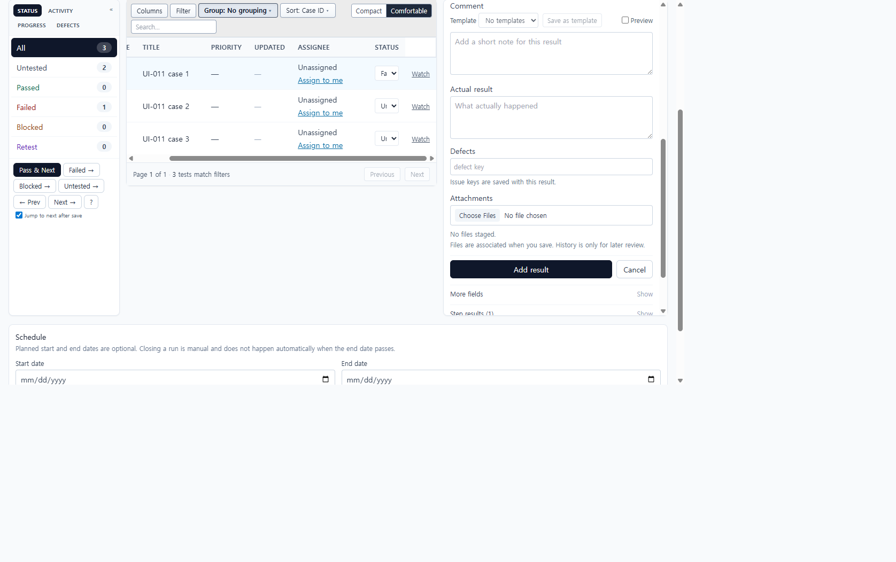
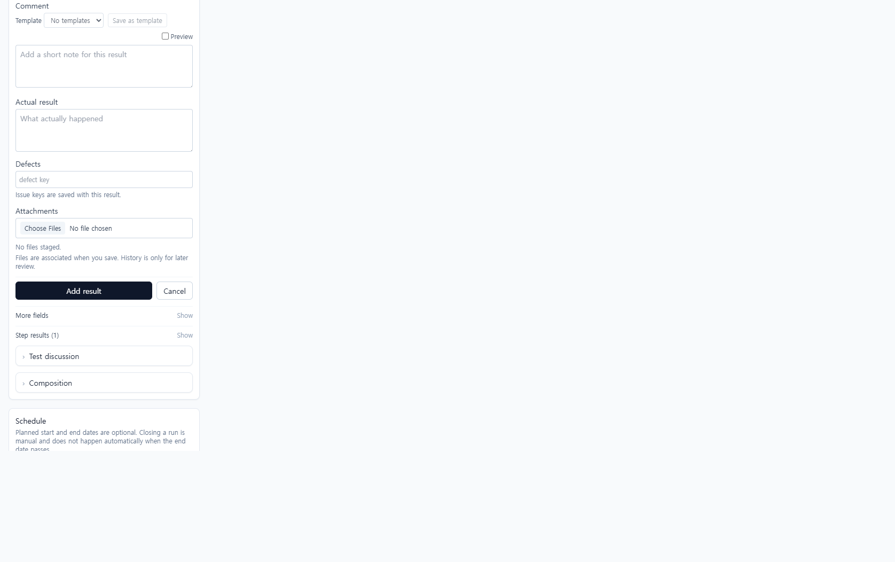

# UI-011 — Recompose result entry around evidence and completion

Completed: 2026-09-18

## Result

- The selected-test composer now groups **status, comment, actual result, defects, attachments, Save, and Cancel** on the Results tab. Elapsed, version, custom fields, and per-step editors stay in secondary details.
- Failed, Blocked, and Retest still preselect that status without committing. Cancel discards the draft and leaves the selected test unchanged.
- Staged files are associated with the created result on Save. History remains a review path, not the only upload path.

## Verification

- Run `UI-011 evidence run` (`/projects/1/runs/1?groupBy=none`). Cancel after filling comment and actual result cleared both fields; C1 stayed Untested (Failed 0).
- C1 Failed opened the composer with `data-composer-status="failed"` and `aria-pressed="true"` on Failed while the row stayed Untested.
- From the Results tab only, a Failed result was saved with comment `Login failed after timeout`, defect `JIRA-42`, actual result `Saw HTTP 500 on submit`, and `failure.png`. After save: C1 Failed, counts Failed 1 / Untested 2. History (checked after recording) showed the same comment, defect, actual result, and attachments.
- Composer controls expose accessible names: Result status, Comment, Actual result, Defects, Attachments, Save/Add result, Cancel.
- Desktop 1280×720: `scrollWidth` 1265px inside a 1280px viewport. Mobile 390×844: `scrollWidth` 390px; Save and Cancel stayed in the composer column.
- `npx.cmd vitest run src/features/runs/utils/resultComposerModel.test.ts src/features/runs/utils/runSelectedTestState.test.ts` (14 passed)
- `npm.cmd run lint -w apps/web`
- `npm.cmd run build -w apps/web` (passed; existing Vite large-chunk warning remains)

## Screenshot review

