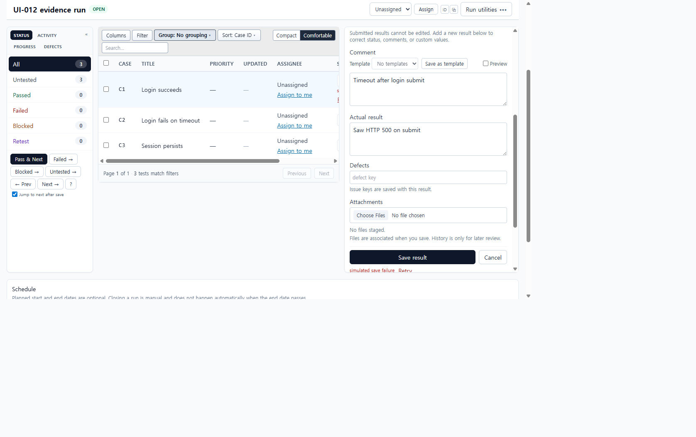
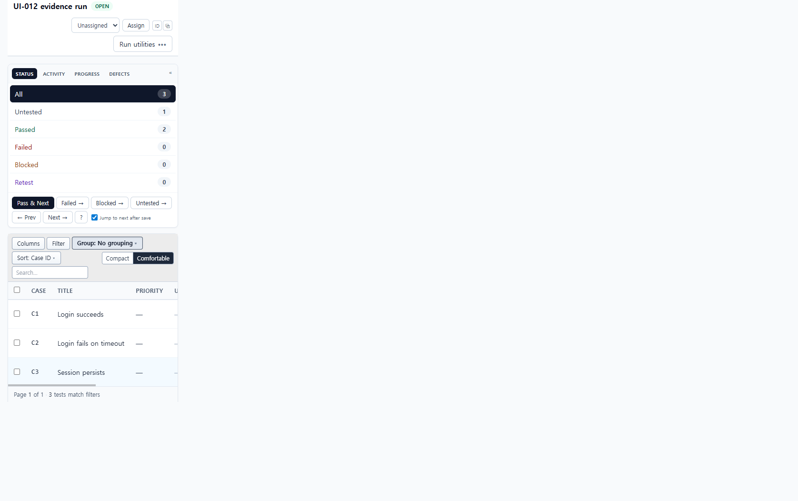

# UI-012 — Add local save, failure, retry, and undo feedback to results

Completed: 2026-09-18

## Result

- Shared `SaveFeedback` now shows **Saving… / Saved / Failed** next to the affected test row and, when that test is selected, under Save/Cancel in the result pane. Failed uses `role="alert"`; Saving/Saved use `role="status"` with `aria-live="polite"`.
- Optimistic status overlays the row, then rolls back on error. Retry resubmits the last payload so comment/actual/attachments are not retyped. Undo is offered for 8s only when the previous status is not `untested`.
- Pass & Next keeps Saved on the row that was saved after selection advances.

## Verification

- Simulated `POST /api/runs/:id/results` failure on C1 Failed with comment `Timeout after login submit` and actual result `Saw HTTP 500 on submit`. Both the C1 row and the composer showed **Failed** + **Retry**; C1 rolled back to Untested; both fields stayed filled. After unpatching, Retry saved C1 as Failed without re-entering evidence (Failed 1 / Untested 2).
- Saving C1 from Failed → Passed showed **Saved** + **Undo** on the row and pane (`data-save-feedback-status="saved"`). Undo restored C1 to Passed's previous Failed, then a later Pass & Next on C2 left **Saved** on the C2 row (no Undo; previous was untested) while the URL advanced to `testId=3`.
- Composer controls keep accessible names from UI-011. SaveFeedback Retry/Undo are named buttons.
- Desktop 1280×720: `scrollWidth` 1265px. Mobile 390×844: `scrollWidth` 390px; feedback stays in the composer/row column.
- `npx.cmd vitest run src/features/runs/utils/resultSaveFeedback.test.ts` (7 passed)
- `npm.cmd run lint -w apps/web`
- `npm.cmd run build -w apps/web` (passed; existing Vite large-chunk warning remains)

## Screenshot review

