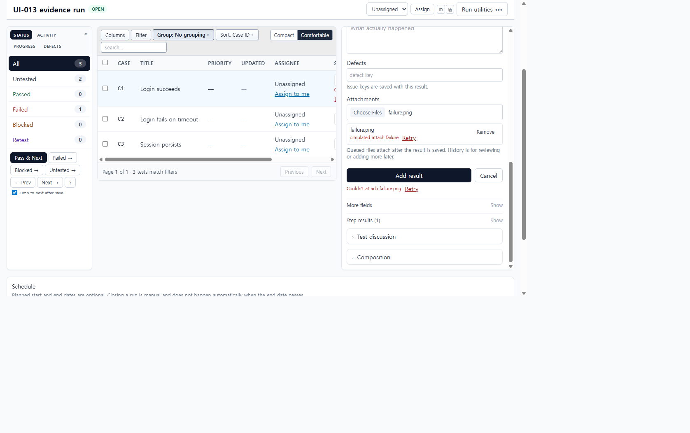
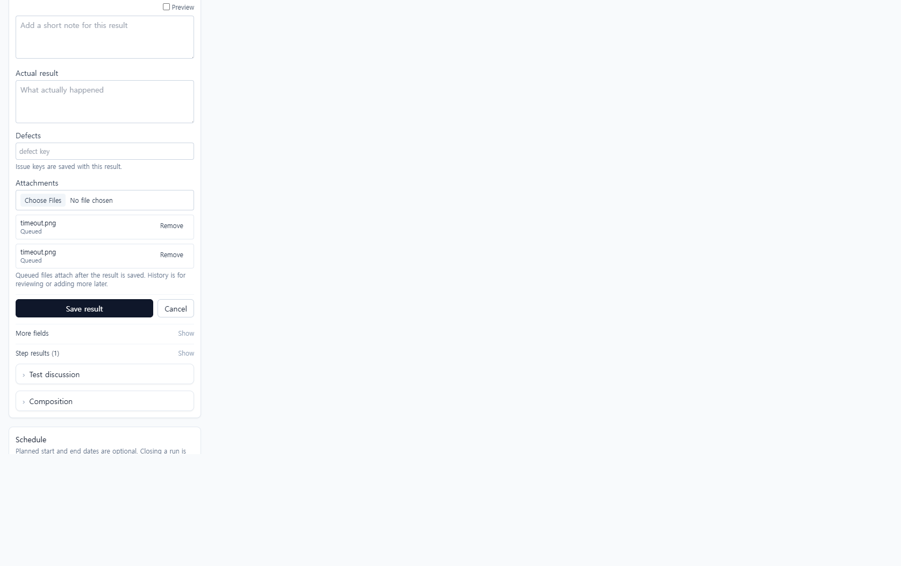

# UI-013 — Stage attachments inside the result composer

Completed: 2026-09-18

## Result

- Composer attachments now show per-file **Queued**, **Uploading…**, **Attached**, and **Failed** states, with Remove while queued/failed. Failed files reuse `SaveFeedback` Retry.
- Files stay local until the result is created, then they are associated with that result. Cancel discards the queue without creating a result. History remains the review / later-addition path.

## Verification

- Staging `failure.png` on C1 showed `data-staged-attachment-status="queued"` with Remove. Cancel cleared the queue; C1 stayed Untested (Untested 3).
- C1 Failed save with `failure.png` while attachment POSTs were patched: result still saved (Failed 1), the staged row showed **Failed** + **Retry** + Remove, and overall SaveFeedback read `Couldn't attach failure.png`.
- After unpatching, per-file Retry attached `failure.png`. History listed `failure.png - image/png - local://results/1/failure.png`.
- Desktop 1280×720: `scrollWidth` 1265px. Mobile 390×844: `scrollWidth` 390px; queued files, Remove, Save, and Cancel stayed in the composer column.
- `npx.cmd vitest run src/features/runs/utils/resultComposerModel.test.ts src/features/runs/utils/resultSaveFeedback.test.ts` (18 passed)
- `npm.cmd run lint -w apps/web`
- `npm.cmd run build -w apps/web` (passed; existing Vite large-chunk warning remains)

## Screenshot review

