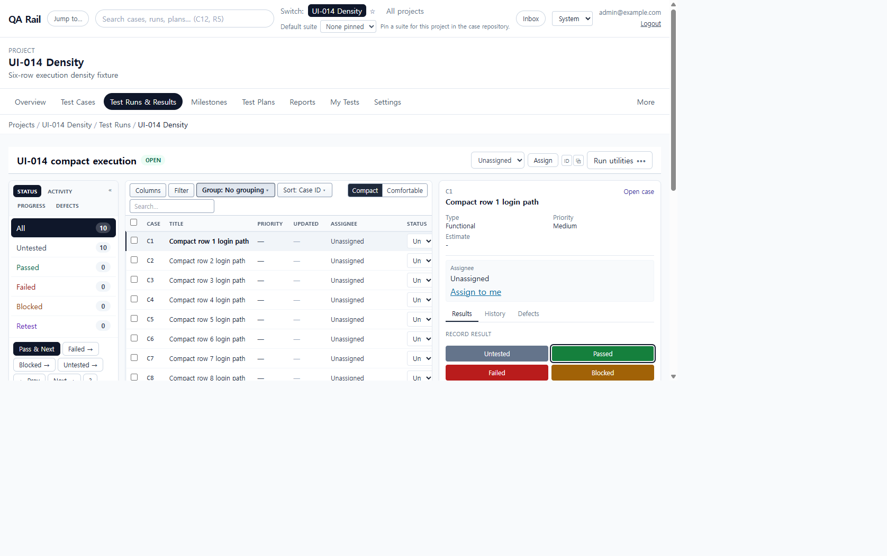
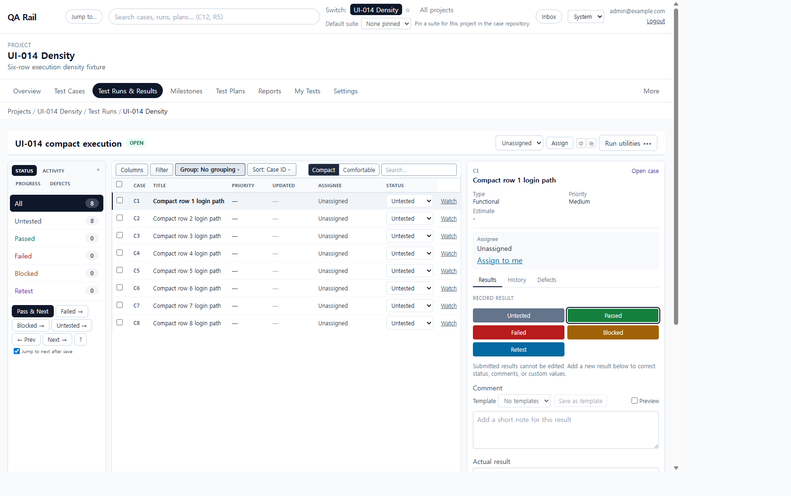
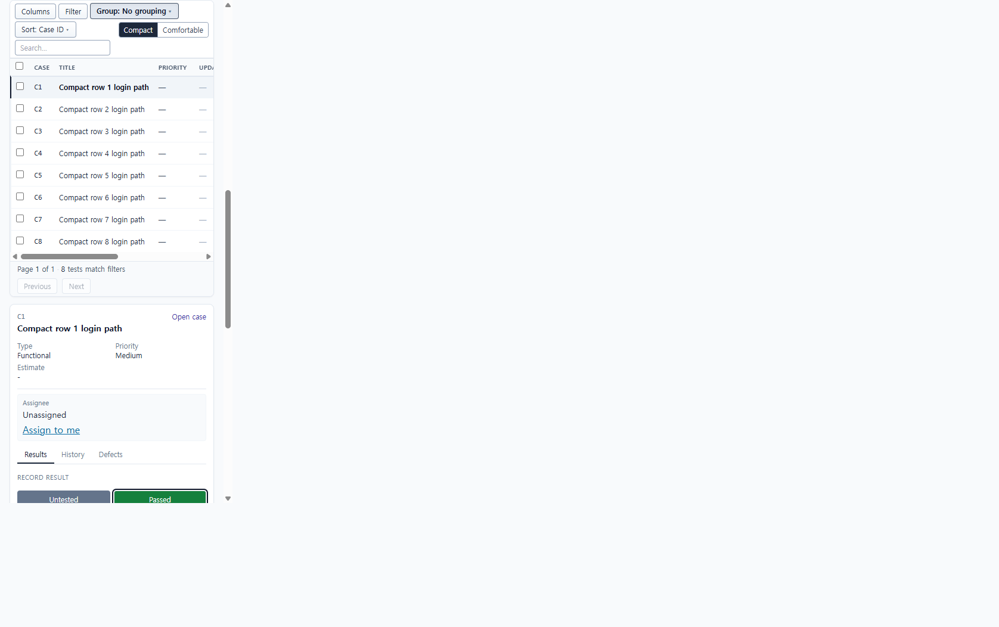

# UI-014 — Increase execution density without reducing readability

Completed: 2026-09-18

## Result

- Run Execution now defaults to compact density. Compact rows are one line: assignee is the name text, status is the labeled select, and the active row uses a slate edge plus `Selected:`/semibold title rather than a color wash alone.
- Empty Schedule, Test discussion, Composition, and Run discussion stay collapsed below the workbench, so they are out of the default 1280×720 viewport.
- The tests column fills remaining viewport height with a sticky `WorkbenchToolbar` and sticky table header.

## Verification

- Desktop 1280×720 with the result pane open: 8 compact test rows (C1–C8) were in the viewport; 7 were fully on-screen. `scrollWidth` was 1265px. Compact was pressed. Empty Schedule/discussion/composition summaries started at y≈793, below the 720px fold.
- Desktop 1440×1000: 8 rows remained visible with Search on the same toolbar row as Columns/Filter. `scrollWidth` 1425px.
- Mobile 390×844: `scrollWidth` 375px. After scrolling to the tests section, the sticky toolbar stayed at the top of the viewport and all 8 compact rows plus the result pane were usable. The table scrolls horizontally for Status/Watch.
- Status selects, Search tests, Compact/Comfortable, and row checkboxes (`Select C1` …) exposed accessible names. Assign to me remains in the result pane, not in compact rows.
- `npx.cmd vitest run src/features/runs/utils/runExecutionDensity.test.ts src/shared/ui/density/uiDensity.test.ts` (7 passed)
- `npm.cmd run lint -w apps/web`
- `npm.cmd run build -w apps/web` (passed; existing Vite large-chunk warning remains)

## Screenshot review

