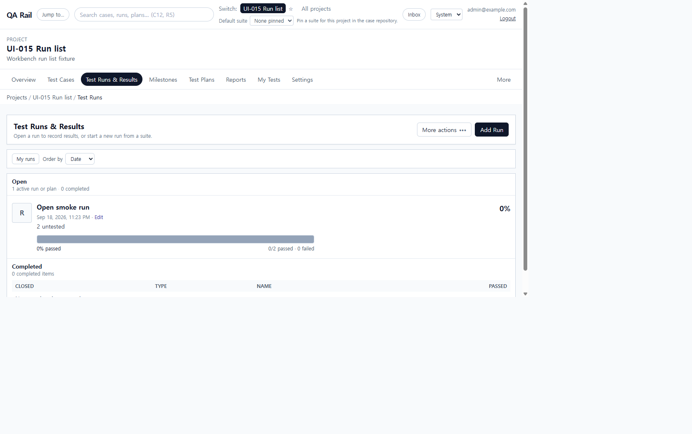
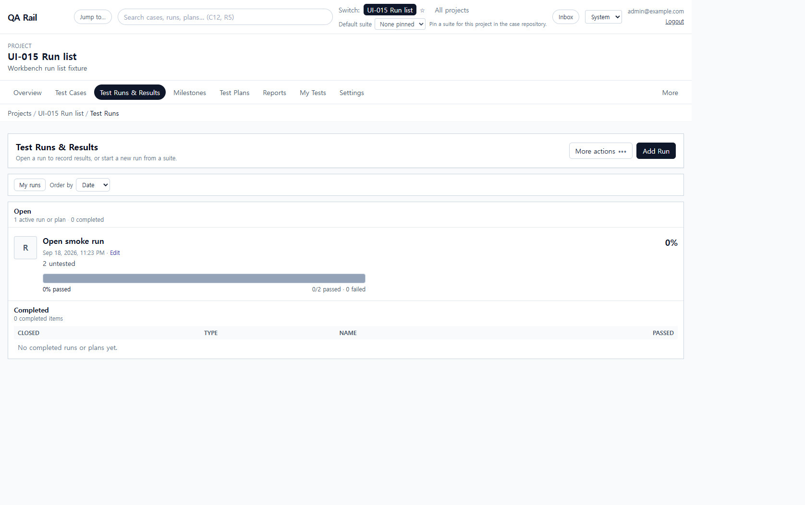
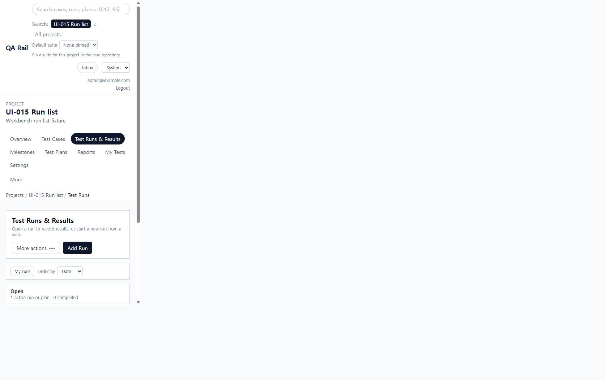

# UI-015 — Apply the workbench pattern to the run list

Completed: 2026-09-18

## Result

- The run list now uses `WorkbenchPage`, `WorkbenchPageHeader`, `WorkbenchToolbar`, shared `Button`/`OverflowMenu`/`DataTable`/`FormField`/`Drawer`.
- The only dominant create action is **Add Run**. Reports, defects, Add test plan, and Compare runs live in **More actions**.
- My runs and Order by sit in one toolbar. The competing sidebar (Add Test Run / Add Test Plan) is gone.

## Exception

- Open items stay as progress-summary rows (`RunPlanSummaryRow`) so the list can still show status bars and jump into execution. Completed items use the shared `DataTable`.

## Verification

- Default page exposed exactly one `Add Run` button and no `Add Test Run` / `Add Test Plan` chrome. `More actions` opened with Workflow, Reports, and Defects; first item received focus; Escape restored focus to the trigger.
- Add Run opened the shared `Choose test suite` drawer with a named Suite field, Cancel, and Continue.
- Desktop 1280×720: `scrollWidth` 1265px. Mobile 390×844: `scrollWidth` 375px; Add Run, More actions, and the toolbar wrapped without page-level horizontal scroll.
- `npx.cmd vitest run src/features/runs/utils/runListHeaderMenu.test.ts` (1 passed)
- `npm.cmd run lint -w apps/web`
- `npm.cmd run build -w apps/web` (passed; existing Vite large-chunk warning remains)

## Screenshot review

