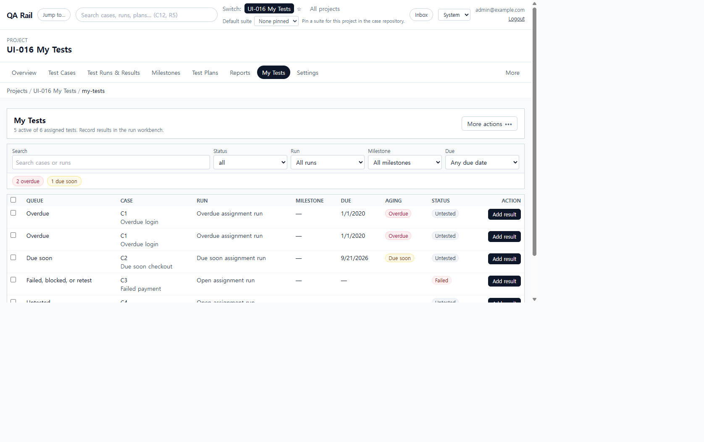
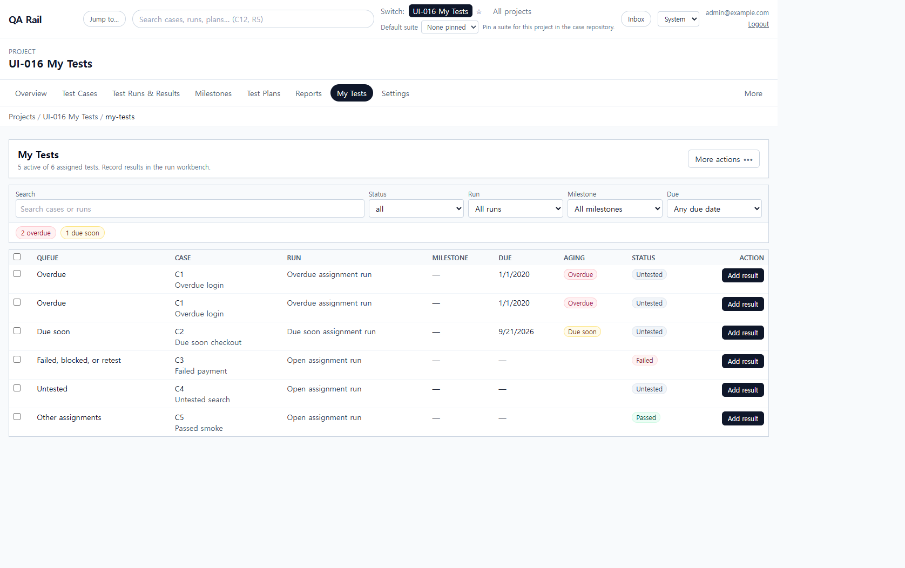
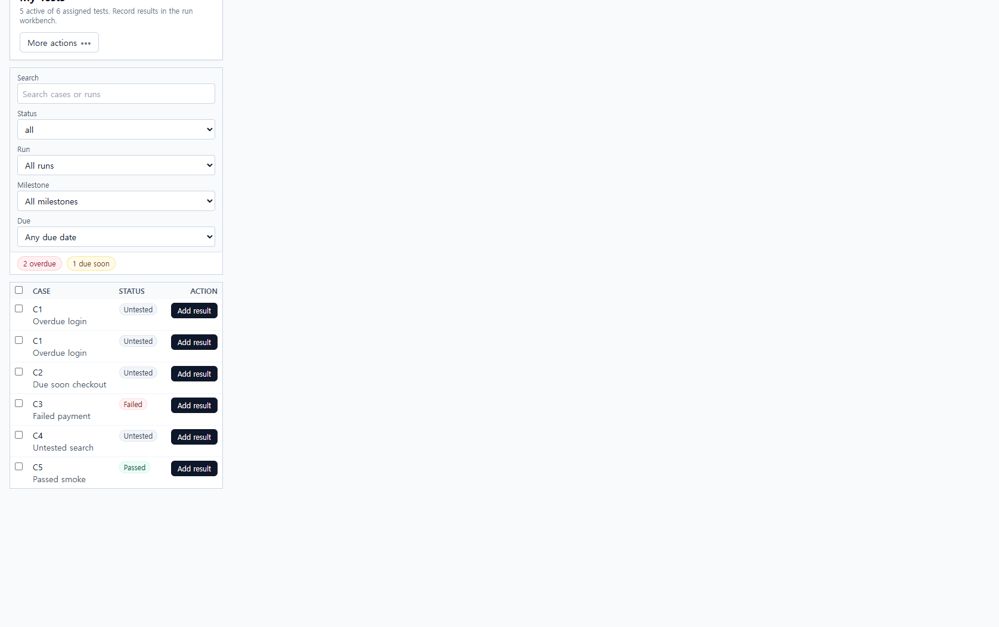

# UI-016 — Apply the workbench pattern to My Tests

Completed: 2026-09-18

## Result

- My Tests now uses `WorkbenchPage`, `WorkbenchPageHeader`, `WorkbenchToolbar`, shared `Button`/`OverflowMenu`/`FilterBar`/`FormField`/`DataTable`/`SelectionActionBar`/`StatusBadge`.
- The assigned table, filters, and **Add result** are the primary work. Team to-do, Users workload, and All reports live in **More actions**.
- Row and selection **Add result** navigate to Run Execution with `testId`. There is no My Tests result composer or bulk-result submit.

## Exception

- Queue grouping is a **Queue** column on the shared `DataTable` (no grouped header rows). Queue, Run, Milestone, Due, and Aging hide on narrow viewports so **Add result** stays on-screen.

## Verification

- Header had **More actions** only; no page-level Add result, no Overdue/Due soon shortcut cards, and no extra **Run** row button. Overflow opened with Workflow (Team to-do) and Reports (Users workload, All reports); first item received focus; Escape restored focus to the trigger.
- Selecting a row showed the shared `Selected test actions` bar (`N selected`, Add result, Clear selection). Add result opened `/projects/1/runs/1?testId=1` with Pass & Next on Run Execution.
- Due on or before used a named `FormField`. Every My Tests control had an accessible name.
- Desktop 1280×720: `scrollWidth` 1265px. Mobile 390×844: `scrollWidth` 390px; Add result stayed inside the viewport (`right` 365px).
- `npx.cmd vitest run src/features/runs/utils/myTestsHeaderMenu.test.ts src/features/runs/utils/myTestsQueue.test.ts` (3 passed)
- `npm.cmd run lint -w apps/web`
- `npm.cmd run build -w apps/web` (passed; existing Vite large-chunk warning remains)

## Screenshot review

