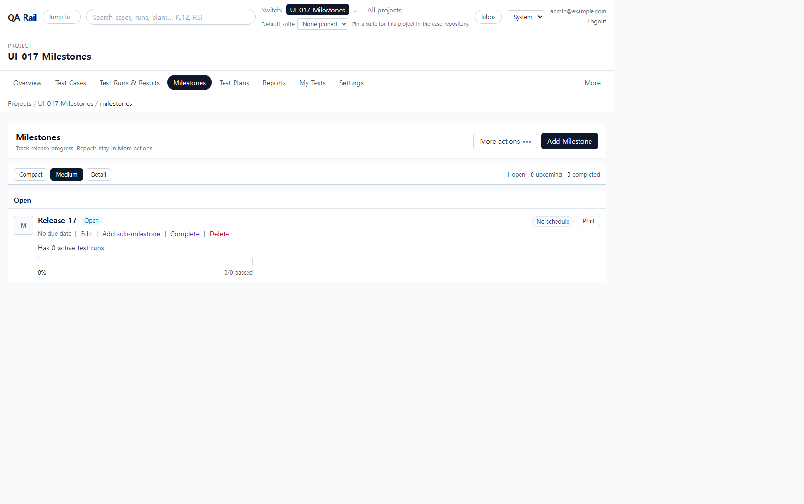
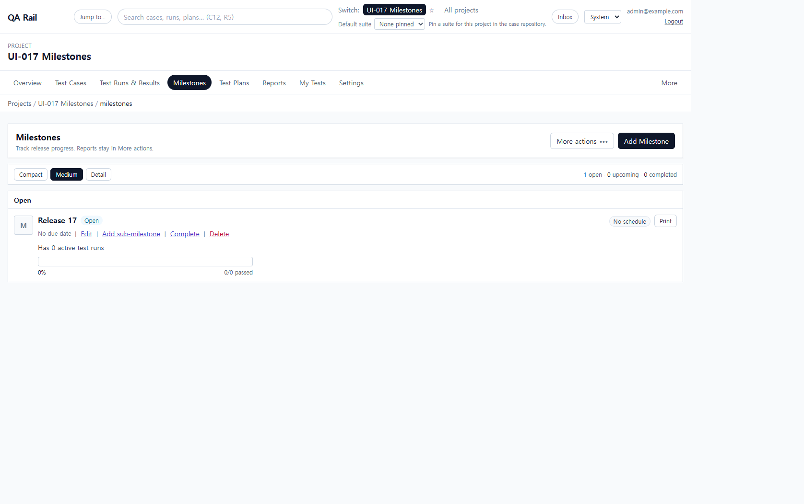
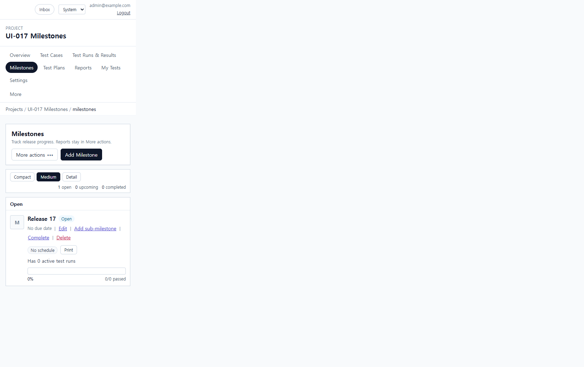

# UI-017 — Apply the workbench pattern to Milestones

Completed: 2026-09-18

## Result

- The milestone list now uses `WorkbenchPage`, `WorkbenchPageHeader`, `WorkbenchToolbar`, shared `Button`/`OverflowMenu`/`FormField`/`Drawer`/`ConfirmDialog`/`SaveFeedback`.
- The only dominant create action is **Add Milestone**. Reports live in **More actions**. The competing sidebar create form, count card, and dashboard panel are gone.
- Compact/Medium/Detail and open/upcoming/completed counts sit in one toolbar. Empty state points at the header CTA instead of repeating it.

## Exception

- Open/upcoming/completed items stay as progress-summary rows (`MilestoneSummaryRow`) so the list can still show lifecycle, progress, and jump into runs. Row **Add sub-milestone** is contextual, not a second page-level create.

## Verification

- Default empty page exposed exactly one `Add Milestone` button, no sidebar Add milestone form, and no Milestone Count / dashboard chrome. `More actions` opened with Reports (Milestone summary first); first item received focus; Escape restored focus to the trigger.
- Add Milestone opened the shared drawer with named Name/Parent/Start/Due fields, Cancel, and Add milestone. Creating **Release 17** closed the drawer and listed the row. Delete opened shared `Delete milestone` confirm; Cancel left the row.
- Desktop 1280×720: `scrollWidth` 1280px. Mobile 390×844: `scrollWidth` 390px; Add Milestone stayed in view (`right` 293px).
- `npx.cmd vitest run src/features/projects/utils/milestoneHeaderMenu.test.ts` (1 passed)
- `npm.cmd run lint -w apps/web`
- `npm.cmd run build -w apps/web` (passed; existing Vite large-chunk warning remains)

## Screenshot review

