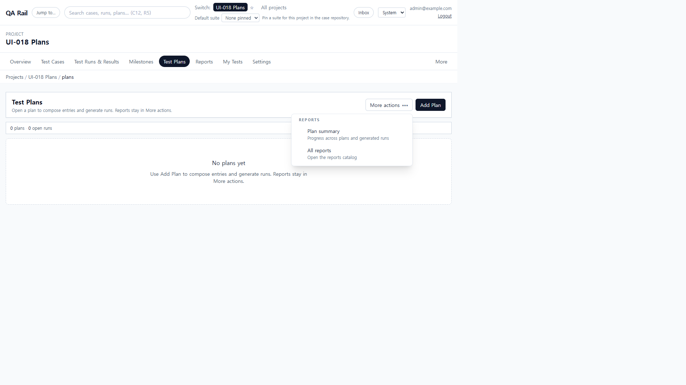
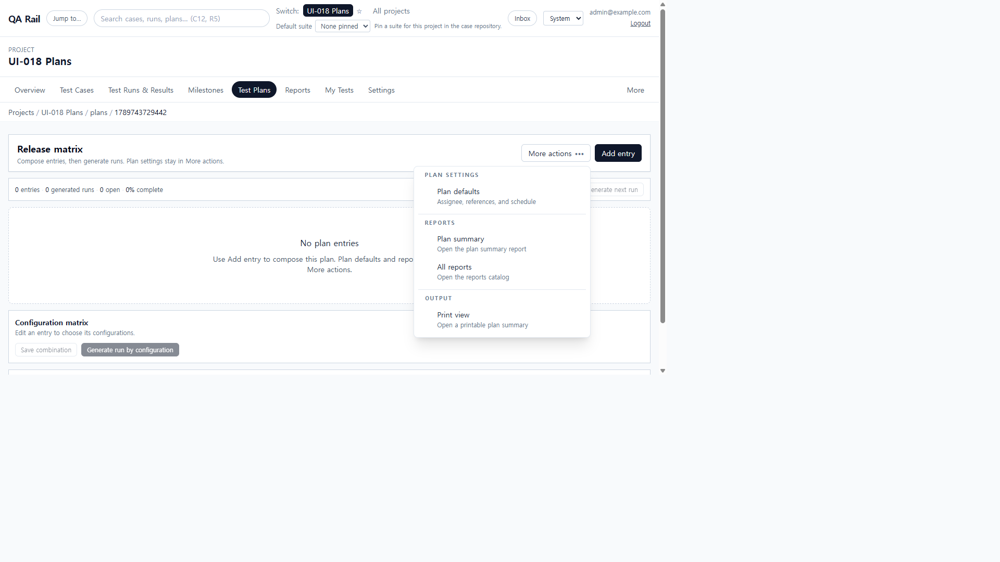
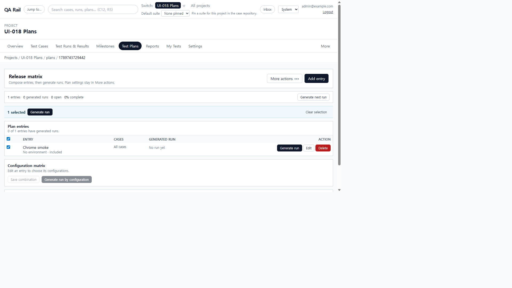
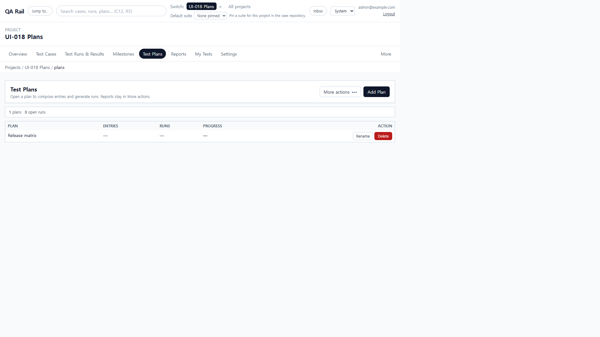
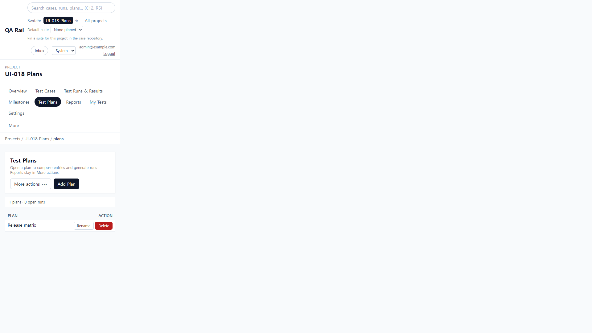

# UI-018 — Apply the workbench pattern to Plans

Completed: 2026-09-18

## Result

- Plans list and plan hub now use `WorkbenchPage`, `WorkbenchPageHeader`, `WorkbenchToolbar`, shared `Button`/`OverflowMenu`/`DataTable`/`SelectionActionBar`/`FormField`/`Drawer`/`ConfirmDialog`/`SaveFeedback`.
- List: the only dominant create action is **Add Plan**. Reports live in **More actions**. The competing sidebar create form, Plan Count card, summary strip, and row Open hub/Print CTAs are gone.
- Hub: **Add entry** is the dominant create. **Generate next run** stays as a composition control in the toolbar. Plan defaults, reports, and print live in **More actions**, not permanent header chrome. Empty state points at the header CTA instead of repeating it.

## Exception

- Configuration matrix and rollup stay on the hub as composition, not a second page-level create. Row **Generate run** is contextual for an entry without a run. **Generate next run** is secondary toolbar composition, not an admin overflow item.

## Verification

- Empty list exposed exactly one `Add Plan` button, no sidebar Add Plan form, and no Plan Count / report strip. `More actions` opened with Reports (Plan summary first); Escape restored focus to the trigger.
- Add Plan opened the shared drawer with a named Name field, Cancel, and Add plan. Creating **Release matrix** closed the drawer and listed the row with Rename/Delete only.
- Hub showed **Add entry** as the only header primary. `More actions` listed Plan defaults, Plan summary, All reports, and Print view. Plan defaults and Add/Edit entry used named drawer fields. Selecting **Chrome smoke** showed the shared selection bar (Generate run / Clear selection).
- Desktop 1280×720: list `scrollWidth` 1280px; hub `scrollWidth` 1265px (no page-level horizontal scroll). Mobile 390×844: `scrollWidth` 390px; Add Plan stayed in view (`right` 257px); Add entry stayed in view (`right` 264px).
- `npx.cmd vitest run src/features/projects/utils/planHeaderMenu.test.ts` (2 passed)
- `npm.cmd run lint -w apps/web`
- `npm.cmd run build -w apps/web` (passed; existing Vite large-chunk warning remains)

## Screenshot review

