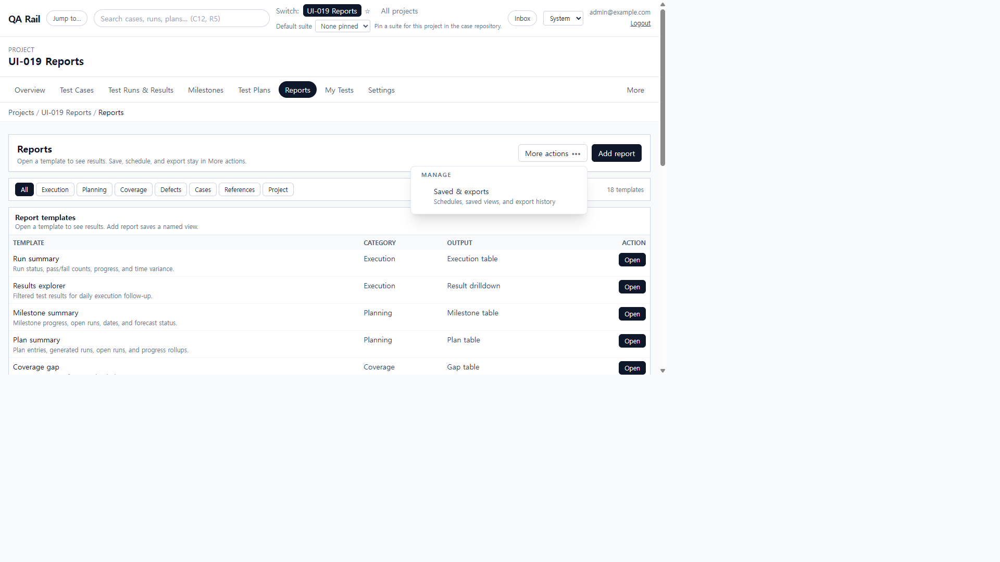
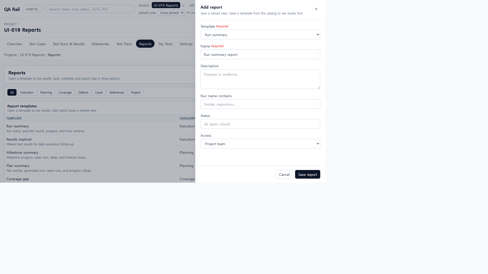
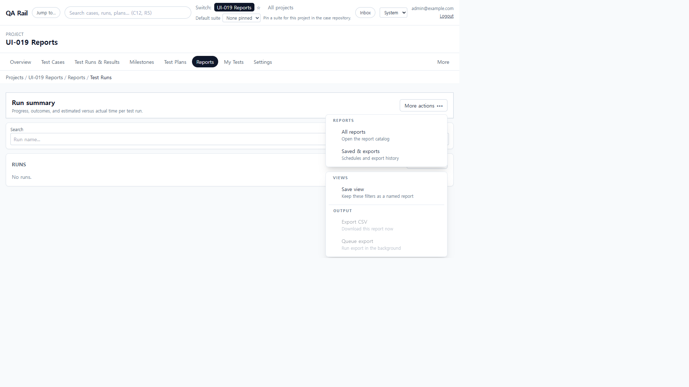
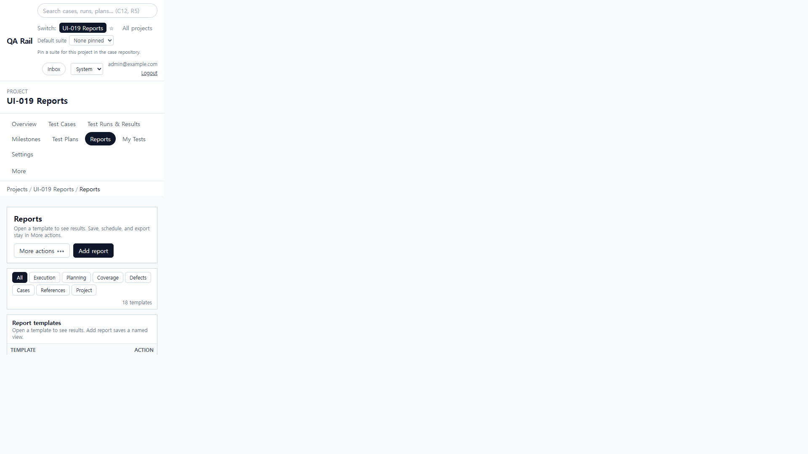

# UI-019 — Apply the workbench pattern to Reports

Completed: 2026-09-18

## Result

- The reports index uses `WorkbenchPage`, `WorkbenchPageHeader`, `WorkbenchToolbar`, shared `Button`/`OverflowMenu`/`DataTable`/`FormField`/`Drawer`/`SaveFeedback`.
- Opening a template is the dominant catalog action (`Open`). The only page-level create is **Add report**. Saved views, schedules, and export history live in **More actions**.
- The 20-link reports toolbar is gone. Drilldowns keep filters on the results surface; print/export/save-view sit in a result overflow instead of four permanent buttons.

## Exception

- Category chips stay in the catalog toolbar because they change which templates can be opened. Search/status filters stay on drilldowns because they change the result set, not administration.

## Verification

- Catalog exposed exactly one `Add report` button, no sidebar Add report form, and no permanent Run summary / Traceability / Saved & exports toolbar. `More actions` opened with Saved & exports only.
- Add report opened a named Template/Name/Description/options/Access drawer (no scheduling). Empty saved-reports copy pointed at the header CTA.
- Opening **Run summary** showed results + filters, header More actions (All reports / Saved & exports), and a second More actions for Save view / Export CSV / Queue export. Export CSV and Queue export were disabled with no runs. No Export CSV/Print/Save view as permanent chrome.
- Desktop 1280×720 catalog `scrollWidth` 1265px; 1440×1000 1425px. Mobile 390×844: `scrollWidth` 390px; Add report stayed in view (`right` 270px).
- `npx.cmd vitest run src/features/projects/utils/reportHeaderMenu.test.ts` (3 passed)
- `npm.cmd run lint -w apps/web`
- `npm.cmd run build -w apps/web` (passed; existing Vite large-chunk warning remains)

## Screenshot review

