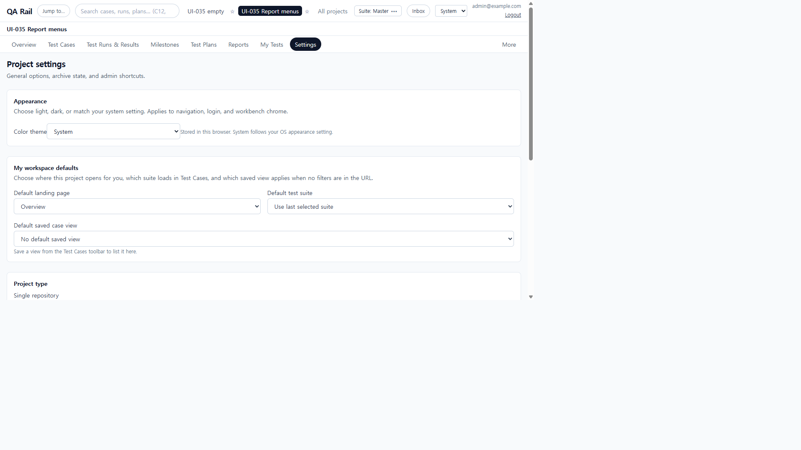
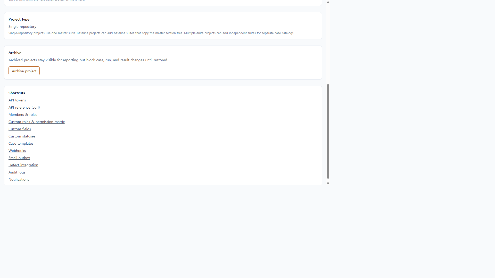
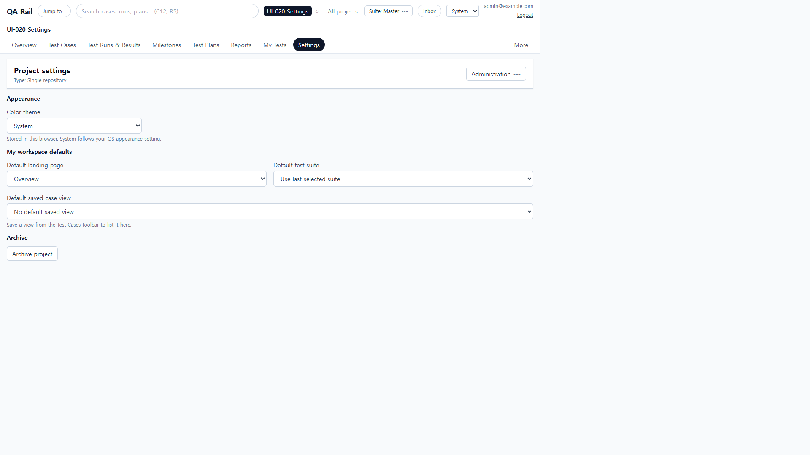
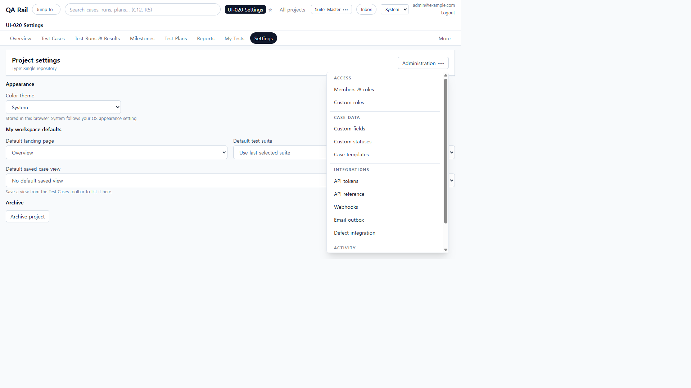
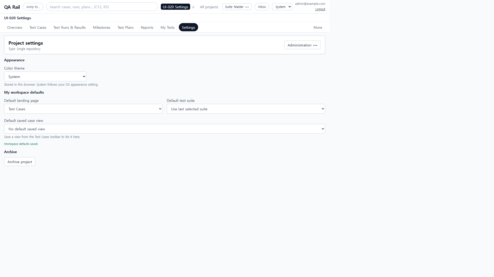
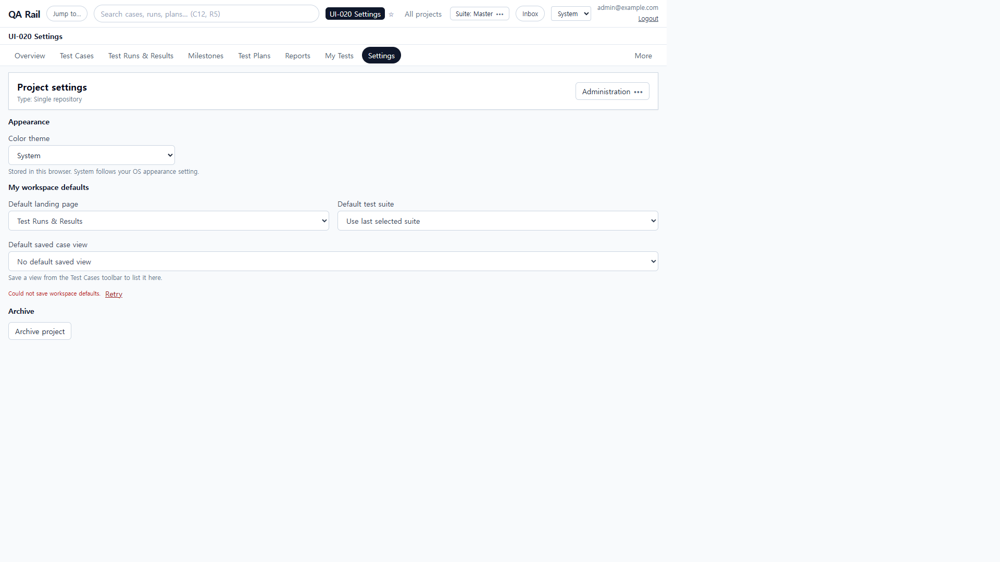
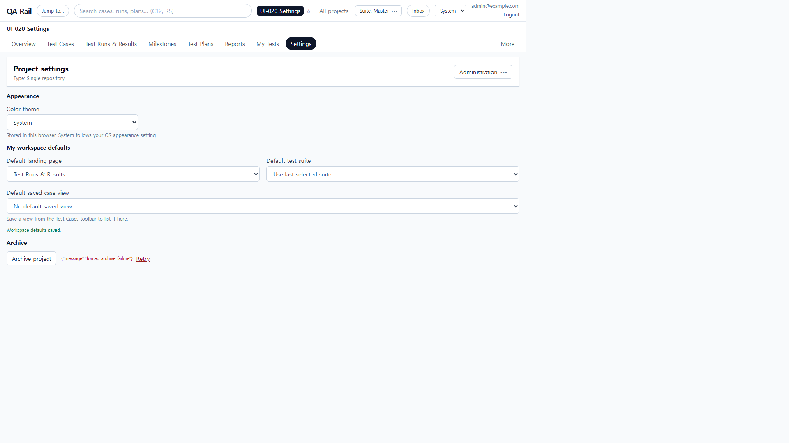
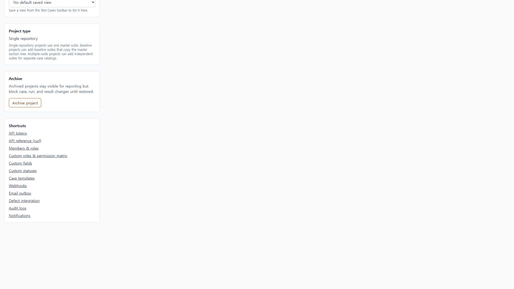
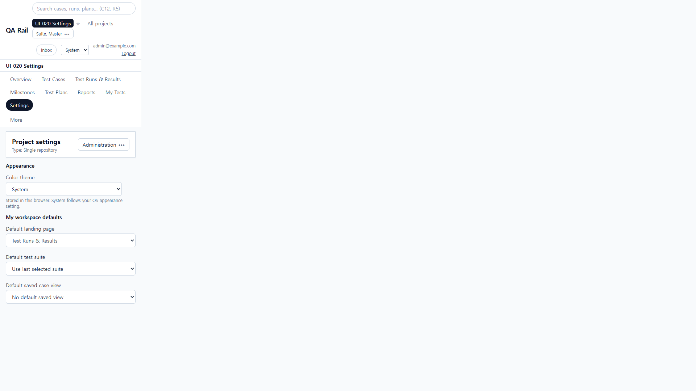

# UI-020 — Apply shared controls and feedback to Settings

Completed: 2026-09-19

## Result

- Settings hub uses `WorkbenchPage` / `WorkbenchPageHeader`, shared `FormField` / `Button` / `OverflowMenu` / `SaveFeedback`.
- Administrative destinations (members, tokens, webhooks, …) sit in **Administration**, not a 12-link shortcut wall.
- Color theme, landing page, suite, and saved-view controls use `FormField` labels. Workspace auto-save and archive/restore failures show local status plus **Retry** (no toast on this hub).

## Verification

- Fixture: in-memory API `localhost:4000`, Vite `http://localhost:5173`, login `admin@example.com`. Project **UI-020 Settings** (id 1, Single repository, Master suite). In-memory store had been wiped; project recreated before after-captures.
- Before (1280×720 / 390×844): four cards; Color theme name included help text; workspace success vanished after 2s with rose error and no Retry; Archive had no SaveFeedback; 12 permanent shortcut links. CDP overflow 0 at 1280.
- After hub controls named **Color theme**, **Default landing page**, **Default test suite**, **Default saved case view**, **Archive project**, **Administration**. Help text is described-by, not part of the name.
- **Administration** groups Access / Case data / Integrations / Activity (Members & roles through Notifications). Escape closed it.
- Changed Default landing page to Test Cases → **Workspace defaults saved.** Forced PATCH 500 → **Could not save workspace defaults.** + Retry; Retry saved Test Runs & Results.
- Archive forced POST 500 → failed + Retry beside **Archive project**; Retry archived (Restore project + Archived banner). Restore returned **Archive project**. Leftover “Project archived.” after restore was removed so success follows the Archive/Restore swap.
- Keyboard: page Color theme → landing → suite → saved view → Archive project. Archive project takes focus. 1280 overflow 0. 390 overflow 0; Administration menu width 340px, `right` 357, no horizontal overflow. Archive is below the 390 fold and reachable by scroll (no shortcut wall).
- `npx.cmd vitest run src/features/projects/utils/settingsHeaderMenu.test.ts` (2 passed)
- `npm.cmd run lint -w apps/web`
- `npm.cmd run build -w apps/web` (passed; existing Vite large-chunk warning remains)

## Exception

- Nested admin routes (Members, Webhooks) still use toast for their own CRUD. This unit converted the Settings hub the same way UI-017–019 converted landings; those destinations remain available from Administration.

## Screenshot review

