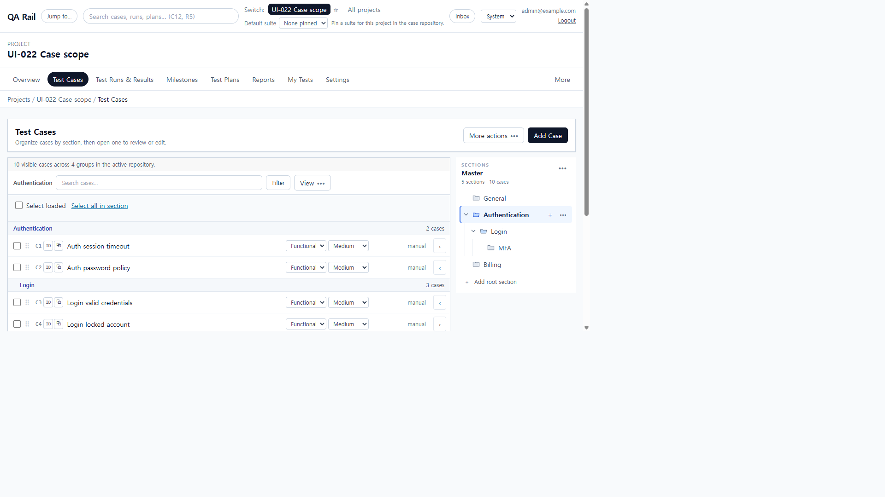
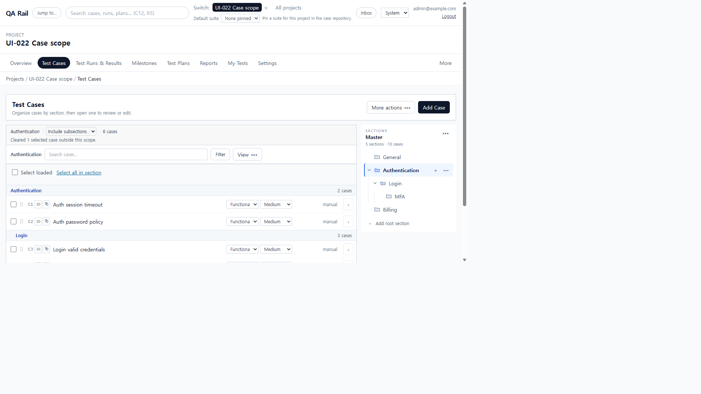
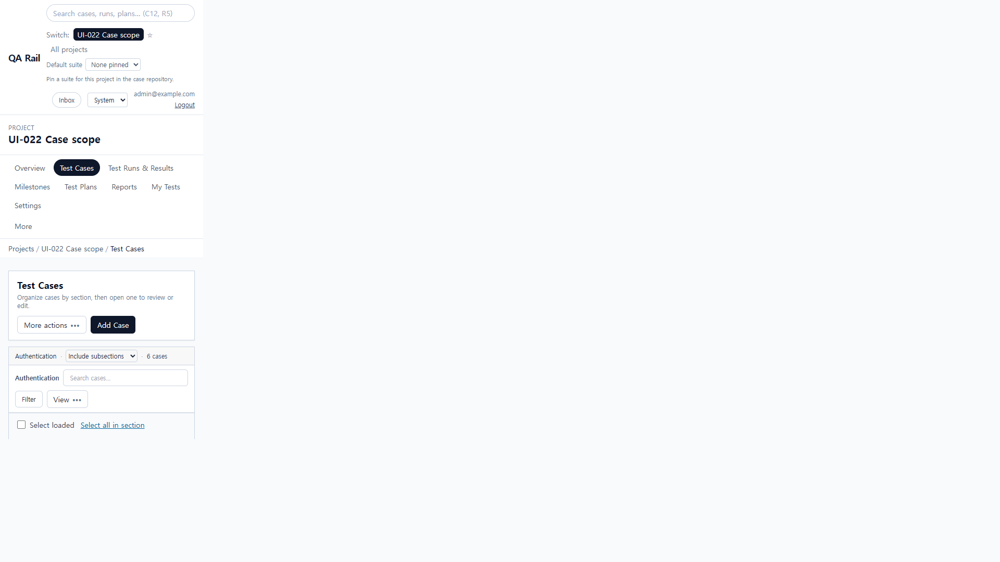

# UI-022 — Separate case query scope from display settings

Completed: 2026-09-19

## Result

- A compact **Case query scope** select sits in the list context row: section path · Selected section only / Include subsections / All sections · count.
- Membership is independent of View display/density. Compact list and Comfortable density keep the same cases.
- Direct and subtree filter on the selected section. All sections keeps the suite-wide set and uses section clicks to scroll to the block.
- Scope lives in the URL (`scope=`), last view, and saved views. Legacy `display=tree` without `scope` still means direct; explicit `display=subtree|compact` without `scope` still means all.

## Verification

- Fixture: in-memory API `localhost:4000`, Vite `http://localhost:5173`, login `admin@example.com`. Project **UI-022 Case scope** (id 1). Authentication (2) 2 TCs, Login (3) 3 TCs, MFA (4) 1 TC, Billing (5) 4 TCs. Bootstrap also has an empty General section.
- Before (1280×720, Authentication selected, no `scope`): **10 visible cases across 4 groups**, including Billing. Search/View Subsections still fetched the whole suite.
- After, Authentication: **Selected section only = 2**, **Include subsections = 6** (no Billing), **All sections = 10**. Login: direct **3**, subtree **4**. Path `Authentication / Login`.
- Compact list and Comfortable density both stayed at **6** on Authentication subtree. URL `scope=subtree&display=compact`.
- All-scope selected C1+C7, then direct: **Cleared 1 selected case outside this scope.** Remaining **1 selected**.
- Shared URL `/projects/1/cases?sectionId=2&suiteId=1&scope=subtree` reload: 6 cases. Back from `scope=all` restored subtree and 6 cases. Search `q=Login` on Auth subtree: 3 Login cases.
- Saved view **UI-022 subtree** applied from All sections restored `scope=subtree` in the URL.
- Keyboard: `aria-label="Case query scope"` receives `element.focus()`. 1280 `scrollWidth` 1265px; 390 `scrollWidth` 390px, selector unclipped.
- `npx.cmd vitest run src/features/cases/caseRepositoryView.test.ts` (6 passed)
- `npx.cmd vitest run src/__tests__/suite-repository-api.test.ts` (5 passed, including sibling exclusion)
- `npm.cmd run lint -w apps/web`
- `npm.cmd run build -w apps/web`

## Screenshot review

## Not live-verified

- Saved-view apply was confirmed by URL `scope=subtree` after selecting **UI-022 subtree**; the row count sample during that click was 0 while the list was still loading, so case rows were not re-counted on that pass.
- `browser_press_key` Tab through the scope select was not used (same Electron routing limit as UI-030–032). Focus was set with `element.focus()`.
- Empty-state copy for each scope was not opened on this populated fixture.
