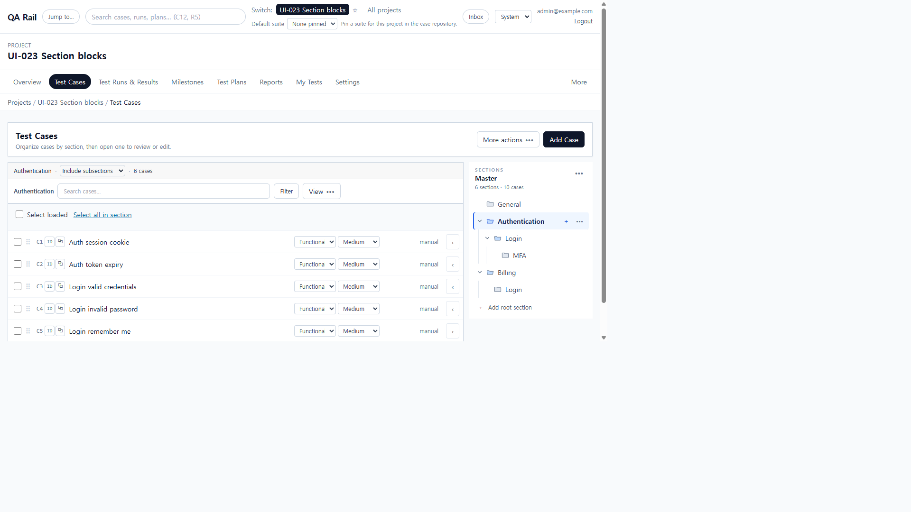
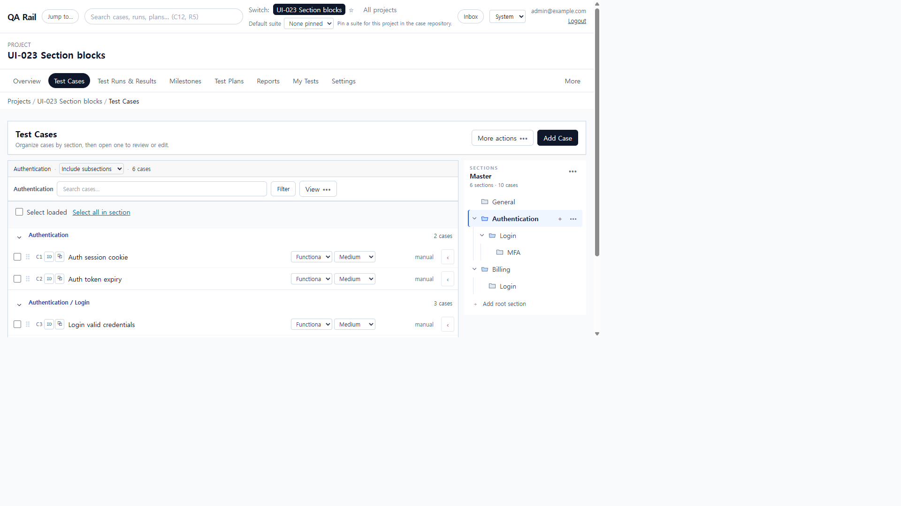
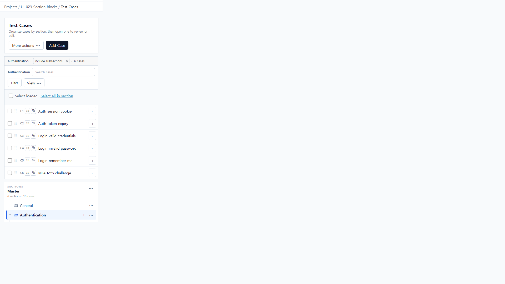
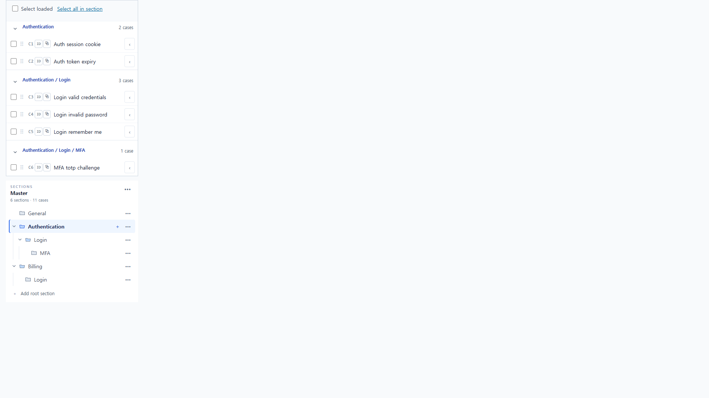

# UI-023 — Make section-owned TC blocks visually explicit

Completed: 2026-09-19

## Result

- Compact list no longer hides owning-section headers. Each grouped block shows a **path**, **direct matching count**, and **collapse chevron**, then the existing compact rows. Blocks are separated by spacing and a single thin divider, without nested cards or per-block toolbars.
- Duplicate section names are distinguished by ancestry (`Authentication / Login` vs `Billing / Login`). Three-level nesting reads as `Authentication / Login / MFA`.
- Collapse changes visibility only. A collapsed block with a remaining selection shows `n selected` on the header. View → **Expand all** / **Collapse all** controls every list block; the section tree stays independent.

## Verification

- Fixture: in-memory API `localhost:4000`, Vite `http://localhost:5173`, login `admin@example.com`. Project **UI-023 Section blocks** (id 1). Authentication (2) 2 TCs, Login (3) 3 TCs, MFA (4) 1 TC, Billing (5) 4 TCs. Bootstrap empty **General**. A second **Login** (6) under Billing started empty so All-scope stayed at 4 blocks; C11 **Billing portal login** was added later only for the duplicate-name filter check.
- Before: Compact `display=compact` on Authentication subtree showed C1–C6 as a flat list with **0** `[data-section-group-id]` headers. Section-headers mode labeled groups **Authentication / Login / MFA** by leaf name only, so the two tree **Login** folders could not be told apart in the list.
- After, Authentication Compact: **Selected section only = 1 block / 2 cases**, **Include subsections = 3 blocks / 6 cases** (`Authentication` 2, `Authentication / Login` 3, `Authentication / Login / MFA` 1), **All sections = 4 blocks / 10 cases** (+ `Billing` 4). No duplicate TC; empty General is not a block. Login: direct **3**, subtree **4** (Login + MFA).
- Collapse `Authentication / Login` with C3 selected: rows C3–C5 hidden; header **Authentication / Login 1 selected · 3 cases**; toolbar still **1 selected**. View **Collapse all** collapsed all four list blocks without collapsing the tree; **Expand all** restored them.
- Filter `q=Login` on All sections: **Authentication / Login · 3 cases** and **Billing / Login · 1 case**.
- Keyboard: collapse control name **Collapse Authentication / Login** / **Expand Authentication / Login**, `aria-expanded` true/false, `element.focus()` lands on the chevron. `browser_press_key` Tab was not used (same Electron routing limit as UI-022/032).
- 1280×720: `scrollWidth` 1265px. 390×844: document `scrollWidth=clientWidth` 390px; path buttons did not overflow; no depth padding. Three-level path `Authentication / Login / MFA` stayed readable.
- `npx.cmd vitest run src/features/cases/utils/caseListSectionBlocks.test.ts src/features/cases/utils/caseRepositoryGrouping.test.ts src/features/cases/caseRepositoryView.test.ts` (12 passed; compact-headers regression failed first, then passed)
- `npm.cmd run lint -w apps/web`
- `npm.cmd run build -w apps/web`

## Screenshot review

## Not live-verified

- `browser_press_key` Tab through collapse controls was not used. Focus was set with click and `element.focus()`.
- The 390 after capture’s tree footer reads **11 cases** because C11 was added to Billing/Login after the 1280 after shot (which still showed 10). Authentication subtree membership on that 390 pass remained the same six cases in three path blocks.
- A path longer than the 390 column was not present; wrapping CSS is in place (`break-words`), and these fixture paths fit on one line at 257px.
