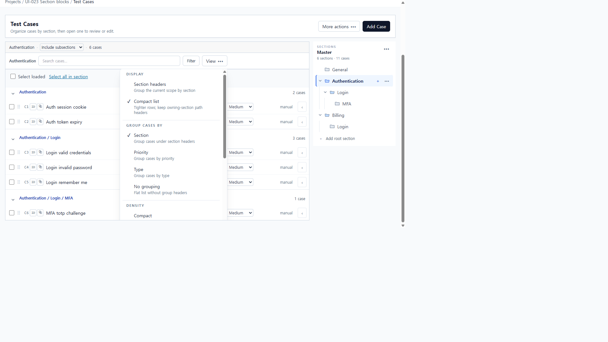
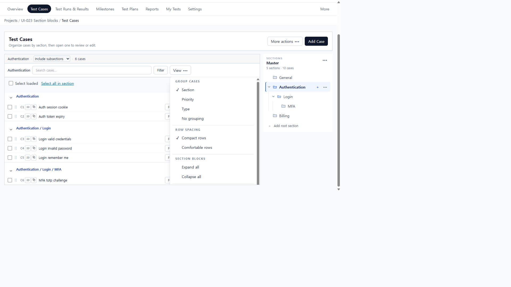
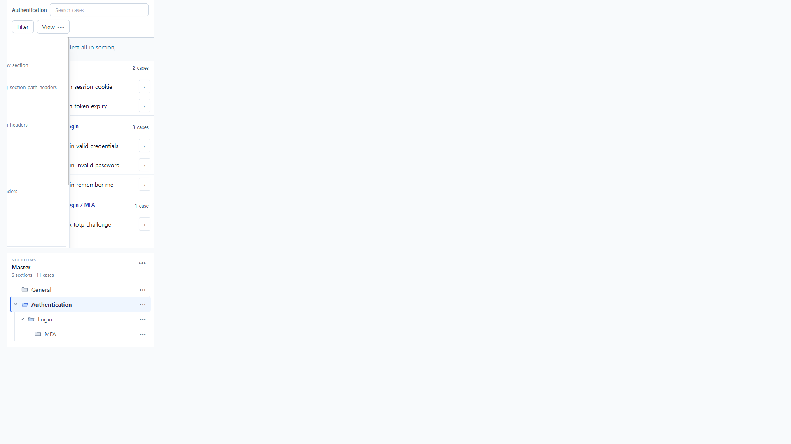
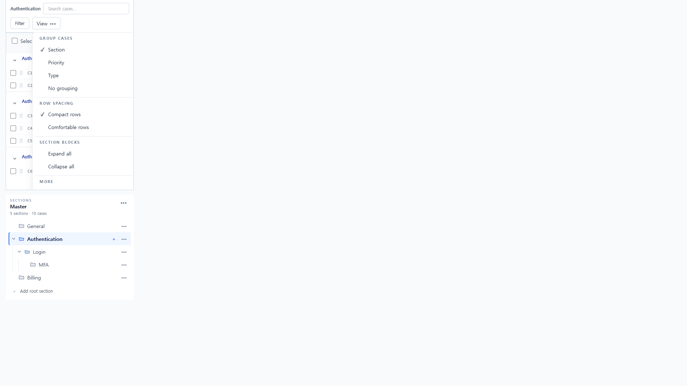

# UI-024 — Simplify View settings and remove overlapping meanings

Completed: 2026-09-19

## Result

- View no longer mixes a Display mode with grouping. **Group cases** (Section / Priority / Type / No grouping) is separate from **Row spacing** (Compact rows / Comfortable rows). Scope stays on the compact selector next to Filter.
- Duplicate `Compact` / `Compact list` / `Section headers` options are gone. Compact rows change height only; Section grouping still shows path headers.
- Columns, saved views, and archived cases sit under **More → Columns and saved views**. Saved views are applied from that dialog, not listed in View.

## Verification

- Fixture: in-memory API `localhost:4000`, Vite `http://localhost:5173`, login `admin@example.com`. Project **UI-023 Section blocks** (id 1). Authentication subtree, 6 cases in 3 path blocks. Scope **Include subsections**.
- Before: View showed Display **Compact list** (checked) and Density **Compact**, plus **Section headers** alongside Group **Section**. `display=compact` was in the URL while section path headers still rendered. 390 menu labels were clipped mid-word (`-section path headers`).
- After: View groups **Group cases**, **Row spacing**, **Section blocks**, **More**. Section checked matches 3 path headers. Compact rows checked; membership stayed **6** and headers stayed **3**. No grouping → `groupBy=none`, **0** headers, still **6** cases / `scope=subtree`. Section again restored the three paths.
- Compact rows wrote `localStorage` `ui-density:1:1:case-repository=compact`. URL did not gain a display/scope change.
- Keyboard: opening View focuses **Section**; ArrowDown moves to **Priority**.
- Columns dialog title **Select columns**; saved view **UI-024 subtree** appeared as an apply button after Save.
- 1280×720: menu readable, no page `overflowX`. 390×844: document `scrollWidth=clientWidth` 390px; Group/Row spacing labels fully readable. Menu right edge was 430px vs 390px viewport (about 40px overhang, no page scroll).
- `npx.cmd vitest run src/features/cases/utils/caseRepositoryViewMenu.test.ts src/features/cases/caseRepositoryView.test.ts` (10 passed)
- `npm.cmd run lint -w apps/web`
- `npm.cmd run build -w apps/web`

## Screenshot review

## Not live-verified

- `browser_press_key` Tab into View was not used (same Electron routing limit as UI-022–023). Focus and ArrowDown were driven with click / `keydown` on the menu.
- Reloading the page to re-read compact density from `localStorage` was not repeated after the 390 pass; the key was observed as `compact` immediately after selecting Compact rows.
- Applying **UI-024 subtree** from the dialog after a scope change was not re-run; save and the named button in the dialog were confirmed.
