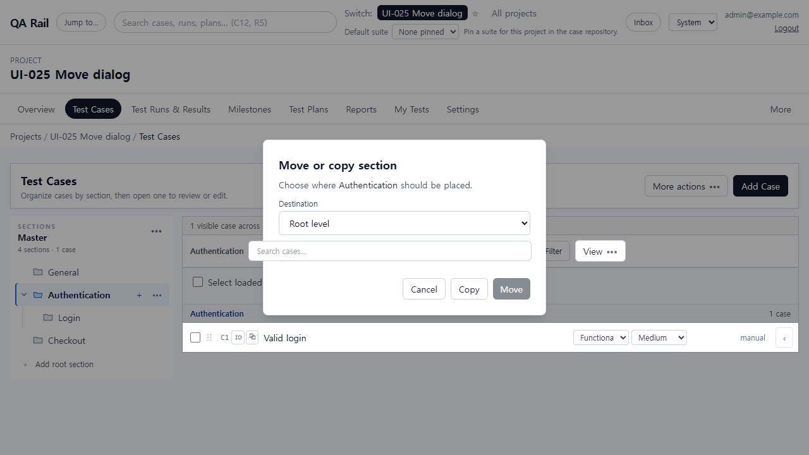
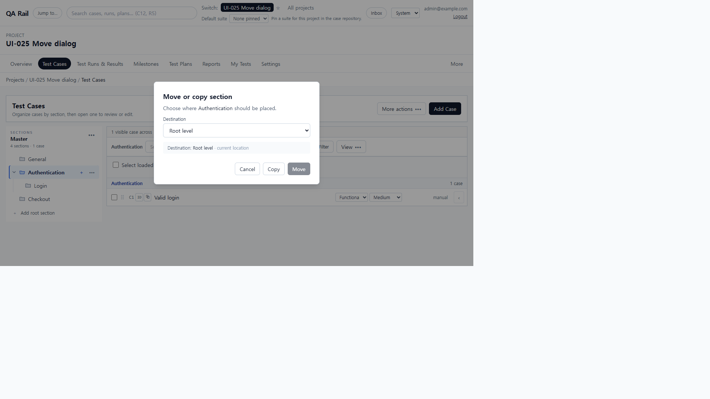
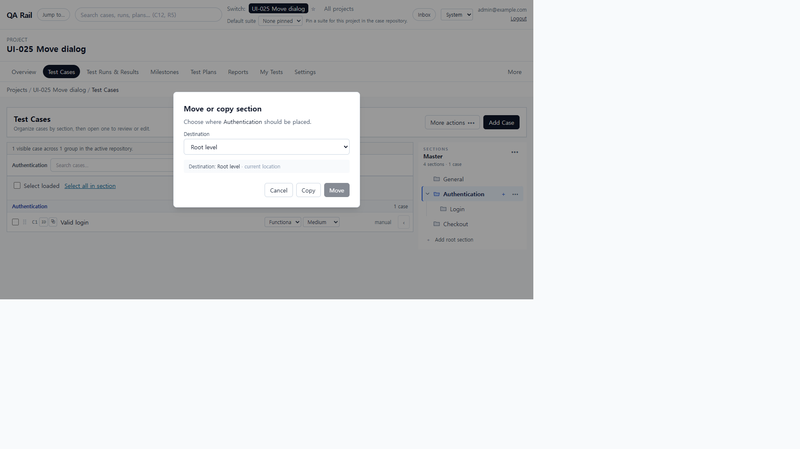
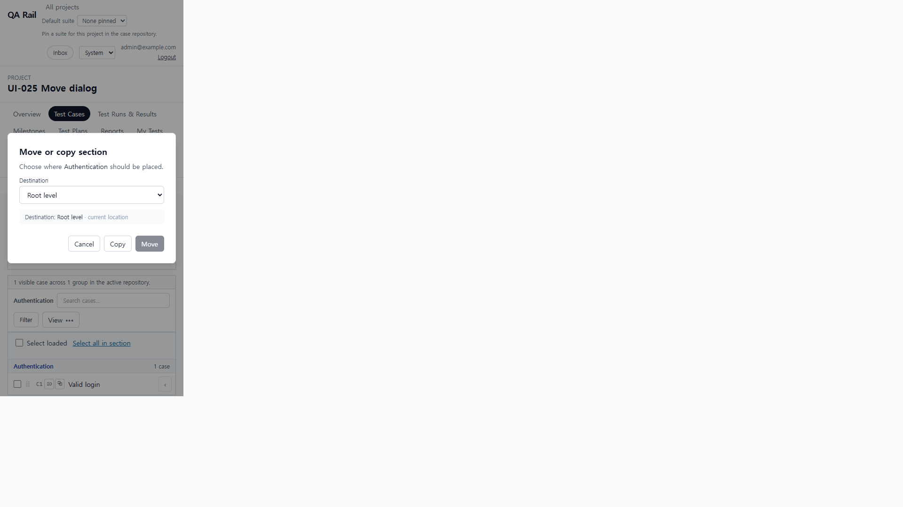

# UI-025 — Keep section move/copy dialogs above the workspace and contain focus

Completed: 2026-09-19

## Result

- `MoveCopyChooserDialog` renders through `createPortal` on `document.body` at `z-[100]`, so destination and Cancel/Copy/Move stay above the Test Cases workspace.
- Shared `useModalFocus` / `trapModalTab` give the dialog initial focus, a Tab cycle, Escape-to-cancel when idle, and restore to the section actions trigger. `#root` is `inert` while the dialog is open.
- Busy Move/Copy still disable Cancel and ignore Escape. Move stays disabled at the current location.

## Verification

- Fixture: in-memory API `localhost:4000`, Vite `http://localhost:5173`, login `admin@example.com`. Project **UI-025 Move dialog** (id 1), suite Master (id 1), sections Authentication (2) / Login (3) / Checkout (4), case C1 Valid login.
- Before (1280×720, tree left): destination summary `y=334`, Search cases `y=381` overlapping it. `search.click()` focused Search. Dialog lived inside the sticky tree, under later sibling Search/View.
- After (1280×720, tree left): overlay parent `BODY`, `z-index: 100`. Destination fully visible (`y=334`, `bottom=372`); Search `y=381` no longer overlaps. `elementFromPoint` at Search/View is the overlay (`role=presentation`). `search.click()` left focus on **Section destination**. Playwright click on Search was intercepted by the overlay.
- Focus: open lands on **Section destination**. Dialog `aria-labelledby` heading **Move or copy section**. Tab trap (dialog `keydown`): Copy → Destination, Shift+Tab from Destination → Copy (Move omitted while disabled). `browser_press_key` Tab from the destination select did not move focus in this Electron session (same routing limit as UI-030–032); cycle was confirmed through the dialog handler.
- Escape (idle): dialog closed; focus returned to **Authentication actions**. Checkout destination enabled Move and dropped the `current location` note. Hung `PATCH /api/sections/:id` showed **Moving...** with Cancel/Copy/Move disabled; Escape left the dialog open.
- Tree on the right (`Suite options` → **Move tree to right**): tree trigger `x=1221`, Search `x=121`. Destination and controls still unobstructed; overlay still covers Search. No page `overflowX` (`scrollWidth=1280`).
- After scrolling: at 390×844 `window.scrollY=80` the fixed overlay stayed on screen (`dialogY=283`); destination remained visible. The 1280 fixture has no overflow tree/list to scroll.
- 390×844: `innerWidth=390`, `scrollWidth=390`, destination and Cancel/Copy/Move inside the viewport, overlay covers Search, no horizontal page overflow.
- `npx.cmd vitest run src/shared/ui/modalFocus.test.ts` (4 passed)
- `npm.cmd run lint -w apps/web`
- `npm.cmd run build -w apps/web`

## Screenshot review

## Not live-verified

- 390×844 capture of the original Search-over-destination stacking. That overlap was reproduced and fixed at 1280×720; the 390 pass is the post-fix layout.
- Case-drop `Move or copy dropped cases?` and tree-drag `Move or copy section?` confirm dialogs share the same portaled component; only the section-menu instance was opened in the browser.
- Native Tab between Destination and Cancel via `browser_press_key` (Electron did not move focus from the select).
