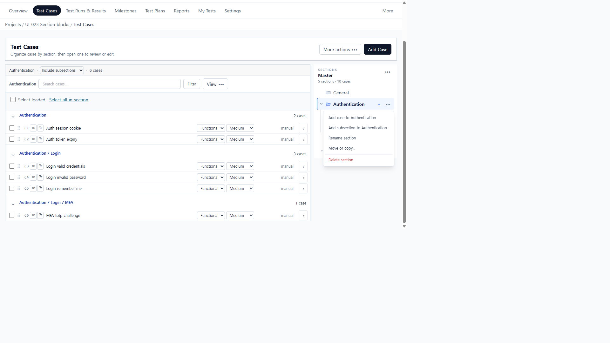
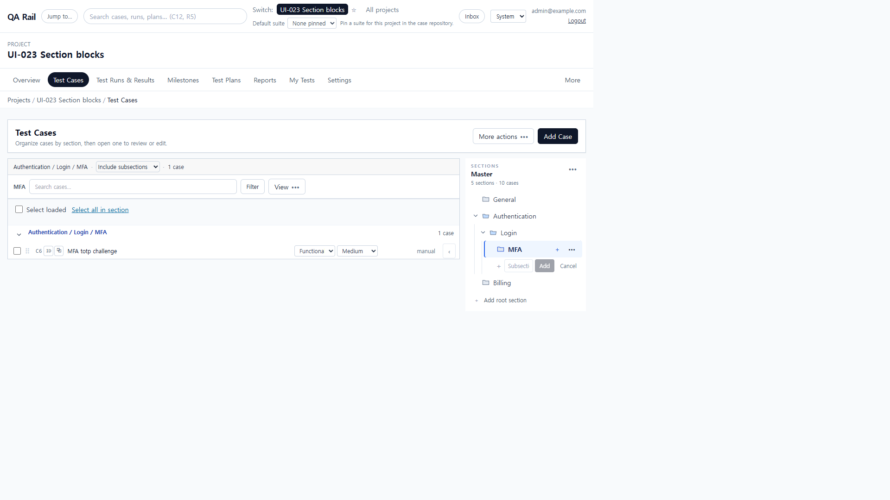
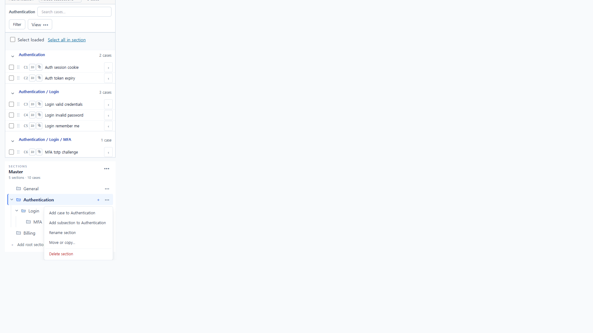
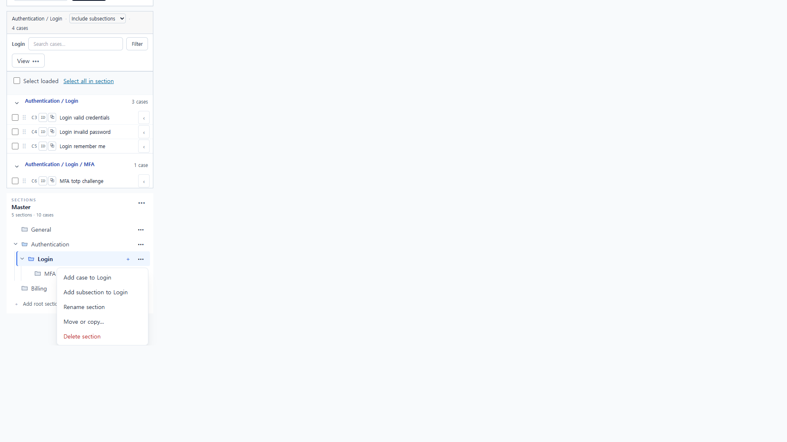

# UI-026 — Make the file-tree interaction match its visual promise

Completed: 2026-09-19

## Result

- The section tree is a single tab stop with roving `tabIndex`. ArrowUp/Down (and J/K while focused) move selection among visible rows. ArrowRight expands or enters the first child; ArrowLeft collapses or moves to the parent, so expand/collapse stays distinct from selection.
- Row actions reuse `OverflowMenu`: first item focuses on open, ArrowDown/Up move, Escape returns to the same row. Inner chevron/`+`/`•••` controls stay `tabIndex=-1` and remain visible on touch without desktop hover.
- Treeitem names are the section path (`Authentication / Login / MFA`) with `aria-selected` / `aria-expanded`. Root and nested create labels share the input id (`case-repository-new-section` / `new-section-{id}`).

## Verification

- Fixture: in-memory API `localhost:4000`, Vite `http://localhost:5173`, login `admin@example.com`. Project **UI-023 Section blocks** (id 1). Authentication / Login / MFA / Billing.
- Before: ArrowDown on focused Authentication did not change selection; 15 tab stops inside the pane; custom row menu left focus on the `•••` trigger and ignored ArrowDown; treeitem names concatenated nested rows (`Authentication + ••• Login ••• MFA •••`); root create `htmlFor` was `new-section-root` against input id `case-repository-new-section`.
- After: ArrowDown Authentication → Login (`sectionId=3`) → MFA (`sectionId=4`). Only the selected treeitem has `tabIndex=0`; inner tree buttons have none. Treeitem names are path-only; MFA is `selected`.
- Shift+F10 on MFA opened **MFA actions** with **Add case to MFA** focused; ArrowDown moved to **Add subsection to MFA**. Starting create bound `label[for=new-section-4]` to the input named **New subsection in MFA**. Escape closed the field and restored focus to the MFA treeitem.
- Login: ArrowLeft hid MFA (`aria-expanded=false`) while Login stayed selected; ArrowRight restored MFA without changing selection.
- Login actions Escape returned focus to **Login actions** on the same row. Root create: `htmlFor`/`id` `case-repository-new-section`, label **New root section**, input focused; Cancel restored `#case-repository-new-section`.
- 1280×720: `scrollWidth=clientWidth` 1265px. 390×844: `scrollWidth=clientWidth` 390px; all row `•••` opacity 1 without hover; Login menu first item focused; menu right edge 362px inside the 390 viewport.
- `npx.cmd vitest run src/features/cases/utils/sectionTreeKeyboard.test.ts src/features/cases/utils/sectionTreeOrder.test.ts` (6 passed)
- `npm.cmd run lint -w apps/web`
- `npm.cmd run build -w apps/web`

## Screenshot review

## Not live-verified

- Native Tab into the tree was not used (`browser_press_key` Tab still routes to the Cursor UI). Roving tabindex and ArrowDown were driven with click / `keydown` on the focused treeitem.
- A screen reader was not run; path/`aria-selected`/`aria-expanded` were read from the accessibility tree and DOM.
- Enter on a focused OverflowMenu item did not activate in this Electron session; the same item was activated with a click. ArrowDown inside the menu was verified.
