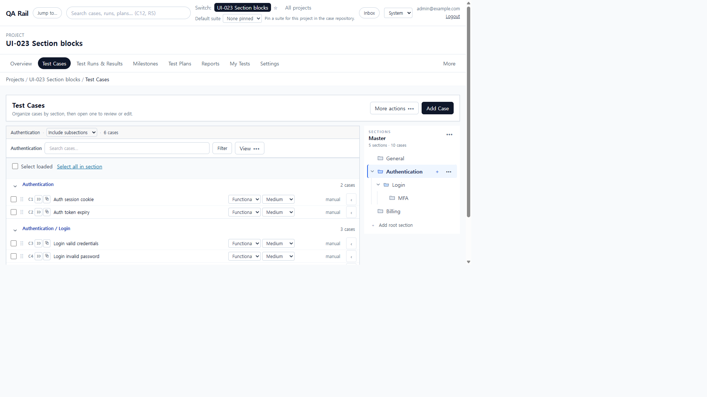
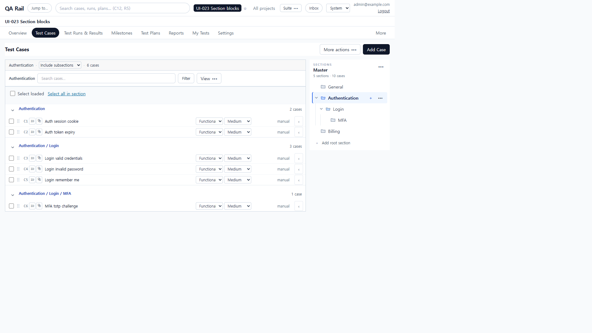
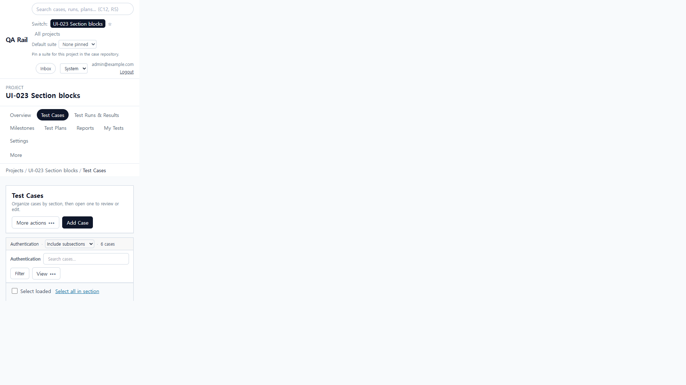
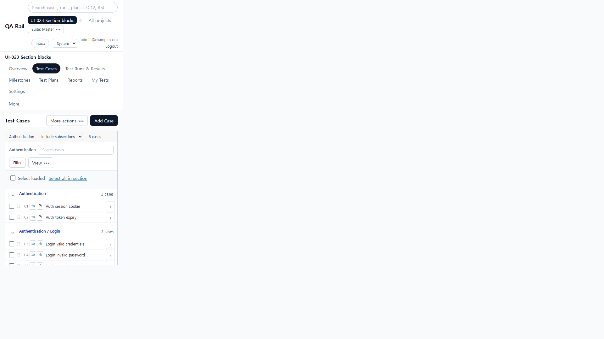

# UI-027 — Reduce repeated navigation chrome above Test Cases

Completed: 2026-09-19

## Result

- Shared project chrome is compact: shell-bar `py-1.5`, project title as a single-line `h1` (no “PROJECT” label or description), tabs `py-1`, AppShell `py-3`. Primary tabs hide the redundant breadcrumb; nested routes such as Settings → API Tokens still show `Projects / … / Settings / API Tokens`.
- Always-visible Default suite `<select>` and “Pin a suite…” help are gone from the daily-work header. Suite pinning and Project settings live in a shared `OverflowMenu` labeled **Suite** / **Suite: {name}**.
- Test Cases uses a compact workbench (no card border/shadow, no page description). Project/suite context stays in the header: project chip, compact `h1`, and Suite menu.

## Verification

- Fixture: in-memory API `localhost:4000`, Vite `http://localhost:5173`, login `admin@example.com`. Project **UI-023 Section blocks** (id 1). Authentication / Login / MFA / Billing, C1–C6 for Test Cases measurements. Overview/Runs checks used the same project after an in-memory re-seed.
- Before 1280×720: Default suite + help in the shell; breadcrumb `Projects / UI-023 Section blocks / Test Cases`; Test Cases description and card; Authentication heading `y=495`, first TC `y=525`.
- After 1280×720: no Default suite row/help; no primary-tab breadcrumb; Authentication heading `y=346` (−149px), first TC `y=376` (−149px). `scrollWidth=clientWidth` 1265px. Suite menu first item **None pinned** focused; ArrowDown to **Master**; pin updates trigger to **Suite: Master**; Escape restores the trigger.
- Before 390×844: Authentication heading `y=859` and first TC `y=889` (both below the 844 fold). After: heading `y=610`, C1 `y=640` both in view; `scrollWidth=clientWidth` 390px; Suite / Add Case not clipped.
- Nested `/projects/1/settings/tokens` shows breadcrumb `Projects / UI-023 Section blocks / Settings / API Tokens`. Overview (`/projects/1`) and Runs (`/projects/1/runs`) keep compact chrome, no Default suite help, no primary-tab breadcrumb, Suite menu still present.
- `npx.cmd vitest run src/features/projects/utils/projectContextMenu.test.ts src/features/projects/utils/primaryProjectTabPath.test.ts` (4 passed)
- `npm.cmd run lint -w apps/web`
- `npm.cmd run build -w apps/web`

## Screenshot review

## Not live-verified

- Native Tab into the Suite `OverflowMenu` was not used (`browser_press_key` Tab still routes to the Cursor UI). Menu open, ArrowDown, pin, and Escape restore were driven from the focused trigger.
- A screen reader was not run; Suite / Suite: Master names were read from the DOM and accessibility snapshot.
- Overview was confirmed after a later in-memory re-seed, not on the same process instance as the 1280/390 Test Cases measurements.
