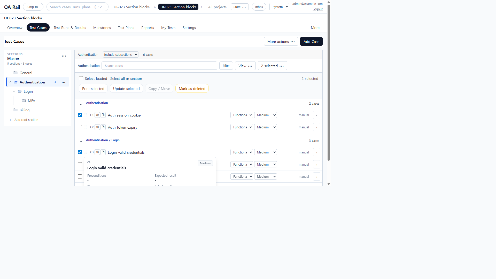
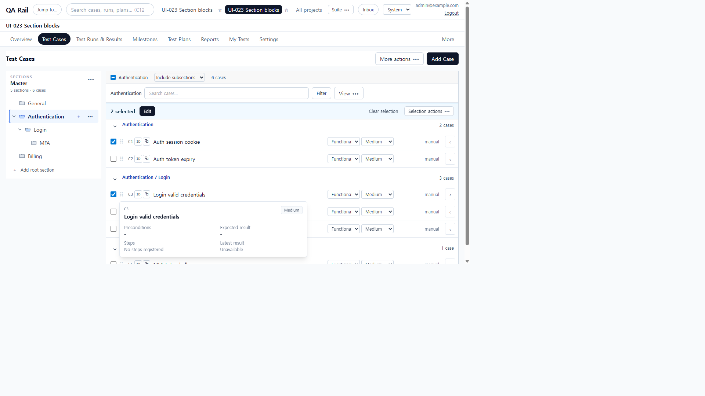
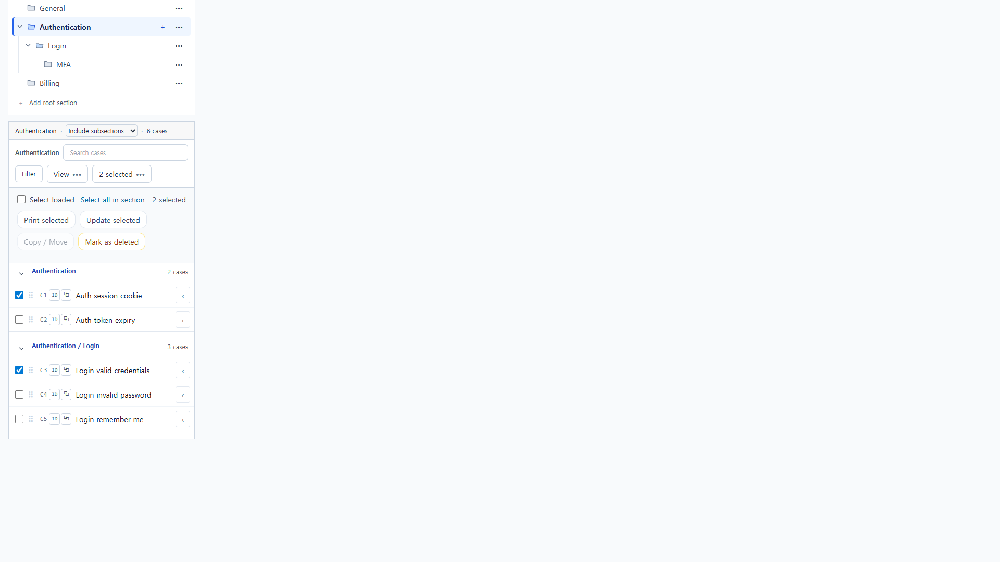
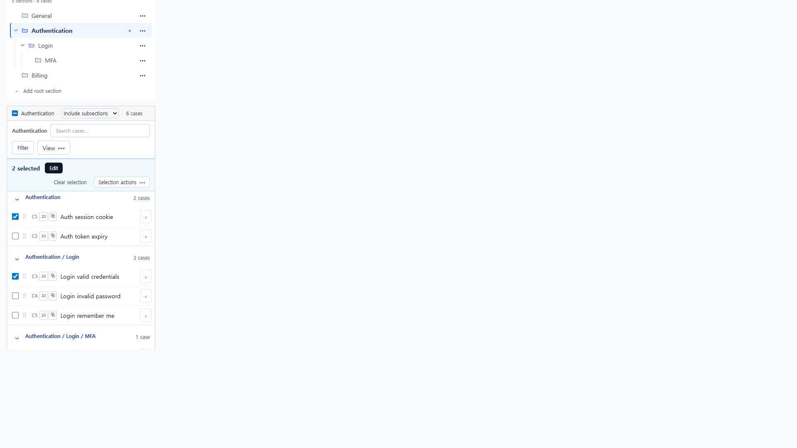

# UI-028 — Consolidate case selection actions and empty-state creation

Completed: 2026-09-19

## Result

- Selecting cases shows one `SelectionActionBar`: **N selected**, **Edit**, **Clear selection**. Print, copy/move, and delete live in **Selection actions**. Edit updates only the selected IDs.
- Zero selection no longer keeps a Select loaded / Select all in section / Update selected strip. A compact list checkbox is labeled **Select all N cases loaded in this list**.
- Empty lists keep header **Add Case** as the only dominant create action and a short scope message, without a second Add case button or dashed empty card.

## Verification

- Fixture: in-memory API `localhost:4000`, Vite `http://localhost:5173`, login `admin@example.com`. Project **UI-023 Section blocks** (id 2). Authentication subtree C1–C6; empty **General**.
- Before, C1+C3 selected: toolbar **2 selected** menu plus a second row with Select loaded, Select all in section, Print selected, **Update selected**, Copy / Move, Mark as deleted.
- After: region **Selected case actions** with **2 selected**, one **Edit**, **Clear selection**, **Selection actions**. No Update selected and no 2 selected toolbar menu. Edit opened **Update test cases?** targeting **2 test cases in the selected**. Cancel left C1/C3 checked. Clear selection hid the bar.
- Overflow first item **Select all 6 loaded cases** focused; ArrowDown to **Print selected**; Escape restored **Selection actions**.
- Zero selection: no Select loaded / Update selected. Empty General: **No test cases in this section**, one header **Add Case**, no dashed empty box.
- 1280×720: `scrollWidth=clientWidth` 1265px. 390×844: `scrollWidth=clientWidth` 390px; Edit / Clear selection / Selection actions visible in the list column.
- `npx.cmd vitest run src/features/cases/utils/caseSelectionActionBarModel.test.ts` (3 passed)
- `npm.cmd run lint -w apps/web`
- `npm.cmd run build -w apps/web`

## Screenshot review

## Not live-verified

- Native Tab into the selection bar was not used (`browser_press_key` Tab still routes to the Cursor UI). Overflow ArrowDown/Escape used the focused trigger; Edit/Clear were clicked.
- Filter-empty **Clear filters** was not opened on this fixture; empty copy was verified on General with zero cases.
- A screen reader was not run; names were read from the accessibility tree.
