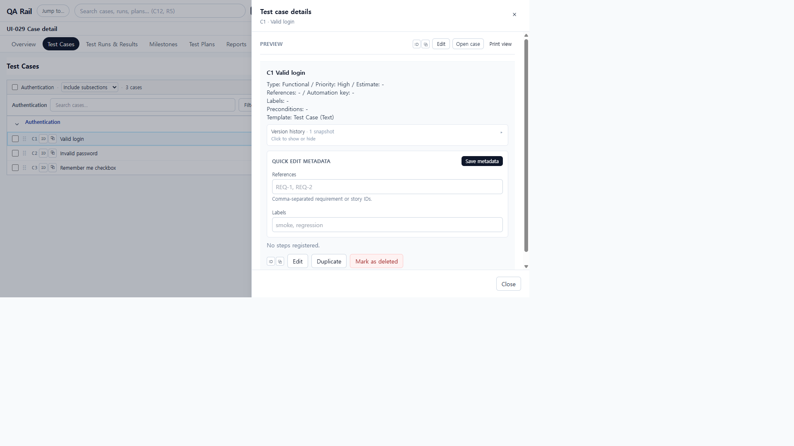
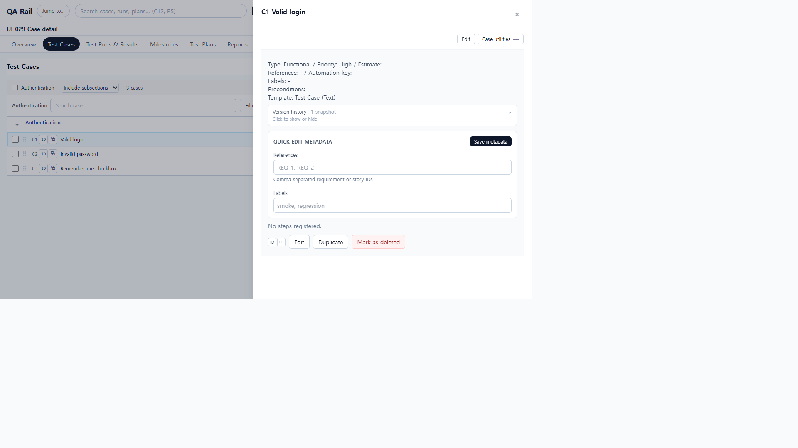
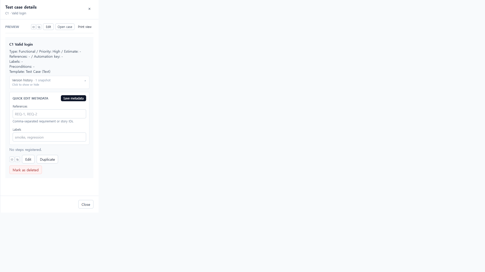
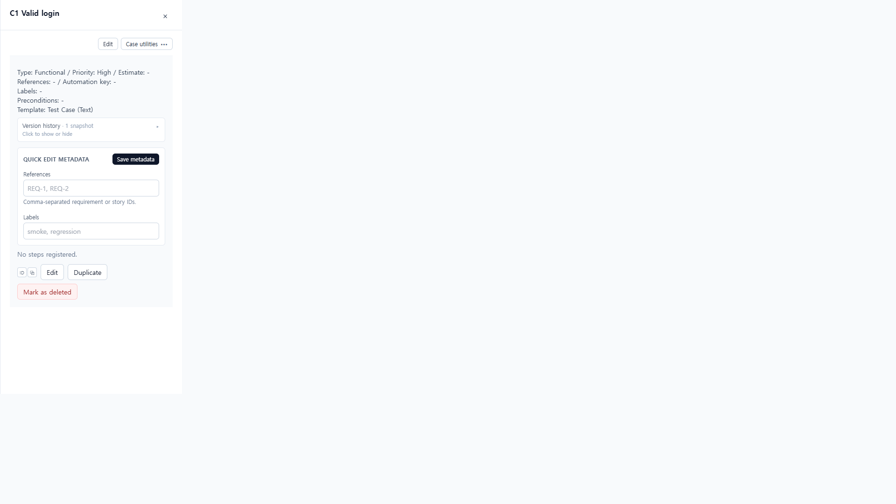
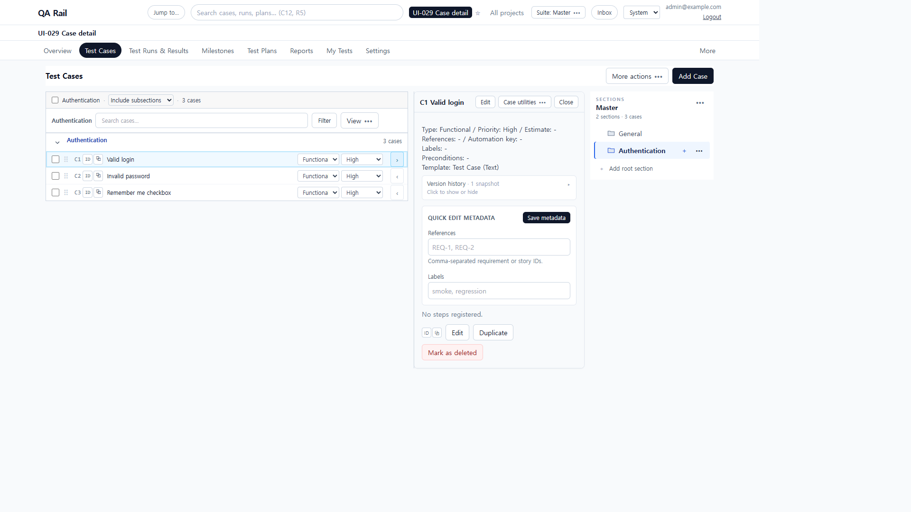

# UI-029 — Put case detail content ahead of its utility buttons

Completed: 2026-09-19

## Result

- Opening a test case shows **C1 Valid login** (or the inline heading) with **Edit** and one **Case utilities** menu. Copy ID, Copy link, Open full page, and Print view are in that menu, not a PREVIEW toolbar.
- Drawer chrome no longer repeats a footer **Close** next to the header **Close drawer**. Inline layout keeps a single **Close** beside Edit.
- The existing edit drawer still opens from the header Edit control (`panelMode=edit`).

## Verification

- Fixture: in-memory API `localhost:4000`, Vite `http://localhost:5173`, login `admin@example.com`. Project **UI-029 Case detail**. Authentication C1–C3. Opened `/projects/1/cases?sectionId=2&panelCaseId=1`.
- Before, 1280×720 drawer: heading **Test case details**, then PREVIEW + ID + Edit + Open case + Print view above the title, plus a footer Close. Content started after the utility row.
- After, 1280×720 drawer: heading **C1 Valid login**, Edit + Case utilities, then Type/Priority content. No PREVIEW, Open case, or Print in the header. Page overflow 0.
- Case utilities opened with **Copy ID** focused; ArrowDown moved to **Copy link**. **Close drawer** returned focus to the C1 row (`C1 ID ⧉ Valid login`).
- Header **Edit** at 1600 set `panelMode=edit` and opened the existing edit drawer.
- After, 390×844: title y=16, Edit and Case utilities on one row (y=81), no clip, no page overflow, no footer Close.
- After, 1600×1000 inline: heading **C1 Valid login** with Edit, Case utilities, Close, `flex-wrap: nowrap`, no PREVIEW.
- `npx.cmd vitest run src/features/cases/utils/caseDetailPanelHeader.test.ts` (2 passed)
- `npm.cmd run lint -w apps/web`
- `npm.cmd run build -w apps/web` (passed; existing Vite large-chunk warning remains)

## Screenshot review

## Not live-verified

- Native Tab into the utilities menu was not used (`browser_press_key` Tab still routes to the Cursor UI). ArrowDown used the focused menu.
- `browser_press_key` Escape also hits the drawer’s document-level handler, so menu-only Escape was not proven with that tool. Close drawer was clicked and restored C1 row focus.
- A screen reader was not run; names were read from the accessibility tree.
